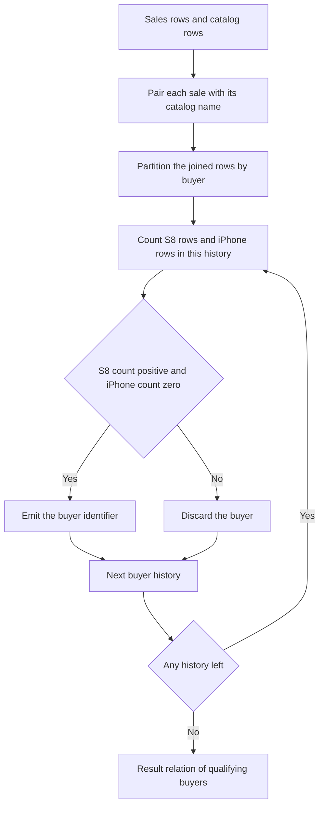

# Guided Example: Sales Analysis II

We resolve product names for one purchase history, then show that the eligibility condition must be evaluated over a buyer's *whole* history rather than on individual transaction rows — the distinction that decides this problem.

**Representative instance (the official sample).** The catalog relates each identifier to a name:

| `product_id` | `product_name` | `unit_price` |
|:---:|:---:|:---:|
| $1$ | `S8` | $1000$ |
| $2$ | `G4` | $800$ |
| $3$ | `iPhone` | $1400$ |

and `Sales` records four purchases:

| `seller_id` | `product_id` | `buyer_id` | `sale_date` | `quantity` | `price` |
|:---:|:---:|:---:|:---:|:---:|:---:|
| $1$ | $1$ | $1$ | `2019-01-21` | $2$ | $2000$ |
| $1$ | $2$ | $2$ | `2019-02-17` | $1$ | $800$ |
| $2$ | $1$ | $3$ | `2019-06-02` | $1$ | $800$ |
| $3$ | $3$ | $3$ | `2019-05-13` | $2$ | $2800$ |

**Required outcome.** The single column `buyer_id`, listing every buyer who bought an `S8` and never an `iPhone`:

| `buyer_id` |
|:---:|
| $1$ |

Buyer $3$ is the instructive case: they bought an `S8` (the row dated `2019-06-02`), so a careless check declares them a match — yet they also bought an `iPhone`, which disqualifies them. The concrete statement belongs to the Reference workflow; this lesson derives the reasoning.

---

## 1. Resolving Names: Matching Sales Rows to the Catalog

`Sales` carries only `product_id`, so the names `S8` and `iPhone` must be obtained from the catalog. The operation is an equi-join on the shared key `product_id` — pairing each transaction with its catalog row — after which the projected relation carries the resolved name alongside the buyer.

$$
\mathcal{J} = \mathcal{S} \bowtie_{\mathcal{S}.product\_id = \mathcal{P}.product\_id} \mathcal{P}.
$$

Because `product_id` is the primary key of the catalog, each `Sales` row matches **at most one** catalog row. The join is therefore *row-preserving*: it annotates transactions without duplicating them. That property matters, because if a product identifier could appear twice in the catalog, a single purchase would be replicated and the presence counts of §3 would be inflated.

| Sale row | `buyer_id` | `product_id` | Resolved `product_name` |
|:---:|:---:|:---:|:---:|
| 1 | $1$ | $1$ | `S8` |
| 2 | $2$ | $2$ | `G4` |
| 3 | $3$ | $1$ | `S8` |
| 4 | $3$ | $3$ | `iPhone` |

The join is used only to *read* the name; no attribute of the catalog other than `product_name` is needed, and `unit_price`, `quantity`, `price`, `seller_id`, and `sale_date` play no role in the decision.

---

## 2. Grouping by Buyer: Histories, Not Rows

The requirement is a statement about a customer's purchases taken together. Grouping the joined relation by `buyer_id` partitions it into one **history** per buyer:

$$
\mathcal{H}_b = \{\, t \in \mathcal{J} : t[buyer\_id] = b \,\}.
$$

From each history, extract the set of distinct product names the buyer has ever bought:

$$
\Pi(b) = \{\, t[product\_name] : t \in \mathcal{H}_b \,\}.
$$

The problem's condition is then exactly

$$
\texttt{"S8"} \in \Pi(b) \quad \land \quad \texttt{"iPhone"} \notin \Pi(b).
$$

The first conjunct is an **existential** requirement over the history; the second is a **universal** requirement — every purchase in the history must avoid `iPhone`. Both quantify over the whole group, which is precisely what a single transaction row cannot express.

| Buyer $b$ | History $\mathcal{H}_b$ (resolved names) | $\Pi(b)$ | Contains `S8`? | Contains `iPhone`? |
|:---:|:---|:---|:---:|:---:|
| $1$ | `S8` | $\{\texttt{"S8"}\}$ | Yes | No |
| $2$ | `G4` | $\{\texttt{"G4"}\}$ | No | No |
| $3$ | `S8`, `iPhone` | $\{\texttt{"S8"}, \texttt{"iPhone"}\}$ | Yes | **Yes** |

---

## 3. Indicator Arithmetic over a Group

Both conjuncts are conveniently expressed with counting indicators. Define, for each buyer $b$,

$$
N_{\texttt{S8}}(b) = \sum_{t \in \mathcal{H}_b} \mathbb{I}\bigl(t[product\_name] = \texttt{"S8"}\bigr),
\qquad
N_{\texttt{iPhone}}(b) = \sum_{t \in \mathcal{H}_b} \mathbb{I}\bigl(t[product\_name] = \texttt{"iPhone"}\bigr).
$$

Each indicator is either $0$ or $1$, and each sum has as many terms as the buyer has transaction rows.

> **Presence/absence lemma.** For every buyer $b$: $N_{\texttt{S8}}(b) \ge 1 \iff \texttt{"S8"} \in \Pi(b)$, and $N_{\texttt{iPhone}}(b) = 0 \iff \texttt{"iPhone"} \notin \Pi(b)$.

*Proof.* A finite sum of $0/1$ terms is positive exactly when at least one term equals $1$, i.e. exactly when some transaction in $\mathcal{H}_b$ names `S8` — which is the definition of membership in $\Pi(b)$. Symmetrically, a sum of non-negative integers is $0$ exactly when every term is $0$, i.e. exactly when no transaction in $\mathcal{H}_b$ names `iPhone`, which is the definition of non-membership. $\blacksquare$

Two robustness observations follow from the lemma:

- The quantities are **multiplicity-insensitive** in the directions used: "$> 0$" and "$= 0$" cannot be changed by buying `S8` a second or third time, so duplicates do not disturb the verdict.
- They are **order-insensitive**: the sums do not depend on the sequence in which the buyer's transactions are stored or visited, only on the multiset of names.

---

## 4. Why Row-Level Filtering Fails

The tempting shortcut is a row predicate applied before any grouping: keep joined rows whose name equals `S8` and whose name is not `iPhone`. That predicate is evaluated on **one row at a time**, so it can never see the buyer's other purchases. Trace it on the instance:

| Joined row | `buyer_id` | `product_name` | Row predicate: name is `S8` and not `iPhone` | Row survives? |
|:---:|:---:|:---:|:---:|:---:|
| 1 | $1$ | `S8` | True | Yes |
| 2 | $2$ | `G4` | False | No |
| 3 | $3$ | `S8` | True | Yes |
| 4 | $3$ | `iPhone` | False | No |

The surviving rows carry buyers $1$ and $3$, so such a filter would wrongly report buyer $3$ as eligible. The mistake is quantifier scope: the check "not `iPhone`" must range over the entire history, while on a single row it collapses to a tautology for that row — a row named `S8` is trivially not named `iPhone` at the same time. The disqualifying evidence sits in a *different row*, which the row predicate has already discarded by the time the group is formed.

Group-level evaluation repairs this. Every row of a history is retained, and the two indicator sums are formed over the complete group:

| Buyer $b$ | $N_{\texttt{S8}}(b)$ | $N_{\texttt{iPhone}}(b)$ | Group predicate $N_{\texttt{S8}} \ge 1 \land N_{\texttt{iPhone}} = 0$ | Verdict |
|:---:|:---:|:---:|:---:|:---:|
| $1$ | $1$ | $0$ | $1 \ge 1$ ✓ and $0 = 0$ ✓ | **Retained** |
| $2$ | $0$ | $0$ | $0 \ge 1$ ✗ | Discarded (never bought `S8`) |
| $3$ | $1$ | $1$ | $1 \ge 1$ ✓ and $1 = 0$ ✗ | Discarded (bought an `iPhone`) |

The essential discipline is that the history must be preserved intact *up to* the aggregation step: filtering rows before grouping destroys the evidence that disqualifies buyer $3$, whereas filtering groups after aggregation uses that evidence.

---

## 5. Correctness, Deduplication, and Boundaries

**Soundness.** If a buyer passes the group predicate, then by the presence/absence lemma its history contains at least one `S8` purchase and no `iPhone` purchase. The buyer therefore satisfies the contract's condition exactly, with no extra assumption about seller, price, quantity, or date.

**Completeness.** If a buyer satisfies the condition, then its history contains an `S8` row (so the first sum is at least $1$) and contains no `iPhone` row (so the second sum is $0$). The predicate succeeds and the buyer is emitted. Because grouping partitions the joined relation, no qualifying buyer is skipped.

**One row per buyer.** The grouping key is `buyer_id`, so the result contains at most one row per distinct buyer. Repeated purchases of `S8` cannot produce repeated output rows, and no separate de-duplication step is needed — adding one would be redundant, and a careless one could collapse two genuinely distinct buyers.

**Relation of origin.** Only buyers that appear in `Sales` are considered, because the joined relation is driven by the transactions. A catalog buyer with no purchase is not a customer here; and if every buyer either lacks an `S8` purchase or has an `iPhone` purchase, the output is empty.

| Scenario | Concrete input | Correct behaviour | Trap it exposes |
|:---|:---|:---|:---|
| Buyer bought both products | `S8` on one day, `iPhone` on another | Rejected; the `iPhone` row disqualifies the whole history | Row-level predicate leakage |
| Repeated `S8` purchases | Three separate `S8` transactions | Retained and emitted exactly once | Multiple output rows for one buyer |
| Other products bought | `S8` plus a laptop | Retained; unrelated names move neither indicator | Over-broad exclusion of "anything other than `S8`" |
| `iPhone` only | A single `iPhone` transaction | Rejected, because no `S8` purchase exists | Ignoring the existential half of the condition |
| Every qualifying buyer disqualified | Each `S8` buyer also bought an `iPhone` | Empty result | Emitting a null row rather than an empty relation |
| Duplicate stored rows | The same `S8` sale recorded twice | Retained; the indicator is still positive | Treating duplicates as an error |
| Buyer absent from `Sales` | Catalog exists but nobody bought it | That buyer is not part of the answer | Fabricating buyers from the catalog |

Alternative formulations of the same test:

| Alternative | Mechanism | Tradeoff |
|:---|:---|:---|
| **Grouped indicator sums** | One grouped pass with an existence indicator and an absence indicator | One pass, one output row per buyer, and both quantifiers visible in the same predicate |
| **Set difference of buyer sets** | Buyers with an `S8` purchase minus buyers with an `iPhone` purchase | Correct and tie-free; needs two independent scans and a subtraction step |
| **Paired existence checks per buyer** | For each buyer, assert that an `S8` purchase exists and that no `iPhone` purchase exists | Conceptually clear and index-friendly; evaluates two semi-joins per buyer |
| **Row-level predicate before grouping** | Filter joined rows by name, then group | Rejected: loses the disqualifying evidence and admits buyers who bought both |

---

## 6. Complexity Derivation

Let $N = \lvert \mathcal{S} \rvert$ be the number of transaction rows, $P = \lvert \mathcal{P} \rvert$ the number of catalog rows, and $B$ the number of distinct buyers, with $B \le N$.

**Time.** Building a hash index on the catalog keyed by `product_id` costs $\Theta(P)$. Probing it once per transaction row costs expected $\Theta(1)$ per row, so the name-resolution phase is expected $\Theta(N + P)$. The grouping phase then visits each joined row once and updates two counters on its buyer's group, which is $\Theta(N)$; testing the $B$ groups costs $\Theta(B)$. Therefore

$$
T(N, P) = \Theta(P) + \Theta(N) + \Theta(B) = \Theta(N + P),
$$

because $B \le N$. With sort-merge or nested-loop alternatives instead of hashing, the corresponding bounds degrade to $\Theta\bigl((N+P)\log(N+P)\bigr)$ and $\Theta(NP)$ respectively, so the hash-index join is the reason the linear bound holds.

**Auxiliary space.** The catalog index stores one entry per distinct product identifier, and the aggregation holds two counters per distinct buyer, so

$$
S_{\text{aux}} = \Theta(P + B).
$$

The traversal keeps no additional state: each joined row is consumed as it is produced. The returned relation is the required output, not auxiliary state. Note in particular that no per-buyer copy of the history is materialised — the counters summarise each history in constant space, which is what allows the grouping to be done in one streaming pass.