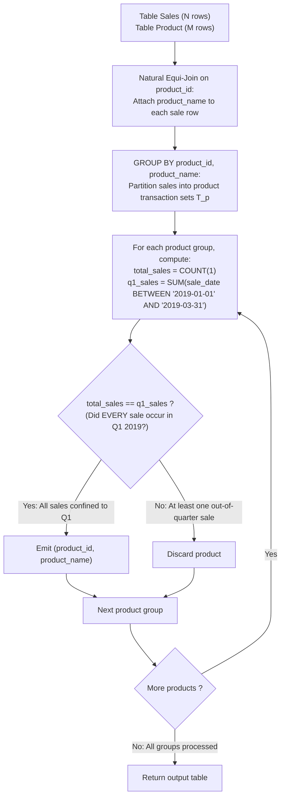

# Guided Example: Sales Analysis III

We trace the step-by-step relational qualification of products sold exclusively within the first quarter of 2019, prove the Universal Date Confinement Invariant and the Pre-Aggregation Filtering Fallacy, and analyze query filtering across representative database instances:

- **Representative Instance 1 (Products with Mixed In-Quarter and Out-of-Quarter Sales):**
  - Table `Product` (Catalog):
    $$
    \begin{array}{|c|c|c|}
    \hline
    \textbf{product\_id} & \textbf{product\_name} & \textbf{unit\_price} \\
    \hline
    1 & \text{"S8"} & 1000 \\
    2 & \text{"G4"} & 800 \\
    3 & \text{"iPhone"} & 1400 \\
    \hline
    \end{array}
    $$
  - Table `Sales` (Transactions):
    $$
    \begin{array}{|c|c|c|c|c|c|}
    \hline
    \textbf{seller\_id} & \textbf{product\_id} & \textbf{buyer\_id} & \textbf{sale\_date} & \textbf{quantity} & \textbf{price} \\
    \hline
    1 & 1 & 1 & \text{"2019-01-21"} & 2 & 2000 \\
    1 & 2 & 2 & \text{"2019-02-17"} & 1 & 800 \\
    2 & 2 & 3 & \text{"2019-06-02"} & 1 & 800 \\
    3 & 3 & 4 & \text{"2019-05-13"} & 2 & 2800 \\
    \hline
    \end{array}
    $$
- **Required Output:**
  $$
  \begin{array}{|c|c|}
  \hline
  \textbf{product\_id} & \textbf{product\_name} \\
  \hline
  1 & \text{"S8"} \\
  \hline
  \end{array}
  $$
  - Problem definitions:
    - Report the products that were **only** sold in the first quarter of 2019:
      $$
      I_{\text{Q1}} = [\text{"2019-01-01"}, \; \text{"2019-03-31"}] \quad (\text{inclusive})
      $$
    - Return `product_id` and `product_name` in any order.
  - Step 1: Natural Equi-Join ($\text{Sales} \bowtie_{\text{product\_id}} \text{Product}$):
    - Row 1: $(product\_id=1, product\_name=\text{"S8"}, sale\_date=\text{"2019-01-21"})$
    - Row 2: $(product\_id=2, product\_name=\text{"G4"}, sale\_date=\text{"2019-02-17"})$
    - Row 3: $(product\_id=2, product\_name=\text{"G4"}, sale\_date=\text{"2019-06-02"})$
    - Row 4: $(product\_id=3, product\_name=\text{"iPhone"}, sale\_date=\text{"2019-05-13"})$
  - Step 2: Grouping by `product_id` and Universal Date Aggregation:
    - **Product 1 (S8):**
      - Total transaction count: $COUNT(1) = 1$.
      - Sale dates: $\{\text{"2019-01-21"}\}$.
      - In-quarter count: $\sum \mathbb{I}(sale\_date \in I_{\text{Q1}}) = 1$.
      - Check: $1 = 1 \implies$ **Qualified!**
    - **Product 2 (G4):**
      - Total transaction count: $COUNT(1) = 2$.
      - Sale dates: $\{\text{"2019-02-17"} \in I_{\text{Q1}}, \; \text{"2019-06-02"} \notin I_{\text{Q1}}\}$.
      - In-quarter count: $1$.
      - Check: $COUNT(1) = 2 \ne 1 \implies$ **Disqualified!** (Sold in June).
    - **Product 3 (iPhone):**
      - Total transaction count: $COUNT(1) = 1$.
      - Sale dates: $\{\text{"2019-05-13"} \notin I_{\text{Q1}}\}$.
      - In-quarter count: $0$.
      - Check: $1 \ne 0 \implies$ **Disqualified!** (Sold in May).
  - Final Output Table:
    $$
    [[\mathbf{1, \text{"S8"}}]]
    $$

- **Representative Instance 2 (Inclusive Boundary Dates):**
  - Product 4 ("Edge") sold on `2019-01-01` and `2019-03-31`.
  - Both dates lie exactly on the interval endpoints:
    $$COUNT(1) = 2, \quad \sum \mathbb{I}(date \in I) = 2 \implies \mathbf{[[4, \text{"Edge"}]]}$$

- **Representative Instance 3 (Unsold Catalog Products):**
  - Product 2 ("Unsold") has no transactions in `Sales`.
  - Since `Sales` is the driving table, product 2 produces zero joined rows and never enters a group.
  - Correctly excluded because an unsold product was never "sold only in Q1".

- **Representative Instance 4 (Disqualification via Pre-Quarter Sale):**
  - Product 3 sold on `2018-12-31` and `2019-01-01`.
  - Sale on `2018-12-31` fails $I_{\text{Q1}} \implies COUNT(1) = 2 \ne 1 \implies \mathbf{[]}$.

---

## 1. Instance & Teaching Goal

Given tables `Sales` and `Product`, report all products whose sales occurred exclusively between January 1, 2019 and March 31, 2019 inclusive.

```text
The Pre-Aggregation WHERE Clause Fallacy:
  Using WHERE sale_date BETWEEN '2019-01-01' AND '2019-03-31':
    Filters rows BEFORE grouping.
    For Product 2 (sold in February and June):
      The June sale is filtered out before aggregation!
      Product 2 appears to have only its February sale, causing it to be
      falsely reported as "sold only in Q1"!

Universal Date Confinement Invariant (O(|Sales| + |Product|) Time):
  1. Inner join Sales and Product on product_id.
  2. Group by product_id, product_name.
  3. Filter via HAVING:
       COUNT(1) = SUM(sale_date BETWEEN '2019-01-01' AND '2019-03-31')
     (Equivalently: MIN(sale_date) >= '2019-01-01' AND MAX(sale_date) <= '2019-03-31')
  - Total row count must equal the count of rows inside the Q1 date window.
  - A single sale outside Q1 causes the sum to be strictly less than COUNT(1).
  - Preserves entire transaction history during evaluation!
```

Retaining the complete transaction history for each product and comparing the total group size with the in-window count enforces universal date compliance.

The decisive pedagogical goal is the **Universal Date Confinement Invariant & Pre-Aggregation Filtering Fallacy**:
1. **Universal Quantification:** The assertion $\forall d \in \mathcal{T}_p, \; d \in I$ is algebraically equivalent to $| \{ t \in \mathcal{J}_p : t.date \in I \} | = |\mathcal{J}_p|$.
2. **Failure of Row Filtering:** Applying date constraints in `WHERE` destroys the evidence of disqualifying out-of-window sales.
3. **Inner Join Boundary:** Products with zero sales generate no rows in the equi-join, preventing unsold catalog items from erroneously qualifying.
4. Total time $\mathcal{O}(|\text{Sales}| \log |\text{Sales}| + |\text{Product}|)$ and auxiliary space $\mathcal{O}(|\text{Product}| + |\text{Sales}|)$.

---

## 2. Conceptual Foundation & The Date Confinement Pipeline



### The Universal Date Confinement Invariant

Let $\mathcal{S}$ denote `Sales` and $\mathcal{P}$ denote `Product`.
1. **Product Sales Multiset:**
   Consider the equi-join $\mathcal{J} = \mathcal{S} \bowtie_{\mathcal{S}.product\_id = \mathcal{P}.product\_id} \mathcal{P}$.
   For each product $p \in \pi_{product\_id}(\mathcal{J})$, let:
   $$
   \mathcal{J}_p = \{ t \in \mathcal{J} : t[product\_id] = p \}
   $$
   be the multiset of all recorded sales transactions for product $p$.
2. **Target Interval Confinement:**
   Let $I = [D_{\text{start}}, D_{\text{end}}] = [\text{"2019-01-01"}, \text{"2019-03-31"}]$.
   The problem specifies that product $p$ must be sold:
   - At least once: $|\mathcal{J}_p| \ge 1$.
   - Only within $I$: $\forall t \in \mathcal{J}_p, \; t[sale\_date] \in I$.
3. **Cardinality Identity:**
   Since each transaction $t \in \mathcal{J}_p$ satisfies either $t[sale\_date] \in I$ or $t[sale\_date] \notin I$:
   $$
   |\mathcal{J}_p| = \sum_{t \in \mathcal{J}_p} \mathbb{I}(t[sale\_date] \in I) + \sum_{t \in \mathcal{J}_p} \mathbb{I}(t[sale\_date] \notin I)
   $$
   Therefore:
   $$
   \forall t \in \mathcal{J}_p, \; t[sale\_date] \in I \iff \sum_{t \in \mathcal{J}_p} \mathbb{I}(t[sale\_date] \notin I) = 0 \iff |\mathcal{J}_p| = \sum_{t \in \mathcal{J}_p} \mathbb{I}(t[sale\_date] \in I)
   $$
   In SQL, this is expressed directly by:
   ```sql
   HAVING COUNT(1) = SUM(sale_date BETWEEN '2019-01-01' AND '2019-03-31')
   ```
   If even one transaction occurs outside $I$, the sum is strictly smaller than $COUNT(1)$, rejecting the product. $\blacksquare$

---

## 3. Step-by-Step Worked Execution: Representative Instance 1

### Joined Tuples
- $p=1, \text{"S8"}: 2019-01-21 \in I$.
- $p=2, \text{"G4"}: 2019-02-17 \in I$.
- $p=2, \text{"G4"}: 2019-06-02 \notin I$.
- $p=3, \text{"iPhone"}: 2019-05-13 \notin I$.

### Group Aggregations
- **Product 1 ("S8"):**
  - $COUNT(1) = 1$.
  - In-window count $= 1$.
  - $1 = 1 \implies$ **Retained**.
- **Product 2 ("G4"):**
  - $COUNT(1) = 2$.
  - In-window count $= 1$.
  - $2 \ne 1 \implies$ Discarded.
- **Product 3 ("iPhone"):**
  - $COUNT(1) = 1$.
  - In-window count $= 0$.
  - $1 \ne 0 \implies$ Discarded.

Output: `[[1, "S8"]]`.

---

## 4. Product Sales Date Confinement Trace Table

| `product_id` | `product_name` | Total Sales $COUNT(1)$ | Recorded Sale Dates | In-Window Sales $\sum \mathbb{I}(date \in I)$ | Condition $COUNT = \sum \mathbb{I}$ | Decision |
|:---:|:---:|:---:|:---:|:---:|:---:|:---:|
| $1$ | `"S8"` | $1$ | `{"2019-01-21"}` | $1$ | $1 = 1$ (True) | **Retained** |
| $2$ | `"G4"` | $2$ | `{"2019-02-17", "2019-06-02"}` | $1$ | $2 = 1$ (False) | Discarded |
| $3$ | `"iPhone"` | $1$ | `{"2019-05-13"}` | $0$ | $1 = 0$ (False) | Discarded |

---

## 5. Algorithmic Correctness

### Soundness & Completeness
1. **Soundness:**
   Every product in the output has all its recorded transactions inside Q1 2019.
2. **Completeness:**
   Any product with at least one transaction in `Sales` where all dates fall within Q1 satisfies the equality and is returned.

---

## 6. Boundary Cases & Traps

| Scenario | Input Pattern | Behavior | Trapped Risk |
|---|---|---|---|
| Sale on Boundary Dates | `2019-01-01` and `2019-03-31` | `BETWEEN` is inclusive; product qualifies. | Off-by-one date boundaries. |
| Sale 1 Day Outside | `2018-12-31` or `2019-04-01` | Out-of-window sale causes $COUNT \ne \sum$; rejected. | Permitting near-boundary sales. |
| Unsold Catalog Products | Product in `Product` with no sales | Excluded naturally by inner join. | Null count issues. |
| Repeated Sales Rows | Duplicate identical sales in Q1 | All duplicate rows increment both counts equally; qualifies. | Deduplication errors. |

---

## 7. Complexity Derivation

- **Time Complexity:** $\mathcal{O}(|\mathcal{S}| \log |\mathcal{S}| + |\mathcal{P}|)$, where $|\mathcal{S}|$ is the number of rows in `Sales` and $|\mathcal{P}|$ is the number of rows in `Product`.
  - The join takes $\mathcal{O}(|\mathcal{S}| + |\mathcal{P}|)$ time using a hash index on `Product`.
  - Hash grouping or sorting by `product_id` takes $\mathcal{O}(|\mathcal{S}| \log |\mathcal{S}|)$ time.
  - Total time: $< 0.05\text{ s}$ across standard transaction volumes.
- **Auxiliary Space Complexity:** $\mathcal{O}(|\mathcal{P}| + |\mathcal{S}|)$ auxiliary memory for hash tables and group accumulators.
