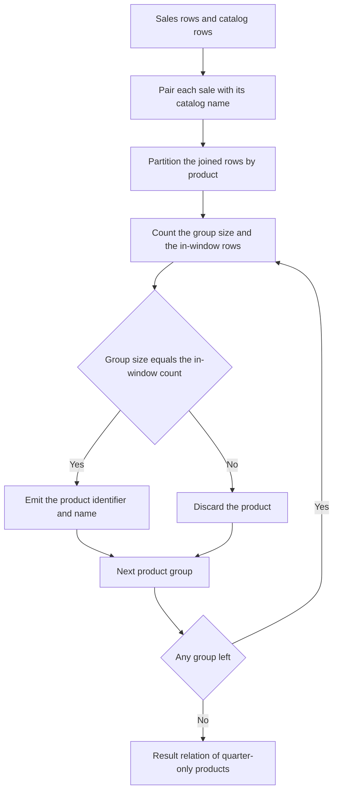

# Guided Example: Sales Analysis III

We qualify one product catalog against a date window, and show why the phrase "only sold in the first quarter" must be checked *after* every transaction of a product has been kept — filtering dates first destroys the very evidence that disqualifies a product.

**Representative instance (the official sample).** The catalog:

| `product_id` | `product_name` | `unit_price` |
|:---:|:---:|:---:|
| $1$ | `S8` | $1000$ |
| $2$ | `G4` | $800$ |
| $3$ | `iPhone` | $1400$ |

and the transactions:

| `seller_id` | `product_id` | `buyer_id` | `sale_date` | `quantity` | `price` |
|:---:|:---:|:---:|:---:|:---:|:---:|
| $1$ | $1$ | $1$ | `2019-01-21` | $2$ | $2000$ |
| $1$ | $2$ | $2$ | `2019-02-17` | $1$ | $800$ |
| $2$ | $2$ | $3$ | `2019-06-02` | $1$ | $800$ |
| $3$ | $3$ | $4$ | `2019-05-13` | $2$ | $2800$ |

**Required outcome.** The two columns `product_id` and `product_name`, reporting products sold only inside the first quarter of 2019:

| `product_id` | `product_name` |
|:---:|:---:|
| $1$ | `S8` |

The window itself is a closed interval on dates:

$$
I = [\,D_{\text{start}},\ D_{\text{end}}\,] = [\,\texttt{"2019-01-01"},\ \texttt{"2019-03-31"}\,].
$$

Inclusiveness is part of the contract: a sale falling exactly on either endpoint lies inside the window. The concrete statement belongs to the Reference workflow; this lesson derives the reasoning.

---

## 1. Reading "Only Sold In" as a Universal Condition

Group the joined sales by product. For a product $p$ let

$$
\mathcal{J}_p = \{\, t \in \mathcal{J} : t[product\_id] = p \,\}
$$

be the multiset of all recorded transactions for that product, where $\mathcal{J}$ is `Sales` paired with the catalog on the shared key `product_id`. Because `product_id` is the primary key of the catalog, that equi-join matches at most one catalog row per transaction, so it annotates rows with names without duplicating them.

The phrase "only sold in the first quarter" is the conjunction of two conditions:

1. **Existence.** The product was sold at least once: $\lvert \mathcal{J}_p \rvert \ge 1$.
2. **Confinement.** Every recorded transaction of the product lies inside the window: $\forall t \in \mathcal{J}_p,\ t[sale\_date] \in I$.

Condition 1 is not decorative. A product with an empty transaction set satisfies the confinement statement *vacuously* — "every sale is inside the window" is true when there are no sales — but such a product was never sold at all, so it must not be reported. This is exactly why the qualifying step must be anchored on products that have transactions, and why an outer join that manufactures empty groups is dangerous (see §5).

| Product $p$ | $\mathcal{J}_p$ (recorded dates) | $\lvert \mathcal{J}_p \rvert \ge 1$? | All dates in $I$? | Qualifies? |
|:---:|:---|:---:|:---:|:---:|
| $1$ (`S8`) | `2019-01-21` | Yes | Yes | **Yes** |
| $2$ (`G4`) | `2019-02-17`, `2019-06-02` | Yes | No — `2019-06-02` is outside | No |
| $3$ (`iPhone`) | `2019-05-13` | Yes | No — not in the window at all | No |

---

## 2. The Confinement Identity

Confinement is a universally quantified property, but it can be decided by a single numeric equality. Each transaction of $\mathcal{J}_p$ satisfies exactly one of two mutually exclusive cases — its date lies in $I$, or it does not — so the indicator sums partition the group:

$$
\lvert \mathcal{J}_p \rvert
= \sum_{t \in \mathcal{J}_p} \mathbb{I}\bigl(t[sale\_date] \in I\bigr)
+ \sum_{t \in \mathcal{J}_p} \mathbb{I}\bigl(t[sale\_date] \notin I\bigr).
$$

> **Confinement identity.** For any product $p$ with $\lvert \mathcal{J}_p \rvert \ge 1$,
> $$
> \forall t \in \mathcal{J}_p,\ t[sale\_date] \in I
> \iff
> \sum_{t \in \mathcal{J}_p} \mathbb{I}\bigl(t[sale\_date] \notin I\bigr) = 0
> \iff
> \lvert \mathcal{J}_p \rvert = \sum_{t \in \mathcal{J}_p} \mathbb{I}\bigl(t[sale\_date] \in I\bigr).
> $$

*Proof.* The second summand counts the out-of-window transactions; it is a sum of non-negative integers, so it is $0$ exactly when no transaction is out of window, which is confinement. Substituting that into the partition identity turns "no out-of-window transaction" into "the total equals the in-window count". $\blacksquare$

Three equivalent screening conditions therefore exist, and all three are used in practice:

| Formulation | Expression of the test | Comment |
|:---|:---|:---|
| **Total equals in-window count** | group size equals the count of in-window rows | Compares two aggregates of the same group; the most direct reading of the identity |
| **Zero out-of-window rows** | the count of out-of-window rows is $0$ | States the intent explicitly and is robust to later changes of the window |
| **Extremal dates** | the earliest date is not before $D_{\text{start}}$ and the latest date is not after $D_{\text{end}}$ | Uses two aggregates instead of a count; valid because the group is non-empty, so both extremes exist |

The extremal form is worth noting for its failure mode: it is only meaningful on a non-empty group. On an empty group the extremes are undefined, and any comparison involving them is unknown rather than true — a second reason to keep the existence condition separate.

---

## 3. Why Filtering Rows Before Grouping Erases the Evidence

The natural shortcut is to constrain the dates in the row-selection step and then group the survivors. That ordering is wrong, and the instance shows exactly how it fails.

Suppose the transactions of product $2$ (`G4`) are reduced to those inside the window before grouping. The June sale is removed by the row filter, leaving a single February row. Aggregating afterwards sees a group of size $1$ whose in-window count is also $1$: the confinement identity holds trivially, and product $2$ is falsely reported as quarter-only.

| Stage | Transactions of product $2$ still visible | Group size | In-window count | Identity holds? | Wrong verdict |
|:---|:---|:---:|:---:|:---:|:---:|
| After a row-level date filter (incorrect) | `2019-02-17` | $1$ | $1$ | $1 = 1$ | Qualifies — **false positive** |
| Full history kept until grouping (correct) | `2019-02-17`, `2019-06-02` | $2$ | $1$ | $2 \ne 1$ | Disqualified |

The general principle is a **quantifier-scope** error: confinement is a property *of the group*, so the group must be formed from the complete transaction set. Discarding out-of-window rows before the group exists removes precisely the witnesses that would have falsified the confinement claim. Once the group has been formed and its aggregates computed, applying the window to the aggregate result is safe — filtering after aggregation uses the evidence, whereas filtering before it destroys the evidence.

---

## 4. Grouping and Confinement Trace

Grouping the joined relation by product and evaluating the identity on the complete history yields the qualification table:

| Product $p$ | `product_name` | History (all recorded dates) | Group size | In-window count | Out-of-window count | Identity | Decision |
|:---:|:---:|:---|:---:|:---:|:---:|:---:|:---:|
| $1$ | `S8` | `2019-01-21` | $1$ | $1$ | $0$ | $1 = 1$ (True) | **Retained** |
| $2$ | `G4` | `2019-02-17`, `2019-06-02` | $2$ | $1$ | $1$ | $2 \ne 1$ (False) | Discarded |
| $3$ | `iPhone` | `2019-05-13` | $1$ | $0$ | $1$ | $1 \ne 0$ (False) | Discarded |

Each product's verdict can be read off a single row of the table, and every rejection has an explicit witness:

| Product | Witness that decides the verdict | Reported? |
|:---:|:---|:---:|
| $1$ (`S8`) | The only sale, `2019-01-21`, lies inside $I$ | Yes: `[1, "S8"]` |
| $2$ (`G4`) | `2019-06-02` lies after $D_{\text{end}}$ | No |
| $3$ (`iPhone`) | `2019-05-13` lies after $D_{\text{end}}$, and no sale lies inside $I$ | No |

The final output is therefore `[[1, "S8"]]`, with the order of returned products unrestricted by the contract.

---

## 5. Correctness of the Qualification

**Soundness.** Suppose a group passes the test. Since groups are produced by grouping rows of the joined relation, the group is non-empty, so $\lvert \mathcal{J}_p \rvert \ge 1$ and the existence condition holds: the product really was sold. By the confinement identity, equality of the group size with the in-window count forces the out-of-window count to be $0$, so no transaction lies outside $I$. Hence every reported product was sold, and only inside the window, and the two projected columns match the required schema.

**Completeness.** Suppose a product was sold only inside the window. Its group is non-empty by the existence condition, and by confinement every one of its transactions is in-window, so the in-window count equals the group size; the test passes and the product is emitted. No qualifying product is missed.

**Unsold catalog products.** A product with no transaction rows produces no group at all, because grouping is driven by the rows of the joined relation. It is therefore never tested and never reported — which is the desired semantics, since a product that was never sold does not satisfy "sold only in the first quarter". Equivalently, this is why the existence condition is stated separately: a formulation that manufactured an empty group for every catalog entry and then tested only the confinement identity would accept unsold products, because for an empty group both the size and the in-window count are $0$ and the equality holds vacuously.

**Duplicates and repetition.** The schema permits duplicate rows, and each stored row contributes one unit to the group size and one unit to the in-window count when it lies in the window. Because both sides of the equality grow together, duplicate in-window rows cannot flip a verdict from reject to accept or the reverse — the identity is stable under duplication of in-window rows, and duplicating an out-of-window row keeps the two sides unequal in the same direction.

---

## 6. Boundary Cases and Alternatives

| Scenario | Concrete input | Correct behaviour | Trap it exposes |
|:---|:---|:---|:---|
| Both endpoints used | Sales on `2019-01-01` and `2019-03-31` | Qualifies: the window is closed at both ends | Treating the interval as half-open |
| One day outside before | A sale on `2018-12-31` among in-window sales | Rejected | Comparing only the earliest date, or skipping the range test |
| One day outside after | A sale on `2019-04-01` among in-window sales | Rejected | Assuming the following quarter is "close enough" |
| All sales outside | Only `2019-05-13` | Rejected: the in-window count is $0$ while the group size is $1$ | Checking only that the window is non-empty |
| Unsold catalog product | Catalog entry with no transactions | Absent from the result; no group exists | Producing an empty group via an outer join and accepting it vacuously |
| Duplicate in-window rows | The same in-window sale stored twice | Qualifies; both counts grow equally | De-duplicating rows and unbalancing the comparison |
| Single in-window sale | One transaction inside the window | Qualifies | Requiring more than one sale |

Alternative formulations, and how each one behaves:

| Alternative | Mechanism | Tradeoff |
|:---|:---|:---|
| **Group first, then test the identity** | Keep every transaction, group by product, compare the group size with the in-window count | Correct; one grouped pass, and the disqualifying rows remain available |
| **Count out-of-window rows and require zero** | Group first and count only the transactions outside the window | Correct and the most explicit statement of the requirement; equivalent by the identity |
| **Compare extremal dates** | Group first, then require the earliest date to be at least $D_{\text{start}}$ and the latest at most $D_{\text{end}}$ | Correct on non-empty groups; needs the existence condition to handle empty groups safely |
| **Anti-join for out-of-window sales** | Return products that have at least one sale and no out-of-window sale | Correct; expresses the universal condition as the absence of a counterexample and uses indexes well |
| **Filter dates in the row-selection step** | Drop out-of-window rows, then group | Rejected: destroys the witnesses and admits products with later sales (§3) |
| **Outer join from the catalog, then test** | Manufacture a group for every catalog product and test confinement | Rejected unless existence is also enforced: an unsold product has size $0$ and in-window count $0$, so the identity holds vacuously |

---

## 7. Complexity Derivation

Let $N = \lvert Sales \rvert$ be the number of transaction rows, $P = \lvert Product \rvert$ the number of catalog rows, and $G$ the number of distinct products that actually appear in `Sales`, with $G \le \min(N, P)$.

**Time.** Building a hash index on the catalog keyed by `product_id` costs $\Theta(P)$, and probing it once per transaction row costs expected $\Theta(1)$ per row, so the join phase is expected $\Theta(N + P)$. Aggregating then visits each joined row exactly once, updating two counters for its product group — an increment of the group size and, when the date lies in $I$, an increment of the in-window count. That is $\Theta(N)$ work, and matching the groups against the qualification table costs $\Theta(G)$. Hence

$$
T(N, P) = \Theta(N + P) + \Theta(N) + \Theta(G) = \Theta(N + P),
$$

because $G \le N$. The date test itself is a constant-time comparison of two ordered values against two fixed endpoints. A sort-based grouping alternative would instead cost $\Theta\bigl((N+P)\log(N+P)\bigr)$, and a nested-loop join $\Theta(NP)$; the linear bound is a consequence of hashing the catalog key.

**Auxiliary space.** The catalog index holds one entry per distinct product identifier, and the aggregation holds two counters per represented product, so

$$
S_{\text{aux}} = \Theta(P + G).
$$

Because the method groups first and evaluates the identity on aggregate values, it never needs to store the transaction histories themselves — each group is summarised by two integers no matter how many sales the product has. The returned relation is the required output, not auxiliary state; no sorted copy of `Sales` is materialised in the hash-based formulation.
