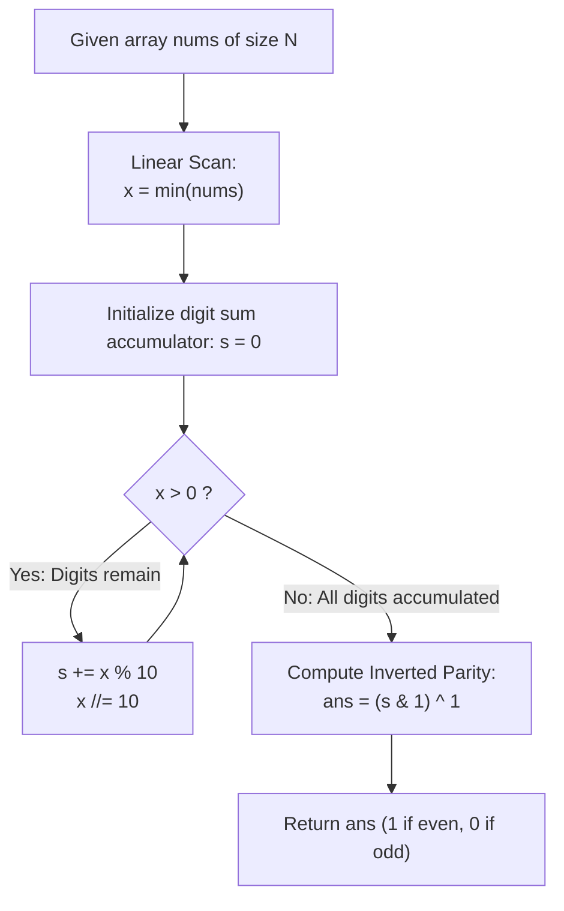

# Guided Example: Sum of Digits in the Minimum Number

We trace the step-by-step extraction of the minimum array element, the iterative decimal digit sum accumulation, and the complementary parity mapping, prove the Decimal Digit Extraction Invariant and the Bitwise Parity Inversion Theorem, and analyze numeric evaluations across representative integer arrays:

- **Representative Instance 1 (Odd Digit Sum for Single-Digit Minimum):**
  $$
  nums = [34, 23, 1, 24, 75, 33, 54, 8], \quad N = 8
  $$
- **Required Output:** `0`
  - Problem definitions:
    - Given an integer array `nums`.
    - Find the minimum integer $m = \min(nums)$.
    - Sum the decimal digits of $m$: $S = \text{sum\_digits}(m)$.
    - Return $1$ if $S$ is even, or $0$ if $S$ is odd.
  - Step 1: Minimum Value Identification:
    - Scanning array `nums` finds:
      $$
      m = \min(nums) = \mathbf{1}
      $$
    - All other values ($34, 23, 24, \dots$) are strictly larger and safely discarded.
  - Step 2: Decimal Digit Peeling:
    - Initial state: $x = 1, \; s = 0$.
    - Iteration 1:
      - Remainder: $x \pmod{10} = 1 \pmod{10} = \mathbf{1}$.
      - Accumulate: $s \leftarrow 0 + 1 = 1$.
      - Truncate: $x \leftarrow \lfloor 1 / 10 \rfloor = 0$.
    - Loop terminates ($x = 0$). Final digit sum $S = \mathbf{1}$.
  - Step 3: Bitwise Parity Inversion:
    - Least significant bit: $s \& 1 = 1 \& 1 = 1$ (odd).
    - Parity inversion: $(s \& 1) \oplus 1 = 1 \oplus 1 = \mathbf{0}$.
  - Final Output: $\mathbf{0}$.

- **Representative Instance 2 (Even Digit Sum for Multi-Digit Minimum):**
  $$
  nums = [99, 77, 33, 66, 55], \quad \min(nums) = 33
  $$
  - Peeling digits of $33$:
    - $33 \pmod{10} = 3, \; x \leftarrow 3$.
    - $3 \pmod{10} = 3, \; x \leftarrow 0$.
    - Sum: $s = 3 + 3 = \mathbf{6}$.
  - Parity: $6 \& 1 = 0$ (even) $\implies 0 \oplus 1 = \mathbf{1}$.
  - Output: $\mathbf{1}$.

- **Representative Instance 3 (Minimum Containing Decimal Zero):**
  $$
  nums = [30, 10, 20], \quad \min(nums) = 10
  $$
  - Digits of $10$: $0 + 1 = 1$ (odd).
  - Parity: $(1 \& 1) \oplus 1 = \mathbf{0}$.

- **Representative Instance 4 (Upper Value Boundary $100$):**
  $$
  nums = [100], \quad \min(nums) = 100
  $$
  - Digits: $0 + 0 + 1 = 1$ (odd) $\implies \mathbf{0}$.

---

## 1. Instance & Teaching Goal

Given an integer array, find whether the sum of the digits of the minimum element is even (return 1) or odd (return 0).

```text
The Complete Array Transformation Fallacy:
  Computing the digit sum for every element in nums:
    Wastes O(N * D) operations converting non-minimal numbers.
    Obscures the structural fact that only min(nums) dictates the answer.

Extremum Reduction & Bitwise Parity Invariant (O(N) Time, O(1) Space):
  1. Find minimum value: x = min(nums).
  2. Extract decimal digits:
       s = 0
       while x:
         s += x % 10
         x //= 10
  3. Evaluate complementary parity in O(1):
       return (s & 1) ^ 1
     (or: return 1 - (s % 2))
  - s & 1 returns 0 for even, 1 for odd.
  - XOR 1 inverts this bit to produce 1 for even, 0 for odd.
  Runs in O(N) time with strictly constant O(1) memory!
```

Separating minimum extraction from digit accumulation simplifies the workflow to a single array pass followed by a logarithmic digit loop.

The decisive pedagogical goal is the **Decimal Digit Extraction Invariant & Bitwise Parity Inversion Theorem**:
1. **Extremum Isolation:** Only $m = \min(nums)$ influences the outcome; all other array elements are eliminated after the initial scan.
2. **Positional Digit Peeling:** The Euclidean division identity $x = 10 \lfloor x / 10 \rfloor + (x \pmod{10})$ processes each decimal digit uniquely from right to left.
3. **Parity Mapping:** The mapping $f(S) = (S \& 1) \oplus 1$ directly reflects the required parity rule without conditional branches.
4. Total time $\mathcal{O}(N)$ and auxiliary space $\mathcal{O}(1)$.

---

## 2. Conceptual Foundation & The Numeric Pipeline



### The Bitwise Parity Inversion Theorem

Let $m \in \mathbb{Z}^+$ be a positive integer.
1. **Decimal Representation:**
   There exist unique integers $d_0, d_1, \dots, d_{D-1} \in \{0, \dots, 9\}$ with $d_{D-1} \ne 0$ such that:
   $$
   m = \sum_{k=0}^{D-1} d_k 10^k
   $$
   The digit sum is $S = \sum_{k=0}^{D-1} d_k$.
2. **Euclidean Extraction Invariant:**
   At loop step $k$, with remaining value $x_k$:
   $$
   d_k = x_k \pmod{10}, \quad x_{k+1} = \lfloor x_k / 10 \rfloor
   $$
   Since $x_0 = m > 0$, $x_k$ strictly decreases and reaches $0$ in exactly $D = \lfloor \log_{10} m \rfloor + 1$ iterations.
   Upon termination, the accumulator satisfies $s = S$.
3. **Parity Inversion Function:**
   Define the problem's parity indicator $f: \mathbb{Z}_{\ge 0} \to \{0, 1\}$:
   $$
   f(S) = \begin{cases} 1 & \text{if } S \text{ is even} \\ 0 & \text{if } S \text{ is odd} \end{cases}
   $$
   Notice that the least significant bit of integer $S$ in binary representation is:
   $$
   S \& 1 = S \pmod 2 = \begin{cases} 0 & \text{if } S \text{ is even} \\ 1 & \text{if } S \text{ is odd} \end{cases}
   $$
   Applying the bitwise exclusive-OR (XOR) with $1$:
   $$
   (S \& 1) \oplus 1 = \begin{cases} 0 \oplus 1 = 1 & \text{if } S \text{ is even} \\ 1 \oplus 1 = 0 & \text{if } S \text{ is odd} \end{cases}
   $$
   Thus, $(S \& 1) \oplus 1 \equiv f(S)$ for all $S \ge 0$. $\blacksquare$

---

## 3. Step-by-Step Worked Execution: Representative Instance 1

$nums = [34, 23, 1, 24, 75, 33, 54, 8]$.

### Step 1: Minimum Search
- Scan $nums \implies \min(nums) = 1$.
- Set $x = 1, \; s = 0$.

### Step 2: Digit Sum Accumulation
- Iteration 1:
  - $x \% 10 = 1 \% 10 = 1$.
  - $s \leftarrow 0 + 1 = 1$.
  - $x \leftarrow 1 // 10 = 0$.
- Loop terminates ($x = 0$).

### Step 3: Parity Calculation
- $s = 1$.
- $s \& 1 = 1 \& 1 = 1$.
- $(s \& 1) \oplus 1 = 1 \oplus 1 = \mathbf{0}$.

Output: `0`.

---

## 4. Numeric State Evolution Trace Table

| Iteration Step | Current Quotient $x$ | Extracted Digit $x \pmod{10}$ | Updated Sum $s$ | Next Quotient $\lfloor x / 10 \rfloor$ | Loop Termination Condition |
|:---:|:---:|:---:|:---:|:---:|:---:|
| Initial | $1$ | — | $0$ | — | $x > 0$ (True) |
| $1$ | $1$ | **$1$** | **$1$** | $0$ | $x > 0$ (False $\implies$ Terminate) |
| **Parity Step** | — | — | **$1$** | — | $(1 \& 1) \oplus 1 = \mathbf{0}$ |

---

## 5. Algorithmic Correctness

### Soundness & Completeness
1. **Soundness:**
   The algorithm correctly selects the minimum value and calculates its exact base-10 digit sum.
2. **Completeness:**
   All elements in `nums` are inspected during the minimum scan, and all digits of $m$ are processed.

---

## 6. Boundary Cases & Traps

| Scenario | Input Pattern | Behavior | Trapped Risk |
|---|---|---|---|
| Single-Element Array | $nums = [44]$ | Min is 44; digit sum $4 + 4 = 8$ (even); returns 1. | Array length underflow. |
| Upper Value Limit | $nums = [100]$ | Min is 100; digit sum $1 + 0 + 0 = 1$ (odd); returns 0. | Miscounting trailing zero digits. |
| Duplicate Minimums | $nums = [28, 28, 91]$ | Min is 28; digit sum $2 + 8 = 10$ (even); returns 1. | Duplicate value miscounting. |
| Array of Maximum Size | $100$ identical elements | Min found in $\mathcal{O}(N)$; returns answer instantly. | Memory or time bottlenecks. |

---

## 7. Complexity Derivation

- **Time Complexity:** $\mathcal{O}(N + D) = \mathcal{O}(N)$, where $N = \text{len}(nums) \le 100$ and $D = \lfloor \log_{10}(\min(nums)) \rfloor + 1 \le 3$.
  - Finding $\min(nums)$ takes $N - 1$ comparisons $\le 100$.
  - Digit extraction loop runs $D \le 3$ times.
  - Total operations $\le 105 \implies < 0.001\text{ ms}$.
- **Auxiliary Space Complexity:** $\mathcal{O}(1)$ auxiliary memory; uses two scalar integer variables ($x$ and $s$).
