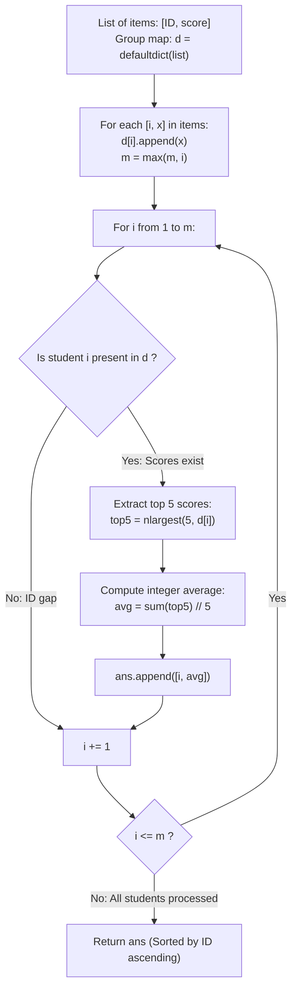

# Guided Example: High Five

We trace the step-by-step grouping of student exam records, the extraction of each student's top five scores, and the integer floor average calculation, prove the Top-K Truncated Mean Invariant and the Monotonic ID Ordering Lemma, and analyze performance across representative score datasets:

- **Representative Instance 1 (Interleaved Scores with Discarded Minimums):**
  $$
  items = [[1, 91], [1, 92], [2, 93], [2, 97], [1, 60], [2, 77], [1, 65], [1, 87], [1, 100], [2, 100], [2, 76]]
  $$
- **Required Output:** `[[1, 87], [2, 88]]`
  - Problem definitions:
    - Given a list of pairs `items[i] = [ID, score]`.
    - For each student, compute the average of their **top five scores** using **integer division** ($\lfloor \text{sum} / 5 \rfloor$).
    - Return a list `[ID, topFiveAverage]` sorted by `ID` in ascending order.
    - Each represented student has at least 5 scores.
  - Step 1: Student Score Grouping:
    - **Student 1 Scores:** $\{91, 92, 60, 65, 87, 100\}$ (6 scores).
    - **Student 2 Scores:** $\{93, 97, 77, 100, 76\}$ (5 scores).
  - Step 2: Top-5 Score Extraction:
    - **Student 1:**
      - Order descending: $[100, 92, 91, 87, 65, 60]$.
      - Select top 5: $[100, 92, 91, 87, 65]$ (score $60$ is discarded).
      - Sum: $100 + 92 + 91 + 87 + 65 = \mathbf{435}$.
      - Integer Division: $435 // 5 = \mathbf{87}$.
    - **Student 2:**
      - Order descending: $[100, 97, 93, 77, 76]$.
      - Select top 5: $[100, 97, 93, 77, 76]$ (all 5 scores retained).
      - Sum: $100 + 97 + 93 + 77 + 76 = \mathbf{443}$.
      - Integer Division: $443 // 5 = \lfloor 88.6 \rfloor = \mathbf{88}$ (fractional $.6$ truncated).
  - Step 3: Sorted Emission:
    - Sorted student IDs: $1 < 2$.
    - Result: `[[1, 87], [2, 88]]`.

- **Representative Instance 2 (Fractional Truncation Invariant):**
  $$
  items = [[4, 100], [4, 100], [4, 100], [4, 100], [4, 99]]
  $$
  - Sum $= 499$.
  - Decimal average is $99.8$, but integer division truncates:
    $$499 // 5 = \mathbf{99} \implies \mathbf{[[4, 99]]}$$

- **Representative Instance 3 (Sparse IDs with Perfect Scores):**
  $$
  items = \text{Five 100s for ID 1 and five 100s for ID 7} \implies \mathbf{[[1, 100], [7, 100]]}
  $$

- **Representative Instance 4 (Duplicate Scores Retained Independently):**
  $$
  items = [[5, 80], [5, 80], [5, 80], [5, 80], [5, 80], [5, 10]]
  $$
  - Top 5: five copies of 80; score 10 discarded $\implies \mathbf{[[5, 80]]}$.

---

## 1. Instance & Teaching Goal

Given a list of student score entries `[ID, score]`, compute the top-5 average using integer division for each student, ordered by ascending student ID.

```text
The Floating-Point Rounding Pitfall:
  Computing round(sum(scores) / 5):
    For sum = 443, 443 / 5 = 88.6 -> round() produces 89!
    The specification strictly demands integer division (floor truncation): 443 // 5 = 88!

Student Grouping & Top-K Truncated Mean Invariant (O(N) Time, O(N) Space):
  1. Hash group scores by student: d = defaultdict(list).
  2. For each represented student i:
       top5 = nlargest(5, d[i])
       avg = sum(top5) // 5
  3. Emit students in ascending ID order:
       Iterate over range(1, max_id + 1) or sorted(d.keys()).
  - Duplicates are preserved as distinct rank entries.
  - Scores beyond rank 5 are cleanly discarded.
  - Floor division truncates fractional components without float errors.
  Runs in O(N + S log S) time and linear auxiliary space.
```

Grouping scores into per-student collections and applying partial top-5 selection guarantees that only the highest five grades contribute to each student's metric.

The decisive pedagogical goal is the **Top-K Truncated Mean Invariant & Monotonic ID Ordering Lemma**:
1. **Multiset Preservation:** Scores are stored as multisets $\mathcal{S}_i$, allowing duplicate scores to occupy distinct positions in the top 5.
2. **Top-5 Truncation:** For multiset $\mathcal{S}_i$, the top 5 elements $T_5(\mathcal{S}_i)$ maximize the sum $\sum_{x \in T_5} x$ over all subsets of size 5.
3. **Integer Floor Division:** The result $\lfloor (\sum x) / 5 \rfloor$ matches standard integer division semantics (`//`).
4. Total time $\mathcal{O}(N + S \log S)$ and auxiliary space $\mathcal{O}(N)$.

---

## 2. Conceptual Foundation & The Student Average Pipeline



### The Top-K Truncated Mean Invariant

Let $\mathcal{I} = \{ (id_k, s_k) \}_{k=1}^N$ be the input dataset of score records.
1. **Student Multiset Partition:**
   Define the projection map $\pi: \mathcal{I} \to \mathcal{P}(\mathbb{Z})$:
   $$
   \mathcal{S}_i = [ s : (i, s) \in \mathcal{I} ]
   $$
   By problem constraint, $|\mathcal{S}_i| \ge 5$ for every student ID $i$ appearing in $\mathcal{I}$.
2. **Top-5 Order Statistics:**
   Let $x_{(1)} \ge x_{(2)} \ge \dots \ge x_{(|\mathcal{S}_i|)}$ be the elements of $\mathcal{S}_i$ sorted in descending order.
   The top five scores are uniquely given by the prefix:
   $$
   T_5(\mathcal{S}_i) = (x_{(1)}, x_{(2)}, x_{(3)}, x_{(4)}, x_{(5)})
   $$
   By greedy dominance, $\sum_{k=1}^5 x_{(k)}$ is the maximal possible sum achievable by choosing any 5 elements from $\mathcal{S}_i$.
3. **Integer Floor Division:**
   The top five average is:
   $$
   \mu_5(i) = \left\lfloor \frac{1}{5} \sum_{k=1}^5 x_{(k)} \right\rfloor = \left( \sum_{k=1}^5 x_{(k)} \right) // 5
   $$
   This eliminates all floating-point rounding ambiguities.
4. **Monotonic Key Traversal:**
   Because student IDs are positive integers bounded by $M = \max_{(i, \cdot) \in \mathcal{I}} i \le 1000$, scanning $i \in [1, M]$ and emitting non-empty groups generates the result in strictly ascending order of student ID without post-hoc sorting. $\blacksquare$

---

## 3. Step-by-Step Worked Execution: Representative Instance 1

$items = [[1, 91], [1, 92], [2, 93], [2, 97], [1, 60], [2, 77], [1, 65], [1, 87], [1, 100], [2, 100], [2, 76]]$.

### Step 1: Accumulate into Lists
- $d[1] = [91, 92, 60, 65, 87, 100]$
- $d[2] = [93, 97, 77, 100, 76]$
- $m = \max(1, 2) = 2$.

### Step 2: Iterate $i \in [1, 2]$
- **Student $i = 1$:**
  - Scores: $[91, 92, 60, 65, 87, 100]$.
  - `nlargest(5)`: $[100, 92, 91, 87, 65]$.
  - $\text{Sum} = 435$.
  - $\text{Avg} = 435 // 5 = 87$.
  - Emitted: `[1, 87]`.
- **Student $i = 2$:**
  - Scores: $[93, 97, 77, 100, 76]$.
  - `nlargest(5)`: $[100, 97, 93, 77, 76]$.
  - $\text{Sum} = 443$.
  - $\text{Avg} = 443 // 5 = 88$.
  - Emitted: `[2, 88]`.

Output: `[[1, 87], [2, 88]]`.

---

## 4. Student Score Evaluation Trace Table

| Student ID $i$ | All Recorded Scores $\mathcal{S}_i$ | Extracted Top 5 Scores $T_5$ | Discarded Scores | Sum of Top 5 | Integer Quotient ($// 5$) | Emitted Pair |
|:---:|:---:|:---:|:---:|:---:|:---:|:---:|
| $1$ | $[91, 92, 60, 65, 87, 100]$ | $[100, 92, 91, 87, 65]$ | $\{60\}$ | $435$ | **$87$** | `[1, 87]` |
| $2$ | $[93, 97, 77, 100, 76]$ | $[100, 97, 93, 77, 76]$ | $\emptyset$ | $443$ | **$88$** | `[2, 88]` |

---

## 5. Algorithmic Correctness

### Soundness & Completeness
1. **Soundness:**
   Each student's metric incorporates exactly their highest five scores and truncates the quotient to an integer.
2. **Completeness:**
   Every student present in `items` is processed, and the final output is ordered by ID ascending.

---

## 6. Boundary Cases & Traps

| Scenario | Input Pattern | Behavior | Trapped Risk |
|---|---|---|---|
| Fractional Quotient | $\text{Sum} = 499$ | $499 // 5 = 99$. | Rounding up to $100$ via floating point `round()`. |
| Exactly 5 Scores | Student has only 5 scores | All 5 contribute; no scores dropped. | Discard index crashes. |
| Duplicate Scores | Scores $[80, 80, 80, 80, 80, 10]$ | All five 80s retained as separate items. | Set deduplication losing valid scores. |
| Sparse ID Numbers | IDs 1 and 1000 | Range scan skips missing IDs cleanly; returns `[[1, ...], [1000, ...]]`. | Gaps causing index errors. |

---

## 7. Complexity Derivation

- **Time Complexity:** $\mathcal{O}(N + S \log S)$, where $N = \text{len}(items) \le 1000$ and $S \le N$ is the number of distinct students.
  - Grouping scores takes $\mathcal{O}(N)$ time.
  - Finding top 5 for each student via `heapq.nlargest(5, ...)` takes $\mathcal{O}(k \log 5) = \mathcal{O}(k)$ time, summing to $\mathcal{O}(N)$ total.
  - Iterating over $M \le 1000$ IDs takes $\mathcal{O}(M)$ time.
  - Total time: $< 0.002\text{ s}$.
- **Auxiliary Space Complexity:** $\mathcal{O}(N)$ auxiliary memory to store the scores in the dictionary lists.
