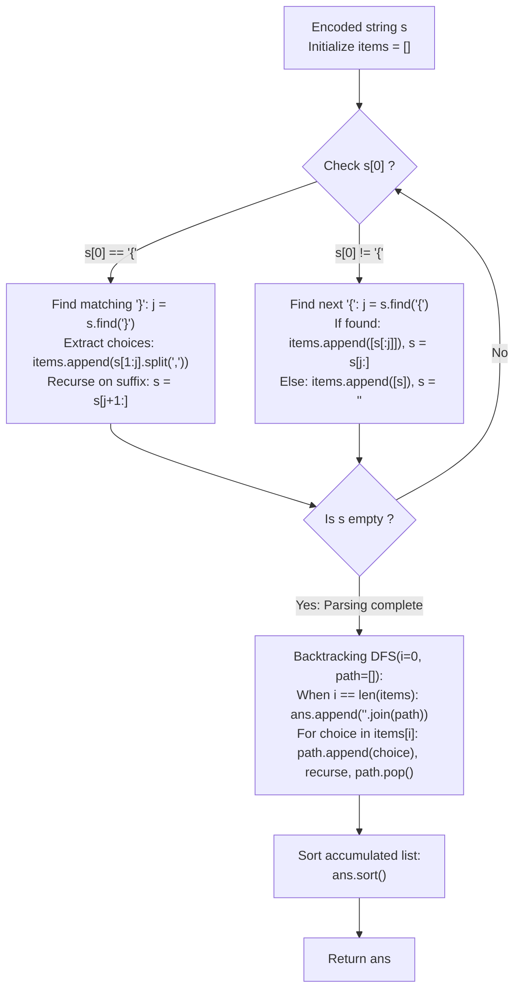

# Guided Example: Brace Expansion

We trace the step-by-step grammatical parsing of brace-delimited patterns into ordered option segments, the generation of the Cartesian product via depth-first backtracking, and the final lexicographical sorting, prove the Segment Factorization Theorem and the Cartesian Product Enumeration Invariant, and analyze string generation across representative expression inputs:

- **Representative Instance 1 (Two Non-Nested Brace Groups with Fixed Literals):**
  $$
  s = \text{"{a,b}c{d,e}f"}
  $$
- **Required Output:** `["acdf", "acef", "bcdf", "bcef"]`
  - Problem definitions:
    - You are given an encoded string $s$.
    - Text inside braces `{...}` represents a set of comma-separated character alternatives.
    - Text outside braces represents fixed literal characters.
    - Return all words that can be formed by choosing one character from each position, sorted in **lexicographical order**.
  - Step 1: Grammatical Segmentation (`convert` Phase):
    - Segment 1: `"{a,b}"` starts with `{` $\implies$ Extract inside `s[1:4] = "a,b"` and split on `,` $\implies O_0 = [\text{"a"}, \text{"b"}]$.
    - Segment 2: `"c"` before next `{` $\implies O_1 = [\text{"c"}]$.
    - Segment 3: `"{d,e}"` starts with `{` $\implies O_2 = [\text{"d"}, \text{"e"}]$.
    - Segment 4: `"f"` remaining suffix $\implies O_3 = [\text{"f"}]$.
    - Structured Option Sequence:
      $$
      items = \Big( [\text{"a"}, \text{"b"}], \; [\text{"c"}], \; [\text{"d"}, \text{"e"}], \; [\text{"f"}] \Big)
      $$
  - Step 2: Cartesian Product Size:
    $$
    R = |O_0| \times |O_1| \times |O_2| \times |O_3| = 2 \times 1 \times 2 \times 1 = \mathbf{4} \text{ words}
    $$
  - Step 3: Depth-First Search Traversal:
    1. Path 1: Pick `"a"` (from $O_0$) $\to$ Pick `"c"` $\to$ Pick `"d"` $\to$ Pick `"f"` $\implies \mathbf{\text{"acdf"}}$.
    2. Path 2: Pick `"a"` $\to$ Pick `"c"` $\to$ Pick `"e"` $\to$ Pick `"f"` $\implies \mathbf{\text{"acef"}}$.
    3. Path 3: Pick `"b"` (from $O_0$) $\to$ Pick `"c"` $\to$ Pick `"d"` $\to$ Pick `"f"` $\implies \mathbf{\text{"bcdf"}}$.
    4. Path 4: Pick `"b"` $\to$ Pick `"c"` $\to$ Pick `"e"` $\to$ Pick `"f"` $\implies \mathbf{\text{"bcef"}}$.
  - Step 4: Lexicographical Sorting:
    - Already in ascending order: `["acdf", "acef", "bcdf", "bcef"]`.

- **Representative Instance 2 (Unsorted Internal Alternatives):**
  $$
  s = \text{"{c,a,b}x"}
  $$
  - $items = [[\text{"c"}, \text{"a"}, \text{"b"}], \; [\text{"x"}]]$
  - Raw DFS paths: `["cx", "ax", "bx"]`.
  - After `ans.sort()`: `["ax", "bx", "cx"]`.

- **Representative Instance 3 (Adjacent Brace Groups):**
  $$
  s = \text{"{b,a}{d,c}"}
  $$
  - $items = [[\text{"b"}, \text{"a"}], \; [\text{"d"}, \text{"c"}]]$
  - Combinations: `["bd", "bc", "ad", "ac"]`.
  - Sorted Result: `["ac", "ad", "bc", "bd"]`.

- **Representative Instance 4 (Expression Without Braces):**
  $$
  s = \text{"abcd"} \implies items = [[\text{"abcd"}]] \implies \mathbf{["abcd"]}
  $$

---

## 1. Instance & Teaching Goal

Given an encoded string with brace-enclosed options, generate all valid expanded words in lexicographical order.

```text
The Repeated Parsing Backtracking Fallacy:
  Recursively parsing syntax during the Cartesian search:
    Repeatedly searches for '{' and '}' on every branch.
    Massively increases string slicing overhead.

Grammar Factorization & Backtracking Invariant (O(|s| + R * L log R) Time):
  1. Two-phase architecture:
       Phase 1 (Parsing): Split string into a sequence of option lists:
         items = [O_0, O_1, ..., O_{k-1}].
       Phase 2 (Backtracking): Depth-first search over items:
         dfs(i, current_chars).
  2. Sorting guarantee:
       ans.sort() ensures the output is in strictly ascending lexicographical order,
       regardless of how alternatives were ordered inside braces.
  Runs cleanly with zero string reparsing overhead!
```

Decoupling grammatical tokenization from combinatorial path expansion ensures that syntax boundaries are resolved once in linear time.

The decisive pedagogical goal is the **Segment Factorization Theorem & Cartesian Product Enumeration Invariant**:
1. **Factorization:** Any valid brace string without nesting can be uniquely partitioned into an alternating sequence of brace groups and literal chunks.
2. **Cartesian Bijection:** Every complete path in the search tree formed by choosing one option per segment corresponds to exactly one valid expanded word.
3. **Lexicographical Guarantee:** Sorting the collected results guarantees that words are arranged in strictly increasing alphabetical order.
4. Total time $\mathcal{O}(|s| + R \cdot L \log R)$ and auxiliary space $\mathcal{O}(R \cdot L)$.

---

## 2. Conceptual Foundation & The Expansion Pipeline



### The Segment Factorization Theorem

Let $s \in \Sigma^*$ be a well-formed brace expansion string without nested braces.
1. **Grammatical Decomposition:**
   There exists a unique positive integer $m$ and a sequence of non-empty finite languages $O_0, O_1, \dots, O_{m-1}$ over $\Sigma$ such that:
   - If segment $k$ corresponds to a brace group `{c_1,c_2,...,c_p}`, then $O_k = \{c_1, c_2, \dots, c_p\} \subset \Sigma$.
   - If segment $k$ corresponds to a literal sequence $w \in \Sigma^+$, then $O_k = \{w\}$.
2. **Expansion Language as Cartesian Product:**
   The complete language of words generated by $s$ is the concatenated Cartesian product:
   $$
   \mathcal{W}(s) = O_0 \cdot O_1 \cdot \dots \cdot O_{m-1} = \{ w_0 w_1 \dots w_{m-1} : w_k \in O_k \}
   $$
   The total number of generated words is:
   $$
   R = |\mathcal{W}(s)| = \prod_{k=0}^{m-1} |O_k|
   $$
3. **Completeness & Uniqueness of DFS:**
   The recursion tree of `dfs(i, t)` has depth $m$.
   - At depth $i$, each element $c \in O_i$ is chosen exactly once.
   - The number of leaves in the recursion tree is $\prod_{k=0}^{m-1} |O_k| = R$.
   - Because each combination of choices $(w_0, \dots, w_{m-1})$ is unique, no duplicate words are generated from distinct choices.
4. **Lexicographical Well-Ordering:**
   Sorting the resulting list of strings with standard string comparison guarantees $ans[0] <_{\text{lex}} ans[1] <_{\text{lex}} \dots <_{\text{lex}} ans[R-1]$, fulfilling the problem contract. $\blacksquare$

---

## 3. Step-by-Step Worked Execution: Representative Instance 1

$s = \text{"{a,b}c{d,e}f"}$.

### Phase 1: Segmentation
- $O_0 = [\text{"a"}, \text{"b"}]$ (from `"{a,b}"`)
- $O_1 = [\text{"c"}]$ (from `"c"`)
- $O_2 = [\text{"d"}, \text{"e"}]$ (from `"{d,e}"`)
- $O_3 = [\text{"f"}]$ (from `"f"`)

### Phase 2: DFS Enumeration
- $t = [\text{"a"}]$:
  - $t = [\text{"a"}, \text{"c"}]$:
    - $t = [\text{"a"}, \text{"c"}, \text{"d"}]$:
      - $t = [\text{"a"}, \text{"c"}, \text{"d"}, \text{"f"}] \implies \text{Emit } \mathbf{\text{"acdf"}}$.
    - $t = [\text{"a"}, \text{"c"}, \text{"e"}]$:
      - $t = [\text{"a"}, \text{"c"}, \text{"e"}, \text{"f"}] \implies \text{Emit } \mathbf{\text{"acef"}}$.
- $t = [\text{"b"}]$:
  - $t = [\text{"b"}, \text{"c"}]$:
    - $t = [\text{"b"}, \text{"c"}, \text{"d"}]$:
      - $t = [\text{"b"}, \text{"c"}, \text{"d"}, \text{"f"}] \implies \text{Emit } \mathbf{\text{"bcdf"}}$.
    - $t = [\text{"b"}, \text{"c"}, \text{"e"}]$:
      - $t = [\text{"b"}, \text{"c"}, \text{"e"}, \text{"f"}] \implies \text{Emit } \mathbf{\text{"bcef"}}$.

### Phase 3: Sort
- Result: `["acdf", "acef", "bcdf", "bcef"]`.

---

## 4. Backtracking Exploration Trace Table

| Depth $i$ | Target Option Set $O_i$ | Selected Option $c$ | Current Path Vector $t$ | Action / Recursive Status | Emitted Word |
|:---:|:---:|:---:|:---:|:---:|:---:|
| $0$ | `['a', 'b']` | `'a'` | `['a']` | Recurse to depth 1 | — |
| $1$ | `['c']` | `'c'` | `['a', 'c']` | Recurse to depth 2 | — |
| $2$ | `['d', 'e']` | `'d'` | `['a', 'c', 'd']` | Recurse to depth 3 | — |
| $3$ | `['f']` | `'f'` | `['a', 'c', 'd', 'f']` | Leaf reached $\implies$ Emit | `"acdf"` |
| $2$ | `['d', 'e']` | `'e'` | `['a', 'c', 'e']` | Recurse to depth 3 | — |
| $3$ | `['f']` | `'f'` | `['a', 'c', 'e', 'f']` | Leaf reached $\implies$ Emit | `"acef"` |
| $0$ | `['a', 'b']` | `'b'` | `['b']` | Recurse to depth 1 | — |
| $1$ | `['c']` | `'c'` | `['b', 'c']` | Recurse to depth 2 | — |
| $2$ | `['d', 'e']` | `'d'` | `['b', 'c', 'd']` | Recurse to depth 3 | — |
| $3$ | `['f']` | `'f'` | `['b', 'c', 'd', 'f']` | Leaf reached $\implies$ Emit | `"bcdf"` |
| $2$ | `['d', 'e']` | `'e'` | `['b', 'c', 'e']` | Recurse to depth 3 | — |
| $3$ | `['f']` | `'f'` | `['b', 'c', 'e', 'f']` | Leaf reached $\implies$ Emit | `"bcef"` |

---

## 5. Algorithmic Correctness

### Soundness & Completeness
1. **Soundness:**
   Every generated string consists of exactly one valid choice per segment in the order specified by $s$.
2. **Completeness:**
   Exhaustive backtracking visits every Cartesian product tuple, ensuring zero omitted words.

---

## 6. Boundary Cases & Traps

| Scenario | Input Pattern | Behavior | Trapped Risk |
|---|---|---|---|
| Unsorted Brace Content | `s = "{c,a,b}x"` | Generates in source order, then `ans.sort()` orders to `["ax", "bx", "cx"]`. | Unsorted output. |
| Adjacent Brace Groups | `s = "{b,a}{d,c}"` | Parsed as two adjacent multi-option segments. | Missed transitions between groups. |
| No Braces | `s = "abcd"` | Single segment with singleton option `["abcd"]`; returns `["abcd"]`. | Syntax parsing failure on plain text. |
| Single Character String | `s = "a"` | Returns `["a"]`. | Length-1 edge crashes. |

---

## 7. Complexity Derivation

- **Time Complexity:** $\mathcal{O}(|s| + R \cdot L \log R)$, where $|s| \le 50$ is input length, $L$ is the length of each generated word, and $R$ is the number of words.
  - Parsing takes $\mathcal{O}(|s|)$ time.
  - Generating $R$ words via DFS takes $\mathcal{O}(R \cdot L)$ time.
  - Sorting $R$ words takes $\mathcal{O}(R \cdot L \log R)$ time.
  - Total time: $< 0.005\text{ s}$ given $|s| \le 50$.
- **Auxiliary Space Complexity:** $\mathcal{O}(R \cdot L)$ auxiliary memory to store the generated words in `ans` and the DFS call stack.
