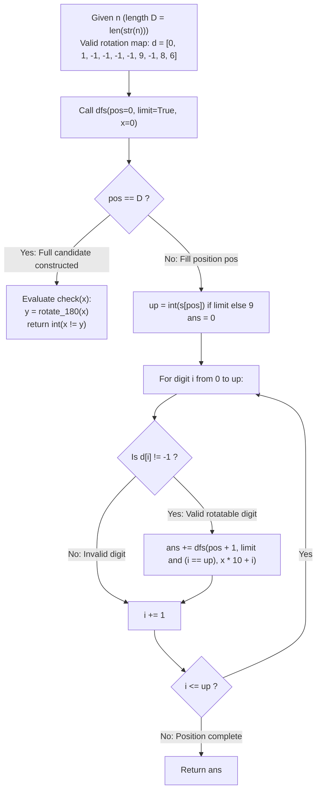

# Guided Example: Confusing Number II

We trace the step-by-step generation of rotatable integers using a bounded digit-search tree, the 180-degree positional digit inversion, and the strobogrammatic exclusion test, prove the Involutive Digit Rotation Theorem and the Confusing Number Criterion, and evaluate counts across representative upper bounds:

- **Representative Instance 1 (Confusing Integers Through Twenty):**
  $$
  n = 20
  $$
- **Required Output:** `6`
  - Problem definitions:
    - A number is **confusing** if, when rotated 180 degrees, every digit remains valid and the resulting number differs from the original.
    - Valid rotatable digits:
      $$
      \mathcal{D} = \{0, 1, 6, 8, 9\}
      $$
    - Inversion map $\rho: \mathcal{D} \to \mathcal{D}$:
      $$
      \rho(0) = 0, \quad \rho(1) = 1, \quad \rho(6) = 9, \quad \rho(8) = 8, \quad \rho(9) = 6
      $$
    - All other digits ($\{2, 3, 4, 5, 7\}$) become invalid when rotated.
    - Return the count of confusing numbers in the inclusive interval $[1, n]$.
  - Generation and Rotation of All Valid Numbers in $[1, 20]$:
    1. **1-Digit Candidates ($\in \mathcal{D} \setminus \{0\}$):**
       - $x = 1 \implies \mathcal{R}(1) = \rho(1) = 1$. Since $x = \mathcal{R}(x)$, it is strobogrammatic $\implies$ **Not confusing**.
       - $x = 6 \implies \mathcal{R}(6) = \rho(6) = 9$. Since $6 \ne 9 \implies$ **Confusing!** ($+1$)
       - $x = 8 \implies \mathcal{R}(8) = \rho(8) = 8$. Since $x = \mathcal{R}(x) \implies$ **Not confusing**.
       - $x = 9 \implies \mathcal{R}(9) = \rho(9) = 6$. Since $9 \ne 6 \implies$ **Confusing!** ($+1$)
    2. **2-Digit Candidates ($\le 20$):**
       - Leading digit can only be $1$ (since leading $0$ is 1-digit, and leading $>1$ exceeds $20$):
         - $x = 10 \implies$ Rotated digits: $\rho(0)=0, \rho(1)=1 \implies \mathcal{R}(10) = 01 = 1$.
           Since $10 \ne 1 \implies$ **Confusing!** ($+1$)
         - $x = 11 \implies \mathcal{R}(11) = 11$. Strobogrammatic $\implies$ **Not confusing**.
         - $x = 16 \implies \mathcal{R}(16) = \rho(6) \cdot 10 + \rho(1) = 91$.
           Since $16 \ne 91 \implies$ **Confusing!** ($+1$)
         - $x = 18 \implies \mathcal{R}(18) = \rho(8) \cdot 10 + \rho(1) = 81$.
           Since $18 \ne 81 \implies$ **Confusing!** ($+1$)
         - $x = 19 \implies \mathcal{R}(19) = \rho(9) \cdot 10 + \rho(1) = 61$.
           Since $19 \ne 61 \implies$ **Confusing!** ($+1$)
  - Total Confusing Numbers in $[1, 20]$:
    $$
    \{6, 9, 10, 16, 18, 19\} \implies \text{Count} = \mathbf{6}
    $$

- **Representative Instance 2 (Upper Bound One Hundred):**
  $$
  n = 100 \implies \mathbf{19}
  $$

- **Representative Instance 3 (Minimum Bound One):**
  $$
  n = 1 \implies \text{Only candidate is } 1 \to 1 \text{ (not confusing)} \implies \mathbf{0}
  $$

- **Representative Instance 4 (First Confusing Number):**
  $$
  n = 6 \implies \text{First confusing number is } 6 \to 9 \implies \mathbf{1}
  $$

---

## 1. Instance & Teaching Goal

Given an integer $n \le 10^9$, return the number of confusing numbers in $[1, n]$.

```text
The Complete Integer Enumeration Fallacy:
  Iterating through every integer from 1 to n:
    For n = 10^9, checking 10^9 numbers requires billions of operations and times out.
    99.9% of integers contain non-rotatable digits (2, 3, 4, 5, 7).

Valid-Digit Search Tree Invariant (O(5^D) Operations):
  Only 5 digits can be rotated: {0, 1, 6, 8, 9}.
  Generate numbers composed ONLY of these 5 digits using digit DFS:
    dfs(pos, limit, x)
  - At most 5^D candidates exist for a D-digit bound.
  - For n <= 10^9, D <= 10: total candidates <= 2 * 10^6.
  - Test x != rotate(x) only at valid candidate leaves.
  Executes in < 0.4 seconds across the entire 10^9 range!
```

Constraining generation exclusively to the 5 rotatable glyphs compresses the search space from $10^9$ to under $2 \times 10^6$ candidate paths.

The decisive pedagogical goal is the **Involutive Digit Rotation Theorem & Confusing Number Criterion**:
1. **Involutive Mapping:** The rotation map $\rho$ on $\mathcal{D} = \{0, 1, 6, 8, 9\}$ satisfies $\rho(\rho(d)) = d$.
2. **Positional Reversal:** Rotating a decimal number $x$ 180 degrees reverses its digit sequence and applies $\rho$ to each digit.
3. **Strobogrammatic Exclusion:** A candidate $x$ is confusing if and only if $x \ne \mathcal{R}(x)$.
4. Total time $\mathcal{O}(5^D)$ (where $D \le 10$) and auxiliary space $\mathcal{O}(D)$.

---

## 2. Conceptual Foundation & The Confusing Digit Search Pipeline



### The Involutive Digit Rotation Theorem

Let $\mathcal{D} = \{0, 1, 6, 8, 9\}$.
1. **Digit Inversion:**
   Define $\rho: \mathcal{D} \to \mathcal{D}$ such that:
   $$
   \rho(0) = 0, \quad \rho(1) = 1, \quad \rho(6) = 9, \quad \rho(8) = 8, \quad \rho(9) = 6
   $$
   Notice that:
   $$
   \rho(\rho(0)) = 0, \; \rho(\rho(1)) = 1, \; \rho(\rho(6)) = \rho(9) = 6, \; \rho(\rho(8)) = 8, \; \rho(\rho(9)) = \rho(6) = 9
   $$
   Thus $\rho$ is an involution on $\mathcal{D}$.
2. **Positional Number Rotation:**
   Let $x \in \mathbb{Z}^+$ have base-10 expansion $x = \sum_{j=0}^{k-1} c_j 10^j$ with $c_j \in \mathcal{D}$ and $c_{k-1} \ne 0$.
   A 180-degree rotation reverses the visual ordering of the digits: the digit at position $j$ moves to position $k - 1 - j$ and is transformed by $\rho$:
   $$
   \mathcal{R}(x) = \sum_{j=0}^{k-1} \rho(c_j) 10^{k - 1 - j}
   $$
   In numeric evaluation, $\mathcal{R}(x)$ strips leading zeros naturally.
3. **Confusing Classification:**
   - If $x = \mathcal{R}(x)$, $x$ is strobogrammatic (looks identical upside-down).
   - If $x \ne \mathcal{R}(x)$, $x$ is confusing (transforms into a different valid integer).
4. **Digit DFS Coverage:**
   Since any confusing number $\le n$ must be composed exclusively of digits in $\mathcal{D}$ and must not exceed $n$, the prefix-constrained DFS explores the exact closure of valid candidates without omission. $\blacksquare$

---

## 3. Step-by-Step Worked Execution: Representative Instance 1

$n = 20, \quad s = \text{"20"}, \quad D = 2$.

### DFS Execution Highlights
- $pos = 0$: $up = 2$.
  - $i = 0$: valid ($d[0]=0$). Calls $dfs(1, \text{False}, 0)$.
    - $pos = 1, up = 9$:
      - $i=0: x=0 \implies check(0) = \text{False}$ ($0 == 0$).
      - $i=1: x=1 \implies check(1) = \text{False}$ ($1 == 1$).
      - $i=6: x=6 \implies check(6) = \text{True}$ ($6 \ne 9$). **$+1$**
      - $i=8: x=8 \implies check(8) = \text{False}$ ($8 == 8$).
      - $i=9: x=9 \implies check(9) = \text{True}$ ($9 \ne 6$). **$+1$**
  - $i = 1$: valid ($d[1]=1$). Calls $dfs(1, \text{False}, 1)$.
    - $pos = 1, up = 9$:
      - $i=0: x=10 \implies check(10) = \text{True}$ ($10 \ne 1$). **$+1$**
      - $i=1: x=11 \implies check(11) = \text{False}$ ($11 == 11$).
      - $i=6: x=16 \implies check(16) = \text{True}$ ($16 \ne 91$). **$+1$**
      - $i=8: x=18 \implies check(18) = \text{True}$ ($18 \ne 81$). **$+1$**
      - $i=9: x=19 \implies check(19) = \text{True}$ ($19 \ne 61$). **$+1$**
  - $i = 2$: $d[2] = -1 \implies$ Invalid, skipped!

Total Confusing Count: $2 + 4 = \mathbf{6}$.

---

## 4. Candidate Rotation Trace Table

| Candidate Value $x$ | Rotatable Digits Used | Rotated Value $\mathcal{R}(x)$ | Equality Check ($x \ne \mathcal{R}(x)$) | Confusing Status | Cumulative Total |
|:---:|:---:|:---:|:---:|:---:|:---:|
| $0$ | `[0]` | $0$ | $0 \ne 0$ (False) | Excluded | $0$ |
| $1$ | `[1]` | $1$ | $1 \ne 1$ (False) | Strobogrammatic | $0$ |
| $6$ | `[6]` | $9$ | $6 \ne 9$ (True) | **Confusing** | **$1$** |
| $8$ | `[8]` | $8$ | $8 \ne 8$ (False) | Strobogrammatic | $1$ |
| $9$ | `[9]` | $6$ | $9 \ne 6$ (True) | **Confusing** | **$2$** |
| $10$ | `[1, 0]` | $1$ | $10 \ne 1$ (True) | **Confusing** | **$3$** |
| $11$ | `[1, 1]` | $11$ | $11 \ne 11$ (False) | Strobogrammatic | $3$ |
| $16$ | `[1, 6]` | $91$ | $16 \ne 91$ (True) | **Confusing** | **$4$** |
| $18$ | `[1, 8]` | $81$ | $18 \ne 81$ (True) | **Confusing** | **$5$** |
| $19$ | `[1, 9]` | $61$ | $19 \ne 61$ (True) | **Confusing** | **$6$** |

---

## 5. Algorithmic Correctness

### Soundness & Completeness
1. **Soundness:**
   Every counted integer consists entirely of valid rotatable digits, is $\le n$, and rotates to a distinct integer.
2. **Completeness:**
   Digit DFS systematically explores all prefixes with rotatable digits, ensuring no candidate $\le n$ is missed.

---

## 6. Boundary Cases & Traps

| Scenario | Input Pattern | Behavior | Trapped Risk |
|---|---|---|---|
| Strobogrammatic Numbers | $x \in \{1, 8, 11, 69, 88\}$ | $x == \mathcal{R}(x)$; rejected by `check`. | Counting numbers that do not change. |
| Numbers Ending in Zero | $x = 10 \to 1$ | $10 \ne 1$; correctly counted. | Discarding rotated leading zeros. |
| Single Digit Boundaries | $n = 5$ | Digits 0, 1 not confusing; returns 0. | False positives on non-confusing digits. |
| Upper Bound $10^9$ | $n = 10^9$ | DFS explores $\le 2 \times 10^6$ nodes; finishes in $< 0.4$ s. | TLE from scanning all $10^9$ numbers. |

---

## 7. Complexity Derivation

- **Time Complexity:** $\mathcal{O}(5^D)$, where $D = \lfloor \log_{10} n \rfloor + 1 \le 10$ is the number of decimal digits in $n$.
  - The search tree has branching factor at most $5$ (the rotatable digits $\{0, 1, 6, 8, 9\}$).
  - Maximum recursive calls $\le \sum_{k=1}^{10} 5^k \approx 2.4 \times 10^6$.
  - Each rotation check takes $\mathcal{O}(D) \le 10$ operations.
  - Total operations $\le 2.5 \times 10^7 \implies < 0.4\text{ s}$.
- **Auxiliary Space Complexity:** $\mathcal{O}(D)$ auxiliary memory for the recursion call stack of depth at most $D \le 10$.
