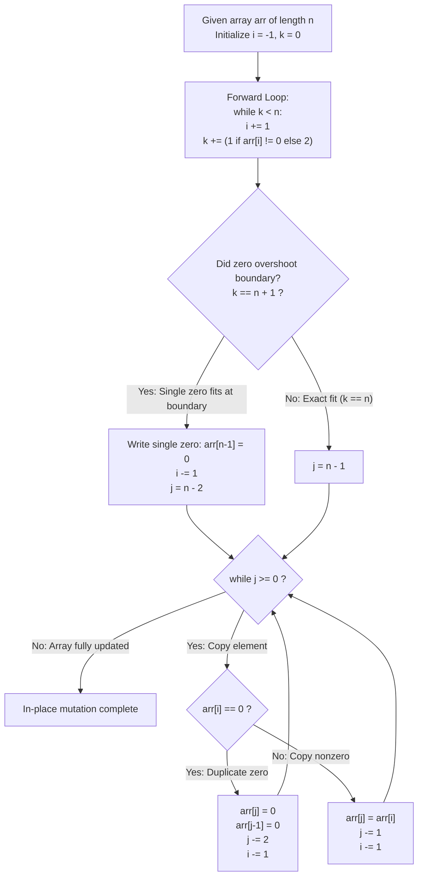

# Guided Example: Duplicate Zeros

We trace the step-by-step in-place duplication of zeros within a fixed-length array using a two-pass two-pointer strategy, prove the Backward Non-Overwriting Invariant and the Virtual Prefix Truncation Theorem, and evaluate array mutations across representative edge cases:

- **Representative Instance 1 (Multiple Middle Zeros with Trailing Drop):**
  $$
  arr = [1, 0, 2, 3, 0, 4, 5, 0], \quad n = 8
  $$
- **Required Output:** `[1, 0, 0, 2, 3, 0, 0, 4]` (modified in-place)
  - Problem definitions:
    - Given a fixed-length array `arr`.
    - Duplicate each occurrence of zero, shifting subsequent elements right.
    - Truncate any elements pushed past index $n - 1$.
    - Perform the modification **in-place** with $\mathcal{O}(1)$ auxiliary memory.
  - Phase 1: Forward Scan (Virtual Expansion Length $k$):
    - Track read index $i$ and cumulative expanded length $k$:
      - Step 1: $i=0, arr[0]=1 \implies k = 1$.
      - Step 2: $i=1, arr[1]=0 \implies k = 1 + 2 = 3$.
      - Step 3: $i=2, arr[2]=2 \implies k = 3 + 1 = 4$.
      - Step 4: $i=3, arr[3]=3 \implies k = 4 + 1 = 5$.
      - Step 5: $i=4, arr[4]=0 \implies k = 5 + 2 = 7$.
      - Step 6: $i=5, arr[5]=4 \implies k = 7 + 1 = 8$.
    - At this point, $k = 8 = n$. The surviving prefix is $arr[0 \dots 5]$.
    - Elements $arr[6]=5$ and $arr[7]=0$ are pushed off the array and discarded!
  - Phase 2: Backward In-Place Writing ($j = n - 1 = 7, \; i = 5$):
    - Write 1: $i=5, arr[5]=4 \implies arr[7] = 4$. Decrement $j \leftarrow 6, \; i \leftarrow 4$.
    - Write 2: $i=4, arr[4]=0 \implies arr[6] = 0, \; arr[5] = 0$. Decrement $j \leftarrow 4, \; i \leftarrow 3$.
    - Write 3: $i=3, arr[3]=3 \implies arr[4] = 3$. Decrement $j \leftarrow 3, \; i \leftarrow 2$.
    - Write 4: $i=2, arr[2]=2 \implies arr[3] = 2$. Decrement $j \leftarrow 2, \; i \leftarrow 1$.
    - Write 5: $i=1, arr[1]=0 \implies arr[2] = 0, \; arr[1] = 0$. Decrement $j \leftarrow 0, \; i \leftarrow 0$.
    - Write 6: $i=0, arr[0]=1 \implies arr[0] = 1$. Decrement $j \leftarrow -1, \; i \leftarrow -1$.
  - Final In-Place Result:
    $$
    [\mathbf{1, 0, 0, 2, 3, 0, 0, 4}]
    $$

- **Representative Instance 2 (Boundary Zero Truncation $k = n + 1$):**
  $$
  arr = [1, 2, 3, 0], \quad n = 4
  $$
  - Forward scan:
    - $i=0 (1) \to k=1$; $i=1 (2) \to k=2$; $i=2 (3) \to k=3$.
    - $i=3 (0) \to k = 3 + 2 = 5 = n + 1$.
  - Overshoot detected: only **one** copy of the trailing zero fits inside the array!
  - Special boundary step: write $arr[3] = 0$, decrement $i \leftarrow 2, \; j \leftarrow 2$.
  - Backward copy: $arr[2]=3, arr[1]=2, arr[0]=1 \implies \mathbf{[1, 2, 3, 0]}$.

- **Representative Instance 3 (Array Without Zeros):**
  $$
  arr = [1, 2, 3] \implies k = 3, \; i = 2 \implies \text{Every element copied to its own index} \implies \mathbf{[1, 2, 3]}
  $$

- **Representative Instance 4 (Single Element Zero):**
  $$
  arr = [0] \implies k = 2 = n + 1 \implies arr[0] = 0 \implies \mathbf{[0]}
  $$

---

## 1. Instance & Teaching Goal

Given a fixed-length array, duplicate each zero in-place without allocating a secondary buffer, shifting following values to the right.

```text
The Left-to-Right Overwrite Hazard:
  Writing duplicate zeros from left to right in-place:
    arr = [1, 0, 2, ...]
    duplicating arr[1]=0 writes to arr[2], destroying the original value '2'
    before it can ever be read!

Two-Pass Backward In-Place Invariant (O(n) Time, O(1) Auxiliary Space):
  Pass 1 (Virtual Length Sizing):
    Advance i and accumulate virtual expanded slots k:
      k += (1 if arr[i] != 0 else 2)
    Stops when k >= n. Index i marks the last contributing original element.
  Pass 2 (Backward In-Place Copy):
    Handle boundary zero if k == n + 1 (only 1 copy of arr[i] fits).
    Iterate backwards:
      if arr[i] == 0: arr[j] = arr[j-1] = 0; j -= 2
      else:           arr[j] = arr[i];       j -= 1
      i -= 1
  - Because j >= i strictly holds at all times, write operations NEVER destroy
    unread source data at index i!
```

Measuring the virtual expanded boundary in a forward pass enables writing from right to left, preventing overwrites of unread data.

The decisive pedagogical goal is the **Backward Non-Overwriting Invariant & Virtual Prefix Truncation Theorem**:
1. **Virtual Prefix Partition:** The input is divided into a contributing prefix $arr[0 \dots i]$ and a discarded suffix $arr[i+1 \dots n-1]$.
2. **Boundary Zero Discrepancy:** When $k = n + 1$, the final zero can duplicate only once; the second copy falls past index $n - 1$.
3. **Write Pointer Domination ($j \ge i$):** Because every zero consumes 2 write slots while occupying 1 read slot, the write pointer $j$ is always ahead of or equal to read pointer $i$.
4. Total time $\mathcal{O}(n)$ and auxiliary space strictly $\mathcal{O}(1)$.

---

## 2. Conceptual Foundation & The In-Place Shift Pipeline



### The Backward Non-Overwriting Invariant

Let $arr$ be an array of length $n$.
1. **Prefix Expansion Length:**
   For any source prefix $arr[0 \dots m]$, its expanded length after zero duplication is:
   $$
   k(m) = \sum_{p=0}^m \big( 1 + \mathbb{I}(arr[p] = 0) \big)
   $$
   The forward pass stops at the minimal index $i$ such that $k(i) \ge n$.
2. **Overshoot Lemma:**
   Since each step increments $k$ by at most $2$, and the loop runs while $k < n$:
   $$
   k(i) \in \{n, \; n + 1\}
   $$
   If $k(i) = n + 1$, the element $arr[i]$ must be $0$, and only its first copy fits in destination slot $n - 1$.
3. **The Non-Overwriting Guarantee ($j \ge i$):**
   At any step of the backward pass where read pointer is at $i$ and write pointer is at $j$:
   The number of remaining write slots $j + 1$ is exactly the expanded length of the remaining prefix $arr[0 \dots i]$:
   $$
   j + 1 = k(i) = \sum_{p=0}^i \big( 1 + \mathbb{I}(arr[p] = 0) \big) \ge \sum_{p=0}^i 1 = i + 1
   $$
   Therefore:
   $$
   j \ge i
   $$
   Because the write pointer $j$ is always strictly greater than or equal to the read pointer $i$, writing to $arr[j]$ (and $arr[j-1]$ when duplicating a zero) never overwrites the unread value at $arr[i]$. $\blacksquare$

---

## 3. Step-by-Step Worked Execution: Representative Instance 1

$arr = [1, 0, 2, 3, 0, 4, 5, 0], \quad n = 8$.

### Forward Pass
- $i=0: arr[0]=1 \implies k=1$
- $i=1: arr[1]=0 \implies k=3$
- $i=2: arr[2]=2 \implies k=4$
- $i=3: arr[3]=3 \implies k=5$
- $i=4: arr[4]=0 \implies k=7$
- $i=5: arr[5]=4 \implies k=8$
- Loop ends ($k = 8 \ge 8$). $k == n \implies$ No boundary overshoot.
- Contributing prefix: $arr[0 \dots 5]$.

### Backward Pass ($j = 7, \; i = 5$)
- $i=5, arr[5]=4 \implies arr[7] = 4, \; j \leftarrow 6, \; i \leftarrow 4$.
- $i=4, arr[4]=0 \implies arr[6]=0, arr[5]=0, \; j \leftarrow 4, \; i \leftarrow 3$.
- $i=3, arr[3]=3 \implies arr[4]=3, \; j \leftarrow 3, \; i \leftarrow 2$.
- $i=2, arr[2]=2 \implies arr[3]=2, \; j \leftarrow 2, \; i \leftarrow 1$.
- $i=1, arr[1]=0 \implies arr[2]=0, arr[1]=0, \; j \leftarrow 0, \; i \leftarrow 0$.
- $i=0, arr[0]=1 \implies arr[0]=1, \; j \leftarrow -1, \; i \leftarrow -1$.

Array becomes: `[1, 0, 0, 2, 3, 0, 0, 4]`.

---

## 4. Two-Pointer In-Place Mutation Trace Table

| Step | Read Pointer $i$ | Source Value $arr[i]$ | Write Pointer $j$ | Destination Slots Modified | Slot Values Set | Invariant $j \ge i$ | Resulting Array Suffix |
|:---:|:---:|:---:|:---:|:---:|:---:|:---:|:---:|
| Start | $5$ | $4$ | $7$ | $arr[7]$ | $4$ | $7 \ge 5$ (True) | `[..., 4]` |
| 1 | $4$ | $0$ | $6$ | $arr[6], arr[5]$ | $0, 0$ | $6 \ge 4$ (True) | `[..., 0, 0, 4]` |
| 2 | $3$ | $3$ | $4$ | $arr[4]$ | $3$ | $4 \ge 3$ (True) | `[..., 3, 0, 0, 4]` |
| 3 | $2$ | $2$ | $3$ | $arr[3]$ | $2$ | $3 \ge 2$ (True) | `[..., 2, 3, 0, 0, 4]` |
| 4 | $1$ | $0$ | $2$ | $arr[2], arr[1]$ | $0, 0$ | $2 \ge 1$ (True) | `[..., 0, 0, 2, 3, 0, 0, 4]` |
| 5 | $0$ | $1$ | $0$ | $arr[0]$ | $1$ | $0 \ge 0$ (True) | `[1, 0, 0, 2, 3, 0, 0, 4]` |

---

## 5. Algorithmic Correctness

### Soundness & Completeness
1. **Soundness:**
   Zeros inside the surviving prefix are duplicated, nonzeros are preserved, and trailing elements are truncated cleanly.
2. **Completeness:**
   All $n$ destination positions are written, leaving no uninitialized or misaligned cells.

---

## 6. Boundary Cases & Traps

| Scenario | Input Pattern | Behavior | Trapped Risk |
|---|---|---|---|
| Half-Fitting Boundary Zero | $arr = [1, 2, 3, 0]$ | $k = 5 = n+1$; writes single 0 at $arr[3]$; leaves other elements intact. | Writing two zeros into one available slot. |
| Array of All Zeros | $arr = [0, 0, 0]$ | All written values are 0; finishes without out-of-bounds index errors. | Overshooting array bounds. |
| Array with No Zeros | $arr = [1, 2, 3]$ | $k = n$; each element written onto itself; array unchanged. | Pointless reallocation. |
| Single Element Array | $arr = [0]$ | $k = 2 = n+1$; single 0 written; returns $[0]$. | Zero-length pointer crashes. |

---

## 7. Complexity Derivation

- **Time Complexity:** $\mathcal{O}(n)$, where $n = \text{len}(arr) \le 10000$.
  - Forward pass: advances $i$ at most $n$ times $\implies \mathcal{O}(n)$ operations.
  - Backward pass: writes each destination index $j$ exactly once from $n - 1$ down to $0 \implies \mathcal{O}(n)$ operations.
  - Total time: $< 0.003\text{ s}$.
- **Auxiliary Space Complexity:** strictly $\mathcal{O}(1)$ auxiliary memory; operates entirely in-place on the input array using three pointer variables ($i, j, k$).
