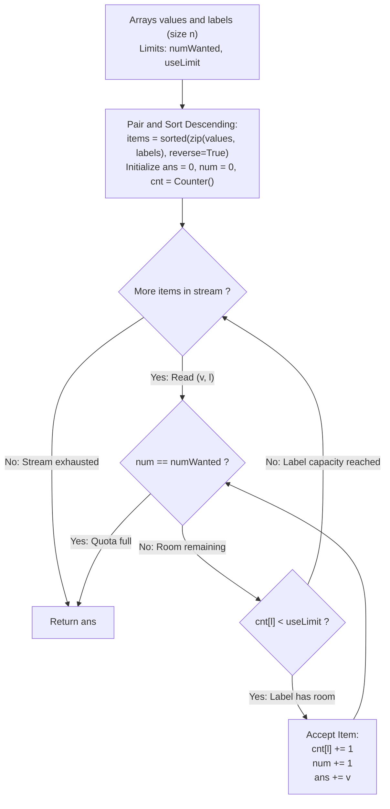

# Guided Example: Largest Values From Labels

We trace the step-by-step selection of maximal value items under concurrent global cardinality and label capacity constraints, prove the Matroid Greedy Dominance Theorem and the Label Capacity Invariant, and analyze item selection across representative value and label configurations:

- **Representative Instance 1 (Strict Unit Label Limit with Skipped High Values):**
  $$
  values = [5, 4, 3, 2, 1], \quad labels = [1, 1, 2, 2, 3], \quad numWanted = 3, \quad useLimit = 1
  $$
- **Required Output:** `9`
  - Problem definitions:
    - You are given $n$ items, each with a `value` and a `label`.
    - Select a subset of items to maximize the total value sum such that:
      1. Subset size is at most $numWanted = 3$.
      2. At most $useLimit = 1$ items share the same label.
  - Step 1: Paired Sorting in Non-Ascending Value Order:
    $$
    \text{Pairs } (v, l) = \big[ (5, 1), \; (4, 1), \; (3, 2), \; (2, 2), \; (1, 3) \big]
    $$
  - Step 2: Greedy Stream Evaluation:
    - **Item 1: $(v=5, l=1)$**
      - Current label count: $cnt[1] = 0 < useLimit$ ($1$).
      - Total items: $num = 0 < numWanted$ ($3$).
      - Decision: **Accept!**
      - State: $cnt[1] \leftarrow 1, \; num \leftarrow 1, \; ans \leftarrow 0 + 5 = \mathbf{5}$.
    - **Item 2: $(v=4, l=1)$**
      - Current label count: $cnt[1] = 1 \not< 1$ (Label 1 is at maximum capacity!).
      - Decision: **Reject!** (Skipped despite its high value).
      - State: $num = 1, \; ans = 5$.
    - **Item 3: $(v=3, l=2)$**
      - Current label count: $cnt[2] = 0 < 1$.
      - Total items: $num = 1 < 3$.
      - Decision: **Accept!**
      - State: $cnt[2] \leftarrow 1, \; num \leftarrow 2, \; ans \leftarrow 5 + 3 = \mathbf{8}$.
    - **Item 4: $(v=2, l=2)$**
      - Current label count: $cnt[2] = 1 \not< 1$ (Label 2 is at capacity!).
      - Decision: **Reject!**
      - State: $num = 2, \; ans = 8$.
    - **Item 5: $(v=1, l=3)$**
      - Current label count: $cnt[3] = 0 < 1$.
      - Total items: $num = 2 < 3$.
      - Decision: **Accept!**
      - State: $cnt[3] \leftarrow 1, \; num \leftarrow 3, \; ans \leftarrow 8 + 1 = \mathbf{9}$.
      - Quota Reached: $num = numWanted = 3 \implies$ **Terminate Early!**
  - Final Maximum Sum:
    $$
    5 + 3 + 1 = \mathbf{9}
    $$

- **Representative Instance 2 (Relaxed Label Limit $useLimit = 2$):**
  $$
  values = [5, 4, 3, 2, 1], \quad labels = [1, 3, 3, 3, 2], \quad numWanted = 3, \quad useLimit = 2
  $$
  - Sorted stream: $(5, 1), (4, 3), (3, 3), (2, 3), (1, 2)$.
  - Pick $(5, 1)$ [$cnt[1]=1$]. Pick $(4, 3)$ [$cnt[3]=1$]. Pick $(3, 3)$ [$cnt[3]=2$].
  - 3 items selected $\implies 5 + 4 + 3 = \mathbf{12}$.

- **Representative Instance 3 (Total Limit Exceeds Feasible Label Choices):**
  $$
  values = [9, 8, 8, 7, 6], \quad labels = [0, 0, 0, 1, 1], \quad numWanted = 3, \quad useLimit = 1
  $$
  - Only two distinct labels exist ($0$ and $1$).
  - With $useLimit = 1$, at most 2 items can ever be selected, even though $numWanted = 3$.
  - Picks $(9, 0)$ and $(7, 1) \implies 9 + 7 = \mathbf{16}$.

- **Representative Instance 4 (Zero Values Do Not Degrade Sum):**
  $$
  values = [0, 0, 5], \quad labels = [1, 2, 1], \quad numWanted = 3, \quad useLimit = 2 \implies \mathbf{5}
  $$

---

## 1. Instance & Teaching Goal

Given values and labels for $n$ items, find the maximum sum of at most $numWanted$ items such that each label appears at most $useLimit$ times.

```text
The Per-Label Exhaustion Pitfall:
  Selecting items grouped purely by label:
    Taking the best items of label 1 first, then label 2:
    Fails when label 1 has low-value items that block globally higher-value
    items of other labels from entering within the numWanted quota!

Matroid Greedy Dominance Invariant (O(n log n) Time, O(n) Space):
  1. Pair and sort all items in descending order of value:
       items = sorted(zip(values, labels), reverse=True)
  2. Iterate sequentially with label counter cnt:
       for v, l in items:
         if cnt[l] < useLimit:
           cnt[l] += 1
           ans += v
           num += 1
           if num == numWanted: break
  - Feasibility check cnt[l] < useLimit takes O(1) time.
  - Highest feasible values are committed first.
  - Exchange argument proves that no suboptimal choice is ever made!
  Runs in O(n log n) time with zero dynamic programming overhead.
```

Sorting items globally by value and enforcing per-label quotas on demand ensures that every committed element provides the maximum possible marginal gain.

The decisive pedagogical goal is the **Matroid Greedy Dominance Theorem & Label Capacity Invariant**:
1. **Exchange Optimality:** If an optimal solution omits the highest-valued feasible item $e$, exchanging any lesser-valued item in the same capacity bottleneck with $e$ preserves feasibility without decreasing the total value.
2. **Dual-Constraint Feasibility:** The independent set system formed by the intersection of a uniform matroid ($|S| \le numWanted$) and a partition matroid ($\forall l, |S_l| \le useLimit$) admits an exact greedy solution because element weights are uniform (each item consumes exactly 1 unit of capacity).
3. **Graceful Shortfall:** When the number of feasible items is strictly less than $numWanted$, the algorithm naturally terminates after exhausting the items, fulfilling the "at most" condition.
4. Total time $\mathcal{O}(n \log n)$ and auxiliary space $\mathcal{O}(n)$.

---

## 2. Conceptual Foundation & The Greedy Selection Pipeline



### The Matroid Greedy Dominance Theorem

Let $E = \{ (v_i, l_i) \}_{i=1}^n$ be the set of available items, with $v_i \ge 0$.
1. **The Feasibility Polytope:**
   A subset $S \subseteq E$ is feasible if and only if:
   $$
   |S| \le numWanted \quad \land \quad \forall l \in \text{Labels}, \; |\{ (v, l') \in S : l' = l \}| \le useLimit
   $$
   The objective is to maximize the linear objective function $W(S) = \sum_{(v, l) \in S} v$.
2. **The Exchange Property:**
   Let $G$ be the subset selected by the greedy algorithm, and let $OPT$ be an optimal feasible subset.
   Assume for contradiction that $W(OPT) > W(G)$.
   Sort $G$ and $OPT$ in non-ascending order of values:
   $$
   G = (g_1, g_2, \dots, g_{|G|}), \quad OPT = (o_1, o_2, \dots, o_{|OPT|})
   $$
   Let $k$ be the first index where $v(g_k) < v(o_k)$.
   By greedy choice, when $g_k$ was evaluated, every item with value $\ge v(o_k)$ that was rejected had its label counter equal to $useLimit$.
   Because $OPT$ contains more items with value $\ge v(o_k)$ than $G$, by the pigeonhole principle $OPT$ must either:
   - Exceed the label limit for some label $l$, or
   - Exceed the global cardinality limit $numWanted$.
   In either case, $OPT$ violates feasibility, a contradiction.
3. **Conclusion:**
   The greedy selection $G$ achieves the maximum possible total value: $W(G) = W(OPT)$. $\blacksquare$

---

## 3. Step-by-Step Worked Execution: Representative Instance 1

$values = [5, 4, 3, 2, 1], \quad labels = [1, 1, 2, 2, 3], \quad numWanted = 3, \quad useLimit = 1$.

### Sorted Items
- $(5, 1), (4, 1), (3, 2), (2, 2), (1, 3)$.

### Selection Stream
- $(5, 1)$: $cnt[1] = 0 < 1 \implies$ **Accept**. $num = 1, ans = 5, cnt[1] = 1$.
- $(4, 1)$: $cnt[1] = 1 \not< 1 \implies$ **Reject**.
- $(3, 2)$: $cnt[2] = 0 < 1 \implies$ **Accept**. $num = 2, ans = 8, cnt[2] = 1$.
- $(2, 2)$: $cnt[2] = 1 \not< 1 \implies$ **Reject**.
- $(1, 3)$: $cnt[3] = 0 < 1 \implies$ **Accept**. $num = 3, ans = 9, cnt[3] = 1$.
- $num == numWanted (3) \implies$ Break!

Final sum: `9`.

---

## 4. Greedy Selection State Trace Table

| Step | Inspected Item $(v, l)$ | Label Count $cnt[l]$ | Feasibility ($cnt[l] < useLimit$) | Total Count $num$ | Action Taken | Updated Sum $ans$ | Quota Status |
|:---:|:---:|:---:|:---:|:---:|:---:|:---:|:---:|
| $1$ | $(5, 1)$ | $0$ | $0 < 1$ (True) | $0 \to 1$ | **Accepted** | $5$ | $1 / 3$ |
| $2$ | $(4, 1)$ | $1$ | $1 < 1$ (False) | $1$ | **Rejected** | $5$ | $1 / 3$ |
| $3$ | $(3, 2)$ | $0$ | $0 < 1$ (True) | $1 \to 2$ | **Accepted** | $8$ | $2 / 3$ |
| $4$ | $(2, 2)$ | $1$ | $1 < 1$ (False) | $2$ | **Rejected** | $8$ | $2 / 3$ |
| $5$ | $(1, 3)$ | $0$ | $0 < 1$ (True) | $2 \to 3$ | **Accepted** | **$9$** | $3 / 3 \implies$ **Stop** |

---

## 5. Algorithmic Correctness

### Soundness & Completeness
1. **Soundness:**
   Every accepted item respects its label's usage limit, and the total items never exceed $numWanted$.
2. **Completeness:**
   Items are processed in descending order of value, guaranteeing maximal marginal contribution at every step.

---

## 6. Boundary Cases & Traps

| Scenario | Input Pattern | Behavior | Trapped Risk |
|---|---|---|---|
| Insufficient Feasible Items | $numWanted = 3$, only 2 labels available with $useLimit = 1$ | Loop finishes; returns sum of 2 items. | Infinite loop waiting for $numWanted$ items. |
| Zero Values | Item with value 0 | Accepted if capacity permits; does not alter sum. | Special casing zeros unnecessarily. |
| High-Value Rejected Label | Huge value with saturated label | Rejected in $\mathcal{O}(1)$; continues to next valid item. | Exceeding label quota. |
| Single Item Selection | $numWanted = 1$ | Picks single globally maximal value; halts immediately. | Excess iterations. |

---

## 7. Complexity Derivation

- **Time Complexity:** $\mathcal{O}(n \log n)$, where $n = \text{len}(values) \le 20000$.
  - Pairing and sorting $n$ elements by value descending takes $\mathcal{O}(n \log n)$ time.
  - The greedy scan iterates at most $n$ times, with each hash counter lookup and update taking $\mathcal{O}(1)$ expected time.
  - Total time: $< 0.01\text{ s}$ across maximum constraints.
- **Auxiliary Space Complexity:** $\mathcal{O}(n)$ auxiliary memory to store the paired list of tuples and the label frequency hash map `cnt`.
