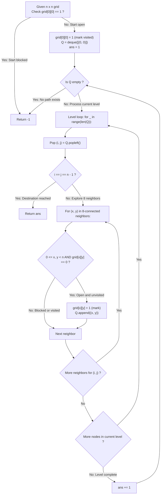

# Guided Example: Shortest Path in Binary Matrix

We trace the step-by-step unweighted breadth-first exploration across an 8-connected grid, prove the Level-Synchronous BFS Optimality Invariant and the Enqueue-Time Visited Marker Theorem, and analyze shortest-path discovery across representative grid layouts:

- **Representative Instance 1 (Immediate Diagonal Traversal):**
  $$
  grid = \begin{bmatrix} 0 & 1 \\ 1 & 0 \end{bmatrix}, \quad n = 2
  $$
- **Required Output:** `2`
  - Problem definitions:
    - Given an $n \times n$ binary matrix `grid`.
    - A **clear path** is a sequence of cells from $(0, 0)$ to $(n - 1, n - 1)$ such that all visited cells have value $0$, and consecutive cells are **8-directionally connected** (horizontal, vertical, or diagonal).
    - Return the minimum number of visited cells along a clear path, or $-1$ if unreachable.
  - Step 1: Initial Boundary Check:
    - Start cell $grid[0][0] = 0$ (open).
    - Target cell $grid[1][1] = 0$ (open).
    - Mark start visited: $grid[0][0] \leftarrow 1$.
    - Initialize queue: $Q = [ (0, 0) ]$.
    - Initial path length: $ans = 1$.
  - Step 2: Level 1 Expansion ($ans = 1$):
    - Dequeue $(0, 0)$. Target is $(1, 1)$, so $(0, 0)$ is not the destination.
    - Inspect all 8 neighbors $(x, y) \in [0, 1] \times [0, 1] \setminus \{(0, 0)\}$:
      - $(0, 1)$: $grid[0][1] = 1$ (blocked, skip).
      - $(1, 0)$: $grid[1][0] = 1$ (blocked, skip).
      - $(1, 1)$: $grid[1][1] = 0$ (open!).
        - Mark visited: $grid[1][1] \leftarrow 1$.
        - Enqueue: $Q.append((1, 1))$.
    - Level 1 finished. Advance path length: $ans \leftarrow 1 + 1 = \mathbf{2}$.
  - Step 3: Level 2 Expansion ($ans = 2$):
    - Dequeue $(1, 1)$.
    - Target check: $i = 1 = n - 1$ and $j = 1 = n - 1$ $\implies$ **Target reached!**
    - Return $ans = \mathbf{2}$.
  - Final Shortest Path Length:
    $$
    \mathbf{2}
    $$

- **Representative Instance 2 (Routing Around Obstacle Walls):**
  $$
  grid = \begin{bmatrix} 0 & 0 & 0 \\ 1 & 1 & 0 \\ 1 & 1 & 0 \end{bmatrix}, \quad n = 3
  $$
  - Obstacles block column 0 and column 1 for rows 1 and 2.
  - Level 1: $(0, 0)$ enqueues $(0, 1)$ [$ans=1$].
  - Level 2: $(0, 1)$ enqueues $(0, 2)$ [$ans=2$].
  - Level 3: $(0, 2)$ enqueues $(1, 2)$ [$ans=3$].
  - Level 4: $(1, 2)$ enqueues $(2, 2)$ (target) $\implies ans = \mathbf{4}$.

- **Representative Instance 3 (Blocked Starting Cell):**
  $$
  grid = \begin{bmatrix} 1 & 0 \\ 0 & 0 \end{bmatrix} \implies grid[0][0] == 1 \implies \mathbf{-1}
  $$

- **Representative Instance 4 (Single Open Cell $1 \times 1$):**
  $$
  grid = [[0]], \quad n = 1 \implies i = j = 0 = n - 1 \implies ans = \mathbf{1}
  $$

---

## 1. Instance & Teaching Goal

Given an $n \times n$ binary grid, compute the minimum cell count of a clear 8-connected path from top-left to bottom-right, or return $-1$.

```text
The Enqueue vs Dequeue Marking Hazard:
  Marking cells visited upon DEQUEUE:
    If two frontier cells both have (x, y) as an open neighbor,
    both will enqueue (x, y) before either dequeues it!
    This leads to exponential duplicate state explosion in dense grids.

Level-Synchronous BFS Invariant (O(n^2) Time, O(n^2) Space):
  1. If grid[0][0] == 1, immediately return -1.
  2. Queue holds active frontier nodes. Mark visited AT ENQUEUE TIME:
       grid[x][y] = 1
       q.append((x, y))
  3. Expand level by level:
       for _ in range(len(q)):
         i, j = q.popleft()
         if i == j == n - 1: return ans
         for x, y in 8-neighbors:
           if valid and open: mark and enqueue
       ans += 1
  - Level structure guarantees that the first arrival at (n-1, n-1) is minimal.
  - Enqueue-time marking ensures every cell is visited at most once.
  Runs in linear O(n^2) time with zero duplicate re-expansions.
```

Modeling the grid as an unweighted graph under the Chebyshev metric ($L_\infty$) allows level-by-level BFS to discover the shortest path in linear time.

The decisive pedagogical goal is the **Level-Synchronous BFS Optimality Invariant & Enqueue-Time Visited Marker Theorem**:
1. **Unweighted Graph Distance:** In an unweighted graph where every transition has cost 1, BFS explores vertices in non-decreasing order of path length.
2. **8-Directional Connectivity:** The neighborhood includes all 8 surrounding cells with Chebyshev distance $\|u - v\|_\infty = 1$.
3. **Enqueue-Time Marking:** Setting $grid[x][y] = 1$ when adding to the queue prevents duplicate queuing from multiple frontier cells.
4. Total time $\mathcal{O}(n^2)$ and auxiliary space $\mathcal{O}(n^2)$.

---

## 2. Conceptual Foundation & The 8-Directional BFS Pipeline



### The Level-Synchronous BFS Optimality Invariant

Let $G = (V, E)$ be the unweighted directed graph where:
$$
V = \{ (i, j) \in [0, n - 1]^2 : grid[i][j] = 0 \}
$$
and an edge $((i_1, j_1), (i_2, j_2)) \in E$ exists if and only if:
$$
\max(|i_1 - i_2|, |j_1 - j_2|) = 1
$$
1. **Level-Synchronous Invariant:**
   Let $Q_k$ denote the set of vertices enqueued at BFS level $k$.
   By mathematical induction:
   - For $k = 1$, $Q_1 = \{ (0, 0) \}$, and the shortest path length to $(0, 0)$ is $1$.
   - Suppose that for all $m < k$, every vertex in $Q_m$ is at shortest path distance $m$.
   - Any unvisited neighbor $v$ discovered from a vertex $u \in Q_{k-1}$ cannot have a path of length $< k$ (otherwise it would have been enqueued in an earlier level).
   - The path $(0, 0) \leadsto u \to v$ has length $(k - 1) + 1 = k$.
   - Hence, every vertex in $Q_k$ has shortest path length exactly $k$.
2. **First Arrival Optimality:**
   Because all edge weights are $+1$, the first time the target vertex $(n - 1, n - 1)$ is dequeued at level $ans$, no shorter path can exist.
3. **Enqueue-Time Marking Invariant:**
   Setting $grid[x][y] = 1$ at the moment $(x, y)$ is enqueued guarantees that $(x, y)$ can never be added to $Q$ a second time.
   Thus, total enqueued elements $\le n^2$, guaranteeing $\mathcal{O}(n^2)$ time. $\blacksquare$

---

## 3. Step-by-Step Worked Execution: Representative Instance 1

$grid = \begin{bmatrix} 0 & 1 \\ 1 & 0 \end{bmatrix}, \quad n = 2$.

### Initialization
- $grid[0][0] = 0 \implies$ Start open.
- $grid[0][0] \leftarrow 1, \; Q = [(0, 0)], \; ans = 1$.

### Level 1 ($ans = 1$)
- Dequeue $(0, 0)$. Target is $(1, 1)$.
- Examine 8 neighbors:
  - $(0, 1)$: $grid[0][1] = 1$ (blocked).
  - $(1, 0)$: $grid[1][0] = 1$ (blocked).
  - $(1, 1)$: $grid[1][1] = 0$ (open!).
    - $grid[1][1] \leftarrow 1, \; Q.append((1, 1))$.
- Level 1 finished. $ans \leftarrow 2$.

### Level 2 ($ans = 2$)
- Dequeue $(1, 1)$.
- Check: $i == 1 == n - 1$ and $j == 1 == n - 1 \implies$ **Target reached!**
- Return $ans = \mathbf{2}$.

---

## 4. BFS Level Expansion Trace Table

| BFS Level $ans$ | Dequeued Node $(i, j)$ | Inspected Neighbors $(x, y)$ | Cell Value $grid[x][y]$ | Enqueue Action | Updated Queue $Q$ |
|:---:|:---:|:---:|:---:|:---:|:---:|
| $1$ | $(0, 0)$ | $(0, 1)$ | $1$ (Blocked) | Skip | `[]` |
| $1$ | $(0, 0)$ | $(1, 0)$ | $1$ (Blocked) | Skip | `[]` |
| $1$ | $(0, 0)$ | **$(1, 1)$** | **$0$ (Open)** | **Mark $1$ & Enqueue** | `[(1, 1)]` |
| **$2$** | **$(1, 1)$** | — | — | **Destination Reached!** | — |

---

## 5. Algorithmic Correctness

### Soundness & Completeness
1. **Soundness:**
   Every reported path consists strictly of 8-adjacent open cells from $(0, 0)$ to $(n - 1, n - 1)$.
2. **Completeness:**
   Level-synchronous BFS exhaustively explores the connected component of $(0, 0)$ in ascending distance order; if a path exists, the shortest one is found.

---

## 6. Boundary Cases & Traps

| Scenario | Input Pattern | Behavior | Trapped Risk |
|---|---|---|---|
| Blocked Start Cell | $grid[0][0] == 1$ | Returns -1 immediately. | Searching invalid paths. |
| Blocked Destination | $grid[n-1][n-1] == 1$ | Target is never enqueued; queue empties; returns -1. | Infinite loop or wrong length. |
| Single Open Cell Grid | $grid = [[0]], n = 1$ | Dequeues $(0, 0)$ at $ans = 1$; returns 1. | Off-by-one errors returning 0. |
| No Valid Path | Wall of 1s separating corners | Queue exhausts; returns -1. | Queue underflow or crash. |

---

## 7. Complexity Derivation

- **Time Complexity:** $\mathcal{O}(n^2)$, where $n$ is the grid side length ($n \le 100$).
  - Total cells in the grid: $n^2 \le 10000$.
  - Each cell is marked visited and enqueued at most once.
  - From each dequeued cell, exactly 8 neighbor coordinates are checked in $\mathcal{O}(1)$ time.
  - Total operations $\le 8 \cdot n^2 \le 80000 \implies < 0.005\text{ s}$.
- **Auxiliary Space Complexity:** $\mathcal{O}(n^2)$ auxiliary memory for the BFS queue in the worst case (e.g. diagonal wave across open grid). The grid itself is marked in-place.
