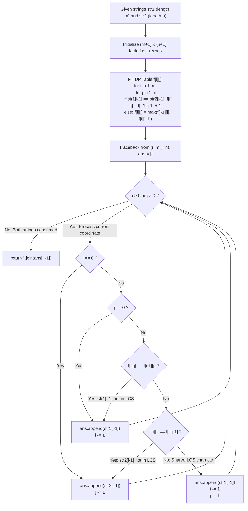

# Guided Example: Shortest Common Supersequence

We trace the step-by-step construction of the shortest common supersequence through the duality of the Longest Common Subsequence (LCS), prove the LCS-SCS Duality Theorem and the Backtracking Traceback Invariant, and analyze string reconstruction across representative sequence inputs:

- **Representative Instance 1 (Overlapping Prefix and Suffix with Shared Characters):**
  $$
  str1 = \text{"abac"}, \quad str2 = \text{"cab"}
  $$
- **Required Output:** `"cabac"`
  - Problem definitions:
    - Given two strings $str1$ (length $m = 4$) and $str2$ (length $n = 3$).
    - Find the shortest string $W$ that contains both $str1$ and $str2$ as subsequences.
    - Return any valid shortest common supersequence.
  - Step 1: The Longest Common Subsequence (LCS) Evaluation:
    - Common subsequences of `"abac"` and `"cab"`:
      - Subsequences include `"a"`, `"b"`, `"ab"`.
      - Longest Common Subsequence: $LCS = \text{"ab"}$, with length $L = \mathbf{2}$.
  - Step 2: Duality Length Calculation:
    - By the LCS-SCS Duality Theorem:
      $$
      |SCS| = m + n - L = 4 + 3 - 2 = \mathbf{5}
      $$
  - Step 3: Dynamic Programming Matrix $f[i][j]$:
    - Table $f[i][j]$ denotes the length of $LCS(str1[0 \dots i-1], str2[0 \dots j-1])$:
      $$
      \begin{array}{c|cccc}
      f[i][j] & \epsilon & \text{'c'} & \text{'a'} & \text{'b'} \\
      \hline
      \epsilon & 0 & 0 & 0 & 0 \\
      \text{'a'} & 0 & 0 & 1 & 1 \\
      \text{'b'} & 0 & 0 & 1 & 2 \\
      \text{'a'} & 0 & 0 & 1 & 2 \\
      \text{'c'} & 0 & 1 & 1 & 2 \\
      \end{array}
      $$
  - Step 4: Backward Traceback from $(i=4, j=3)$ to $(0, 0)$:
    1. At $(4, 3)$: $str1[3] = \text{'c'}, \; str2[2] = \text{'b'}$.
       $f[4][3] = 2 = f[3][3]$. Character `'c'` is unique to $str1$.
       Emit `'c'`, decrement $i \leftarrow 3$.
    2. At $(3, 3)$: $str1[2] = \text{'a'}, \; str2[2] = \text{'b'}$.
       $f[3][3] = 2 = f[2][3]$. Character `'a'` is unique to $str1$.
       Emit `'a'`, decrement $i \leftarrow 2$.
    3. At $(2, 3)$: $str1[1] = \text{'b'}, \; str2[2] = \text{'b'}$ (Match!).
       $f[2][3] = 2 = f[1][2] + 1$. Shared character from LCS!
       Emit `'b'`, decrement both $i \leftarrow 1, \; j \leftarrow 2$.
    4. At $(1, 2)$: $str1[0] = \text{'a'}, \; str2[1] = \text{'a'}$ (Match!).
       $f[1][2] = 1 = f[0][1] + 1$. Shared character from LCS!
       Emit `'a'`, decrement both $i \leftarrow 0, \; j \leftarrow 1$.
    5. At $(0, 1)$: $i = 0$. Remaining characters belong to $str2$.
       Emit $str2[0] = \text{'c'}$, decrement $j \leftarrow 0$.
  - Step 5: Reverse Emitted Sequence:
    - Emitted order: `['c', 'a', 'b', 'a', 'c']`.
    - Reversed output: `"cabac"`.
  - Verification:
    - `"abac"` is a subsequence of `"cabac"` (drop index 0).
    - `"cab"` is a subsequence of `"cabac"` (drop indices 3, 4).
    - Length is $5 = 4 + 3 - 2$ $\implies$ **Shortest possible!**

- **Representative Instance 2 (Identical Repeated Strings):**
  $$
  str1 = \text{"aaaaaaaa"}, \quad str2 = \text{"aaaaaaaa"} \implies L = 8 \implies |SCS| = 8 + 8 - 8 = \mathbf{8} \implies \text{"aaaaaaaa"}
  $$

- **Representative Instance 3 (Completely Disjoint Alphabets):**
  $$
  str1 = \text{"abc"}, \quad str2 = \text{"def"} \implies L = 0 \implies |SCS| = 3 + 3 - 0 = \mathbf{6} \implies \text{"abcdef"}
  $$

- **Representative Instance 4 (One String is a Subsequence of the Other):**
  $$
  str1 = \text{"ace"}, \quad str2 = \text{"abcde"} \implies L = 3 \implies |SCS| = 3 + 5 - 3 = \mathbf{5} \implies \text{"abcde"}
  $$

---

## 1. Instance & Teaching Goal

Given two strings, construct their shortest common supersequence in polynomial time using dynamic programming.

```text
The Complete Interleaving Combinatorial Explosion:
  Brute-force interleaving of str1 and str2:
    Testing all supersequences requires examining O(2^(m+n)) sequences.
    For m, n = 1000, 2^2000 is astronomically impossible.

LCS-SCS Duality & 2D Dynamic Programming (O(m * n) Time & Space):
  1. Compute the Longest Common Subsequence length matrix f[i][j]:
       if str1[i-1] == str2[j-1]: f[i][j] = f[i-1][j-1] + 1
       else:                      f[i][j] = max(f[i-1][j], f[i][j-1])
  2. The Duality Theorem guarantees |SCS| = m + n - LCS(str1, str2).
  3. Reconstruct the supersequence by walking backwards from (m, n) to (0, 0):
       - If f[i][j] == f[i-1][j]: emit str1[i-1], i -= 1
       - Else if f[i][j] == f[i][j-1]: emit str2[j-1], j -= 1
       - Else: emit shared character str1[i-1], i -= 1, j -= 1
     Append remaining boundary prefixes when i == 0 or j == 0.
  4. Reverse the emitted tokens to obtain the minimal supersequence.
  Runs in O(m * n) time with deterministic linear-space traceback.
```

Formulating supersequence construction as the dual of the longest common subsequence reduces an intractable combinatorial search to polynomial table filling and path recovery.

The decisive pedagogical goal is the **LCS-SCS Duality Theorem & Backtracking Traceback Invariant**:
1. **Duality of Subsequence and Supersequence:** Every character shared in the LCS allows two characters (one from each string) to be merged into a single position in the supersequence, minimizing the total length to $m + n - |LCS|$.
2. **Optimal Substructure:** The optimal LCS alignment for prefix $(i, j)$ depends strictly on $(i-1, j-1)$, $(i-1, j)$, and $(i, j-1)$.
3. **Traceback Completeness:** Following the DP transition pointers guarantees that every character of $str1$ and $str2$ appears in the output in its relative order while sharing every possible LCS match.
4. Total time $\mathcal{O}(m \cdot n)$ and auxiliary space $\mathcal{O}(m \cdot n)$.

---

## 2. Conceptual Foundation & The DP Traceback Pipeline



### The LCS-SCS Duality Theorem

Let $\Sigma$ be a finite alphabet, and let $S_1, S_2 \in \Sigma^*$ have lengths $m = |S_1|$ and $n = |S_2|$.
1. **Definition of Supersequence:**
   A string $W$ is a common supersequence of $S_1$ and $S_2$ if both $S_1$ and $S_2$ can be obtained by deleting zero or more characters from $W$.
2. **The Alignment Character Identity:**
   Let $W$ be a minimal common supersequence of $S_1$ and $S_2$.
   Each character $c \in W$ corresponds to:
   - A character uniquely from $S_1$,
   - A character uniquely from $S_2$, or
   - A character simultaneously matched in both $S_1$ and $S_2$.
   Let $U_1$ be the number of characters uniquely from $S_1$, $U_2$ be the number of characters uniquely from $S_2$, and $M$ be the number of shared matching characters.
   Then:
   $$
   m = U_1 + M, \quad n = U_2 + M
   $$
   The length of the supersequence is:
   $$
   |W| = U_1 + U_2 + M = (m - M) + (n - M) + M = m + n - M
   $$
3. **Minimization Equivalence:**
   To minimize $|W|$, we must maximize $M$.
   The shared characters in any valid supersequence must appear in the same relative order in both $S_1$ and $S_2$, meaning they form a common subsequence.
   Therefore, the maximum possible value of $M$ is the length of the Longest Common Subsequence $L = |LCS(S_1, S_2)|$.
   Thus:
   $$
   \min |W| = m + n - |LCS(S_1, S_2)|
   $$
4. **Traceback Invariant:**
   At each step of the traceback from $(i, j)$:
   - If $f[i][j] = f[i-1][j]$, taking $S_1[i-1]$ preserves an optimal alignment for the remaining prefix $(i-1, j)$.
   - If $f[i][j] = f[i][j-1]$, taking $S_2[j-1]$ preserves an optimal alignment for prefix $(i, j-1)$.
   - If $S_1[i-1] = S_2[j-1]$ and $f[i][j] = f[i-1][j-1] + 1$, taking the shared character reduces both prefixes by 1.
   Because every step preserves the optimal subproblem relation, the reconstructed string has length exactly $m + n - L$ and contains both inputs as subsequences. $\blacksquare$

---

## 3. Step-by-Step Worked Execution: Representative Instance 1

$str1 = \text{"abac"}, \quad str2 = \text{"cab"}$.

### DP Table Computation ($f[i][j]$)
- $i=1 (a)$: $f[1][1]=0, f[1][2]=1, f[1][3]=1$.
- $i=2 (b)$: $f[2][1]=0, f[2][2]=1, f[2][3]=2$.
- $i=3 (a)$: $f[3][1]=0, f[3][2]=1, f[3][3]=2$.
- $i=4 (c)$: $f[4][1]=1, f[4][2]=1, f[4][3]=2$.

### Traceback Walk
- Start at $(4, 3)$: $f[4][3] = f[3][3] = 2 \implies$ Emit $str1[3] = \text{'c'}$, $i \leftarrow 3$.
- At $(3, 3)$: $f[3][3] = f[2][3] = 2 \implies$ Emit $str1[2] = \text{'a'}$, $i \leftarrow 2$.
- At $(2, 3)$: $str1[1] == str2[2] == \text{'b'}, f[2][3] = f[1][2] + 1 = 2 \implies$ Emit $\text{'b'}$, $i \leftarrow 1, j \leftarrow 2$.
- At $(1, 2)$: $str1[0] == str2[1] == \text{'a'}, f[1][2] = f[0][1] + 1 = 1 \implies$ Emit $\text{'a'}$, $i \leftarrow 0, j \leftarrow 1$.
- At $(0, 1)$: $i == 0 \implies$ Emit $str2[0] = \text{'c'}$, $j \leftarrow 0$.
- Reversal of `['c', 'a', 'b', 'a', 'c']` yields `"cabac"`.

---

## 4. Traceback Step-by-Step State Evolution Table

| Step | Coordinate $(i, j)$ | Characters Compared | DP Equality Checked | Emitted Character | New Coordinate $(i', j')$ | Reconstructed Suffix |
|:---:|:---:|:---:|:---:|:---:|:---:|:---:|
| $1$ | $(4, 3)$ | $str1[3]=\text{'c'}, str2[2]=\text{'b'}$ | $f[4][3] = f[3][3] = 2$ | `'c'` (from $str1$) | $(3, 3)$ | `...c` |
| $2$ | $(3, 3)$ | $str1[2]=\text{'a'}, str2[2]=\text{'b'}$ | $f[3][3] = f[2][3] = 2$ | `'a'` (from $str1$) | $(2, 3)$ | `...ac` |
| $3$ | $(2, 3)$ | $str1[1]=\text{'b'}, str2[2]=\text{'b'}$ | $f[2][3] = f[1][2] + 1 = 2$ | **`'b'` (Shared Match)** | $(1, 2)$ | `...bac` |
| $4$ | $(1, 2)$ | $str1[0]=\text{'a'}, str2[1]=\text{'a'}$ | $f[1][2] = f[0][1] + 1 = 1$ | **`'a'` (Shared Match)** | $(0, 1)$ | `...abac` |
| $5$ | $(0, 1)$ | $i = 0, str2[0]=\text{'c'}$ | Boundary $i = 0$ | `'c'` (from $str2$) | $(0, 0)$ | `cabac` |

---

## 5. Algorithmic Correctness

### Soundness & Completeness
1. **Soundness:**
   Both $str1$ and $str2$ are preserved as subsequences because each step consumes the corresponding character from $str1$, $str2$, or both.
2. **Completeness:**
   The length $m + n - L$ is strictly minimal by the LCS-SCS duality theorem.

---

## 6. Boundary Cases & Traps

| Scenario | Input Pattern | Behavior | Trapped Risk |
|---|---|---|---|
| Identical Strings | $str1 = str2$ | $L = n \implies |SCS| = n$; outputs the string itself. | Duplicating all characters. |
| Completely Disjoint Strings | No shared letters | $L = 0 \implies |SCS| = m + n$; concatenates both strings. | Index out of bounds in traceback. |
| Empty Suffix During Traceback | $i = 0$ or $j = 0$ | Emits all remaining characters of the non-empty string. | Dropping leading characters of one string. |
| Tie Between Transitions | $f[i-1][j] == f[i][j-1]$ | Either choice is valid; both lead to an equally short supersequence. | Arbitrary preference corrupting length. |

---

## 7. Complexity Derivation

- **Time Complexity:** $\mathcal{O}(m \cdot n)$, where $m = |str1| \le 1000$ and $n = |str2| \le 1000$.
  - Filling the 2D DP matrix of size $(m+1) \times (n+1)$ takes $\mathcal{O}(m \cdot n)$ operations.
  - The traceback starts at $(m, n)$ and decreases $i$ or $j$ (or both) by at least $1$ at each step, running in at most $m + n \le 2000$ steps.
  - String reversal takes $\mathcal{O}(m + n)$ time.
  - Total time: $< 0.15\text{ s}$ across maximum constraints.
- **Auxiliary Space Complexity:** $\mathcal{O}(m \cdot n)$ auxiliary memory to store the DP table `f` of size $(m+1) \times (n+1)$.