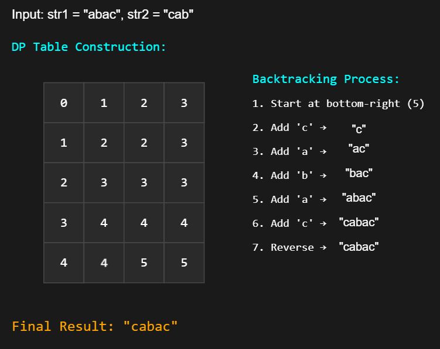

## Solution

---

### Overview

We are given two strings, `str1` and `str2`, and our goal is to construct the shortest string that contains both as subsequences. If multiple valid solutions exist, we can return any of them.

A supersequence of a string is a sequence that includes the original string as a subsequence. This means we can derive the original string by removing certain characters without altering the relative order of the remaining ones.

> The Shortest Common Supersequence (SCS) is the smallest string that contains both `str1` and `str2` as subsequences.

This problem is closely linked to the Longest Common Subsequence (LCS). A strong understanding of LCS allows us to efficiently construct the SCS. If this concept is unfamiliar, it is highly recommended to first solve the following problems:
- [1143. Longest Common Subsequence](https://leetcode.com/problems/longest-common-subsequence/description/)
- [516. Longest Palindromic Subsequence](https://leetcode.com/problems/longest-palindromic-subsequence/description/)
- [1062. Longest Repeating Substring](https://leetcode.com/problems/longest-repeating-substring/description/)

> Note: The LCS represents the longest sequence of characters that appear in both strings in the same order. To form the SCS, we preserve the LCS while inserting the remaining characters from both strings around it, ensuring that the final sequence maintains the relative order of all characters.

---

### Approach 1: Backtracking (Time Limit Exceeded)

#### Intuition

The most direct way to solve this problem is to try all possible ways to form the shortest common supersequence by exploring different combinations of characters from the two given strings. At each step, we add one character to the supersequence until we reach the end of both strings.

If the characters at the current positions in both strings are the same, we have no choice but to take that character, since it appears in both strings and must be included. However, if the characters are different, we face a decision: we can either take the current character from the first string and move forward or take the current character from the second string and move forward. Since our goal is to find the shortest supersequence, we must explore both options and choose the one that results in the smallest length.

To implement this approach, we use recursion. We call the function recursively for each of the two choices and return the shortest sequence found. However, this approach essentially tries out all possibilities, leading to an exponential time complexity of $O(2^{(m+n)} \cdot (m + n))$, where $m$ and $n$ are the lengths of the two strings. The additional $(m + n)$ factor comes from the cost of creating substrings in each recursive call. Due to the large number of redundant calculations, this approach is highly inefficient and causes a Time Limit Exceeded (TLE) error for larger inputs.

#### Algorithm

- If both `str1` and `str2` are empty, return an empty string since there's no common supersequence to construct.
- If `str1` is empty, return `str2` since the shortest supersequence is just `str2`.
- If `str2` is empty, return `str1` since the shortest supersequence is just `str1`.

- If the first characters of `str1` and `str2` match:
  - Append the common character to the result of a recursive call with the remaining substrings of `str1` and `str2`.
  - Return the computed result.

- Otherwise, try both options:
  - Append the first character of `str1` and make a recursive call with `str1` shortened.
  - Append the first character of `str2` and make a recursive call with `str2` shortened.

- Compare the lengths of the two possible supersequences and return the shorter one.

#### Implementation

```python
class Solution:
    def shortestCommonSupersequence(self, str1: str, str2: str) -> str:
        # Base case: both strings are empty
        if not str1 and not str2:
            return ""

        # Base case: one string is empty, append the other string
        if not str1:
            return str2
        if not str2:
            return str1

        # If the first characters match, include it in the supersequence
        if str1[0] == str2[0]:
            return str1[0] + self.shortestCommonSupersequence(
                str1[1:], str2[1:]
            )
        else:
            # Try both options: picking from str1 or str2, and choose the shorter one
            pick_str1 = str1[0] + self.shortestCommonSupersequence(
                str1[1:], str2
            )
            pick_str2 = str2[0] + self.shortestCommonSupersequence(
                str1, str2[1:]
            )

            return pick_str1 if len(pick_str1) < len(pick_str2) else pick_str2
```

#### Complexity Analysis

Let $n$ be the size of `str1` and $m$ be the size of `str2`.

- Time complexity: $O(2^{(n + m)} \cdot (n + m))$

    The time complexity of this approach is exponential due to the recursive nature of the function `getSuperseq`. For each pair of characters in `str1` and `str2`, the function may branch into two recursive calls when the characters do not match. This results in a binary tree of recursive calls, where the height of the tree is at most $n + m$ (the total number of characters in both strings). Since each level of the tree doubles the number of calls, the total number of recursive calls is proportional to $2^{n+m}$.

    Additionally, the substring operation, which advances the strings by 1 character, has a time complexity of $O(n)$ or $O(m)$ depending on the string being processed. Since this operation occurs in every recursive call, the total cost includes an additional $O(n + m)$ factor. Thus the total time complexity of the algorithm is $O(2^{(n + m)} \cdot (n + m))$.

- Space complexity: $O((n + m)^2)$

    The space complexity is determined by the depth of the recursion stack. In the worst case, the recursion depth can reach $n + m$ because the function may need to process all characters of both strings before reaching the base case. Each recursive call consumes additional space on the call stack, leading to a stack space complexity of $O(n + m)$.

    However, the `substring` operation creates new copies of suffixes at each recursive call. This leads to the creation of substrings of decreasing lengths, contributing to an additional $O((n + m)^2)$ space complexity due to repeated string allocations.

---

### Approach 2: Memoization (Memory Limit Exceeded)

#### Intuition

The issue with the backtracking approach is that it repeatedly computes results for the same subproblems. To optimize this, we use memoization, a technique that stores previously computed results and reuses them when needed. Instead of recalculating the shortest supersequence for the same inputs multiple times, we store results in a hash map, where the key is a combination of the remaining portions of `str1` and `str2`. If we encounter the same state again, we can retrieve the stored result instantly, avoiding redundant calculations.

More specifically, if both `s1` and `s2` are empty, there is nothing left to process, so we return an empty string. If one string is empty while the other is not, the non-empty string must be included in the result since it is necessary to form a valid supersequence.

When the first characters of both strings match, we include that character in the result and recursively compute the shortest supersequence for the remaining substrings. However, if the first characters are different, we have two choices:
1. We include the first character of `s1` and recursively compute the shortest supersequence.
2. We include the first character of `s2` and do the same.

Since we are looking for the shortest common supersequence, we take the result that produces the smaller string.

Memoizing results reduces unnecessary recursive calls, but since the approach still relies on recursion and substring operations, it remains inefficient. While better than naive recursion, it can still lead to a Memory Limit Exceeded (MLE) error for large inputs.

#### Algorithm

- Initialize a `memo` hashmap to store computed results and avoid redundant calculations.
- Call the recursive `helper` function with `str1`, `str2`, and `memo`.

- In `helper` function:
  - Construct a `memoKey` by concatenating `str1` and `str2`.
  - If `memo` contains `memoKey`, return the stored result.

  - If both strings are empty, return an empty string.
  - If `str1` is empty, return `str2`.
  - If `str2` is empty, return `str1`.

  - If the first characters match:
- Include the common character and recursively process the remaining substrings.
- Store the result in `memo` and return it.

  - Otherwise:
- Compute `pickStr1` by including $\text{str1}[0]$ and calling `helper` on the remaining part of `str1`.
- Compute `pickStr2` by including $\text{str2}[0]$ and calling `helper` on the remaining part of `str2`.
- Store and return the shorter of `pickStr1` and `pickStr2` in `memo`.

- Return the computed shortest common supersequence.

#### Implementation

```python
class Solution:
    def shortestCommonSupersequence(self, str1: str, str2: str) -> str:
        memo = {}
        return self.helper(str1, str2, memo)

    def helper(self, str1: str, str2: str, memo: dict) -> str:
        memo_key = (str1, str2)
        # Check if result is already computed
        if memo_key in memo:
            return memo[memo_key]

        # Base case: both strings are empty
        if not str1 and not str2:
            return ""

        # Base case: one string is empty, append the other string
        if not str1:
            return str2
        if not str2:
            return str1

        # If the first characters match, include it in the supersequence
        if str1[0] == str2[0]:
            memo[memo_key] = str1[0] + self.helper(str1[1:], str2[1:], memo)
            return memo[memo_key]

        # Try both options: picking from str1 or str2, and choose the shorter one
        pick_str1 = str1[0] + self.helper(str1[1:], str2, memo)
        pick_str2 = str2[0] + self.helper(str1, str2[1:], memo)

        memo[memo_key] = (
            pick_str1 if len(pick_str1) < len(pick_str2) else pick_str2
        )
        return memo[memo_key]
```

#### Complexity Analysis

Let $n$ be the size of `str1` and $m$ be the size of `str2`.

- Time complexity: $O(n \cdot m \cdot (n + m))$

    In this memoized recursive approach, we have $O(n \cdot m)$ unique subproblems, as each subproblem is defined by a unique combination of remaining suffixes of `s1` and `s2`. For each subproblem, we perform string operations, including concatenation (+) and substring, which take $O(n + m)$ time in the worst case, as the strings can grow up to length $n + m$.

    The `memoKey` creation using string concatenation also takes $O(n + m)$ time. Hash map operations (`put` and `get`) take amortized $O(1)$ time.

    Therefore, the total time complexity is $O(n \cdot m \cdot (n + m))$ considering all subproblems and string operations within each subproblem.

- Space complexity: $O(n \cdot m \cdot (n + m))$

    The memoization Hash map stores results for $O(n \cdot m)$ subproblems. Each stored result can be a string of length up to $O(n + m)$ in the worst case.

    Additionally, the recursion stack can grow up to $O(n)$ or $O(m)$ in the worst case when we keep taking characters from one string while keeping the other string intact. The `memoKey` strings also consume space but are bounded by the same complexity.

    Therefore, the total space complexity is $O(n \cdot m \cdot (n + m))$, dominated by the memoized results storage.

---

### Approach 3: Bottom-Up Dynamic Programming

#### Intuition

In the memoization approach, we observed that we were solving subproblems multiple times and caching their results. Instead of using recursion and memoization, we can transition to a bottom-up dynamic programming approach, where we iteratively build the solution using a table. This will help us to systematically compute the shortest common supersequence without redundant recursive calls. To explore more dynamic programming, check out the [LeetCode Explore Card on Dynamic Programming](https://leetcode.com/explore/learn/card/dynamic-programming/).

We define a conceptual 2D table where $\text{dp}[row][col]$ stores the shortest common supersequence for the prefixes `str1[0....row-1]` and `str2[0....col-1]`. However, rather than maintaining an entire 2D table, we can optimize space usage by keeping only two rows at a time: `prevRow`, which represents the previous row in the table, and `currRow`, which represents the row we are currently computing. Since each entry in the table depends only on values from the current and previous row, this optimization significantly reduces space complexity.

The base case is similar to the previous approach: if one of the strings is empty, the shortest common supersequence is simply the other string. This means that when `row` is zero, the supersequence consists of the first `col` characters of `str2`, and when `col` is zero, it consists of the first `row` characters of `str1`.

As we fill the table, we consider how to construct $\text{currRow}[col]$ based on the characters from `str1` and `str2`:

1. Matching Characters:

    If the characters `str1[row-1]` and `str2[col-1]` match, we append this character to the end of `prevRow[col-1]`. This ensures that the matching character appears only once in the supersequence.

2. Different Characters:
  If they do not match, we have two choices:
     - Append $str1[row - 1]$ to the shortest supersequence found for $\text{prevRow}[col]$.
     - Append $str2[col - 1]$ to the shortest supersequence found for $currRow[col - 1]$.

Since we want the shortest sequence, we take the one that results in the smaller string.

By iterating through all possible values of `row` and `col`, we progressively build the shortest common supersequence. Instead of storing an entire `dp` table, we only retain two rows at a time, updating `prevRow` to become `currRow` after each iteration. Since every $\text{dp}[row][col]$ entry depends only on `dp[row-1][col]`, $\text{dp}[row][col-1]$, and `dp[row-1][col-1]`, this optimization reduces the space needed for the DP table structure from $O(m \cdot n)$ to $O(m)$.

However, because each entry stores a string that can have a length of up to $O(n + m)$ in the worst case, the total space complexity is $O(m \cdot (n + m))$.

#### Algorithm

- Compute `str1Length` and `str2Length` to determine the lengths of `str1` and `str2`.

- Initialize `prevRow`, an array of size $str2Length + 1$, where each element stores prefixes of `str2` up to column `col`.

- Iterate over `row` from `1` to `str1Length`:
  - Create `currRow`, an array of size $str2Length + 1$, to store intermediate results for the current row.
  - Set $\text{currRow}[0]$ to the prefix of `str1` up to `row`.
  - Iterate over `col` from `1` to `str2Length`:
- If characters $str1[row - 1]$ and $str2[col - 1]$ match:
      - Append the common character to $prevRow[col - 1]$ and store it in $\text{currRow}[col]$.
- Otherwise:
      - Compute `pickS1` as $\text{prevRow}[col]$, representing the shortest supersequence without including $str1[row - 1]$.
      - Compute `pickS2` as $currRow[col - 1]$, representing the shortest supersequence without including $str2[col - 1]$.
      - Choose the shorter option and append the respective character to form $\text{currRow}[col]$.
  - Update `prevRow` to `currRow` for the next iteration.

- Return $\text{prevRow}[str2Length]$, which stores the shortest common supersequence.

#### Implementation

> In C++, storing full strings in the table is much more memory-intensive than in Java and Python, leading to a Memory Limit Exceeded (MLE) error.

```python
class Solution:
    def shortestCommonSupersequence(self, str1: str, str2: str) -> str:
        str1_length = len(str1)
        str2_length = len(str2)

        # Initialize the first row (when str1 is empty, the supersequence is str2's prefix)
        prev_row = [str2[0:col] for col in range(str2_length + 1)]

        # Fill the DP table row by row
        for row in range(1, str1_length + 1):
            # Initialize the first column (when str2 is empty, the supersequence is str1's prefix)
            curr_row = [str1[0:row]] + [None for _ in range(str2_length)]

            for col in range(1, str2_length + 1):
                # If characters match, extend the supersequence from the diagonal value
                if str1[row - 1] == str2[col - 1]:
                    curr_row[col] = prev_row[col - 1] + str1[row - 1]
                else:
                    # If characters do not match, choose the shorter supersequence
                    # From previous row (exclude current str1 char)
                    pick_s1 = prev_row[col]
                    # From previous column (exclude current str2 char)
                    pick_s2 = curr_row[col - 1]

                    curr_row[col] = (
                        pick_s1 + str1[row - 1]
                        if len(pick_s1) < len(pick_s2)
                        else pick_s2 + str2[col - 1]
                    )

            # Move to the next row (update previous row reference)
            prev_row = curr_row

        # Return the shortest common supersequence from the last cell
        return prev_row[str2_length]
```

#### Complexity Analysis

Let $n$ be the size of `str1` and $m$ be the size of `str2`.

- Time complexity: $O(n \cdot m \cdot (n + m))$

    The time complexity of this approach is determined by the nested loops and the string concatenation operations. The outer loop runs $n$ times (for each character in `str1`), and the inner loop runs $m$ times (for each character in `str2`). For each cell in the DP table, the algorithm performs string concatenation, which takes $O(n + m)$ time in the worst case (since the supersequence can be up to $n + m$ in length).

    Thus, the total time complexity is: $O(n \cdot m \cdot (n + m))$

- Space complexity: $O(m \cdot (n + m))$

    We maintain two arrays (`prevRow` and `currRow`) of length $m + 1$, where each element is a string that can grow up to length $O(n + m)$ in the worst case. This gives us space complexity of $O(m \cdot (n + m))$. The space usage comes primarily from storing the supersequences in these arrays.

    Note that we only need to store two rows at a time, which is why we don't need the full $O(n \cdot m)$ space for the DP table structure itself. Other variables like `row`, `col`, and temporary strings use negligible space in comparison.

---

### Approach 4: Most Optimal - Space Optimized Dynamic Programming

#### Intuition

We can further optimize this problem by defining $\text{dp}[row][col]$ as the **length** of the shortest common supersequence (SCS) for the first `row` characters of `str1` and the first `col` characters of `str2` and not the entire sequence like in the previous approach. To build this table, we begin by handling base cases: if one string is empty, the only way to form the supersequence is to take all characters from the other string. This means that $\text{dp}[row][0] = row$ and $\text{dp}[0][col] = col$, since the SCS of any string with an empty string is just the string itself.

Next, we iterate through both strings and update $\text{dp}[row][col]$, based on whether the current characters of `str1` and `str2` match. We have two branches:

1. Matching Characters:
   If $str1[row - 1] = str2[col - 1]$, then this character is part of the SCS, so we extend the solution from $dp[row - 1][col - 1]$ by 1: $\text{dp}[row][col] = dp[row - 1][col - 1] + 1$

2. Different Characters:
   If $str1[row - 1] \neq str2[col - 1]$, we must include one of the characters. We choose the option that results in the shorter supersequence: $\text{dp}[row][col] = min(dp[row - 1][col], \text{dp}[row][col - 1]) + 1$

Here, $dp[row - 1][col]$ represents including a character from `str1` and $\text{dp}[row][col - 1]$ represents including a character from `str2`.

Once the `dp` table is filled, we backtrack from $\text{dp}[m][n]$ to reconstruct the SCS. The idea is to start at the last cell `(m, n)` and trace back how we reached that value. If characters match, they are added to the result, and both pointers move diagonally. If they differ, we move in the direction that resulted in the smaller value, ensuring that we include necessary characters while keeping the sequence as short as possible. Finally, any remaining characters from `str1` or `str2` are appended to complete the supersequence. Since we build the sequence in reverse, we finally reverse it to obtain the correct order.

The dp table is visualized below:



#### Algorithm

- Initialize `str1Length` and `str2Length` to store the lengths of `str1` and `str2`, respectively.

- Create a 2D array `dp` of size $(str1Length + 1) x (str2Length + 1)$, where $\text{dp}[i][j]$ represents the length of the shortest common supersequence (SCS) for the first `i` characters of `str1` and the first `j` characters of `str2`.

- Fill the first column and first row:
  - $\text{dp}[row][0] = row$ because if `str2` is empty, the only option is to append all characters of `str1`.
  - $\text{dp}[0][col] = col$ because if `str1` is empty, the only option is to append all characters of `str2`.

- Populate `dp` using bottom-up dynamic programming:
  - If characters at $str1[row - 1]$ and $str2[col - 1]$ match, inherit $dp[row - 1][col - 1]$ and add `1` (since the common character is counted once).
  - Otherwise, take the minimum of $dp[row - 1][col]$ and $\text{dp}[row][col - 1]$, then add `1` (since we need to include either $str1[row - 1]$ or $str2[col - 1]$).

- Reconstruct the supersequence using a string `supersequence`:
  - Start from $\text{dp}[str1Length][str2Length]$ and backtrack:
- If characters match, append the character and move diagonally up-left (`row--, col--`).
- If $dp[row - 1][col] < \text{dp}[row][col - 1]$, append $str1[row - 1]$ and move up (`row--`).
- Otherwise, append $str2[col - 1]$ and move left (`col--`).
  - Append any remaining characters from `str1` or `str2`.

- Reverse the `supersequence` string to obtain the correct order of the supersequence and return it.

#### Implementation

```python
class Solution:
    def shortestCommonSupersequence(self, str1: str, str2: str) -> str:
        str1_length = len(str1)
        str2_length = len(str2)

        dp = [
            [0 for _ in range(str2_length + 1)] for _ in range(str1_length + 1)
        ]

        # Initialize the base cases
        # When str2 is empty, the supersequence is str1 itself (length = row index)
        for row in range(str1_length + 1):
            dp[row][0] = row

        # When str1 is empty, the supersequence is str2 itself (length = col index)
        for col in range(str2_length + 1):
            dp[0][col] = col

        # Fill the DP table
        for row in range(1, str1_length + 1):
            for col in range(1, str2_length + 1):
                if str1[row - 1] == str2[col - 1]:
                    # If characters match, inherit the length from the diagonal +1
                    dp[row][col] = dp[row - 1][col - 1] + 1
                else:
                    # If characters do not match, take the minimum length option +1
                    dp[row][col] = min(dp[row - 1][col], dp[row][col - 1]) + 1

        super_sequence = []
        row, col = str1_length, str2_length

        while row > 0 and col > 0:
            if str1[row - 1] == str2[col - 1]:
                # If characters match, take it from diagonal
                super_sequence.append(str1[row - 1])
                row -= 1
                col -= 1
            elif dp[row - 1][col] < dp[row][col - 1]:
                # If str1’s character is part of the supersequence, move up
                super_sequence.append(str1[row - 1])
                row -= 1
            else:
                # If str2’s character is part of the supersequence, move left
                super_sequence.append(str2[col - 1])
                col -= 1

        # Append any remaining characters
        # If there are leftover characters in str1
        while row > 0:
            super_sequence.append(str1[row - 1])
            row -= 1
        # If there are leftover characters in str2
        while col > 0:
            super_sequence.append(str2[col - 1])
            col -= 1

        # Reverse the built sequence to get the correct order
        return "".join(super_sequence[::-1])
```

#### Complexity Analysis

Let $n$ be the size of `str1` and $m$ be the size of `str2`.

- Time complexity: $O(n \cdot m)$

    The main time complexity comes from constructing the DP table which requires iterating through each cell, taking $O(n \cdot m)$ time. After building the table, we perform backtracking to construct the supersequence which takes $O(n + m)$ time since we move either up, left, or diagonally starting from the bottom-right corner. The append operations take amortized $O(1)$ time, while reversing the supersequence string takes $O(n + m)$ time. Since DP table construction dominates other operations, the overall time complexity remains $O(n \cdot m)$.

- Space complexity: $O(n \cdot m)$

    The primary space usage comes from the DP table which requires a 2D array of size $(n + 1) \cdot (m + 1)$, taking $O(n \cdot m)$ space. Additionally, we use a string to store the final supersequence which takes $O(n + m)$ space. Other variables like `row` and `col` use constant space. The DP table dominates the space requirements, making the overall space complexity $O(n \cdot m)$.

---