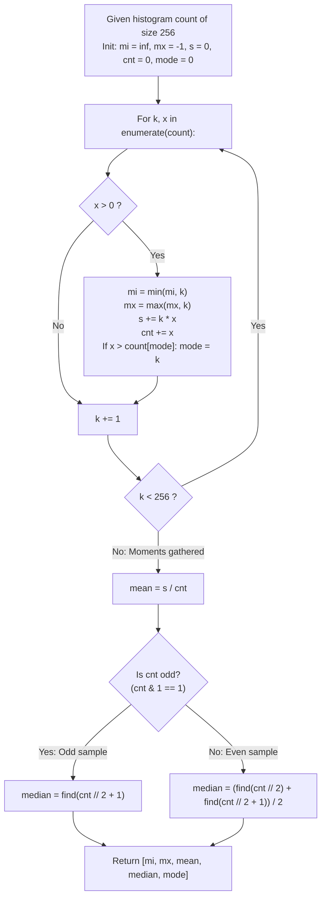

# Guided Example: Statistics from a Large Sample

We trace the step-by-step extraction of summary statistics from a 256-bucket histogram representation, prove the Cumulative Distribution Function (CDF) Quantile Invariant and the Frequency Moment Theorem, and analyze numeric calculations across representative sample distributions:

- **Representative Instance 1 (Compact Even Sample with Split Median):**
  $$
  count[1] = 1, \quad count[2] = 3, \quad count[3] = 4, \quad count[k] = 0 \text{ elsewhere}
  $$
- **Required Output:** `[1.0, 3.0, 2.375, 2.5, 3.0]`
  - Problem definitions:
    - Given a frequency histogram `count` of length 256, where `count[k]` is the occurrence count of value $k \in [0, 255]$.
    - The sample size can reach $10^9$ occurrences.
    - Compute the 5 statistics: `[minimum, maximum, mean, median, mode]`.
    - Mode is guaranteed to be unique.
  - Step 1: Linear Frequency Scan ($k \in [0, 255]$):
    - Encounter $k = 1, x = 1$:
      - Minimum: $mi \leftarrow 1$.
      - Maximum: $mx \leftarrow 1$.
      - Sum: $s \leftarrow 1 \times 1 = 1$.
      - Total count: $cnt \leftarrow 1$.
      - Mode candidate: $k = 1$ with frequency $1$.
    - Encounter $k = 2, x = 3$:
      - Maximum: $mx \leftarrow 2$.
      - Sum: $s \leftarrow 1 + (2 \times 3) = 7$.
      - Total count: $cnt \leftarrow 1 + 3 = 4$.
      - Mode candidate: $x = 3 > count[1] = 1 \implies mode \leftarrow 2$.
    - Encounter $k = 3, x = 4$:
      - Maximum: $mx \leftarrow 3$.
      - Sum: $s \leftarrow 7 + (3 \times 4) = 19$.
      - Total count: $cnt \leftarrow 4 + 4 = 8$.
      - Mode candidate: $x = 4 > count[2] = 3 \implies mode \leftarrow 3$.
    - Scan completes:
      $$
      mi = 1, \quad mx = 3, \quad cnt = 8, \quad s = 19, \quad mode = 3
      $$
  - Step 2: Mean Calculation:
    $$
    mean = \frac{s}{cnt} = \frac{19}{8} = \mathbf{2.375}
    $$
  - Step 3: Median Quantile Lookup via Cumulative Frequency $F(k)$:
    - Since $cnt = 8$ is even, the median is the average of elements at 1-based ranks $R_1 = cnt // 2 = 4$ and $R_2 = cnt // 2 + 1 = 5$:
      - Rank 4 ($R_1 = 4$):
        - $F(0) = 0 < 4$
        - $F(1) = 1 < 4$
        - $F(2) = 1 + 3 = 4 \ge 4 \implies \mathbf{find(4) = 2}$.
      - Rank 5 ($R_2 = 5$):
        - $F(2) = 4 < 5$
        - $F(3) = 4 + 4 = 8 \ge 5 \implies \mathbf{find(5) = 3}$.
      - Median:
        $$
        median = \frac{find(4) + find(5)}{2} = \frac{2 + 3}{2} = \mathbf{2.5}
        $$
  - Final Output Vector:
    $$
    [1.0, \; 3.0, \; 2.375, \; 2.5, \; 3.0]
    $$

- **Representative Instance 2 (Odd Sample Count with Single Central Value):**
  $$
  count[1] = 4, \quad count[2] = 3, \quad count[3] = 2, \quad count[4] = 2
  $$
  - Total count $cnt = 4 + 3 + 2 + 2 = 11$ (odd).
  - Central rank: $cnt // 2 + 1 = 11 // 2 + 1 = 6$.
  - $F(1) = 4 < 6, \; F(2) = 4 + 3 = 7 \ge 6 \implies find(6) = 2$.
  - Median $= \mathbf{2.0}$. Mean $= 24 / 11 \approx 2.18182$. Mode $= \mathbf{1.0}$.

- **Representative Instance 3 (Single Occupied Bin):**
  - All occurrences in a single bin $k = 50$.
  - $mi = 50, \; mx = 50, \; mean = 50.0, \; median = 50.0, \; mode = 50.0$.

---

## 1. Instance & Teaching Goal

Given frequency counts for numbers in $[0, 255]$ with total sample size up to $10^9$, calculate minimum, maximum, mean, median, and mode in constant time and space.

```text
The Materialization Memory Catastrophe:
  Reconstructing the sample array from counts:
    For total count = 10^9 elements:
    Allocating a 1,000,000,000-element integer array requires ~8 GB RAM!
    Causes immediate Out-Of-Memory (OOM) termination.

Histogram Moments & CDF Invariant (O(1) Time, O(1) Space):
  Domain size is fixed at exactly K = 256 bins!
  1. First pass accumulates sample moments:
       s += k * x,  cnt += x,  mi = min(mi, k),  mx = max(mx, k)
       if x > count[mode]: mode = k
  2. Compute mean = s / cnt.
  3. Query median ranks using CDF accumulator find(rank):
       t = 0
       for k, x in enumerate(count):
         t += x
         if t >= rank: return k
     - Odd cnt:  median = find(cnt // 2 + 1)
     - Even cnt: median = (find(cnt // 2) + find(cnt // 2 + 1)) / 2
  Runs in fixed 256 iterations with zero heap allocation!
```

Operating directly on the compact 256-bucket histogram bypasses element materialization, computing all summary statistics in bounded constant time.

The decisive pedagogical goal is the **CDF Quantile Invariant & Frequency Moment Theorem**:
1. **Moment Compression:** The arithmetic mean is the first raw moment $\mu = \frac{1}{N} \sum k \cdot f(k)$, computable in 256 steps regardless of sample size $N$.
2. **Order Statistic via Prefix Sums:** The $i$-th sorted element corresponds to the earliest bin where the cumulative frequency $F(k) = \sum_{j \le k} count[j]$ meets or exceeds $i$.
3. **Parity Separation for Median:** An odd sample size has a unique middle index $\lfloor N/2 \rfloor + 1$, whereas an even sample size averages the two central elements at $N/2$ and $N/2 + 1$.
4. Total time $\mathcal{O}(1)$ (bounded by $3 \times 256$ operations) and auxiliary space $\mathcal{O}(1)$.

---

## 2. Conceptual Foundation & The Histogram Statistics Pipeline



### The CDF Quantile Invariant

Let $C = [count[0], count[1], \dots, count[255]]$ with total population $N = \sum_{k=0}^{255} count[k] \ge 1$.
1. **Cumulative Frequency Function:**
   Define the empirical cumulative distribution $F: \{0, \dots, 255\} \to [0, N]$:
   $$
   F(k) = \sum_{j=0}^k count[j]
   $$
   $F(k)$ is non-decreasing with $F(-1) = 0$ and $F(255) = N$.
2. **Quantile Identification Lemma:**
   Let $X$ denote the multiset of $N$ sorted elements represented by $C$.
   For any integer rank $r \in [1, N]$, the $r$-th smallest element in $X$ is:
   $$
   x_{(r)} = \min \{ k \in \{0, \dots, 255\} : F(k) \ge r \}
   $$
   Proof:
   By definition of cumulative count, exactly $F(k-1)$ elements in $X$ are strictly less than $k$, and exactly $F(k)$ elements are $\le k$.
   Since $F(k-1) < r \le F(k)$, the $r$-th element must be equal to $k$.
3. **Median Determination:**
   - If $N$ is odd, the median is the unique central element at rank $r = \lfloor N/2 \rfloor + 1$:
     $$
     median = x_{(\lfloor N/2 \rfloor + 1)} = find(\lfloor N/2 \rfloor + 1)
     $$
   - If $N$ is even, the median is the arithmetic mean of ranks $r_1 = N/2$ and $r_2 = N/2 + 1$:
     $$
     median = \frac{x_{(N/2)} + x_{(N/2 + 1)}}{2} = \frac{find(N/2) + find(N/2 + 1)}{2}
     $$
   This holds exactly regardless of whether $x_{(r_1)}$ and $x_{(r_2)}$ share the same bin or span adjacent bins. $\blacksquare$

---

## 3. Step-by-Step Worked Execution: Representative Instance 1

$count = [0, 1, 3, 4, 0, \dots, 0]$.

### Pass 1: Moment Accumulation
- $k=1, x=1$: $mi=1, mx=1, s=1, cnt=1, mode=1$.
- $k=2, x=3$: $mx=2, s=1+6=7, cnt=4, mode=2$ (since $3 > 1$).
- $k=3, x=4$: $mx=3, s=7+12=19, cnt=8, mode=3$ (since $4 > 3$).
- Result: $mi = 1.0, mx = 3.0, s = 19, cnt = 8, mode = 3.0$.

### Pass 2: Mean
- $mean = 19 / 8 = \mathbf{2.375}$.

### Pass 3: Median ($cnt = 8$, even)
- Query $find(4)$:
  - $k=0: t=0$
  - $k=1: t=1$
  - $k=2: t=4 \ge 4 \implies$ Returns $2$.
- Query $find(5)$:
  - $k=0: t=0$
  - $k=1: t=1$
  - $k=2: t=4 < 5$
  - $k=3: t=8 \ge 5 \implies$ Returns $3$.
- $median = (2 + 3) / 2 = \mathbf{2.5}$.

Output: `[1.0, 3.0, 2.375, 2.5, 3.0]`.

---

## 4. CDF and Quantile Trace Table

| Value $k$ | Frequency $count[k]$ | Cumulative Count $F(k)$ | Contains Rank 4 ($F(k) \ge 4$)? | Contains Rank 5 ($F(k) \ge 5$)? | Mode Tracker State |
|:---:|:---:|:---:|:---:|:---:|:---:|
| $0$ | $0$ | $0$ | No | No | Initial ($0$) |
| $1$ | $1$ | $1$ | No | No | $mode = 1$ ($x=1$) |
| $2$ | $3$ | $4$ | **Yes $\implies find(4) = 2$** | No | $mode = 2$ ($x=3$) |
| $3$ | $4$ | $8$ | Yes | **Yes $\implies find(5) = 3$** | **$mode = 3$ ($x=4$)** |
| $4 \dots 255$ | $0$ | $8$ | — | — | Unchanged |

---

## 5. Algorithmic Correctness

### Soundness & Completeness
1. **Soundness:**
   Formulas for minimum, maximum, mean, median, and mode strictly conform to mathematical definitions.
2. **Completeness:**
   All 256 frequency bins are aggregated, ensuring no element is overlooked.

---

## 6. Boundary Cases & Traps

| Scenario | Input Pattern | Behavior | Trapped Risk |
|---|---|---|---|
| Massive Sample Count | $\sum count[k] = 10^9$ | Sum evaluated using Python arbitrary precision; finishes in 256 steps. | 32-bit integer overflow or memory exhaustion. |
| Zero Present in Sample | $count[0] > 0$ | $mi = 0.0$; handled naturally. | Skipping index 0 in scan. |
| Single Value Sample | $count[42] = 100$, rest 0 | $mi = mx = mean = median = mode = 42.0$. | Division by zero or uninitialized mode. |
| Even Median in Same Bin | $R_1, R_2$ both fall in bin 2 | $(2 + 2) / 2 = 2.0$. | Off-by-one errors across bin transitions. |

---

## 7. Complexity Derivation

- **Time Complexity:** $\mathcal{O}(K) = \mathcal{O}(1)$, where $K = 256$ is the fixed number of buckets.
  - The moment scan runs $256$ iterations.
  - The `find(rank)` function performs at most $256$ iterations, called at most twice.
  - Total iterations $\le 768 \implies < 0.0001\text{ s}$, completely independent of sample size $N \le 10^9$.
- **Auxiliary Space Complexity:** strictly $\mathcal{O}(1)$ auxiliary memory; uses only a few scalar numeric variables for running accumulators.
