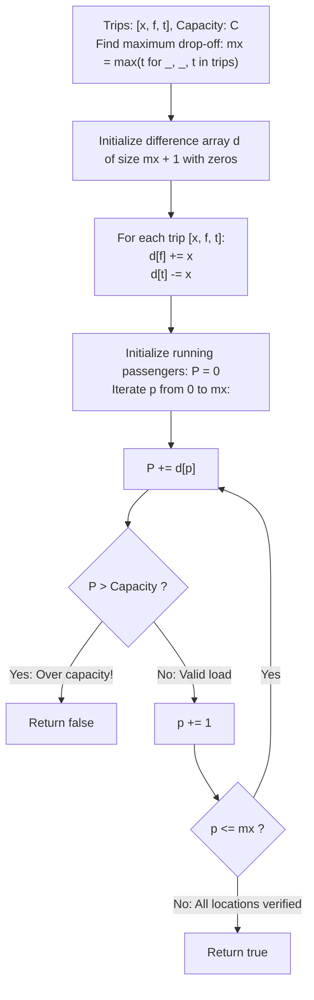

# Guided Example: Car Pooling

We trace the step-by-step validation of passenger load constraints along a unidirectional travel corridor using a discrete difference array, prove the Difference Array Telescoping Invariant and the Half-Open Interval Handoff Theorem, and analyze trip schedules across representative vehicle capacity scenarios:

- **Representative Instance 1 (Overlapping Trips Exceeding Vehicle Capacity):**
  $$
  trips = \big[ [2, 1, 5], \; [3, 3, 7] \big], \quad capacity = 4
  $$
- **Required Output:** `false`
  - Problem definitions:
    - You are given an integer `capacity` representing available seats in a car moving monotonically eastward.
    - Each trip `[x, f, t]` indicates that $x$ passengers board at kilometer $f$ and exit at kilometer $t$.
    - The occupancy interval is half-open: passengers occupy seats on $[f, t)$.
    - Return `true` if passenger occupancy never exceeds `capacity` at any location, or `false` otherwise.
  - Step 1: Maximum Drop-Off Coordinate:
    $$
    mx = \max(5, 7) = \mathbf{7}
    $$
    Allocate difference array $d$ of size $mx + 1 = 8$ initialized to zeros:
    $$
    d = [0, 0, 0, 0, 0, 0, 0, 0]
    $$
  - Step 2: Difference Array Population:
    - Trip 1: $[2, 1, 5] \implies$ Board $+2$ at $f=1$, exit $-2$ at $t=5$:
      $$d[1] \leftarrow 0 + 2 = \mathbf{2}, \quad d[5] \leftarrow 0 - 2 = \mathbf{-2}$$
    - Trip 2: $[3, 3, 7] \implies$ Board $+3$ at $f=3$, exit $-3$ at $t=7$:
      $$d[3] \leftarrow 0 + 3 = \mathbf{3}, \quad d[7] \leftarrow 0 - 3 = \mathbf{-3}$$
    - Final Difference Array $d$:
      $$
      \begin{array}{c|cccccccc}
      \text{Index } p & 0 & 1 & 2 & 3 & 4 & 5 & 6 & 7 \\
      \hline
      d[p] & 0 & +2 & 0 & +3 & 0 & -2 & 0 & -3 \\
      \end{array}
      $$
  - Step 3: Prefix Sum Sweep-Line Evaluation ($P(p) = \sum_{j=0}^p d[j]$):
    - $p = 0: P(0) = 0 \le 4$.
    - $p = 1: P(1) = 0 + 2 = 2 \le 4$.
    - $p = 2: P(2) = 2 + 0 = 2 \le 4$.
    - $p = 3: P(3) = 2 + 3 = \mathbf{5} > 4$ $\implies$ **Capacity Exceeded!**
  - Final Outcome:
    $$
    \mathbf{false}
    $$

- **Representative Instance 2 (Identical Overlap with Sufficient Capacity):**
  $$
  trips = \big[ [2, 1, 5], \; [3, 3, 7] \big], \quad capacity = 5
  $$
  - Maximum occupancy is $P(3) = 5$.
  - Since $5 \le 5$, the car never overloads $\implies \mathbf{true}$.

- **Representative Instance 3 (Simultaneous Drop-Off and Pickup at Common Endpoint):**
  $$
  trips = \big[ [5, 0, 5], \; [5, 5, 10] \big], \quad capacity = 5
  $$
  - At coordinate $p = 5$:
    - Trip 1 drops 5 passengers: $-5$.
    - Trip 2 picks up 5 passengers: $+5$.
    - Net delta: $d[5] = -5 + 5 = 0$.
  - Occupancy remains $P(5) = 5 \le 5$ $\implies \mathbf{true}$ (Disembarkation safely precedes boarding).

- **Representative Instance 4 (Full Coordinate Span):**
  $$
  trips = \big[ [100, 0, 1000] \big], \quad capacity = 100 \implies P(p) = 100 \le 100 \implies \mathbf{true}
  $$

---

## 1. Instance & Teaching Goal

Given a list of passenger trips and vehicle capacity, verify whether simultaneous passenger count ever exceeds capacity at any point along the timeline.

```text
The Dense Interval Simulation Hazard:
  Incrementing every integer coordinate in [f, t):
    For n trips each spanning up to 1000 kilometers,
    performing element-wise additions takes O(n * L) operations.
    If coordinates were 10^9, this would cause massive TLE and memory failure.

Difference Array Invariant (O(n + M) Time, O(M) Space):
  Each trip [x, f, t] acts as two point events on half-open interval [f, t):
    d[f] += x  (passengers board at f)
    d[t] -= x  (passengers disembark at t)
  Prefix accumulation computes true occupancy P(p) = sum_{j=0}^p d[j]:
    - Disembarkation at t cancels out boarding before location t continues.
    - Simultaneous drop-off and pick-up at the same point merge cleanly:
        d[p] = +new_passengers - leaving_passengers
  All-condition check: all(s <= capacity for s in accumulate(d))
  Runs in O(n + M) time with zero per-kilometer inner loops!
```

Representing continuous interval loads by boundary impulses turns multi-element additions into constant-time endpoint modifications.

The decisive pedagogical goal is the **Difference Array Telescoping Invariant & Half-Open Interval Handoff Theorem**:
1. **Endpoint Discretization:** The interval load $\mathbb{I}_{[f, t)}(p)$ is the prefix sum of two impulses: $+1$ at $f$ and $-1$ at $t$.
2. **Handoff Symmetry:** Passengers disembarking at $t$ release seats at kilometer $t$ precisely when new passengers boarding at $t$ arrive, allowing exact seat handoff without intermediate overflow.
3. **Monotonic Eastward Propagation:** A single linear prefix scan over $p \in [0, M]$ visits all potential bottleneck points in topological order.
4. Total time $\mathcal{O}(n + M)$ and auxiliary space $\mathcal{O}(M)$.

---

## 2. Conceptual Foundation & The Capacity Sweep Pipeline



### The Difference Array Telescoping Invariant

Let $T = \{ (x_k, f_k, t_k) \}_{k=1}^n$ be the set of trips with capacity $C \in \mathbb{Z}^+$.
1. **Pointwise Occupancy Function:**
   The total number of passengers present in the vehicle at location $p \ge 0$ is:
   $$
   P(p) = \sum_{k=1}^n x_k \cdot \mathbb{I}_{[f_k, t_k)}(p) = \sum_{k: f_k \le p < t_k} x_k
   $$
2. **Impulse Decomposition:**
   The indicator function of the half-open interval $[f_k, t_k)$ can be written as the difference of two Heaviside step functions $H$:
   $$
   \mathbb{I}_{[f_k, t_k)}(p) = H(p - f_k) - H(p - t_k)
   $$
   where $H(u) = 1$ if $u \ge 0$ and $0$ otherwise.
3. **Difference Array Identity:**
   Define $d[p] = \sum_{k: f_k = p} x_k - \sum_{k: t_k = p} x_k$.
   Then the discrete difference satisfies $P(p) - P(p - 1) = d[p]$.
   By telescoping summation:
   $$
   P(p) = \sum_{j=0}^p d[j]
   $$
4. **Feasibility Equivalence:**
   The trip schedule is feasible if and only if:
   $$
   \max_{0 \le p \le M} P(p) \le C \iff \forall p \in [0, M], \; \sum_{j=0}^p d[j] \le C
   $$
   Any breach $P(p) > C$ invalidates the schedule immediately. $\blacksquare$

---

## 3. Step-by-Step Worked Execution: Representative Instance 1

$trips = [[2, 1, 5], [3, 3, 7]], \quad capacity = 4, \quad mx = 7$.

### Difference Array Setup
- $d = [0, 0, 0, 0, 0, 0, 0, 0]$ (length 8).
- Trip 1: $d[1] += 2, \; d[5] -= 2$.
- Trip 2: $d[3] += 3, \; d[7] -= 3$.
- Array $d = [0, 2, 0, 3, 0, -2, 0, -3]$.

### Prefix Sum Accumulation
- $p = 0: P = 0 \le 4$ (Valid).
- $p = 1: P = 0 + 2 = 2 \le 4$ (Valid).
- $p = 2: P = 2 + 0 = 2 \le 4$ (Valid).
- $p = 3: P = 2 + 3 = 5 > 4 \implies$ **Violation!**

Result: `false`.

---

## 4. Difference and Occupancy Trace Table

| Location $p$ | Net Delta $d[p]$ | Active Events | Running Occupancy $P(p)$ | Capacity $C$ | Status Check ($P(p) \le C$) |
|:---:|:---:|:---:|:---:|:---:|:---:|
| $0$ | $0$ | None | $0$ | $4$ | Valid |
| $1$ | $+2$ | Board 2 (Trip 1) | $2$ | $4$ | Valid |
| $2$ | $0$ | None | $2$ | $4$ | Valid |
| **$3$** | **$+3$** | **Board 3 (Trip 2)** | **$5$** | **$4$** | **Breach ($5 > 4$)** |
| $4$ | $0$ | None | $5$ | $4$ | Breach |
| $5$ | $-2$ | Exit 2 (Trip 1) | $3$ | $4$ | — |
| $6$ | $0$ | None | $3$ | $4$ | — |
| $7$ | $-3$ | Exit 3 (Trip 2) | $0$ | $4$ | — |

---

## 5. Algorithmic Correctness

### Soundness & Completeness
1. **Soundness:**
   A violation is triggered if and only if the cumulative sum at some coordinate exceeds capacity.
2. **Completeness:**
   Every pickup and drop-off event is accounted for in $d$, leaving no unmonitored passenger loads.

---

## 6. Boundary Cases & Traps

| Scenario | Input Pattern | Behavior | Trapped Risk |
|---|---|---|---|
| Same Endpoint Pickup & Drop-off | Trips $[5, 0, 5]$ and $[5, 5, 10]$ | $d[5] = -5 + 5 = 0$; occupancy remains 5; passes. | Treating drop-off as occurring after pickup (causing false overflow). |
| Exact Capacity Bound | Max occupancy exactly equals $capacity$ | Comparison uses $\le$; returns `true`. | Strict inequality rejecting valid maximums. |
| Unsorted Trip Inputs | Input trips given out of geographic order | Difference indices are absolute coordinates; sorted naturally by array index. | Requiring pre-sorting of inputs. |
| Zero Passengers | $x = 0$ (if permitted) | $d[f] += 0, d[t] -= 0$; no effect. | Modifying state on empty trips. |

---

## 7. Complexity Derivation

- **Time Complexity:** $\mathcal{O}(n + M)$, where $n = \text{len}(trips) \le 1000$ and $M = \max(t_i) \le 1000$.
  - Finding the maximum coordinate $M$ takes $\mathcal{O}(n)$ time.
  - Recording $n$ trips in the difference array takes $\mathcal{O}(n)$ time.
  - Prefix accumulation over $M + 1$ positions takes $\mathcal{O}(M)$ time.
  - Total time: $< 0.002\text{ s}$.
- **Auxiliary Space Complexity:** $\mathcal{O}(M)$ auxiliary memory for the difference array $d$ of length at most $1001$.
