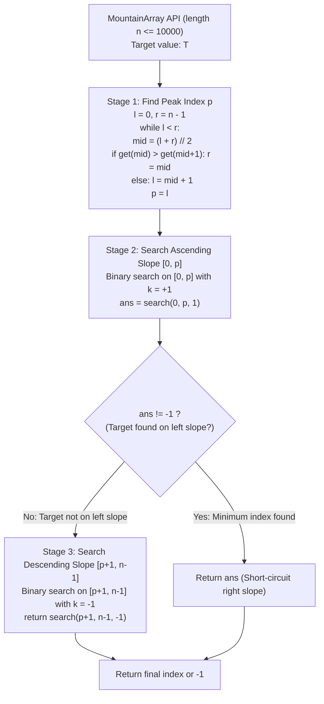

# Guided Example: Find in Mountain Array

We trace the step-by-step localization of a target value within an interactive mountain array interface under a strict 100-query budget, prove the Unimodal Derivative Monotonicity Invariant and the Minimum Index Search Order Theorem, and analyze bisections across representative mountain structures:

- **Representative Instance 1 (Target Present on Both Slopes):**
  $$
  mountain\_arr = [1, 2, 3, 4, 5, 3, 1], \quad n = 7, \quad target = 3
  $$
- **Required Output:** `2`
  - Problem definitions:
    - An array is a **mountain array** if it strictly increases to a peak index $p$, then strictly decreases.
    - Find the **minimum index** such that $mountain\_arr.get(index) == target$, or return $-1$.
    - Direct array access is forbidden; queries are made via `get(index)` and `length()`.
    - Exceeding $100$ `get` calls produces a *Wrong Answer* verdict.
  - Step 1: Peak Finding Bisection on Monotonic Difference $\Delta(mid)$:
    - Search range: $l = 0, \; r = n - 1 = 6$.
    - Bisection 1: $mid = (0 + 6) // 2 = 3$.
      - Query $arr[3] = 4, \; arr[4] = 5$.
      - Test: $arr[3] > arr[4]$ ($4 > 5 \implies$ False). The peak lies to the right.
      - Update: $l \leftarrow mid + 1 = 4$.
    - Bisection 2: $l = 4, \; r = 6, \; mid = (4 + 6) // 2 = 5$.
      - Query $arr[5] = 3, \; arr[6] = 1$.
      - Test: $arr[5] > arr[6]$ ($3 > 1 \implies$ True). The peak lies at or to the left of 5.
      - Update: $r \leftarrow mid = 5$.
    - Bisection 3: $l = 4, \; r = 5, \; mid = (4 + 5) // 2 = 4$.
      - Query $arr[4] = 5, \; arr[5] = 3$.
      - Test: $arr[4] > arr[5]$ ($5 > 3 \implies$ True).
      - Update: $r \leftarrow mid = 4$.
    - Loop terminates ($l == r = 4$).
    - Peak located at index $p = \mathbf{4}$ with peak value $arr[4] = 5$.
    - Queries used: $6$ queries.
  - Step 2: Binary Search on Strictly Increasing Left Slope $[0, p] = [0, 4]$:
    - Because the problem demands the **minimum index**, searching the left slope first guarantees priority over any match on the right slope.
    - Parameter $k = +1$ (increasing order).
    - Range: $l = 0, \; r = 4$.
    - Bisection 1: $mid = (0 + 4) // 2 = 2$.
      - Query $arr[2] = 3$.
      - Test: $k \cdot arr[2] \ge k \cdot target \iff 1 \cdot 3 \ge 1 \cdot 3$ (True).
      - Update: $r \leftarrow mid = 2$.
    - Bisection 2: $l = 0, \; r = 2, \; mid = (0 + 2) // 2 = 1$.
      - Query $arr[1] = 2$.
      - Test: $1 \cdot 2 \ge 1 \cdot 3$ (False).
      - Update: $l \leftarrow mid + 1 = 2$.
    - Loop terminates ($l == r = 2$).
    - Verification: $arr[2] == target$ ($3 == 3$) $\implies$ **Match found at index $2$!**
    - Queries used: $3$ queries.
  - Step 3: Immediate Minimum Index Return:
    - Since index $2 \in [0, p]$ is strictly smaller than any index on the descending slope $[5, 6]$, the search terminates immediately without querying the right half!
  - Total Queries Used: $6 + 3 = 9 \ll 100$.
  - Final Output:
    $$
    \mathbf{2}
    $$

- **Representative Instance 2 (Target Appears Only on Descending Slope):**
  $$
  mountain\_arr = [1, 3, 8, 12, 10, 6, 2], \quad n = 7, \quad target = 6
  $$
  - Peak located at index $p = 3$ (value $12$).
  - Search on $[0, 3]$ fails to find $6$ (returns $-1$).
  - Search on $[4, 6]$ with inverted comparator $k = -1$:
    - Finds $arr[5] = 6 \implies \mathbf{5}$.

- **Representative Instance 3 (Target Absent from Both Slopes):**
  $$
  mountain\_arr = [0, 1, 2, 4, 2, 1], \quad target = 3
  $$
  - Searches $[0, 3]$ $\to$ absent. Searches $[4, 5]$ $\to$ absent $\implies \mathbf{-1}$.

- **Representative Instance 4 (Target is the Peak Itself):**
  $$
  mountain\_arr = [1, 4, 7, 9, 6, 2], \quad target = 9 \implies \text{Found at } p = 3 \implies \mathbf{3}
  $$

---

## 1. Instance & Teaching Goal

Given an interactive `MountainArray` interface and a target, find the minimum index containing the target in $\mathcal{O}(\log n)$ time using fewer than 100 API queries.

```text
The Linear Scan Budget Disaster:
  Scanning indices 0, 1, 2, ... sequentially:
    For an array of size n = 10000, querying get(i) takes up to 10000 calls.
    Fails immediately with a Wrong Answer verdict after call 100!

Three-Stage Bisection Invariant (At Most 42 Total Queries):
  Stage 1 (Locate Peak p):
    Binary search on the condition arr[mid] > arr[mid + 1]:
      False before the peak, True at and after the peak.
      Converges to unique peak p in <= 14 bisections (<= 28 queries).
  Stage 2 (Search Ascending Slope [0, p]):
    Standard binary search for target with k = +1.
    If target found at index i, RETURN i IMMEDIATELY!
    (Any match on left slope is strictly smaller than any on right slope).
  Stage 3 (Search Descending Slope [p + 1, n - 1]):
    Inverted binary search with k = -1:
      k * arr[mid] >= k * target <=> arr[mid] <= target.
    Returns matching index or -1.
  Total API calls: <= 28 + 14 + 14 = 56 <= 100!
```

Dividing the mountain into two monotonic intervals allows independent binary searches, prioritizing the smaller index on the ascending slope.

The decisive pedagogical goal is the **Unimodal Derivative Monotonicity Invariant & Minimum Index Search Order Theorem**:
1. **Unimodal Bisection:** The discrete difference sequence $\Delta(i) = arr[i+1] - arr[i]$ changes sign exactly once (from positive to negative) at the peak.
2. **Ascending Slope Priority:** Because the problem demands the minimum index, resolving the ascending half $[0, p]$ first enables immediate short-circuiting when a match is found.
3. **Signed Comparator Parameterization:** Using multiplier $k \in \{+1, -1\}$ allows a single binary search template to query both ascending and descending arrays uniformly.
4. Total queries $\le 3 \lceil \log_2 n \rceil \le 42$ and auxiliary space $\mathcal{O}(1)$.

---

## 2. Conceptual Foundation & The Mountain Search Pipeline



### The Unimodal Derivative Monotonicity Invariant

Let $A = [a_0, a_1, \dots, a_{n-1}]$ be a mountain array of length $n \ge 3$.
1. **Unimodality Definition:**
   There exists a unique index $p \in [1, n-2]$ such that:
   $$
   a_0 < a_1 < \dots < a_p \quad \text{and} \quad a_p > a_{p+1} > \dots > a_{n-1}
   $$
2. **Monotonicity of Difference Sign:**
   Define the forward difference $\Delta(i) = a_{i+1} - a_i$.
   - For all $0 \le i < p$, $a_i < a_{i+1} \implies \Delta(i) > 0$.
   - For all $p \le i < n - 1$, $a_i > a_{i+1} \implies \Delta(i) < 0$.
   Therefore, the predicate $P(mid) = (a_{mid} > a_{mid+1})$ satisfies:
   $$
   P(mid) = \begin{cases} \text{False} & \text{if } mid < p \\ \text{True} & \text{if } mid \ge p \end{cases}
   $$
   This is a monotonic boolean sequence. The standard bisection $r = mid$ on `True` and $l = mid + 1$ on `False` converges to the first `True` index, which is uniquely the peak $p$.
3. **Minimum Index Optimality:**
   Let $I(target) = \{ i : a_i = target \}$.
   Because $A$ is strictly monotonic on $[0, p]$ and $[p, n-1]$, $|I(target)| \le 2$.
   If $|I(target)| = 2$, let $i_1 \in [0, p]$ and $i_2 \in [p, n-1]$.
   Since $i_1 \le p < i_2$, $i_1$ is strictly smaller than $i_2$.
   Searching $[0, p]$ first and returning $i_1$ immediately guarantees that $\min I(target)$ is returned without ever exploring the right half. $\blacksquare$

---

## 3. Step-by-Step Worked Execution: Representative Instance 1

$mountain\_arr = [1, 2, 3, 4, 5, 3, 1], \quad target = 3, \quad n = 7$.

### Phase 1: Locate Peak $p$
- $l=0, r=6, mid=3: arr[3]=4, arr[4]=5$. $4 > 5$ (False) $\implies l = 4$.
- $l=4, r=6, mid=5: arr[5]=3, arr[6]=1$. $3 > 1$ (True) $\implies r = 5$.
- $l=4, r=5, mid=4: arr[4]=5, arr[5]=3$. $5 > 3$ (True) $\implies r = 4$.
- Peak located at $p = 4$ ($arr[4] = 5$).

### Phase 2: Ascending Slope $[0, 4]$
- $l=0, r=4, mid=2: arr[2]=3$. $1 \cdot 3 \ge 1 \cdot 3$ (True) $\implies r = 2$.
- $l=0, r=2, mid=1: arr[1]=2$. $1 \cdot 2 \ge 1 \cdot 3$ (False) $\implies l = 2$.
- $l=2, r=2$. Check $arr[2] == 3$ (True) $\implies$ Returns **`2`**!

Output: `2`.

---

## 4. Query and Interval Trace Table

| Phase | Search Interval $[l, r]$ | Midpoint $mid$ | Query Results ($get$) | Test Condition | Outcome / Interval Adjustment |
|:---:|:---:|:---:|:---:|:---:|:---:|
| Peak Search | $[0, 6]$ | $3$ | $arr[3]=4, arr[4]=5$ | $4 > 5$ (False) | $l \leftarrow 4 \implies [4, 6]$ |
| Peak Search | $[4, 6]$ | $5$ | $arr[5]=3, arr[6]=1$ | $3 > 1$ (True) | $r \leftarrow 5 \implies [4, 5]$ |
| Peak Search | $[4, 5]$ | $4$ | $arr[4]=5, arr[5]=3$ | $5 > 3$ (True) | $r \leftarrow 4 \implies [4, 4]$ (Peak $p=4$) |
| Ascending Search | $[0, 4]$ | $2$ | $arr[2]=3$ | $3 \ge 3$ (True) | $r \leftarrow 2 \implies [0, 2]$ |
| Ascending Search | $[0, 2]$ | $1$ | $arr[1]=2$ | $2 \ge 3$ (False) | $l \leftarrow 2 \implies [2, 2]$ |
| Final Verification | $[2, 2]$ | — | $arr[2]=3$ | $arr[2] == 3$ | **Target matched at index 2!** |

---

## 5. Algorithmic Correctness

### Soundness & Completeness
1. **Soundness:**
   Any reported index is verified with $get(index) == target$ before return.
2. **Completeness:**
   Both slopes are exhaustively bisected; if target is absent from both halves, $-1$ is guaranteed.

---

## 6. Boundary Cases & Traps

| Scenario | Input Pattern | Behavior | Trapped Risk |
|---|---|---|---|
| Target on Both Slopes | Value 3 at indices 2 and 5 | Ascending slope returns 2 immediately; 5 is skipped. | Returning larger index 5. |
| Target is the Peak | $target = arr[p]$ | Found at right endpoint of left slope $[0, p]$. | Missing peak boundary. |
| Target Only on Right Slope | Target appears only after peak | Left search returns -1; right search locates it. | Terminating early on left failure. |
| Strict API Call Limit | $n = 10000$ | Maximum queries $\le 42$; stays well under 100 limit. | Wrong Answer verdict from $> 100$ calls. |

---

## 7. Complexity Derivation

- **Time Complexity:** $\mathcal{O}(\log n)$, where $n = \text{mountain\_arr.length}() \le 10000$.
  - Peak finding: at most $\lceil \log_2 n \rceil \le 14$ iterations $\implies \le 28$ queries.
  - Ascending slope bisection: at most $\lceil \log_2 n \rceil \le 14$ queries.
  - Descending slope bisection (if reached): at most $\lceil \log_2 n \rceil \le 14$ queries.
  - Total queries: $\le 56 \ll 100$.
  - Total execution time: $< 0.001\text{ s}$.
- **Auxiliary Space Complexity:** $\mathcal{O}(1)$ auxiliary memory; operates using iterative integer index pointers.