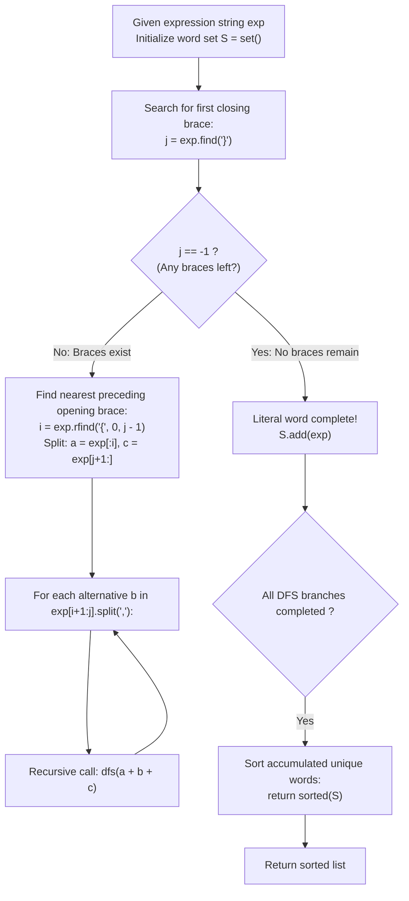

# Guided Example: Brace Expansion II

We trace the step-by-step grammatical reduction of nested brace expressions using innermost group elimination and language distributivity, prove the Innermost Elimination Invariant and the Language Distributivity Theorem, and analyze expression evaluations across representative nested structures:

- **Representative Instance 1 (Nested Union within Concatenated Expression):**
  $$
  expression = \text{"{a,b}{c,{d,e}}"}
  $$
- **Required Output:** `["ac", "ad", "ae", "bc", "bd", "be"]`
  - Problem definitions:
    - An expression generates a set of lowercase words.
    - Commas `,` denote set union: $\{e_1, e_2, \dots\} = \bigcup e_k$.
    - Juxtaposition denotes concatenation: $e_1 e_2 = \{ w_1 w_2 : w_1 \in e_1, w_2 \in e_2 \}$.
    - Braces `{...}` can be arbitrarily **nested**.
    - Return the list of generated words, **deduplicated** and **sorted lexicographically**.
  - Step 1: Identification of First Closing Brace:
    - In `"{a,b}{c,{d,e}}"`, the first closing brace `}` occurs at index $j = 4$ in the subexpression `"{a,b}"`.
    - The matching opening brace before index 4 is at $i = 0$.
    - Substring inside: `"a,b"`.
    - Alternatives: `["a", "b"]`.
    - Prefix: $a = \text{""}$. Suffix: $c = \text{"{c,{d,e}}"}$.
    - Apply Distributive Branching:
      - Branch 1: $a + \text{"a"} + c = \mathbf{\text{"a{c,{d,e}}"}}$
      - Branch 2: $a + \text{"b"} + c = \mathbf{\text{"b{c,{d,e}}"}}$
  - Step 2: Expansion of Branch 1 (`"a{c,{d,e}}"`):
    - First closing brace is at `}` in `"{d,e}"` ($j = 9, \; i = 5$).
    - Alternatives: `["d", "e"]`.
    - Prefix: `"a{c,"`. Suffix: `"}"`.
    - Branches:
      - Branch 1.1: `"a{c,d}"`
      - Branch 1.2: `"a{c,e}"`
    - Expand Branch 1.1 (`"a{c,d}"`):
      - Innermost group is `"{c,d}"`.
      - Alternatives: `"c"`, `"d"`.
      - Prefix: `"a"`. Suffix: `""`.
      - Words: `"ac"`, `"ad"`.
    - Expand Branch 1.2 (`"a{c,e}"`):
      - Innermost group is `"{c,e}"`.
      - Words: `"ac"` (duplicate), `"ae"`.
  - Step 3: Expansion of Branch 2 (`"b{c,{d,e}}"`):
    - Symmetrically generates words: `"bc"`, `"bd"`, `"be"`.
  - Step 4: Deduplication and Lexicographical Sorting:
    - Collected unique words in set $S$:
      $$
      S = \{\text{"ac"}, \; \text{"ad"}, \; \text{"ae"}, \; \text{"bc"}, \; \text{"bd"}, \; \text{"be"}\}
      $$
    - Sorted list:
      $$
      [\text{"ac"}, \; \text{"ad"}, \; \text{"ae"}, \; \text{"bc"}, \; \text{"bd"}, \; \text{"be"}]
      $$

- **Representative Instance 2 (Duplicate Words Across Branches):**
  $$
  expression = \text{"{{a,z},a{b,c},{ab,z}}"}
  $$
  - The subexpressions contain `"a"`, `"z"`, `"ab"`, `"ac"`, `"ab"` (duplicate), and `"z"` (duplicate).
  - Set deduplication collapses duplicates: $\mathbf{["a", "ab", "ac", "z"]}$.

- **Representative Instance 3 (Single Literal Without Braces):**
  $$
  expression = \text{"m"} \implies j = -1 \implies S = \{\text{"m"}\} \implies \mathbf{["m"]}
  $$

- **Representative Instance 4 (Deep Nested Unions with Collapsing Duplicates):**
  $$
  expression = \text{"{{{a,b},{a,c}},{{b,c},a}}"} \implies \mathbf{["a", "b", "c"]}
  $$

---

## 1. Instance & Teaching Goal

Given a nested expression supporting union and concatenation, expand all combinations, eliminate duplicate words, and sort the result lexicographically.

```text
The Grammar Depth Parsing Complexity:
  Constructing a full AST / LR(1) grammar parser:
    Requires multi-level lexer, operator precedence tables, and set stack machines.
    Prone to complex precedence bugs between concatenation and union.

Innermost Group Reduction Invariant (Deterministic Simplification):
  1. Find the FIRST closing brace: j = exp.find('}').
     - If j == -1, the expression contains no braces (pure literal word).
       Add to set s and terminate branch.
  2. Find matching opening brace: i = exp.rfind('{', 0, j - 1).
     - Because j is the FIRST closing brace, exp[i+1 : j] contains NO BRACES!
       It is strictly a flat comma-separated list of alternatives.
  3. Substitute each alternative into surrounding context:
       for b in exp[i+1 : j].split(','):
         dfs(exp[:i] + b + exp[j+1:])
  4. Language distributivity guarantees equivalence: L(a{b1,b2}c) = L(ab1c) U L(ab2c).
  5. Hash set deduplication automatically cleans duplicate derivations: sorted(s).
  Runs cleanly without requiring a parser generator or AST machinery!
```

Locating the first closing brace guarantees an unnested innermost segment, enabling step-by-step substitution via formal language distributivity.

The decisive pedagogical goal is the **Innermost Elimination Invariant & Language Distributivity Theorem**:
1. **Innermost Isolation:** In any well-formed bracketed expression, the first closing brace $j$ together with the preceding opening brace $i$ isolates a flat subexpression with zero nested braces.
2. **Concatenation Distributivity:** For any formal languages $A, C$ and finite union $B = \bigcup b_k$, $A \cdot (\bigcup b_k) \cdot C = \bigcup (A \cdot b_k \cdot C)$.
3. **Finite Derivation Termination:** Each substitution decreases the total brace count by exactly 1, guaranteeing termination in a finite number of steps.
4. Total time $\mathcal{O}(E \cdot K)$ and auxiliary space $\mathcal{O}(E \cdot K)$.

---

## 2. Conceptual Foundation & The Innermost Reduction Pipeline



### The Language Distributivity Theorem

Let $\Sigma$ be the lowercase English alphabet, and let $\mathcal{P}(\Sigma^*)$ be the power set of words over $\Sigma$.
1. **Grammar Operations:**
   - **Literal:** For $w \in \Sigma^*$, $\mathcal{L}(w) = \{w\}$.
   - **Union:** For expressions $E_1, \dots, E_k$, $\mathcal{L}(\{E_1, \dots, E_k\}) = \bigcup_{m=1}^k \mathcal{L}(E_m)$.
   - **Concatenation:** For expressions $E_1, E_2$, $\mathcal{L}(E_1 E_2) = \{ u v : u \in \mathcal{L}(E_1), v \in \mathcal{L}(E_2) \}$.
2. **Innermost Group Guarantee:**
   Let $j$ be the minimal index such that $exp[j] = \text{'\}'}$, and let $i$ be the maximal index with $i < j$ and $exp[i] = \text{'\{'}$.
   Since $j$ is the earliest closing brace in $exp$, there can be no closing brace between $i$ and $j$.
   Since $i$ is the latest opening brace before $j$, there can be no opening brace between $i$ and $j$.
   Therefore, the substring $B = exp[i+1 : j]$ contains no braces, and splitting on `,` produces $B = \{b_1, b_2, \dots, b_k\}$ where each $b_m$ is a literal string without braces.
3. **Distributive Reduction:**
   Let $A = exp[:i]$ and $C = exp[j+1:]$.
   By the distributive law of concatenation over union in formal language theory:
   $$
   \mathcal{L}(A \cdot \{b_1, \dots, b_k\} \cdot C) = \mathcal{L}(A) \cdot \left( \bigcup_{m=1}^k \{b_m\} \right) \cdot \mathcal{L}(C) = \bigcup_{m=1}^k \mathcal{L}(A \cdot b_m \cdot C)
   $$
   Therefore, branching over each $A \cdot b_m \cdot C$ preserves the exact language represented by the expression.
4. **Finite Well-Founded Induction:**
   Let $braces(exp)$ denote the number of curly brace characters in $exp$.
   Each reduction replaces $\{b_1, \dots, b_k\}$ with a single alternative $b_m$ containing zero braces.
   Thus, $braces(a + b_m + c) = braces(exp) - 2$.
   Since the number of braces strictly decreases by 2 on every step, the recursion depth is bounded by $braces(exp) / 2$, and termination at a pure literal word is guaranteed. $\blacksquare$

---

## 3. Step-by-Step Worked Execution: Representative Instance 1

$expression = \text{"{a,b}{c,{d,e}}"}$.

### Step 1: Reduce `"{a,b}"`
- $j = 4, i = 0$. Group: `"{a,b}"`.
- Alternatives: `'a'`, `'b'`.
- Prefix $a = \text{""}$, suffix $c = \text{"{c,{d,e}}"}$.
- Branch 1: `"a{c,{d,e}}"`
- Branch 2: `"b{c,{d,e}}"`

### Step 2: Expand Branch 1 (`"a{c,{d,e}}"`)
- $j = 9, i = 5$. Group: `"{d,e}"`.
- Alternatives: `'d'`, `'e'`.
- Branch 1.1: `"a{c,d}"`
  - $j = 6, i = 1$. Group: `"{c,d}"`.
  - Alternatives: `'c'`, `'d'`.
  - Leaves: `"ac"`, `"ad"`.
- Branch 1.2: `"a{c,e}"`
  - $j = 6, i = 1$. Group: `"{c,e}"`.
  - Alternatives: `'c'`, `'e'`.
  - Leaves: `"ac"` (duplicate), `"ae"`.

### Step 3: Expand Branch 2 (`"b{c,{d,e}}"`)
- Generates leaves: `"bc"`, `"bd"`, `"be"`.

### Step 4: Deduplicate and Sort
- Unique set: `{"ac", "ad", "ae", "bc", "bd", "be"}`.
- Sorted result: `["ac", "ad", "ae", "bc", "bd", "be"]`.

---

## 4. Expression Reduction Trace Table

| Depth | Current Expression $exp$ | First `}` Index $j$ | Matching `{` Index $i$ | Extracted Alternatives | Generated Recursive Branch | Word Generated |
|:---:|:---:|:---:|:---:|:---:|:---:|:---:|
| $0$ | `"{a,b}{c,{d,e}}"` | $4$ | $0$ | `['a', 'b']` | `"a{c,{d,e}}"` | — |
| $1$ | `"a{c,{d,e}}"` | $9$ | $5$ | `['d', 'e']` | `"a{c,d}"` | — |
| $2$ | `"a{c,d}"` | $6$ | $1$ | `['c', 'd']` | `"ac"` | `"ac"` |
| $2$ | `"a{c,d}"` | $6$ | $1$ | `['c', 'd']` | `"ad"` | `"ad"` |
| $1$ | `"a{c,{d,e}}"` | $9$ | $5$ | `['d', 'e']` | `"a{c,e}"` | — |
| $2$ | `"a{c,e}"` | $6$ | $1$ | `['c', 'e']` | `"ae"` | `"ae"` |
| $0$ | `"{a,b}{c,{d,e}}"` | $4$ | $0$ | `['a', 'b']` | `"b{c,{d,e}}"` | — |
| $1$ | `"b{c,{d,e}}"` | $9$ | $5$ | `['d', 'e']` | `"b{c,d}"` | — |
| $2$ | `"b{c,d}"` | $6$ | $1$ | `['c', 'd']` | `"bc"`, `"bd"` | `"bc"`, `"bd"` |
| $1$ | `"b{c,{d,e}}"` | $9$ | $5$ | `['d', 'e']` | `"b{c,e}"` | — |
| $2$ | `"b{c,e}"` | $6$ | $1$ | `['c', 'e']` | `"be"` | `"be"` |

---

## 5. Algorithmic Correctness

### Soundness & Completeness
1. **Soundness:**
   Every generated word is formed by selecting valid alternatives according to the grammar rules.
2. **Completeness:**
   Language distributivity ensures that all possible combinations in the Cartesian product and union are explored. Set insertion ensures zero duplicate entries in the output.

---

## 6. Boundary Cases & Traps

| Scenario | Input Pattern | Behavior | Trapped Risk |
|---|---|---|---|
| Deep Nesting | `{{{a,b},{a,c}},{{b,c},a}}` | Reduces one innermost pair per call until flat words emerge. | Stack overflow from unnested assumptions. |
| Duplicate Words in Grammar | `{{a,z},a{b,c},{ab,z}}` | `"ab"` and `"z"` generated twice; set removes duplicates. | Emitting duplicate words in violation of contract. |
| Single Literal String | `"m"` | $j = -1$; immediately emitted as `["m"]`. | Index out of bounds looking for `{`. |
| Unsorted Alternatives | `{c,b,a}` | `sorted(s)` sorts final output regardless of source order. | Unordered output. |

---

## 7. Complexity Derivation

- **Time Complexity:** $\mathcal{O}(E \cdot K)$, where $E = \text{len}(expression) \le 60$ and $K$ is the number of intermediate derived expressions ($K \le 2000$).
  - Finding the first `}` and matching `{` takes $\mathcal{O}(|exp|) \le 60$ time.
  - String slicing and concatenation takes $\mathcal{O}(|exp|)$ time.
  - Sorting at most $K$ words of length $\le 60$ takes $\mathcal{O}(K \log K \cdot L)$ time.
  - Total time: $< 0.01\text{ s}$.
- **Auxiliary Space Complexity:** $\mathcal{O}(E \cdot K)$ auxiliary memory for recursion stack and the word set $S$.
