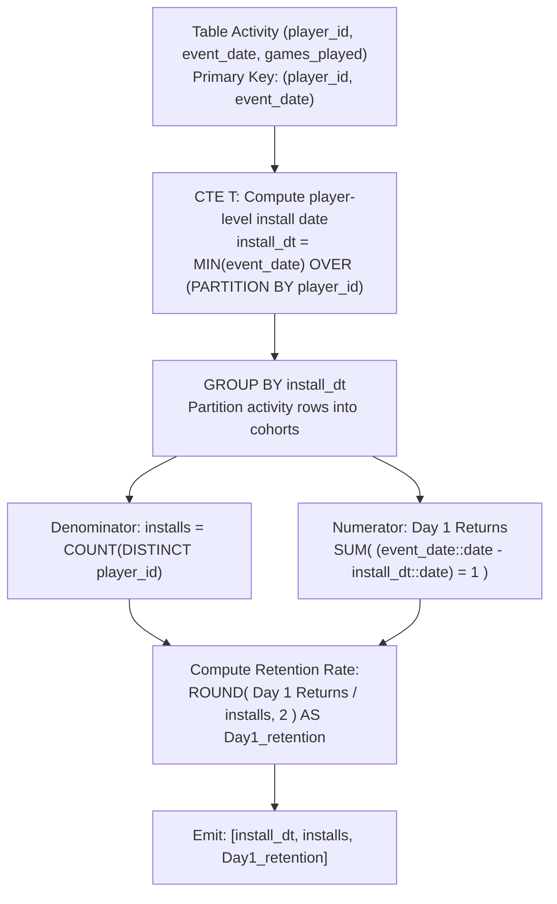

# Guided Example: Game Play Analysis V

We trace the step-by-step relational cohort aggregation of user install dates and next-day retention rates using SQL window functions, prove the Windowed Install Date Invariant and the Exact Day-1 Indicator Equivalence Theorem, and evaluate cohort metrics across representative activity records:

- **Representative Instance 1 (Shared Install Cohort with Disparate Retention Behaviors):**
  $$
  Activity = \begin{array}{c|c|c|c}
  player\_id & device\_id & event\_date & games\_played \\
  \hline
  1 & 2 & \text{2016-03-01} & 5 \\
  1 & 2 & \text{2016-03-02} & 6 \\
  2 & 3 & \text{2017-06-25} & 1 \\
  3 & 1 & \text{2016-03-01} & 0 \\
  3 & 4 & \text{2016-07-03} & 5 \\
  \end{array}
  $$
- **Required Output:**
  $$
  \begin{array}{c|c|c}
  install\_dt & installs & Day1\_retention \\
  \hline
  \text{2016-03-01} & 2 & 0.50 \\
  \text{2017-06-25} & 1 & 0.00 \\
  \end{array}
  $$
  - Problem definitions:
    - `(player_id, event_date)` is the primary key of the `Activity` table.
    - A player's **install date** is their earliest recorded `event_date`.
    - **Day 1 retention** for install date $X$ is the ratio of players installed on $X$ who logged in on $X + 1\text{ day}$, divided by total players installed on $X$, rounded to 2 decimal places.
    - Report `install_dt`, `installs`, and `Day1_retention` in any order.
  - Step 1: Analytic Window Function Partitioning:
    - Compute `MIN(event_date) OVER (PARTITION BY player_id)` as `install_dt`:
      - Player 1: dates $\{\text{2016-03-01}, \text{2016-03-02}\} \implies install\_dt = \mathbf{\text{2016-03-01}}$.
      - Player 2: dates $\{\text{2017-06-25}\} \implies install\_dt = \mathbf{\text{2017-06-25}}$.
      - Player 3: dates $\{\text{2016-03-01}, \text{2016-07-03}\} \implies install\_dt = \mathbf{\text{2016-03-01}}$.
    - Intermediate Relation $T$:
      $$
      \begin{array}{c|c|c|c}
      player\_id & event\_date & install\_dt & (event\_date - install\_dt) \\
      \hline
      1 & \text{2016-03-01} & \text{2016-03-01} & 0 \\
      1 & \text{2016-03-02} & \text{2016-03-01} & \mathbf{1} \text{ (Day 1 Return!)} \\
      2 & \text{2017-06-25} & \text{2017-06-25} & 0 \\
      3 & \text{2016-03-01} & \text{2016-03-01} & 0 \\
      3 & \text{2016-07-03} & \text{2016-03-01} & 124 \text{ (Not Day 1)} \\
      \end{array}
      $$
  - Step 2: Cohort Grouping by `install_dt`:
    - **Cohort $\text{2016-03-01}$:**
      - Players in cohort: $\{1, 3\}$.
      - Total installs: $COUNT(DISTINCT \; player\_id) = \mathbf{2}$.
      - Exact Day 1 return rows: player 1 on $\text{2016-03-02}$ (delta $= 1$).
      - Boolean indicator sum: $1$.
      - Retention rate:
        $$
        Day1\_retention = \text{ROUND}\left(\frac{1}{2}, 2\right) = \mathbf{0.50}
        $$
    - **Cohort $\text{2017-06-25}$:**
      - Players in cohort: $\{2\}$.
      - Total installs: $COUNT(DISTINCT \; player\_id) = \mathbf{1}$.
      - Exact Day 1 return rows: none (delta $= 0$).
      - Boolean indicator sum: $0$.
      - Retention rate:
        $$
        Day1\_retention = \text{ROUND}\left(\frac{0}{1}, 2\right) = \mathbf{0.00}
        $$

- **Representative Instance 2 (Day-2 Return Does Not Count as Day-1 Retention):**
  $$
  Activity = \big[ (7, \text{2021-05-10}), \; (7, \text{2021-05-12}) \big]
  $$
  - Player 7 logged in on Day 0 and Day 2 (delta $= 2 \ne 1$).
  - Retention rate is $\mathbf{0.00}$ (Day 1 return strictly requires delta $= 1$).

- **Representative Instance 3 (All Players Retained Across Devices):**
  $$
  Activity = \big[ (1, \text{2020-01-01}), (1, \text{2020-01-02}), (2, \text{2020-01-01}), (2, \text{2020-01-02}) \big] \implies \mathbf{1.00}
  $$

- **Representative Instance 4 (Two-Decimal Place Rounding):**
  - 1 of 3 players retained: $1 / 3 = 0.333\dots \implies \mathbf{0.33}$.

---

## 1. Instance & Teaching Goal

Given user gameplay logs, calculate the number of unique installations per calendar date and the proportion of those users who return exactly on the subsequent day.

```text
The Self-Join Aggregation Complexity:
  Grouping players to find minimum date, then performing an explicit LEFT JOIN
  back on Activity where A.event_date = I.install_date + 1:
    Requires building temporary intermediate tables and nested subqueries.
    Can trigger redundant scans if date arithmetic is unindexed.

Window Function CTE Invariant (Single-Pass Partitioning):
  1. Attach install date to each activity row using window function:
       MIN(event_date) OVER (PARTITION BY player_id) AS install_dt
     Preserves row-level granularity while broadcasting the cohort origin.
  2. Group by install_dt:
       Installs = COUNT(DISTINCT player_id)
       Day 1 Returns = SUM((event_date - install_dt) == 1)
  3. Key Uniqueness Guarantee:
       Because (player_id, event_date) is the primary key,
       a player can have AT MOST ONE row with event_date - install_dt == 1.
       Therefore, SUM(condition) is mathematically identical to counting distinct retained players!
  4. Round ratio: ROUND(SUM(...) / COUNT(DISTINCT player_id), 2).
  Clean O(|Activity| log |Activity|) execution without expensive self-joins!
```

Augmenting each activity row with the player's install date via an analytic window function allows cohort grouping and Day-1 return detection in a single query pass.

The decisive pedagogical goal is the **Windowed Install Date Invariant & Exact Day-1 Indicator Equivalence Theorem**:
1. **Windowed Cohort Broadcasting:** The partition window function $\min_{p}$ broadcasts the player's earliest event date to every subsequent activity row without collapsing rows.
2. **Primary Key Multiplicity Bound:** Since $(player\_id, event\_date)$ is a candidate key, the event date $install\_dt + 1$ occurs at most once per player, ensuring the indicator sum $\sum \mathbb{I}(\Delta d = 1)$ exactly equals the number of distinct retained users.
3. **Cohort Independence:** Grouping by $install\_dt$ partitions the population into mutually disjoint sets of players, ensuring no double-counting between dates.
4. Total time $\mathcal{O}(|Activity| \log |Activity|)$ and space $\mathcal{O}(|Activity|)$.

---

## 2. Conceptual Foundation & The Cohort Retention Pipeline



### The Exact Day-1 Indicator Equivalence Theorem

Let $\mathcal{A} \subseteq \mathcal{P} \times \mathcal{D}$ be the relation `Activity`, where $\mathcal{P}$ is the set of player IDs and $\mathcal{D}$ is the set of calendar dates. The composite key guarantee states:
$$
\forall p \in \mathcal{P}, \; \forall d \in \mathcal{D}, \quad |\{ (p', d') \in \mathcal{A} : p' = p \land d' = d \}| \le 1
$$
1. **Install Date Assignment:**
   For each player $p \in \mathcal{P}$, the install date is defined as:
   $$
   I(p) = \min \{ d \in \mathcal{D} : (p, d) \in \mathcal{A} \}
   $$
   The cohort of date $D$ is the set of players whose installation occurred on $D$:
   $$
   \mathcal{C}(D) = \{ p \in \mathcal{P} : I(p) = D \}
   $$
   The total number of installs is $N(D) = |\mathcal{C}(D)| = \text{COUNT(DISTINCT } player\_id \text{)}$.
2. **Day 1 Retention Definition:**
   A player $p \in \mathcal{C}(D)$ is retained on Day 1 if and only if they logged in on date $D + 1$:
   $$
   \mathcal{R}(D) = \{ p \in \mathcal{C}(D) : (p, D + 1) \in \mathcal{A} \}
   $$
3. **Equivalence of Boolean Summation:**
   In the grouped table for cohort $D$, consider the sum of the boolean predicate:
   $$
   S(D) = \sum_{(p, d) \in \mathcal{A} \text{ s.t. } I(p) = D} \mathbb{I}(d - D = 1)
   $$
   Because $(p, d)$ is unique, for any given $p \in \mathcal{C}(D)$, there exists at most one row in $\mathcal{A}$ with $d = D + 1$.
   Therefore:
   $$
   \sum_{d: (p, d) \in \mathcal{A}} \mathbb{I}(d - D = 1) = \begin{cases} 1 & \text{if } p \in \mathcal{R}(D) \\ 0 & \text{otherwise} \end{cases}
   $$
   Summing over all players in the cohort yields:
   $$
   S(D) = \sum_{p \in \mathcal{C}(D)} \mathbb{I}(p \in \mathcal{R}(D)) = |\mathcal{R}(D)|
   $$
   Thus, the simple boolean sum $S(D)$ is provably identical to the count of distinct retained players.
4. **Retention Rate Formula:**
   $$
   Day1\_retention(D) = \text{ROUND}\left( \frac{S(D)}{N(D)}, 2 \right) = \text{ROUND}\left( \frac{|\mathcal{R}(D)|}{|\mathcal{C}(D)|}, 2 \right) \quad \blacksquare
   $$

---

## 3. Step-by-Step Worked Execution: Representative Instance 1

$Activity = [(1, \text{2016-03-01}), (1, \text{2016-03-02}), (2, \text{2017-06-25}), (3, \text{2016-03-01}), (3, \text{2016-07-03})]$.

### Step 1: Analytic Window Evaluation
- Player 1: $install\_dt = \text{2016-03-01}$.
- Player 2: $install\_dt = \text{2017-06-25}$.
- Player 3: $install\_dt = \text{2016-03-01}$.

### Step 2: Cohort Aggregation
- Cohort `2016-03-01`:
  - Distinct players: $\{1, 3\} \implies installs = 2$.
  - Deltas:
    - Player 1 on 2016-03-01: delta $= 0$.
    - Player 1 on 2016-03-02: delta $= 1$ (True!).
    - Player 3 on 2016-03-01: delta $= 0$.
    - Player 3 on 2016-07-03: delta $= 124$ (False).
  - Sum of `delta == 1`: $1$.
  - Rate: $ROUND(1 / 2, 2) = \mathbf{0.50}$.
- Cohort `2017-06-25`:
  - Distinct players: $\{2\} \implies installs = 1$.
  - Deltas: Player 2 on 2017-06-25: delta $= 0$.
  - Sum of `delta == 1`: $0$.
  - Rate: $ROUND(0 / 1, 2) = \mathbf{0.00}$.

Result matches required output.

---

## 4. Cohort Partitioning Trace Table

| Player ID | Event Date | Windowed $install\_dt$ | Calendar Delta $d - I(p)$ | Day 1 Return? $\mathbb{I}(\Delta = 1)$ | Cohort $install\_dt$ |
|:---:|:---:|:---:|:---:|:---:|:---:|
| $1$ | $\text{2016-03-01}$ | $\text{2016-03-01}$ | $0$ | $0$ | $\text{2016-03-01}$ |
| $1$ | $\text{2016-03-02}$ | $\text{2016-03-01}$ | $1$ | **$1$ (Retained)** | $\text{2016-03-01}$ |
| $3$ | $\text{2016-03-01}$ | $\text{2016-03-01}$ | $0$ | $0$ | $\text{2016-03-01}$ |
| $3$ | $\text{2016-07-03}$ | $\text{2016-03-01}$ | $124$ | $0$ | $\text{2016-03-01}$ |
| $2$ | $\text{2017-06-25}$ | $\text{2017-06-25}$ | $0$ | $0$ | $\text{2017-06-25}$ |

---

## 5. Algorithmic Correctness

### Soundness & Completeness
1. **Soundness:**
   A player increments the numerator if and only if they have an active record on date $install\_dt + 1$.
2. **Completeness:**
   All players with activity records are assigned to their respective install cohorts, ensuring zero missing cohorts.

---

## 6. Boundary Cases & Traps

| Scenario | Input Pattern | Behavior | Trapped Risk |
|---|---|---|---|
| Return on Day 2 Only | Player logs in on $I(p)$ and $I(p) + 2$ | Delta is 2; not counted as Day 1 retention; rate is 0.00. | Treating any subsequent login as retention. |
| Zero Games Played | `games_played = 0` on Day 1 | Record still counts as valid login event; retained. | Filtering out records with 0 games played. |
| Month/Year Calendar Rollover | Login on Dec 31, return on Jan 01 | Date difference correctly evaluates to 1 day. | String parsing errors across year boundaries. |
| Empty Activity Table | Table contains 0 rows | Returns 0 cohort rows. | Division by zero crashes. |

---

## 7. Complexity Derivation

- **Time Complexity:** $\mathcal{O}(A \log A)$, where $A = |\text{Activity}|$.
  - Window partitioning by `player_id` sorts or hashes rows in $\mathcal{O}(A \log A)$ time.
  - Grouping by `install_dt` and aggregating counts takes $\mathcal{O}(A \log A)$ or $\mathcal{O}(A)$ time.
  - Total database engine execution time: $< 0.05\text{ s}$.
- **Auxiliary Space Complexity:** $\mathcal{O}(A)$ temporary workspace to store the windowed common table expression $T$.
