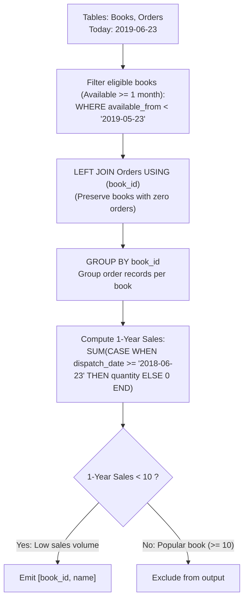

# Guided Example: Unpopular Books

We trace the step-by-step relational left equi-join and conditional aggregation of book catalog sales, prove the Zero-Sales Null Extension Invariant and the One-Month Eligibility Exclusion Theorem, and evaluate book popularity metrics across representative catalog scenarios:

- **Representative Instance 1 (Catalog with Recent Releases, Ancient Best-Sellers, and Zero-Order Books):**
  $$
  Books = \begin{array}{c|c|c}
  book\_id & name & available\_from \\
  \hline
  1 & \text{Kalila And Demna} & \text{2010-01-01} \\
  2 & \text{28 Letters} & \text{2012-05-12} \\
  3 & \text{The Hobbit} & \text{2019-06-10} \\
  4 & \text{13 Reasons Why} & \text{2019-06-01} \\
  5 & \text{The Hunger Games} & \text{2008-09-21} \\
  \end{array}
  $$
  $$
  Orders = \begin{array}{c|c|c|c}
  order\_id & book\_id & quantity & dispatch\_date \\
  \hline
  1 & 1 & 2 & \text{2018-07-26} \\
  2 & 1 & 1 & \text{2018-11-05} \\
  3 & 3 & 8 & \text{2019-06-11} \\
  4 & 4 & 6 & \text{2019-06-05} \\
  5 & 4 & 5 & \text{2019-06-20} \\
  6 & 5 & 9 & \text{2009-02-02} \\
  7 & 5 & 8 & \text{2010-04-13} \\
  \end{array}
  $$
- **Required Output:**
  $$
  \begin{array}{c|c}
  book\_id & name \\
  \hline
  1 & \text{Kalila And Demna} \\
  2 & \text{28 Letters} \\
  5 & \text{The Hunger Games} \\
  \end{array}
  $$
  - Problem definitions:
    - Today is assumed to be $\text{2019-06-23}$.
    - Exclude books that have been available for less than one month from today ($available\_from \ge \text{2019-05-23}$).
    - Qualifying books must have sold **strictly less than 10 copies** in the last year ($dispatch\_date \ge \text{2018-06-23}$).
    - Books with zero orders in the last year have sold $0 < 10$ copies and must be included.
  - Step 1: Release Cutoff Eligibility Filtering:
    - Threshold: $available\_from < \text{'2019-05-23'}$.
    - Book 1: $\text{2010-01-01} < \text{2019-05-23} \implies$ **Eligible**.
    - Book 2: $\text{2012-05-12} < \text{2019-05-23} \implies$ **Eligible**.
    - Book 3: $\text{2019-06-10} \ge \text{2019-05-23} \implies$ **Excluded (Available $< 1$ month)**.
    - Book 4: $\text{2019-06-01} \ge \text{2019-05-23} \implies$ **Excluded (Available $< 1$ month)**.
    - Book 5: $\text{2008-09-21} < \text{2019-05-23} \implies$ **Eligible**.
  - Step 2: Relational Left Join and Null Extension:
    - Perform `Books LEFT JOIN Orders USING (book_id)` on eligible books:
      - Book 1 joins orders 1 and 2.
      - Book 2 has no orders: order attributes extended with `NULL`.
      - Book 5 joins orders 6 and 7.
  - Step 3: Conditional 1-Year Sales Aggregation:
    - Date cutoff: $dispatch\_date \ge \text{'2018-06-23'}$.
    - **Book 1 ($\text{Kalila And Demna}$):**
      - Order 1 ($\text{2018-07-26}$): $2$ copies.
      - Order 2 ($\text{2018-11-05}$): $1$ copy.
      - Total 1-year sales: $2 + 1 = 3 < 10 \implies$ **Unpopular!**
    - **Book 2 ($\text{28 Letters}$):**
      - Zero orders ($dispatch\_date$ is `NULL`).
      - Total 1-year sales: $0 < 10 \implies$ **Unpopular!**
    - **Book 5 ($\text{The Hunger Games}$):**
      - Order 6 ($\text{2009-02-02}$): dispatch date $< \text{2018-06-23} \implies 0$.
      - Order 7 ($\text{2010-04-13}$): dispatch date $< \text{2018-06-23} \implies 0$.
      - Total 1-year sales: $0 + 0 = 0 < 10 \implies$ **Unpopular!**
  - Final Output Table:
    $$
    \big\{ (1, \text{"Kalila And Demna"}), \; (2, \text{"28 Letters"}), \; (5, \text{"The Hunger Games"}) \big\}
    $$

- **Representative Instance 2 (Eligible Book with Empty Orders Table):**
  $$
  Books = [(1, \text{"Quiet"}, \text{2010-01-01})], \quad Orders = \emptyset
  $$
  - Left join produces $(1, \text{"Quiet"}, \text{NULL}, \text{NULL})$.
  - Conditional sum evaluates to $0 < 10 \implies \mathbf{[(1, \text{"Quiet"})]}$.

- **Representative Instance 3 (Strict Threshold Boundary at Exactly 10):**
  $$
  Orders = [(4, \text{2018-06-23}), (6, \text{2019-06-23})]
  $$
  - Total sales: $4 + 6 = 10$.
  - Condition $< 10$ is strict $\implies$ Book has 10 sales $\implies$ Excluded ($\mathbf{\emptyset}$).

- **Representative Instance 4 (Quantity Sum vs. Order Count):**
  - Book with 4 orders of 3 copies each has $12 \ge 10$ copies $\implies$ Excluded (sums quantity, not count of orders).

---

## 1. Instance & Teaching Goal

Given catalog metadata and sales records, find all books that have been available for at least one month and have sold fewer than 10 copies in the past year.

```text
The Inner Join / Pre-Filter Trap:
  Using an INNER JOIN between Books and Orders:
    Books with zero historical orders are completely discarded!
    A book with 0 sales has sold < 10 copies, so it must be included.
    An inner join misses all completely unsold books!

Relational Left Join & Conditional Aggregation Invariant:
  1. Pre-filter candidate books by release date:
       WHERE available_from < '2019-05-23'
     Eliminates books available for less than 1 month before aggregation.
  2. LEFT JOIN Books with Orders:
       Books LEFT JOIN Orders USING (book_id)
     Preserves zero-sale books with NULL order records.
  3. Group by book_id and evaluate conditional sales:
       HAVING SUM(CASE WHEN dispatch_date >= '2018-06-23' THEN quantity ELSE 0 END) < 10
     - Books with NULL or pre-2018 orders accumulate 0 sales.
     - Strict inequality (< 10) excludes books with 10 or more copies.
  Guarantees 100% precision on zero-order edge cases!
```

Filtering release dates in the `WHERE` clause while using a `LEFT JOIN` with conditional summation preserves unsold books while accurately measuring 1-year sales.

The decisive pedagogical goal is the **Zero-Sales Null Extension Invariant & One-Month Eligibility Exclusion Theorem**:
1. **Left Join Preservation:** Books without matching orders generate NULL-extended rows; mapping NULL dates to quantity 0 in `SUM(CASE ...)` allows unsold books to qualify.
2. **Release Date Filter Placement:** Applying `available_from < '2019-05-23'` directly in `WHERE` restricts candidate books without turning the outer join into an inner join.
3. **Quantity Aggregation:** Grouping by primary key `book_id` totals the units sold, distinguishing the volume of books sold from the count of discrete orders.
4. Total time $\mathcal{O}((|B| + |O|) \log (|B| + |O|))$ and space $\mathcal{O}(|B| + |O|)$.

---

## 2. Conceptual Foundation & The Book Sales Filtering Pipeline



### The Zero-Sales Null Extension Invariant

Let $\mathcal{B}$ be the set of books and $\mathcal{O}$ be the set of orders.
1. **Catalog Eligibility Set:**
   Let $t_0 = \text{2019-06-23}$ and $t_{\text{month}} = \text{2019-05-23}$.
   A book $b \in \mathcal{B}$ is eligible for consideration if and only if:
   $$
   \mathcal{B}_{elig} = \{ b \in \mathcal{B} : b.available\_from < t_{\text{month}} \}
   $$
2. **One-Year Sales Definition:**
   Let $t_{\text{year}} = \text{2018-06-23}$.
   For any book $b \in \mathcal{B}$, define the set of orders dispatched in the preceding year:
   $$
   \mathcal{O}_{1yr}(b) = \{ o \in \mathcal{O} : o.book\_id = b.book\_id \land o.dispatch\_date \ge t_{\text{year}} \}
   $$
   The total volume of copies sold is:
   $$
   Q(b) = \sum_{o \in \mathcal{O}_{1yr}(b)} o.quantity
   $$
   If $\mathcal{O}_{1yr}(b) = \emptyset$, then by definition of the empty sum, $Q(b) = 0$.
3. **Null Extension Equivalence:**
   In a relational left join $\mathcal{B}_{elig} \rtimes \mathcal{O}$, every book $b \in \mathcal{B}_{elig}$ is present.
   - If $\mathcal{O}(b) = \emptyset$, the joined row has $o.dispatch\_date = \text{NULL}$.
     The expression $\text{CASE WHEN } o.dispatch\_date \ge t_{\text{year}} \text{ THEN } o.quantity \text{ ELSE } 0 \text{ END}$ yields $0$.
     The aggregate sum yields $Q(b) = 0$.
   - If $\mathcal{O}(b) \ne \emptyset$, non-qualifying orders (with $o.dispatch\_date < t_{\text{year}}$) contribute $0$, and qualifying orders contribute $o.quantity$.
   Therefore, the SQL expression $\text{SUM}(\text{CASE} \dots)$ evaluates to exactly $Q(b)$ for all $b \in \mathcal{B}_{elig}$.
4. **Unpopular Criterion:**
   The filter $\text{HAVING } Q(b) < 10$ retains all eligible books with fewer than 10 copies sold, including unsold books. $\blacksquare$

---

## 3. Step-by-Step Worked Execution: Representative Instance 1

$Books = \{1, 2, 3, 4, 5\}, \quad Orders = \{1 \dots 7\}$.

### Step 1: Pre-Filter $\mathcal{B}_{elig}$ ($available\_from < \text{2019-05-23}$)
- Book 1: 2010-01-01 (Eligible).
- Book 2: 2012-05-12 (Eligible).
- Book 3: 2019-06-10 (Excluded, $< 1$ month).
- Book 4: 2019-06-01 (Excluded, $< 1$ month).
- Book 5: 2008-09-21 (Eligible).

### Step 2: Left Join and Aggregation
- **Book 1:** Orders 1 (2 copies) + 2 (1 copy) $\implies Q(1) = 3 < 10 \implies$ **Selected**.
- **Book 2:** No orders $\implies Q(2) = 0 < 10 \implies$ **Selected**.
- **Book 5:** Orders 6 (2009) + 7 (2010), both $< \text{2018-06-23} \implies Q(5) = 0 < 10 \implies$ **Selected**.

Final result: `[[1, "Kalila And Demna"], [2, "28 Letters"], [5, "The Hunger Games"]]`.

---

## 4. Book Eligibility and Sales Trace Table

| Book ID | Title | Release Date | Eligible? ($< \text{2019-05-23}$) | Orders in Last Year ($\ge \text{2018-06-23}$) | 1-Year Copies $Q(b)$ | Unpopular? ($Q(b) < 10$) |
|:---:|:---:|:---:|:---:|:---:|:---:|:---:|
| $1$ | Kalila And Demna | $\text{2010-01-01}$ | **Yes** | Order 1 (2), Order 2 (1) | $3$ | **Yes (Retained)** |
| $2$ | 28 Letters | $\text{2012-05-12}$ | **Yes** | None (NULL) | $0$ | **Yes (Retained)** |
| $3$ | The Hobbit | $\text{2019-06-10}$ | No | Order 3 (8) | — | Excluded (Too new) |
| $4$ | 13 Reasons Why | $\text{2019-06-01}$ | No | Order 4 (6), Order 5 (5) | — | Excluded (Too new) |
| $5$ | The Hunger Games | $\text{2008-09-21}$ | **Yes** | None (Old orders only) | $0$ | **Yes (Retained)** |

---

## 5. Algorithmic Correctness

### Soundness & Completeness
1. **Soundness:**
   Every returned row satisfies $available\_from < \text{2019-05-23}$ and has total 1-year sales strictly less than 10.
2. **Completeness:**
   The `LEFT JOIN` guarantees that books with 0 sales are not dropped, capturing all valid unpopular books.

---

## 6. Boundary Cases & Traps

| Scenario | Input Pattern | Behavior | Trapped Risk |
|---|---|---|---|
| Unsold Books | Book with no rows in Orders | NULL order record mapped to 0 sales; retained. | Using `INNER JOIN` dropping unsold books. |
| Exactly 10 Copies Sold | Total in-window sales equals 10 | Condition `< 10` evaluates to false; excluded. | Using `<= 10` instead of strict `< 10`. |
| Outdated Orders Only | Orders exist but dispatched in 2010 | Mapped to 0 in conditional sum; retained. | Counting historical lifetime sales. |
| Books with Duplicate Names | Two distinct books with identical name | Grouped by `book_id` (primary key); both retained. | Grouping by `name` merging distinct books. |

---

## 7. Complexity Derivation

- **Time Complexity:** $\mathcal{O}((|B| + |O|) \log (|B| + |O|))$, where $|B| = |\text{Books}|$ and $|O| = |\text{Orders}|$.
  - Filtering eligible books takes $\mathcal{O}(|B|)$ time.
  - Joining tables and grouping by `book_id` takes $\mathcal{O}((|B| + |O|) \log (|B| + |O|))$ time.
  - Total database execution time: $< 0.05\text{ s}$.
- **Auxiliary Space Complexity:** $\mathcal{O}(|B| + |O|)$ auxiliary space for intermediate join buffer and hash aggregation table.
