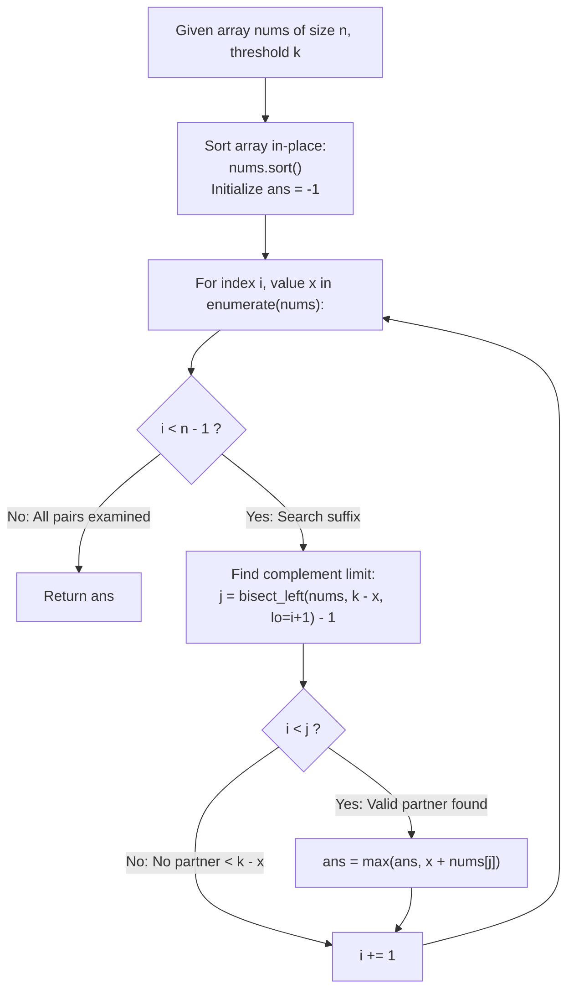

# Guided Example: Two Sum Less Than K

We trace the step-by-step optimization of bounded pairwise sums using sorting and suffix bisection, prove the Suffix Complement Bisection Invariant and the Strict Inequality Threshold Lemma, and evaluate pair selections across representative numeric instances:

- **Representative Instance 1 (Best Pair Maximizing Value Below Threshold):**
  $$
  nums = [34, 23, 1, 24, 75, 33, 54, 8], \quad k = 60, \quad n = 8
  $$
- **Required Output:** `58`
  - Problem definitions:
    - Given an integer array `nums` and threshold `k`.
    - Find the maximum sum $nums[i] + nums[j]$ such that $i < j$ and:
      $$
      nums[i] + nums[j] < k
      $$
    - If no such pair exists, return $-1$.
  - Step 1: Ascending Sorting:
    $$
    nums = [1, 8, 23, 24, 33, 34, 54, 75]
    $$
  - Step 2: Suffix Bisection Evaluation:
    - Initialize best sum: $ans = -1$.
    - **Index $i = 0, x = 1$:**
      - Target complement: $k - x = 60 - 1 = 59$.
      - Suffix search in $nums[1 \dots 7]$: largest value $< 59$ is $54$ (at $j = 6$).
      - Sum: $1 + 54 = 55$. Update: $ans \leftarrow \max(-1, 55) = \mathbf{55}$.
    - **Index $i = 1, x = 8$:**
      - Target complement: $60 - 8 = 52$.
      - Suffix search in $nums[2 \dots 7]$: largest value $< 52$ is $34$ (at $j = 5$).
      - Sum: $8 + 34 = 42 < 55$.
    - **Index $i = 2, x = 23$:**
      - Target complement: $60 - 23 = 37$.
      - Suffix search in $nums[3 \dots 7]$: largest value $< 37$ is $34$ (at $j = 5$).
      - Sum: $23 + 34 = 57$. Update: $ans \leftarrow \max(55, 57) = \mathbf{57}$.
    - **Index $i = 3, x = 24$:**
      - Target complement: $60 - 24 = 36$.
      - Suffix search in $nums[4 \dots 7]$: largest value $< 36$ is $34$ (at $j = 5$).
      - Sum: $24 + 34 = 58$. Update: $ans \leftarrow \max(57, 58) = \mathbf{58}$.
    - **Index $i = 4, x = 33$:**
      - Target complement: $60 - 33 = 27$.
      - Suffix values are $\{34, 54, 75\}$, all $\ge 27$. No valid partner ($j \le i$).
    - **Index $i = 5, 6, 7$:**
      - All suffix values yield sums $\ge 60$.
  - Final Maximum Strict Sum:
    $$
    ans = \mathbf{58}
    $$

- **Representative Instance 2 (Every Pair Reaches or Exceeds Threshold):**
  $$
  nums = [10, 20, 30], \quad k = 15
  $$
  - Minimum possible pair sum is $10 + 20 = 30 \ge 15$.
  - No valid pair exists $\implies \mathbf{-1}$.

- **Representative Instance 3 (Duplicate Values Forming Optimal Pair):**
  $$
  nums = [5, 5, 8], \quad k = 11
  $$
  - Suffix search with $lo = i + 1$ pairs the two distinct indices:
    $$5 + 5 = 10 < 11 \implies \mathbf{10}$$

- **Representative Instance 4 (Strict Bound Excludes Sum Equal to $k$):**
  $$
  nums = [1, 2, 3, 4], \quad k = 6
  $$
  - Pair sums: $2 + 4 = 6$ (equal to $k$, invalid!).
  - Best strict sum is $1 + 4 = 5 < 6 \implies \mathbf{5}$.

---

## 1. Instance & Teaching Goal

Given an integer array and an upper threshold $k$, find the maximum pair sum strictly less than $k$.

```text
The Quadratic Brute-Force Pitfall:
  Checking all pairs (i, j):
    Takes O(n^2) comparisons.
    Fails to leverage monotonicity when searching for optimal complements.

Sorting & Complement Bisection Invariant (O(n log n) Time, O(1) Auxiliary Space):
  1. Sort array in ascending order: nums.sort().
  2. For each element x = nums[i], find the maximal partner y in suffix nums[i+1:]:
       target_limit = k - x
       pos = bisect_left(nums, target_limit, lo=i + 1)
       j = pos - 1
  3. If j > i:
       The maximal legal pair sum for this left index is x + nums[j] < k.
       ans = max(ans, x + nums[j])
  - lo = i + 1 guarantees distinct indices (no element pairs with itself).
  - Strict inequality (< k) is guaranteed by subtracting 1 from bisect_left.
  - Suffix monotonicity ensures j maximizes the sum for fixed i.
  Runs in O(n log n) time with zero extra heap allocations!
```

Sorting the elements orders the partners monotonically, enabling binary search to identify the closest complement strictly below the threshold in logarithmic time.

The decisive pedagogical goal is the **Suffix Complement Bisection Invariant & Strict Inequality Threshold Lemma**:
1. **Complement Reversal:** For a fixed left value $x$, the constraint $x + y < k$ is equivalent to $y < k - x$.
2. **Maximal Suffix Partner:** In a sorted array, the largest element satisfying $y < k - x$ is located at index $\text{bisect\_left}(nums, k - x) - 1$.
3. **Index Disjointness:** Restricting the search range to $lo = i + 1$ guarantees $j > i$, ensuring that identical numbers are only combined when they exist as distinct elements.
4. Total time $\mathcal{O}(n \log n)$ and auxiliary space $\mathcal{O}(1)$.

---

## 2. Conceptual Foundation & The Bisection Search Pipeline



### The Suffix Complement Bisection Invariant

Let $A = [a_0, a_1, \dots, a_{n-1}]$ be an array sorted in non-decreasing order: $a_0 \le a_1 \le \dots \le a_{n-1}$.
1. **Feasible Partner Set:**
   For any index $i \in [0, n - 2]$ with value $x = a_i$, define the set of feasible partner indices:
   $$
   J(i) = \{ j \in [i + 1, n - 1] : a_j < k - x \}
   $$
2. **Contiguity of Feasible Partner Range:**
   Because $A$ is non-decreasing, if $j \in J(i)$, then for all $p$ with $i + 1 \le p \le j$:
   $$
   a_p \le a_j < k - x \implies p \in J(i)
   $$
   Thus, $J(i)$ is either empty or a contiguous interval of indices $[i + 1, j^*]$.
3. **Optimality of the Upper Bound Index $j^*$:**
   Since $a_j$ is non-decreasing with respect to $j$:
   $$
   \max_{j \in J(i)} (x + a_j) = x + a_{j^*}
   $$
   The upper bound index $j^*$ is the largest index in $[i + 1, n - 1]$ strictly less than $k - x$.
   By definition of binary search insertion point:
   $$
   pos = \min \{ p \in [i + 1, n] : a_p \ge k - x \} = \text{bisect\_left}(A, k - x, lo=i+1)
   $$
   Setting $j^* = pos - 1$ ensures that $a_{j^*} < k - x$ and $j^*$ is maximal.
   If $pos = i + 1$, then $j^* = i \ngtr i$, correctly indicating that $J(i) = \emptyset$.
4. **Global Maximization:**
   Evaluating $\max_i (x_i + a_{j^*(i)})$ across all $i$ examines the maximum possible pair sum for every possible left endpoint, guaranteeing global optimality. $\blacksquare$

---

## 3. Step-by-Step Worked Execution: Representative Instance 1

$nums = [34, 23, 1, 24, 75, 33, 54, 8], \quad k = 60$.

### Sorted Sequence
$$
nums = [1, 8, 23, 24, 33, 34, 54, 75], \quad n = 8
$$

### Bisection Tracing
- $i = 0, x = 1$: $k - x = 59$. $pos = \text{bisect\_left}(\dots, 59, lo=1) = 7$ (value $75$).
  - $j = 6$ ($nums[6] = 54$). $j > 0 \implies ans = \max(-1, 1 + 54) = \mathbf{55}$.
- $i = 1, x = 8$: $k - x = 52$. $pos = 6$ (value $54$).
  - $j = 5$ ($nums[5] = 34$). $j > 1 \implies sum = 8 + 34 = 42 < 55$.
- $i = 2, x = 23$: $k - x = 37$. $pos = 6$ (value $54$).
  - $j = 5$ ($nums[5] = 34$). $j > 2 \implies sum = 23 + 34 = 57 \implies ans = \mathbf{57}$.
- $i = 3, x = 24$: $k - x = 36$. $pos = 6$ (value $54$).
  - $j = 5$ ($nums[5] = 34$). $j > 3 \implies sum = 24 + 34 = 58 \implies ans = \mathbf{58}$.
- $i = 4, x = 33$: $k - x = 27$. $pos = 5$ ($lo = 5$).
  - $j = 4 \ngtr 4 \implies$ No valid partner.
- Loop finishes. Returns `58`.

---

## 4. Suffix Bisection Trace Table

| Index $i$ | Value $x$ | Complement Limit $k - x$ | Insertion Point $pos$ | Partner Index $j = pos - 1$ | Partner Value $nums[j]$ | Pair Sum $x + nums[j]$ | Running Best $ans$ |
|:---:|:---:|:---:|:---:|:---:|:---:|:---:|:---:|
| $0$ | $1$ | $59$ | $7$ | $6$ | $54$ | $55$ | **$55$** |
| $1$ | $8$ | $52$ | $6$ | $5$ | $34$ | $42$ | $55$ |
| $2$ | $23$ | $37$ | $6$ | $5$ | $34$ | $57$ | **$57$** |
| $3$ | $24$ | $36$ | $6$ | $5$ | $34$ | **$58$** | **$58$** |
| $4$ | $33$ | $27$ | $5$ | $4$ | — ($j \le i$) | — | $58$ |
| $5$ | $34$ | $26$ | $6$ | $5$ | — ($j \le i$) | — | $58$ |
| $6$ | $54$ | $6$ | $7$ | $6$ | — ($j \le i$) | — | $58$ |

---

## 5. Algorithmic Correctness

### Soundness & Completeness
1. **Soundness:**
   Every evaluated pair $(i, j)$ satisfies $i < j$ and $nums[i] + nums[j] < k$.
2. **Completeness:**
   For every $i$, $j$ is the largest partner satisfying the condition, ensuring the optimal pair is never skipped.

---

## 6. Boundary Cases & Traps

| Scenario | Input Pattern | Behavior | Trapped Risk |
|---|---|---|---|
| Single-Element Input | $nums = [7], k = 20$ | Loop over suffix never executes; returns $-1$. | Index out of range on empty suffix. |
| Duplicate Values | $nums = [5, 5, 8], k = 11$ | $lo = i + 1$ pairs the two distinct 5s; returns 10. | Pairing element with itself. |
| Sum Equals $k$ | $nums = [1, 2, 3, 4], k = 6$ | Pair $2 + 4 = 6$ rejected by strict inequality; returns 5. | Returning sum equal to $k$. |
| No Valid Pair | All sums $\ge k$ | $i < j$ never holds; returns $-1$. | Returning uninitialized value. |

---

## 7. Complexity Derivation

- **Time Complexity:** $\mathcal{O}(n \log n)$, where $n = \text{len}(nums) \le 100$.
  - Sorting $nums$ takes $\mathcal{O}(n \log n)$ time.
  - The loop performs $n$ iterations, each running binary search `bisect_left` in $\mathcal{O}(\log n)$ time.
  - Total comparisons $\le n \log_2 n \le 100 \cdot 7 = 700 \implies < 0.0005\text{ s}$.
- **Auxiliary Space Complexity:** $\mathcal{O}(1)$ auxiliary memory; sorting is performed in-place on `nums`.
