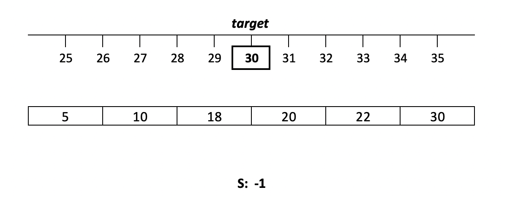
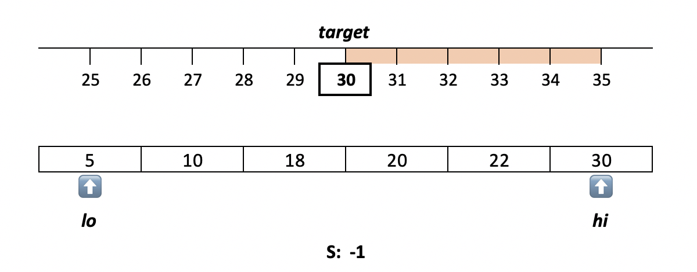
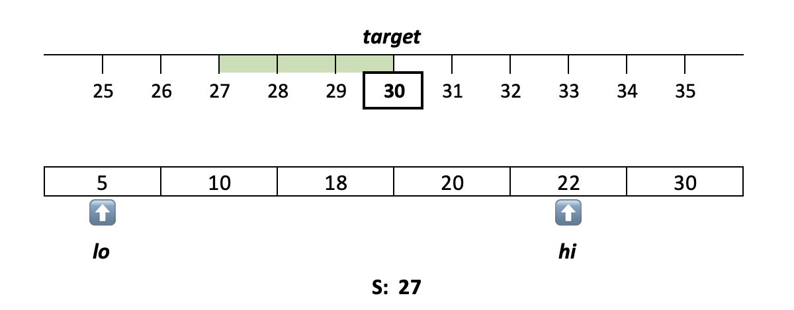
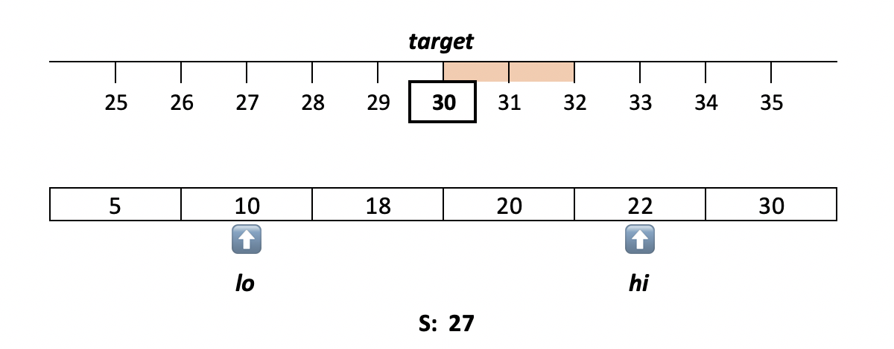
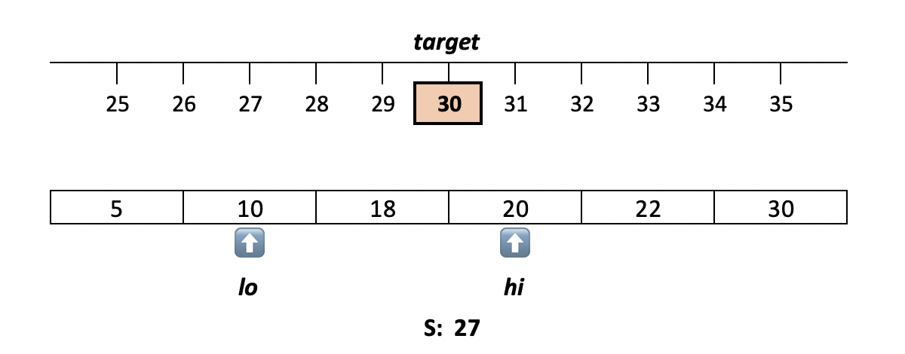
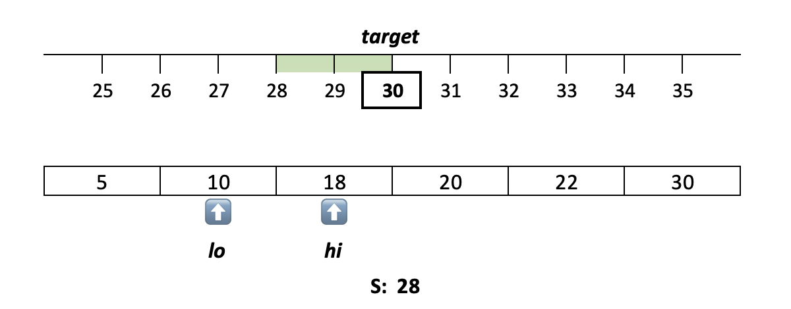

[TOC]

## Video Solution
---

<div>
    <div class="video-container">
        <iframe src="https://player.vimeo.com/video/476771045" width="640" height="360" frameborder="0" allow="autoplay; fullscreen" allowfullscreen></iframe>
    </div>
</div>

<div>
</div>

## Solution Article
---

This problem is a variation of [Two Sum](https://leetcode.com/articles/two-sum/). The main difference is that we are not searching for the exact target here. Instead, our sum is in some *relation* with the target. For this problem, we are looking for a maximum sum that is *smaller* than the target.

First, let's check solutions for the similar problems:

1. [Two Sum](https://leetcode.com/articles/two-sum/) uses a hashmap to find complement values, and therefore achieves $\mathcal{O}(N)$ time complexity.
2. [Two Sum II](https://leetcode.com/articles/two-sum-ii-input-array-is-sorted/) uses the two pointers pattern and also has $\mathcal{O}(N)$ time complexity for a sorted array. We can use this approach for any array if we sort it first, which bumps the time complexity to $\mathcal{O}(n\log{n})$.

Since our sum can be any value smaller than the target, we cannot use a hashmap. We do not know which value to look up! Instead, we need to sort the array and use a binary search or the two pointers pattern, like in [Two Sum II](https://leetcode.com/articles/two-sum-ii-input-array-is-sorted/). In a sorted array, it is easy to find elements that are close to a given value.

---

### Approach 1: Brute Force

It is important to understand the input constraints to choose the most appropriate approach. For this problem, the size of our array is limited to `100`. So, a brute force solution could be a reasonable option. It's simple and does not require any additional memory.

**Algorithm**

1. For each index `i` in `nums`:
- For each index `j > i` in `nums`:
- If $\text{nums}[i] + \text{nums}[j]$ is less than `k`:
- Track maximum $\text{nums}[i] + \text{nums}[j]$ in the result `answer`.

2. Return the result `answer`.

```python
class Solution:
    def twoSumLessThanK(self, nums: List[int], k: int) -> int:
        answer = -1
        for i in range(len(nums)):
            for j in range(i + 1, len(nums)):
                sum = nums[i] + nums[j]
                if sum < k:
                    answer = max(answer, sum)
        return answer
```

**Complexity Analysis**

- Time Complexity: $\mathcal{O}(n^2)$. We have 2 nested loops.

- Space Complexity: $\mathcal{O}(1)$.

---

### Approach 2: Two Pointers

We will follow the same two pointers approach as in [Two Sum II](https://leetcode.com/articles/two-sum-ii-input-array-is-sorted/). It requires the array to be sorted, so we'll do that first.

As a quick refresher, the pointers are initially set to the first and the last element respectively. We compare the sum of these two elements with the target. If it is smaller than the target, we increment the lower pointer `left`. Otherwise, we decrement the higher pointer `right`. Thus, the sum always moves toward the target, and we "prune" pairs that would move it further away. Again, this works only if the array is sorted. Head to the [Two Sum II](https://leetcode.com/articles/two-sum-ii-input-array-is-sorted/) solution for a detailed explanation.

Since the sum here must be smaller than the target, we don't stop when we find a pair that sums exactly to the target. We decrement the higher pointer and continue until our pointers collide. For each iteration, we track the maximum sum - if it's smaller than the target.













**Algorithm**

1. Sort the array.

2. Set the `left` pointer to zero, and `right` - to the last index.

3. While `left` is smaller than `right`:
- If $\text{nums}[left] + \text{nums}[right]$ is less than `k`:
- Track maximum $\text{nums}[left] + \text{nums}[right]$ in the result `answer`.
- Increment `left`.
- Else:
- Decrement `right`.

4. Return the result `answer`.

```python
class Solution:
    def twoSumLessThanK(self, nums: List[int], k: int) -> int:
        nums.sort()
        answer = -1
        left = 0
        right = len(nums) -1
        while left < right:
            sum = nums[left] + nums[right]
            if (sum < k):
                answer = max(answer, sum)
                left += 1
            else:
                right -= 1
        return answer
```

**Optimizations**

We can break from the loop as soon as $\text{nums}[left] > k / 2$. In the sorted array, $\text{nums}[left]$ is the smallest of the remaining elements, so $\text{nums}[right] > k / 2$ for any `right`. Therefore, $\text{nums}[left] + \text{nums}[right]$ will be equal to or greater than `k` for the remaining elements.

**Complexity Analysis**

- Time Complexity: $\mathcal{O}(n\log{n})$ to sort the array. The two pointers approach itself is $\mathcal{O}(n)$, so the time complexity would be linear if the input is sorted.

- Space Complexity: from $\mathcal{O}(\log{n})$ to $\mathcal{O}(n)$, depending on the implementation of the sorting algorithm.

---

### Approach 3: Binary Search

Instead of moving two pointers towards the target, we can iterate through each element $\text{nums}[i]$, and binary-search for a complement value $k - \text{nums}[i]$. This approach is less efficient than the two pointers one, however, it can be more intuitive to come up with. Same as above, we need to sort the array first for this to work.

Note that the binary search returns the "insertion point" for the searched value, i.e. the position where that value would be inserted to keep the array sorted. So, the binary search result points to the first element that is equal to or greater than the complement value. Since our sum must be smaller than `k`, we consider the element immediately *before* the found element.

**Algorithm**

1. Sort the array.

2. For each index `i` in `nums`:
- Binary search for $k - \text{nums}[i]$ starting from $i + 1$.
- Set `j` to the position before the found element.
- If `j` is less than `i`:
- Track maximum $\text{nums}[i] + \text{nums}[j]$ in the result `answer`.

3. Return the result `answer`.

> Note that the binary search function in Java works a bit differently. If there are multiple elements that match the search value, it does not guarantee to point to the first one. That's why in the Java solution below we search for $k - \text{nums}[i] - 1$. Note that we decrement the pointer only if the value we found is greater than $k - \text{nums}[i] - 1$.

```python
class Solution:
    def twoSumLessThanK(self, nums: List[int], k: int) -> int:
        answer = -1
        nums.sort()
        for i in range(len(nums)):
            j = bisect_left(nums, k - nums[i], i + 1) - 1
            if j > i:
                answer = max(answer, nums[i] + nums[j])
        return answer
```

**Complexity Analysis**

- Time Complexity: $\mathcal{O}(n\log{n})$ to sort the array and do the binary search for each element.

- Space Complexity: from $\mathcal{O}(\log{n})$ to $\mathcal{O}(n)$, depending on the implementation of the sorting algorithm.

---

### Approach 4: Counting Sort

We can leverage the fact that the input number range is limited to `[1..1000]` and use a counting sort. Then, we can use the two pointers pattern to enumerate pairs in the `[1..1000]` range.

> Note that the result can be a sum of two identical numbers, and that means that `lo` can be equal to `hi`. In this case, we need to check if the count for that number is greater than one.

**Algorithm**

1. Count each element using the array `count`.

2. Set the `lo` number to zero, and `hi` - to 1000.

3. While `lo` is smaller than, or **equals** `hi`:
- If $lo + hi$ is greater than `k`, or $\text{count}[hi] = 0$:
- Decrement `hi`.
- Else:
- If $\text{count}[lo]$ is greater than `0` (when `lo < hi`), or `1` (when $lo = hi$):
- Track maximum $lo + hi$ in the result `answer`.
- Increment `lo`.

4. Return the result `answer`.

```python
class Solution:
    def twoSumLessThanK(self, nums: List[int], k: int) -> int:
        answer = -1
        count = [0] * 1001
        for num in nums:
            count[num] += 1
        lo = 1
        hi = 1000
        while lo <= hi:
            if lo + hi >= k or count[hi] == 0:
                hi -= 1
            else:
                if count[lo] > (0 if lo < hi else 1):
                    answer = max(answer, lo + hi)
                lo += 1
        return answer
```

**Optimizations**

1. We can set `hi` to either the maximum number, or $k - 1$, whichever is smaller.
2. We can ignore numbers greater than $k - 1$.
3. We can use a boolean array (e.g. `seen`) instead of `count`. In the first loop, we will check if `i` is a duplicate ($\text{seen}[i]$ is already true) and set `answer` to the highest $i + i < k$. Note that the two pointers loop will run while `lo < hi`, not while $lo \le hi$.
4. We can break from the two pointers loop as soon as $\text{nums}[lo] > k / 2$.

**Complexity Analysis**

- Time Complexity: $\mathcal{O}(n + m)$, where $m$ corresponds to the range of values in the input array.

- Space Complexity: $\mathcal{O}(m)$ to count each value.

---

### Further Thoughts

Always clarify the problem constraints and inputs during an interview. This would help you choose the right approach.

The Two Pointers approach is a good choice when the number of elements is large, and the range of possible values is not constrained. Also, if the input array is already sorted, this approach provides a linear time complexity and does not require additional memory.