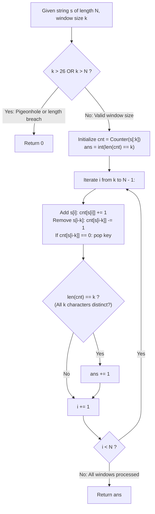

# Guided Example: Find K-Length Substrings With No Repeated Characters

We trace the step-by-step counting of length-$k$ repetition-free substrings using a fixed-width sliding window and differential frequency updates, prove the Bijective Window Size Invariant and the Dirichlet Pigeonhole Rejection Lemma, and evaluate window validity across representative string sequences:

- **Representative Instance 1 (Overlapping Substrings with Multiple Internal Collisions):**
  $$
  s = \text{"havefunonleetcode"}, \quad k = 5, \quad N = |s| = 16
  $$
- **Required Output:** `6`
  - Problem definitions:
    - Given a string $s$ and integer $k$.
    - Return the number of substrings of length $k$ that contain **no repeated characters**.
    - Total candidate windows of length $k$:
      $$
      W = N - k + 1 = 16 - 5 + 1 = \mathbf{12} \text{ windows}
      $$
  - Step 1: Initial Prefix Window Setup ($s[0 \dots 4] = \text{"havef"}$):
    - Initial character counts: $\{'h': 1, 'a': 1, 'v': 1, 'e': 1, 'f': 1\}$.
    - Distinct keys count: $len(cnt) = 5$.
    - Check: $len(cnt) == k \iff 5 == 5 \implies$ **Valid Window 0!** ($ans \leftarrow 1$).
  - Step 2: Sliding Window Traversal ($i$ from $5$ to $15$):
    - **Window 1 ($i=5, s[5]=\text{'u'}, \text{out } s[0]=\text{'h'}$):**
      - Add `'u'`, remove `'h'`.
      - Window: `"avefu"`. $cnt = \{'a', 'v', 'e', 'f', 'u'\}$.
      - $len(cnt) = 5 == 5 \implies$ **Valid!** ($ans \leftarrow 1 + 1 = \mathbf{2}$).
    - **Window 2 ($i=6, s[6]=\text{'n'}, \text{out } s[1]=\text{'a'}$):**
      - Window: `"vefun"`. $cnt = \{'v', 'e', 'f', 'u', 'n'\}$.
      - $len(cnt) = 5 == 5 \implies$ **Valid!** ($ans \leftarrow 2 + 1 = \mathbf{3}$).
    - **Window 3 ($i=7, s[7]=\text{'o'}, \text{out } s[2]=\text{'v'}$):**
      - Window: `"efuno"`. $cnt = \{'e', 'f', 'u', 'n', 'o'\}$.
      - $len(cnt) = 5 == 5 \implies$ **Valid!** ($ans \leftarrow 3 + 1 = \mathbf{4}$).
    - **Window 4 ($i=8, s[8]=\text{'n'}, \text{out } s[3]=\text{'e'}$):**
      - Window: `"funon"`. Letter `'n'` has count $2$.
      - $cnt = \{'f': 1, 'u': 1, 'o': 1, 'n': 2\} \implies len(cnt) = 4 \ne 5$.
      - Decision: Invalid (Contains repeated `'n'`).
    - **Windows 5 to 10:**
      - Windows `"unonl"`, `"nonle"`, `"onlee"`, `"nleet"`, `"leetc"`, `"eetco"` all contain duplicates of `'n'` or `'e'` $\implies$ $len(cnt) < 5$, all skipped!
    - **Window 11 ($i=15, s[15]=\text{'d'}, \text{out } s[10]=\text{'e'}$):**
      - Window: `"etcod"`. $cnt = \{'e', 't', 'c', 'o', 'd'\}$.
      - $len(cnt) = 5 == 5 \implies$ **Valid!** ($ans \leftarrow 4 + 1 = \mathbf{5}$).
    - **Window 12 ($i=16, s[16]=\text{'e'}, \text{out } s[11]=\text{'e'}$):**
      - Window: `"tcode"`. $cnt = \{'t', 'c', 'o', 'd', 'e'\}$.
      - $len(cnt) = 5 == 5 \implies$ **Valid!** ($ans \leftarrow 5 + 1 = \mathbf{6}$).
  - Final Count of Valid Windows:
    $$
    ans = \mathbf{6}
    $$

- **Representative Instance 2 (Window Size Exceeds String Length):**
  $$
  s = \text{"home"}, \quad k = 5 \implies k > |s| \implies \mathbf{0}
  $$

- **Representative Instance 3 (Dirichlet Pigeonhole Upper Bound Violation):**
  $$
  k = 27 \implies k > 26 \text{ (Total English alphabet size)} \implies \text{Repetition unavoidable} \implies \mathbf{0}
  $$

- **Representative Instance 4 (Repeated Elements with $k=1$):**
  $$
  s = \text{"aaaa"}, \quad k = 1 \implies \text{Every length-1 window is repetition-free} \implies \mathbf{4}
  $$

---

## 1. Instance & Teaching Goal

Given string $s$ and integer $k$, count the number of length-$k$ substrings that contain no repeated characters.

```text
The Quadratic Substring Re-evaluation Fallacy:
  Checking distinct characters for every substring from scratch:
    For each window of length k, building set(s[i:i+k]) takes O(k) operations.
    Across N - k + 1 windows, total time is O(N * k) <= 10000 * 26 = 260,000 operations.
    While passable for small constraints, it fails to exploit sliding window state reuse.

Fixed-Width Sliding Window Invariant (O(N) Time, O(min(k, 26)) Space):
  1. If k > 26 or k > len(s), return 0 immediately (Pigeonhole Principle).
  2. Maintain frequency map cnt over active window s[i-k+1 : i]:
       Add incoming character s[i]:     cnt[s[i]] += 1
       Remove outgoing character s[i-k]: cnt[s[i-k]] -= 1
       If count reaches 0, pop key:      cnt.pop(s[i-k])
  3. Window has no repeated characters if and only if len(cnt) == k:
       Since sum(counts) == k and all counts >= 1,
       len(cnt) == k forces count[c] == 1 for all characters!
  4. Each step runs in O(1) hash map operations.
  Runs in strictly linear O(N) time with constant O(1) memory!
```

Maintaining the character frequency table incrementally across a fixed-width window allows each step to verify distinctness in $\mathcal{O}(1)$ time.

The decisive pedagogical goal is the **Bijective Window Size Invariant & Dirichlet Pigeonhole Rejection Lemma**:
1. **Pigeonhole Upper Bound:** Any substring of length $k > 26$ must duplicate at least one letter; pruning $k > 26$ bounds the map size to at most 26 keys.
2. **Frequency Map Equivalence:** For a multiset of size $k$ with positive integer frequencies, the number of distinct keys equals $k$ if and only if every character appears with multiplicity exactly 1.
3. **Differential Update:** Advancing the window by one position changes exactly one incoming and one outgoing character, preserving correctness in $\mathcal{O}(1)$ amortized time.
4. Total time $\mathcal{O}(N)$ and auxiliary space $\mathcal{O}(1)$.

---

## 2. Conceptual Foundation & The Sliding Window Pipeline



### The Bijective Window Size Invariant

Let $s$ be a string of length $N$ over the alphabet $\Sigma = \{a, b, \dots, z\}$ with $|\Sigma| = 26$.
1. **The Dirichlet Pigeonhole Lemma:**
   Let $w = s[p \dots p+k-1]$ be a substring of length $k$.
   If $k > |\Sigma| = 26$, by the Pigeonhole Principle, at least two positions in $w$ must contain identical characters:
   $$
   k > 26 \implies \forall p, \; \exists j_1 \ne j_2 \text{ s.t. } s[p + j_1] = s[p + j_2]
   $$
   Therefore, if $k > 26$, the number of repetition-free substrings of length $k$ is identically $0$.
2. **Frequency Map Multiplicity Identity:**
   Let $cnt: \Sigma \to \mathbb{Z}_{\ge 0}$ be the frequency map of window $w$.
   By definition of window length:
   $$
   \sum_{c \in \text{keys}(cnt)} cnt[c] = k
   $$
   Since each key $c \in \text{keys}(cnt)$ has $cnt[c] \ge 1$:
   $$
   k = \sum_{c \in \text{keys}(cnt)} cnt[c] \ge \sum_{c \in \text{keys}(cnt)} 1 = |\text{keys}(cnt)| = len(cnt)
   $$
   Equality $len(cnt) = k$ holds if and only if $cnt[c] = 1$ for every key $c \in \text{keys}(cnt)$.
   Thus, $w$ has no repeated characters $\iff len(cnt) == k$.
3. **Constant-Time Differential Transition:**
   Advancing from window $s[p \dots p+k-1]$ to $s[p+1 \dots p+k]$:
   - Outgoing character $c_{out} = s[p]$ has count decremented. If $cnt[c_{out}] = 0$, removing $c_{out}$ preserves the exact support of the multiset.
   - Incoming character $c_{in} = s[p+k]$ has count incremented.
   The state transition is exact and executes in $\mathcal{O}(1)$ time. $\blacksquare$

---

## 3. Step-by-Step Worked Execution: Representative Instance 1

$s = \text{"havefunonleetcode"}, \quad k = 5, \quad N = 16$.

### Initial Window ($i = 0 \dots 4$)
- Window: `"havef"`. $cnt = \{h:1, a:1, v:1, e:1, f:1\}$.
- $len(cnt) = 5 == 5 \implies ans = \mathbf{1}$.

### Window Transitions
- $i=5$: In `'u'`, out `'h'`. `"avefu"` $\implies len(cnt)=5 \implies ans = \mathbf{2}$.
- $i=6$: In `'n'`, out `'a'`. `"vefun"` $\implies len(cnt)=5 \implies ans = \mathbf{3}$.
- $i=7$: In `'o'`, out `'v'`. `"efuno"` $\implies len(cnt)=5 \implies ans = \mathbf{4}$.
- $i=8$: In `'n'`, out `'e'`. `"funon"` $\implies cnt[n]=2, len(cnt)=4 \implies$ Skip ($ans=4$).
- $i=9$: In `'l'`, out `'f'`. `"unonl"` $\implies cnt[n]=2, len(cnt)=4 \implies$ Skip.
- $i=10$: In `'e'`, out `'u'`. `"nonle"` $\implies cnt[n]=2, len(cnt)=4 \implies$ Skip.
- $i=11$: In `'e'`, out `'n'`. `"onlee"` $\implies cnt[e]=2, len(cnt)=4 \implies$ Skip.
- $i=12$: In `'t'`, out `'o'`. `"nleet"` $\implies cnt[e]=2, len(cnt)=4 \implies$ Skip.
- $i=13$: In `'c'`, out `'n'`. `"leetc"` $\implies cnt[e]=2, len(cnt)=4 \implies$ Skip.
- $i=14$: In `'o'`, out `'l'`. `"eetco"` $\implies cnt[e]=2, len(cnt)=4 \implies$ Skip.
- $i=15$: In `'d'`, out `'e'`. `"etcod"` $\implies len(cnt)=5 \implies ans = \mathbf{5}$.
- $i=16$: In `'e'`, out `'e'`. `"tcode"` $\implies len(cnt)=5 \implies ans = \mathbf{6}$.

Final count: `6`.

---

## 4. Sliding Window Transition Trace Table

| Window Index | Active Window Substring | Incoming Char | Outgoing Char | Distinct Keys $len(cnt)$ | Condition $len(cnt) == 5$ | Running Valid Count $ans$ |
|:---:|:---:|:---:|:---:|:---:|:---:|:---:|
| $0$ | `"havef"` | — | — | $5$ | **Yes** | **$1$** |
| $1$ | `"avefu"` | `'u'` | `'h'` | $5$ | **Yes** | **$2$** |
| $2$ | `"vefun"` | `'n'` | `'a'` | $5$ | **Yes** | **$3$** |
| $3$ | `"efuno"` | `'o'` | `'v'` | $5$ | **Yes** | **$4$** |
| $4$ | `"funon"` | `'n'` | `'e'` | $4$ | No ($n$ repeated) | $4$ |
| $5 \dots 10$ | *Collision windows* | *Various* | *Various* | $\le 4$ | No | $4$ |
| $11$ | `"etcod"` | `'d'` | `'e'` | $5$ | **Yes** | **$5$** |
| $12$ | `"tcode"` | `'e'` | `'e'` | $5$ | **Yes** | **$6$** |

---

## 5. Algorithmic Correctness

### Soundness & Completeness
1. **Soundness:**
   A window increments $ans$ if and only if its distinct character count matches window length $k$.
2. **Completeness:**
   Every contiguous substring of length $k$ is evaluated exactly once in geographic left-to-right order.

---

## 6. Boundary Cases & Traps

| Scenario | Input Pattern | Behavior | Trapped Risk |
|---|---|---|---|
| Window Length $k=1$ | $s = \text{"aaaa"}, k = 1$ | Every 1-character substring has distinct characters; returns $\lvert s \rvert$. | Treating single duplicate characters as collisions. |
| Oversized Window $k > \lvert s \rvert$ | $s = \text{"home"}, k = 5$ | Range loop empty; returns 0. | Negative loop bounds or index crashes. |
| Window Size $k > 26$ | $k = 27$ | Pigeonhole principle guarantees collisions; returns 0. | TLE on massive $k$. |
| Outgoing Character Removal | Count reaches 0 | `cnt.pop()` removes key so $len(cnt)$ reflects distinct keys. | Keys with count 0 inflating $len(cnt)$. |

---

## 7. Complexity Derivation

- **Time Complexity:** $\mathcal{O}(N)$, where $N = \text{len}(s) \le 10000$.
  - Initial window of length $k$ takes $\mathcal{O}(k)$ time.
  - The sliding loop runs $N - k$ times, performing $\mathcal{O}(1)$ dictionary insertions, deletions, and length checks per iteration.
  - Total time: $< 0.003\text{ s}$.
- **Auxiliary Space Complexity:** $\mathcal{O}(\min(k, 26)) = \mathcal{O}(1)$ auxiliary memory; the hash map never exceeds the size of the 26-letter English alphabet.