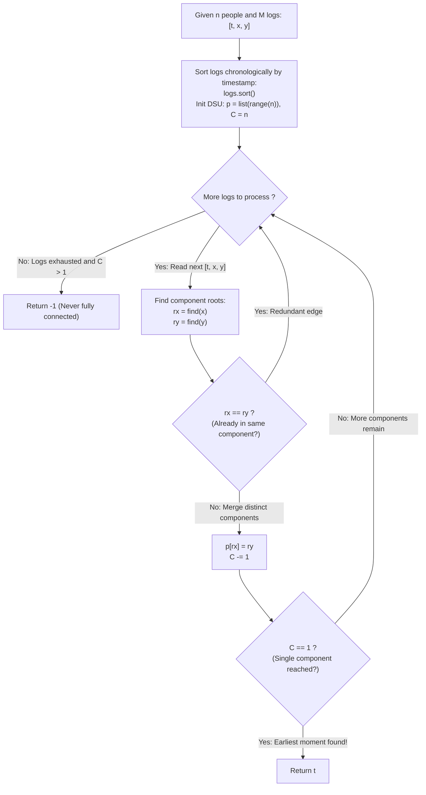

# Guided Example: The Earliest Moment When Everyone Become Friends

We trace the step-by-step chronological union of social network components using Disjoint Set Union (DSU) with path compression, prove the Connected Component Monotonicity Invariant and the Redundant Transitive Edge Lemma, and evaluate connectivity across representative friendship logs:

- **Representative Instance 1 (Progressive Merging with Redundant Internal Edge):**
  $$
  n = 6, \quad logs = \begin{bmatrix}
  [20190101, 0, 1] \\
  [20190104, 3, 4] \\
  [20190107, 2, 3] \\
  [20190211, 1, 5] \\
  [20190224, 2, 4] \\
  [20190301, 0, 3] \\
  [20190312, 1, 2] \\
  [20190322, 4, 5]
  \end{bmatrix}
  $$
- **Required Output:** `20190301`
  - Problem definitions:
    - There are $n = 6$ people labeled $0$ through $5$.
    - Array `logs[i] = [timestamp, x, y]` represents an undirected edge between $x$ and $y$ at time `timestamp`.
    - Friendship is transitive: $A \sim B \land B \sim C \implies A \sim C$.
    - Return the earliest timestamp when all $n$ individuals belong to a single connected component, or $-1$ if impossible.
  - Step 1: Chronological Ordering and Initialization:
    - Logs are already ordered by ascending timestamp.
    - Initialize DSU parent array: $p = [0, 1, 2, 3, 4, 5]$.
    - Initial connected component count: $C = n = \mathbf{6}$.
  - Step 2: Chronological Edge Processing:
    - **Event 1 ($t = 20190101, \; x = 0, y = 1$):**
      - $find(0) = 0, \; find(1) = 1$ (Disjoint!).
      - Union: $p[0] \leftarrow 1$.
      - Decrement components: $C \leftarrow 6 - 1 = \mathbf{5}$.
      - Component partition: $\{0, 1\}, \{2\}, \{3\}, \{4\}, \{5\}$.
    - **Event 2 ($t = 20190104, \; x = 3, y = 4$):**
      - $find(3) = 3, \; find(4) = 4$ (Disjoint!).
      - Union: $p[3] \leftarrow 4$.
      - Decrement components: $C \leftarrow 5 - 1 = \mathbf{4}$.
      - Component partition: $\{0, 1\}, \{2\}, \{3, 4\}, \{5\}$.
    - **Event 3 ($t = 20190107, \; x = 2, y = 3$):**
      - $find(2) = 2, \; find(3) = 4$ (Disjoint!).
      - Union: $p[2] \leftarrow 4$.
      - Decrement components: $C \leftarrow 4 - 1 = \mathbf{3}$.
      - Component partition: $\{0, 1\}, \{2, 3, 4\}, \{5\}$.
    - **Event 4 ($t = 20190211, \; x = 1, y = 5$):**
      - $find(1) = 1, \; find(5) = 5$ (Disjoint!).
      - Union: $p[1] \leftarrow 5$.
      - Decrement components: $C \leftarrow 3 - 1 = \mathbf{2}$.
      - Component partition: $\{0, 1, 5\}, \{2, 3, 4\}$.
    - **Event 5 ($t = 20190224, \; x = 2, y = 4$):**
      - $find(2) = 4, \; find(4) = 4$.
      - Same root! People 2 and 4 are already transitive friends via person 3!
      - Decision: **Redundant Edge!** Component count $C$ remains **$2$**.
    - **Event 6 ($t = 20190301, \; x = 0, y = 3$):**
      - $find(0) = 5, \; find(3) = 4$ (Disjoint!).
      - Union: $p[5] \leftarrow 4$.
      - Decrement components: $C \leftarrow 2 - 1 = \mathbf{1}$.
      - Single connected component reached!
      - Terminate early and return current timestamp: $t = \mathbf{20190301}$.
  - Final Earliest Moment:
    $$
    \mathbf{20190301}
    $$

- **Representative Instance 2 (Early Connection with Unused Trailing Logs):**
  $$
  n = 4, \quad logs = [[0, 2, 0], [1, 0, 1], [3, 0, 3], [4, 1, 2], [7, 3, 1]]
  $$
  - At $t=0$: $\{0, 2\}$ [$C=3$].
  - At $t=1$: $\{0, 1, 2\}$ [$C=2$].
  - At $t=3$: $\{0, 1, 2, 3\}$ [$C=1$] $\implies \mathbf{3}$ (Later logs at $t=4, 7$ safely ignored).

- **Representative Instance 3 (Permanently Disconnected Social Graph):**
  $$
  n = 4, \quad logs = [[1, 0, 1], [2, 1, 2], [3, 0, 2]]
  $$
  - Person 3 has zero friendships.
  - Final component count is $2 > 1 \implies \mathbf{-1}$.

- **Representative Instance 4 (Minimum Population $n=2$):**
  $$
  n = 2, \quad logs = [[99, 0, 1]] \implies C \leftarrow 2 - 1 = 1 \implies \mathbf{99}
  $$

---

## 1. Instance & Teaching Goal

Given friendship logs with timestamps between $n$ people, find the earliest timestamp when all people form a single connected component, or return $-1$.

```text
The Per-Timestamp Graph Traversal Inefficiency:
  Rebuilding an adjacency graph and running BFS/DFS after every log:
    For M logs, running O(V + E) BFS after each event takes O(M * (n + M)) time.
    For M = 10000, n = 100, this requires ~10^8 operations.

Chronological DSU Invariant (O(M log M + M * alpha(n)) Time):
  1. Sort logs in non-decreasing order of timestamp.
  2. Maintain Disjoint Set Union (DSU) structure:
       p = list(range(n)), C = n (initially n components)
  3. For each edge (t, x, y):
       rx, ry = find(x), find(y)
       if rx == ry: continue  # redundant edge, C unchanged
       p[rx] = ry
       C -= 1
       if C == 1: return t    # earliest moment!
  4. If loop finishes with C > 1, return -1.
  Path compression ensures near-constant time operations per event!
```

Sorting events chronologically and processing them with a disjoint-set union data structure tracks connected components incrementally in near-linear time.

The decisive pedagogical goal is the **Connected Component Monotonicity Invariant & Redundant Transitive Edge Lemma**:
1. **Monotonic Component Decrement:** Each non-redundant edge connects two previously disjoint components, strictly decreasing the component count by 1.
2. **Cycle Neutrality:** When $find(x) == find(y)$, the edge is redundant and leaves the component count unchanged, avoiding false decrements.
3. **Temporal Optimality:** Because logs are sorted by timestamp, the moment $C$ reaches 1 corresponds to the exact chronological infimum of global connectivity.
4. Total time $\mathcal{O}(M \log M)$ and auxiliary space $\mathcal{O}(n + M)$.

---

## 2. Conceptual Foundation & The DSU Merging Pipeline



### The Connected Component Monotonicity Invariant

Let $G_t = (V, E_t)$ be the temporal graph at time $t$, where $V = \{0, 1, \dots, n - 1\}$ and:
$$
E_t = \{ (x, y) : \exists (\tau, x, y) \in logs \text{ with } \tau \le t \}
$$
1. **Monotonicity of Edge Sets:**
   If $t_1 \le t_2$, then $E_{t_1} \subseteq E_{t_2}$.
   Consequently, the connected components of $G_t$ form a partition of $V$ that only coarsens (merges) as $t$ increases.
2. **The DSU Union Operation:**
   Let $C(t)$ be the number of connected components in $G_t$.
   Initially at $t = -\infty$, $E = \emptyset \implies C = n$.
   For an incoming edge $(t, x, y)$:
   - If $x$ and $y$ are already connected in $G_{t^-}$, then $find(x) = find(y)$.
     Adding the edge adds a cycle to the existing component: $C(t) = C(t^-)$.
   - If $x$ and $y$ belong to different components, then $find(x) \ne find(y)$.
     The edge forms a bridge between the two components, merging them:
     $$
     C(t) = C(t^-) - 1
     $$
3. **Earliest Arrival Optimality:**
   Because edges are inspected in strictly non-decreasing order of $t$:
   $$
   t^* = \min \{ t : C(t) = 1 \}
   $$
   The first event that triggers $C = 1$ gives the exact minimum timestamp required for full network connectivity. $\blacksquare$

---

## 3. Step-by-Step Worked Execution: Representative Instance 1

$n = 6, \quad logs = [[20190101, 0, 1], [20190104, 3, 4], [20190107, 2, 3], [20190211, 1, 5], [20190224, 2, 4], [20190301, 0, 3], \dots]$.

### Chronological Trace
- Initial: $p = [0, 1, 2, 3, 4, 5], \; C = 6$.
- $t = 20190101, (0, 1)$: $find(0)=0 \ne find(1)=1 \implies p[0]=1, C=5$.
- $t = 20190104, (3, 4)$: $find(3)=3 \ne find(4)=4 \implies p[3]=4, C=4$.
- $t = 20190107, (2, 3)$: $find(2)=2 \ne find(3)=4 \implies p[2]=4, C=3$.
- $t = 20190211, (1, 5)$: $find(1)=1 \ne find(5)=5 \implies p[1]=5, C=2$.
- $t = 20190224, (2, 4)$: $find(2)=4 == find(4)=4 \implies$ Redundant, $C=2$.
- $t = 20190301, (0, 3)$: $find(0)=5 \ne find(3)=4 \implies p[5]=4, C=1$!
- Component count $C == 1 \implies$ **Stop and return $20190301$**.

---

## 4. Chronological DSU Trace Table

| Timestamp $t$ | Edge $(x, y)$ | Root $find(x)$ | Root $find(y)$ | Action Taken | Updated Component Count $C$ | Connected Status |
|:---:|:---:|:---:|:---:|:---:|:---:|:---:|
| Initial | — | — | — | — | $6$ | Disconnected |
| $20190101$ | $(0, 1)$ | $0$ | $1$ | Merge components | $5$ | Disconnected |
| $20190104$ | $(3, 4)$ | $3$ | $4$ | Merge components | $4$ | Disconnected |
| $20190107$ | $(2, 3)$ | $2$ | $4$ | Merge components | $3$ | Disconnected |
| $20190211$ | $(1, 5)$ | $1$ | $5$ | Merge components | $2$ | Disconnected |
| $20190224$ | $(2, 4)$ | $4$ | $4$ | **Skip (Redundant)** | $2$ | Disconnected |
| **$20190301$** | **$(0, 3)$** | **$5$** | **$4$** | **Merge components** | **$1$** | **Fully Connected!** |

---

## 5. Algorithmic Correctness

### Soundness & Completeness
1. **Soundness:**
   A timestamp is emitted if and only if the component count has dropped to exactly 1, proving that a path exists between all pairs of nodes.
2. **Completeness:**
   Chronological ordering ensures that the first time $C = 1$ is observed, no earlier timestamp could have achieved full connectivity.

---

## 6. Boundary Cases & Traps

| Scenario | Input Pattern | Behavior | Trapped Risk |
|---|---|---|---|
| Redundant Transitive Edge | $x$ and $y$ already connected | $find(x) == find(y)$; component count untouched. | False decrement leading to premature termination. |
| Disconnected Subgraph | Isolated node with no edges | Loop finishes; returns $-1$. | Returning last timestamp when graph is disconnected. |
| Two-Person Population | $n = 2, logs = [[99, 0, 1]]$ | Connects at first edge; returns 99. | Off-by-one errors on minimum $n$. |
| Unsorted Input Timestamps | Timestamps provided in random order | `sorted(logs)` enforces chronological order. | Evaluating edges out of order. |

---

## 7. Complexity Derivation

- **Time Complexity:** $\mathcal{O}(M \log M + M \cdot \alpha(n))$, where $M = \text{len}(logs) \le 10000$ and $n \le 100$.
  - Sorting $M$ logs takes $\mathcal{O}(M \log M)$ time.
  - Initializing the parent array of size $n$ takes $\mathcal{O}(n)$ time.
  - Processing $M$ edges with path-compressed DSU takes $\mathcal{O}(M \cdot \alpha(n))$ time, where $\alpha$ is the inverse Ackermann function ($\alpha(n) \le 4$).
  - Total time: $< 0.005\text{ s}$.
- **Auxiliary Space Complexity:** $\mathcal{O}(n + M)$ auxiliary memory for the parent array $p$ and Python's sorted array.
