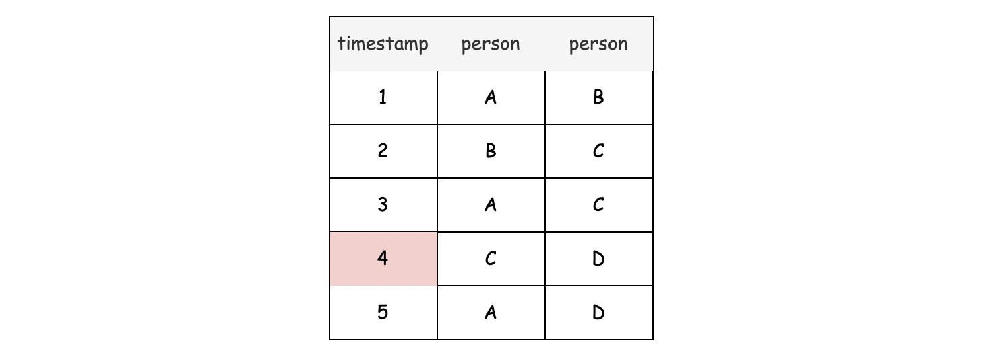

[TOC]

## Solution

---
### Approach: Union-Find (Disjoint-Set)

**Intuition**

This problem deals with the relationship or membership of entities.
For those of you who are familiar with a data structure called **_Union-Find_**, this problem might ring a bell.
In fact, it is a perfect example that demonstrates the advantages of **_Union-Find_** data structure (also known as [Disjoint-Set](https://en.wikipedia.org/wiki/Disjoint-set_data_structure)).

>Union-Find (_a.k.a_ Disjoint-Set) is a data structure that keeps track of the **_connectivities_** among interconnected individuals **_efficiently_**. With Union-Find, one can quickly determine which group a specific individual belongs to. In addition, one can quickly merge two individuals together along with the two groups that they belong to.

As suggested by its name, a typical Union-Find data structure usually provides two interfaces as follows:
- `find(a)`: this function returns the group that the individual `a` belongs to.

- `union(a, b)`: this function merges the two groups that the individuals `a` and `b` belong to respectively, if the groups are not of the same group already.

To make the `union(a, b)` function more useful, one can return a boolean value in the function to indicate whether the merging actually happens or not.
For example, `union(a, b)` would return true when `a` and `b` (and their respective groups) are merged together, and false when `a` and `b` are already in the same group and thus do not need to be merged together.

Now, imagine that we already have the above Union-Find data structure available, we can go over the problem again and try to come up with a solution using the data structure.

**Algorithm**

The solution, which as shown below, can be implemented in only a few lines, is actually less difficult than the implementation of the Union-Find data structure.

```python
class Solution:
    def earliestAcq(self, logs: List[List[int]], n: int) -> int:
        # In order to ensure that we find the _earliest_ moment,
        #  first of all we need to sort the events in chronological order.
        logs.sort(key = lambda x: x[0])

        uf = UnionFind(n)
        # Initially, we treat each individual as a separate group.
        group_cnt = n

        # We merge the groups along the way.
        for timestamp, friend_a, friend_b in logs:
            if uf.union(friend_a, friend_b):
                group_cnt -= 1

            # The moment when all individuals are connected to each other.
            if group_cnt == 1:
                return timestamp

        # There are still more than one groups left,
        #  i.e. not everyone is connected.
        return -1
```

**_Yes, talk is cheap._** But still, here are a few more words to help you better understand the above code.

- In order to discover the _earliest_ moment, we must first ensure that we read through the logs in chronological order.
Since there is no mentioning whether the logs are ordered or not in the problem description, we need to **sort** them first.

- Once the logs are _sorted_ by time, we then iterate through them, while applying the Union-Find data structure.

- For each log, we connect the two individuals that were involved in the log, by applying the `union(a, b)` function.
- Each log adds more connections among the individuals.
    A connection is *useful* if the two individuals are separated (disjoint), or *redundant* if the two individuals are connected already via other individuals.
- Initially, we treat each individual as a separate group. The number of groups decreases along with the _useful_ merging operations.
    The moment when the number of groups is reduced to one is the _earliest_ moment when everyone becomes connected (friends).

**Implementation**

In the above solutions, we assume that the Union-Find data structure has been implemented.
In this section, we provide a complete solution with an **_optimized_** implementation of the Union-Find data structure.
By _optimized_, we apply the **path compression** optimization in the `find(a)` interface and **union by rank** in the `union(a, b)` interface.
For those of you who are not familiar with the data structure, we have an [Explore Card](https://leetcode.com/explore/featured/card/graph/618/disjoint-set/) that dives into more details, including the optimization techniques mentioned here.

```python
class Solution:
    def earliestAcq(self, logs: List[List[int]], n: int) -> int:
        # First, we need to sort the events in chronological order.
        logs.sort(key = lambda x: x[0])

        uf = UnionFind(n)
        # Initially, we treat each individual as a separate group.
        group_cnt = n

        # We merge the groups along the way.
        for timestamp, friend_a, friend_b in logs:
            if uf.union(friend_a, friend_b):
                group_cnt -= 1

            # The moment when all individuals are connected to each other.
            if group_cnt == 1:
                return timestamp

        # There are still more than one groups left,
        #  i.e. not everyone is connected.
        return -1

class UnionFind:

    def __init__(self, size):
        self.group = [group_id for group_id in range(size)]
        self.rank = [0] * size

    def find(self, person):
        if self.group[person] != person:
            self.group[person] = self.find(self.group[person])
        return self.group[person]

    def union(self, a, b):
        """
            return: true if a and b are not connected before
                otherwise, connect a with b and then return false
        """
        group_a = self.find(a)
        group_b = self.find(b)
        is_merged = False
        if group_a == group_b:
            return is_merged

        is_merged = True
        # Merge the lower-rank group into the higher-rank group.
        if self.rank[group_a] > self.rank[group_b]:
            self.group[group_b] = group_a
        elif self.rank[group_a] < self.rank[group_b]:
            self.group[group_a] = group_b
        else:
            self.group[group_a] = group_b
            self.rank[group_b] += 1

        return is_merged
```

To see better how the Union-Find algorithm works, here we showcase an example on how Union-Find algorithms _find_ and _merge_ groups together.

In the following table, we show a list of logs in chronological order where each entry indicates the moment when two people become friends.



To visualize the final relationships, we draw the following graph, where each node represents an individual and the link between nodes represents the friendship relationship between two individuals.
In addition, the label on top of the link indicates the moment when two individuals become friends.


As one can see, at the timestamp `4`, eventually everyone gets to know each other.
Note that, the connections of `3` and `5` do not contribute to the overall connections among the friends.
They are _redundant_ connections, as we discussed before.
To highlight them, we mark the connections with a dashed line.

Now, given the above example, we show _step by step_ how our Union-Find algorithm works.

- Initially, we have four groups, where each individual is a group itself. We use a directed link to point to the group that an individual belongs to. We show them in the following graph.


- Starting from the first event `(1, A, B)`, we merge the groups of `A` and `B` together with the `union(A, B)` function. By merging, we assign the group of either `A` or `B` to the other one.
As a result, the merged group `(A, B)` contains two elements.
The total number of groups is now reduced to three.


- With the event `(2, B, C)`, we then merge the group of `(A, B)` with the group of `(C)` together.
To optimize the merging operations, we merge a smaller group (_i.e._ the one with smaller _rank_ value) into a larger group.
Therefore, we merge the group of `(C)` into the group of `(A, B)`.
The total number of groups is now reduced to two.
**Note:** The keen observer will notice that `C` should actually point to `A` because of the effects of union by rank, but the main point here is that `C` has now joined the group with `A` and `B`. For simplicity, we will point `C` to `B`.


- With the event `(3, A, C)`, as it turns out, the individuals `A` and `C` already belong to the same group.
Therefore, no merging operation is needed.
The landscape of groups remains the same.


- Finally with the event `(4, C, D)`, we merge the group of `(D)` into the group of `(A, B, C)`.
The total number of groups is reduced to one.
And this is the **_earliest_** moment when everyone becomes friends.


**Complexity Analysis**

Since we applied the Union-Find data structure in our algorithm, we would like to start with a statement on the time complexity of the data structure, as follows:

>**Statement**: If $M$ operations, either Union or Find, are applied to $N$ elements, the total run time is $O(M \cdot \alpha(N))$, where $\alpha (N)$ is the [Inverse Ackermann Function](https://en.wikipedia.org/wiki/Ackermann_function#Inverse).

One can refer to this article on [Union-Find complexity](http://www.cs.cornell.edu/courses/cs6110/2014sp/Handouts/UnionFind.pdf) for more details.

In our case, the number of elements in the Union-Find data structure is equal to the number of people, and the number of operations on the Union-Find data structure is up to the number of logs.

Let $N$ be the number of people and $M$ be the number of logs.

- Time Complexity: $O(N + M \log M + M \alpha (N))$

- First of all, we sort the logs in the order of timestamp. The time complexity of (quick) sorting is $O(M \log M)$.

- Then we created a Union-Find data structure, which takes $O(N)$ time to initialize the array of group IDs.

- We then iterate through the sorted logs. At each iteration, we invoke the `union(a, b)` function. According to the statement we made above, the amortized time complexity of the entire process is $O(M \alpha (N))$.

- To sum up, the overall time complexity of our algorithm is $O(N + M \log M + M \alpha (N))$.

- Space Complexity: $O(N + M)$ or $O(N + \log M)$

- The space complexity of our Union-Find data structure is $O(N)$, because we keep track of the group ID for each individual.

- The space complexity of the sorting algorithm depends on the implementation of each program language.

- For instance, the `list.sort()` function in Python is implemented with the [Timsort](https://en.wikipedia.org/wiki/Timsort) algorithm whose space complexity is $O(M)$.
    While in Java, the [Arrays.sort()](https://docs.oracle.com/javase/8/docs/api/java/util/Arrays.html#sort-byte:A-) is implemented as a variant of quicksort algorithm whose space complexity is $O(\log{M})$.

- To sum up, the overall space complexity of the algorithm is $O(N + M)$ for Python and $O(N + \log M)$ for Java.

---