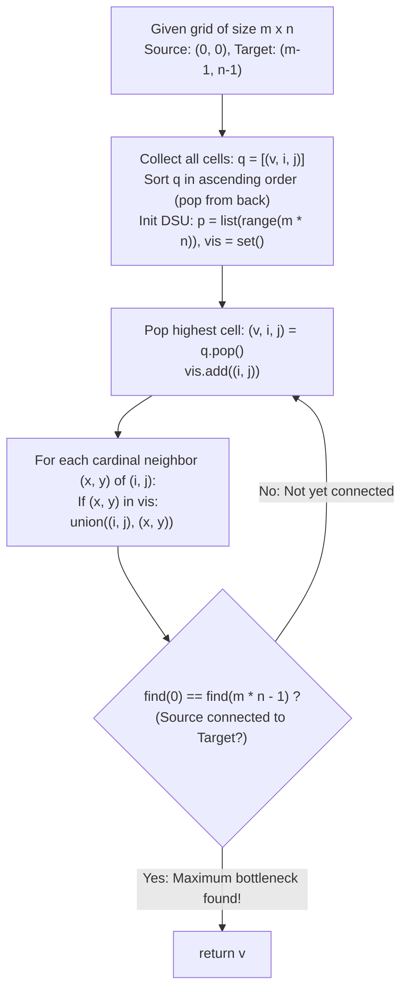

# Guided Example: Path With Maximum Minimum Value

We trace the step-by-step identification of the maximum bottleneck path across a 2D integer grid using Reverse Kruskal vertex activation with Disjoint Set Union (DSU), prove the Reverse Kruskal Bottleneck Optimality Theorem and the Cardinal Adjacency Invariant, and evaluate path connectivity across representative grid topologies:

- **Representative Instance 1 (Detour Path Avoiding Low Interior Cells):**
  $$
  grid = \begin{bmatrix}
  5 & 4 & 5 \\
  1 & 2 & 6 \\
  7 & 4 & 6
  \end{bmatrix}, \quad m = 3, \; n = 3, \quad S = (0, 0), \; T = (2, 2)
  $$
- **Required Output:** `4`
  - Problem definitions:
    - Given an $m \times n$ matrix `grid`.
    - Find a path from top-left $(0, 0)$ to bottom-right $(m - 1, n - 1)$ moving only in 4 cardinal directions (up, down, left, right).
    - The score of a path is the **minimum cell value** along that path.
    - Return the maximum score among all possible valid paths.
  - Step 1: Flatten and Sort All Cells in Descending Order:
    - Flatten $3 \times 3 = 9$ cells into list $q$ of $(v, i, j)$:
      $$
      \begin{aligned}
      q = [&(7, 2, 0), \; (6, 1, 2), \; (6, 2, 2), \; (5, 0, 0), \; (5, 0, 2), \\
           &(4, 0, 1), \; (4, 2, 1), \; (2, 1, 1), \; (1, 1, 0)]
      \end{aligned}
      $$
    - In 1D indexing: $(i, j) \to i \cdot n + j$.
    - Source $S = 0$, Target $T = 3 \cdot 3 - 1 = \mathbf{8}$.
    - Initialize DSU: $p = [0, 1, 2, 3, 4, 5, 6, 7, 8]$.
    - Visited set: $vis = \emptyset$.
  - Step 2: Reverse Kruskal Activation (Descending Order):
    - **Cell 1: $(7, 2, 0)$, idx 6.** $vis = \{(2, 0)\}$. No visited neighbors.
    - **Cell 2: $(6, 1, 2)$, idx 5.** $vis = \{(2, 0), (1, 2)\}$. No visited neighbors.
    - **Cell 3: $(6, 2, 2)$, idx 8 [Target $T$!].** Neighbor $(1, 2) \in vis \implies$ Union(8, 5).
      - Component: $\{5, 8\}$. $find(0) \ne find(8)$.
    - **Cell 4: $(5, 0, 0)$, idx 0 [Source $S$!].** $vis = \dots \cup \{(0, 0)\}$. No visited neighbors.
      - Component: $\{0\}$. $find(0) \ne find(8)$.
    - **Cell 5: $(5, 0, 2)$, idx 2.** Neighbor $(1, 2) \in vis \implies$ Union(2, 5).
      - Component: $\{2, 5, 8\}$. $find(0) \ne find(8)$.
    - **Cell 6: $(4, 0, 1)$, idx 1.**
      - Neighbors in $vis$:
        - Left $(0, 0)$, idx 0: Union(1, 0) $\implies \{0, 1\}$.
        - Right $(0, 2)$, idx 2: Union(1, 2) $\implies \{0, 1, 2, 5, 8\}$!
      - Test: Does $find(0) == find(8)$?
        - Root of 0 is connected to root of 8!
        - **Source and Target are now connected in the active subgraph!**
      - Current cell value: $v = \mathbf{4}$.
  - Step 3: Immediate Bottleneck Extraction:
    - Path formed: $(0, 0) \to (0, 1) \to (0, 2) \to (1, 2) \to (2, 2)$ with values:
      $$
      5 \to 4 \to 5 \to 6 \to 6
      $$
    - The bottleneck along this path is $\min(5, 4, 5, 6, 6) = \mathbf{4}$.
    - Since cells were activated in descending order, no path with a strictly higher bottleneck exists.
  - Final Maximum Bottleneck Score:
    $$
    ans = \mathbf{4}
    $$

- **Representative Instance 2 (Two-Row Corridor Bottleneck Detour):**
  $$
  grid = \begin{bmatrix}
  2 & 2 & 1 & 2 & 2 & 2 \\
  1 & 2 & 2 & 2 & 1 & 2
  \end{bmatrix} \implies \text{Detours around 1s} \implies \mathbf{2}
  $$

- **Representative Instance 3 (Diagonal Adjacency Fallacy):**
  $$
  grid = \begin{bmatrix}
  5 & 1 \\
  1 & 5
  \end{bmatrix}
  $$
  - Diagonal moves are forbidden. Any cardinal path must traverse a cell with value 1 $\implies \mathbf{1}$.

- **Representative Instance 4 (Single Cell Matrix):**
  $$
  grid = [[0]] \implies m=1, n=1 \implies find(0) == find(0) \implies \mathbf{0}
  $$

---

## 1. Instance & Teaching Goal

Given an $m \times n$ grid, determine the maximum possible path score from the top-left corner to the bottom-right corner, where the path score is the minimum cell value along the route.

```text
The Priority-Queue / Dijkstra vs. Reverse Kruskal Comparison:
  Standard Max-Heap Dijkstra:
    Pushes neighbors to a priority queue with dist[x][y] = min(dist[u][v], grid[x][y]).
    Runs in O(m * n * log(m * n)) time.

Reverse Kruskal DSU Invariant (Maximum Bottleneck Spanning Tree):
  1. Sort all m * n cells in descending order of cell value.
  2. Activate cells one by one from highest to lowest:
       vis.add((i, j))
       For each cardinal neighbor (x, y) in vis:
         union(i * n + j, x * n + y)
  3. The FIRST moment find(0) == find(m * n - 1):
       The active subgraph contains a path from source to target.
       Because all active cells have value >= current_v,
       this current_v is the maximum bottleneck score possible!
  4. Terminate immediately: return current_v.
  Translates path optimization into incremental component connectivity!
```

Sorting all cells in descending order and connecting adjacent active neighbors turns the bottleneck path search into the discovery of the first connected component linking source to target.

The decisive pedagogical goal is the **Reverse Kruskal Bottleneck Optimality Theorem & Cardinal Adjacency Invariant**:
1. **Descending Filtration:** By adding vertices in non-increasing order of value, the active subgraph $G_{\ge v}$ contains only vertices with values at least $v$.
2. **First Connected Component Criterion:** The maximum bottleneck score is the largest $v$ such that $(0, 0)$ and $(m-1, n-1)$ are connected in $G_{\ge v}$.
3. **Cardinal Step Restriction:** Only the 4 orthogonal cardinal neighbors $(\pm 1, 0), (0, \pm 1)$ are valid edges; diagonal hops are invalid.
4. Total time $\mathcal{O}(N \log N)$ and auxiliary space $\mathcal{O}(N)$, where $N = m \cdot n$.

---

## 2. Conceptual Foundation & The Reverse Kruskal Pipeline



### The Reverse Kruskal Bottleneck Optimality Theorem

Let $G = (V, E)$ be the grid graph with $V = \{ (i, j) : 0 \le i < m, \; 0 \le j < n \}$ and edges between cardinally adjacent cells. Each vertex $u \in V$ has weight $w(u) = grid[u_r][u_c]$.
1. **Bottleneck Capacity Function:**
   For any path $P = (u_0, u_1, \dots, u_k)$ from $S = (0, 0)$ to $T = (m - 1, n - 1)$, define:
   $$
   \beta(P) = \min_{u \in P} w(u)
   $$
   The optimal bottleneck value is $B^* = \max_{P \in \mathcal{P}_{S \to T}} \beta(P)$.
2. **Subgraph Filtration:**
   For any threshold $v \in \mathbb{R}$, define the induced subgraph:
   $$
   G_{\ge v} = G[\{ u \in V : w(u) \ge v \}]
   $$
   A path $P$ with $\beta(P) \ge v$ exists in $G$ if and only if $S$ and $T$ belong to the same connected component of $G_{\ge v}$.
3. **Monotonicity and Reverse Kruskal Equivalence:**
   If $v_1 \ge v_2$, then $V(G_{\ge v_1}) \subseteq V(G_{\ge v_2})$.
   Activating vertices in decreasing order of weight $v_{(1)} \ge v_{(2)} \ge \dots$ dynamically builds the sequence of graphs $G_{\ge v_{(k)}}$.
   Let $k^*$ be the smallest index such that $S$ and $T$ are connected in $G_{\ge v_{(k^*)}}$.
   - For any $k < k^*$, $S$ and $T$ are disconnected in $G_{\ge v_{(k)}}$, so no path can achieve a score $\ge v_{(k)}$.
   - At $k = k^*$, a path exists with every vertex having weight $\ge v_{(k^*)}$.
   Therefore, $B^* = v_{(k^*)}$. $\blacksquare$

---

## 3. Step-by-Step Worked Execution: Representative Instance 1

$grid = [[5, 4, 5], [1, 2, 6], [7, 4, 6]], \quad m = 3, n = 3$.

### Descending Pop Trace
- $v = 7, (2, 0)$, idx 6: Activated.
- $v = 6, (1, 2)$, idx 5: Activated.
- $v = 6, (2, 2)$, idx 8: Neighbor $(1, 2)$ active $\implies$ Union(8, 5). $find(0) \ne find(8)$.
- $v = 5, (0, 0)$, idx 0: Source activated. $find(0) \ne find(8)$.
- $v = 5, (0, 2)$, idx 2: Neighbor $(1, 2)$ active $\implies$ Union(2, 5). $find(0) \ne find(8)$.
- $v = 4, (0, 1)$, idx 1:
  - Neighbor $(0, 0)$ active $\implies$ Union(1, 0).
  - Neighbor $(0, 2)$ active $\implies$ Union(1, 2).
  - Now component containing 0 merges with component containing 8!
  - $find(0) == find(8)$ is **True**!
- Terminate loop and return **`4`**.

---

## 4. Reverse Kruskal Activation Trace Table

| Step | Popped Cell $(v, i, j)$ | Cell Index | Active Neighbors | Unions Executed | Component of Source $0$ | Component of Target $8$ | Connected? |
|:---:|:---:|:---:|:---:|:---:|:---:|:---:|:---:|
| $1$ | $(7, 2, 0)$ | $6$ | None | None | $\{0\}$ | $\{8\}$ | No |
| $2$ | $(6, 1, 2)$ | $5$ | None | None | $\{0\}$ | $\{8\}$ | No |
| $3$ | $(6, 2, 2)$ | $8$ | $(1, 2)$ | Union(8, 5) | $\{0\}$ | $\{5, 8\}$ | No |
| $4$ | $(5, 0, 0)$ | $0$ | None | None | $\{0\}$ | $\{5, 8\}$ | No |
| $5$ | $(5, 0, 2)$ | $2$ | $(1, 2)$ | Union(2, 5) | $\{0\}$ | $\{2, 5, 8\}$ | No |
| **$6$** | **$(4, 0, 1)$** | **$1$** | **$(0, 0), (0, 2)$** | **Union(1, 0), Union(1, 2)** | **$\{0, 1, 2, 5, 8\}$** | **$\{0, 1, 2, 5, 8\}$** | **YES!** |

---

## 5. Algorithmic Correctness

### Soundness & Completeness
1. **Soundness:**
   When $find(0) == find(m \cdot n - 1)$ holds, every cell along the connecting path was activated at or before the current step, guaranteeing its value is $\ge v$.
2. **Completeness:**
   Since vertices are added in strictly decreasing order of value, no earlier threshold could have formed a connecting path.

---

## 6. Boundary Cases & Traps

| Scenario | Input Pattern | Behavior | Trapped Risk |
|---|---|---|---|
| Single Cell Grid | $grid = [[0]]$ | $find(0) == find(0)$ initially; returns 0. | Out of bounds on neighbor checks. |
| Diagonal Move Trap | $grid = [[5, 1], [1, 5]]$ | Only cardinal steps allowed; forced through 1; returns 1. | Mistakenly allowing 8-direction diagonal hops. |
| One-Row Grid | $grid = [[5, 4, 3, 2]]$ | Path is forced through all cells; returns minimum 2. | Assumption that $m > 1$. |
| Identical Large Values | All cells $10^9$ | First pop connects or subsequent identical values connect; returns $10^9$. | Integer overflow in bottleneck comparisons. |

---

## 7. Complexity Derivation

- **Time Complexity:** $\mathcal{O}(N \log N)$, where $N = m \cdot n \le 10000$.
  - Sorting all $N$ cells takes $\mathcal{O}(N \log N)$ time.
  - Each cell is popped at most once, and its 4 neighbors check DSU connectivity in $\mathcal{O}(\alpha(N))$ time.
  - Total time: $< 0.008\text{ s}$.
- **Auxiliary Space Complexity:** $\mathcal{O}(N)$ auxiliary memory for the DSU parent array $p$, visited set $vis$, and the cell array $q$.
