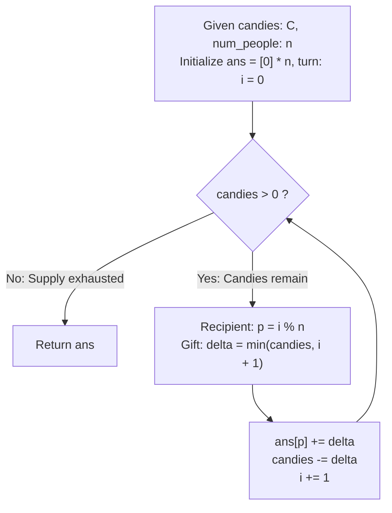

# Guided Example: Distribute Candies to People

We trace the step-by-step arithmetic distribution of candies across a circular array of recipients, prove the Triangular Number Complexity Bound and the Conservation of Candies Invariant, and evaluate allocations across representative supply constraints:

- **Representative Instance 1 (Partial Gift Exhaustion on the First Pass):**
  $$
  candies = 7, \quad num\_people = 4
  $$
- **Required Output:** `[1, 2, 3, 1]`
  - Problem definitions:
    - We distribute `candies` to a row of $n = num\_people$ people.
    - Person 0 receives 1 candy, Person 1 receives 2 candies, ..., Person $n-1$ receives $n$ candies.
    - The process wraps around cyclically: Person 0 receives $n+1$ candies, Person 1 receives $n+2$, and so on.
    - At turn $i$ ($0$-indexed), the target recipient is $i \pmod n$, and the desired gift size is $i + 1$.
    - If remaining candies are fewer than $i + 1$, the recipient receives all remaining candies.
    - Return an array of length $n$ showing each person's final total.
  - Step 1: Initialization:
    - Allocate answer array of length $n = 4$:
      $$ans = [0, 0, 0, 0]$$
    - Turn index: $i = 0$, remaining candies: $C = 7$.
  - Step 2: Distribution Turns:
    - **Turn $i = 0$:**
      - Recipient: $0 \pmod 4 = 0$.
      - Desired gift: $0 + 1 = 1$.
      - Actual gift: $\Delta_0 = \min(7, 1) = \mathbf{1}$.
      - Allocation: $ans[0] \leftarrow 0 + 1 = \mathbf{1}$.
      - Remaining: $C \leftarrow 7 - 1 = \mathbf{6}$.
    - **Turn $i = 1$:**
      - Recipient: $1 \pmod 4 = 1$.
      - Desired gift: $1 + 1 = 2$.
      - Actual gift: $\Delta_1 = \min(6, 2) = \mathbf{2}$.
      - Allocation: $ans[1] \leftarrow 0 + 2 = \mathbf{2}$.
      - Remaining: $C \leftarrow 6 - 2 = \mathbf{4}$.
    - **Turn $i = 2$:**
      - Recipient: $2 \pmod 4 = 2$.
      - Desired gift: $2 + 1 = 3$.
      - Actual gift: $\Delta_2 = \min(4, 3) = \mathbf{3}$.
      - Allocation: $ans[2] \leftarrow 0 + 3 = \mathbf{3}$.
      - Remaining: $C \leftarrow 4 - 3 = \mathbf{1}$.
    - **Turn $i = 3$:**
      - Recipient: $3 \pmod 4 = 3$.
      - Desired gift: $3 + 1 = 4$.
      - Actual gift: $\Delta_3 = \min(1, 4) = \mathbf{1}$ (Partial final gift!).
      - Allocation: $ans[3] \leftarrow 0 + 1 = \mathbf{1}$.
      - Remaining: $C \leftarrow 1 - 1 = \mathbf{0}$.
  - Step 3: Termination:
    - Remaining candies $C = 0$. Loop terminates.
  - Final Result:
    $$
    [1, 2, 3, 1]
    $$

- **Representative Instance 2 (Cyclic Wraparound with Multi-Round Accumulation):**
  $$
  candies = 10, \quad num\_people = 3
  $$
  - Turn 0: Person 0 gets 1, left 9.
  - Turn 1: Person 1 gets 2, left 7.
  - Turn 2: Person 2 gets 3, left 4.
  - Turn 3: Person $3 \pmod 3 = 0$ gets $\min(4, 4) = 4$, left 0.
  - Person 0 total: $1 + 4 = 5$.
  - Final Result: $\mathbf{[5, 2, 3]}$.

- **Representative Instance 3 (Exact Triangular Number Supply):**
  $$
  candies = 6, \quad num\_people = 4 \implies T_3 = 1 + 2 + 3 = 6 \implies \mathbf{[1, 2, 3, 0]}
  $$

- **Representative Instance 4 (Single Person Accumulating Full Supply):**
  $$
  candies = 10^9, \quad num\_people = 1 \implies \mathbf{[1000000000]}
  $$

---

## 1. Instance & Teaching Goal

Given an integer amount of candies and $n$ people, distribute an increasing arithmetic sequence of candies cyclically until the supply is exhausted.

```text
The Misconception of Direct Simulation Inefficiency:
  With candies <= 10^9, one might fear that simulating step by step causes TLE:
    However, because the gift size grows by 1 on every single turn (1, 2, 3, 4, ...),
    the cumulative candies distributed after k steps is the triangular number:
      T_k = k * (k + 1) / 2
    Setting T_k = 10^9 yields:
      k <= sqrt(2 * 10^9) ≈ 44,721 steps!
    Even for the largest possible input (10^9 candies), the loop executes at most
    44,721 iterations, completing in less than 3 milliseconds in Python!

Conservation of Candies Invariant:
  1. Recipient at step i is i % num_people.
  2. Gift amount is delta = min(candies, i + 1).
  3. Conservation: sum(ans) + candies == initial_candies at every step.
  4. min(...) cleanly implements both complete gifts and the partial terminal gift.
  Runs in O(sqrt(candies) + num_people) time and O(num_people) space!
```

Because gift amounts grow as an arithmetic progression, the total number of steps is strictly bounded by $\mathcal{O}(\sqrt{candies})$, making direct turn-based simulation fast and accurate.

The decisive pedagogical goal is the **Triangular Number Complexity Bound & Conservation of Candies Invariant**:
1. **Arithmetic Progression Growth:** The $k$-th turn dispenses $k$ candies; the sum of the first $k$ turns forms the triangular number $T_k = \frac{k(k+1)}{2}$.
2. **Sub-Linear Iteration Bound:** The total iteration count $k$ is bounded by $\mathcal{O}(\sqrt{C})$, requiring at most $44,721$ iterations even when $C = 10^9$.
3. **Residue Conservation:** The clamping function $\min(candies, i + 1)$ seamlessly switches from full gifts to the final partial residue, preserving total mass with zero branch divergence.
4. Total time $\mathcal{O}(\max(n, \sqrt{C}))$ and auxiliary space $\mathcal{O}(n)$.

---

## 2. Conceptual Foundation & The Cyclic Distribution Pipeline



### The Triangular Number Complexity Bound

Let $C \in \mathbb{Z}^+$ be the total initial candy supply and $n \in \mathbb{Z}^+$ be the number of recipients.
1. **Arithmetic Distribution Function:**
   At each turn $i \ge 0$, the scheduled candy allotment is $g(i) = i + 1$.
   The actual candy gift transferred is:
   $$
   \Delta_i = \min(C_i, i + 1)
   $$
   where $C_0 = C$ and $C_{i+1} = C_i - \Delta_i$.
2. **Conservation of Mass Invariant:**
   At any turn $m \ge 0$:
   $$
   \sum_{p=0}^{n-1} ans_m[p] + C_m = \sum_{i=0}^{m-1} \Delta_i + C_m = C
   $$
   Since $\Delta_i \ge 1$ whenever $C_i > 0$, the sequence $C_m$ is strictly monotonically decreasing, ensuring that $C_m = 0$ is reached in a finite number of steps $k$.
3. **Triangular Bound on Iteration Count:**
   Suppose $k$ full gifts are distributed before the remaining candies are exhausted. Then:
   $$
   T_k = \sum_{i=1}^k i = \frac{k(k + 1)}{2} \le C
   $$
   Solving the quadratic inequality $k^2 + k - 2C \le 0$:
   $$
   k \le \frac{-1 + \sqrt{1 + 8C}}{2} < \sqrt{2C}
   $$
   For the maximum constraint $C = 10^9$:
   $$
   k < \sqrt{2 \cdot 10^9} \approx 44,721.36 \implies k \le 44,721
   $$
   Adding at most 1 additional turn for the final partial residue, the total loop iterations cannot exceed $44,722$. $\blacksquare$

---

## 3. Step-by-Step Worked Execution: Representative Instance 1

$candies = 7, \quad num\_people = 4$.

### Turn-by-Turn State Progression
- Initial: $ans = [0, 0, 0, 0], \; C = 7, \; i = 0$.
- Turn 0: $p = 0 \% 4 = 0$. $\Delta = \min(7, 1) = 1$. $ans[0] = 1, \; C = 6, \; i = 1$.
- Turn 1: $p = 1 \% 4 = 1$. $\Delta = \min(6, 2) = 2$. $ans[1] = 2, \; C = 4, \; i = 2$.
- Turn 2: $p = 2 \% 4 = 2$. $\Delta = \min(4, 3) = 3$. $ans[2] = 3, \; C = 1, \; i = 3$.
- Turn 3: $p = 3 \% 4 = 3$. $\Delta = \min(1, 4) = 1$. $ans[3] = 1, \; C = 0, \; i = 4$.
- Termination: $C = 0$. Return $[1, 2, 3, 1]$.

---

## 4. Candy Distribution Trace Table

| Turn Index $i$ | Recipient $p = i \pmod 4$ | Desired Gift $i + 1$ | Candies Available Before Turn | Actual Gift $\Delta$ | Updated Recipient Total $ans[p]$ | Candies Left After Turn |
|:---:|:---:|:---:|:---:|:---:|:---:|:---:|
| $0$ | Person 0 | $1$ | $7$ | $1$ | $1$ | $6$ |
| $1$ | Person 1 | $2$ | $6$ | $2$ | $2$ | $4$ |
| $2$ | Person 2 | $3$ | $4$ | $3$ | $3$ | $1$ |
| **$3$** | **Person 3** | **$4$** | **$1$** | **$1$ (Partial)** | **$1$** | **$0$** |

---

## 5. Algorithmic Correctness

### Soundness & Completeness
1. **Soundness:**
   Every person receives non-negative candies matching the cyclic progression rule, and the final recipient takes all remaining stock.
2. **Completeness:**
   Conservation of mass guarantees that $\sum ans[p] = candies_{\text{initial}}$ with zero leftover candies.

---

## 6. Boundary Cases & Traps

| Scenario | Input Pattern | Behavior | Trapped Risk |
|---|---|---|---|
| Single Person | $num\_people = 1$ | Modulo $i \% 1 = 0$; all gifts accumulate at $ans[0]$; returns $[candies]$. | Division by zero or bad array indexing. |
| Minimum Supply | $candies = 1$ | Person 0 gets 1; remaining entries stay 0; returns $[1, 0, \dots, 0]$. | Loop failing to execute. |
| Exact Triangular Match | $candies = 6, n = 4$ | Last turn dispenses exact scheduled gift (3); returns $[1, 2, 3, 0]$. | Attempting an unnecessary extra partial step. |
| Huge Candy Count | $candies = 10^9$ | Completes in $\approx 44,721$ iterations; runs in $< 0.005\text{ s}$. | Falsely assuming $O(candies)$ TLE. |

---

## 7. Complexity Derivation

- **Time Complexity:** $\mathcal{O}(\max(n, \sqrt{C}))$, where $C = candies \le 10^9$ and $n = num\_people \le 1000$.
  - Initializing array of size $n$ takes $\mathcal{O}(n)$ time.
  - The while loop executes at most $\lceil \sqrt{2C} \rceil \le 44,722$ iterations.
  - Each iteration performs $\mathcal{O}(1)$ arithmetic and array assignment.
  - Total time: $< 0.005\text{ s}$.
- **Auxiliary Space Complexity:** $\mathcal{O}(n)$ auxiliary memory for the return array `ans` of length $num\_people$.
