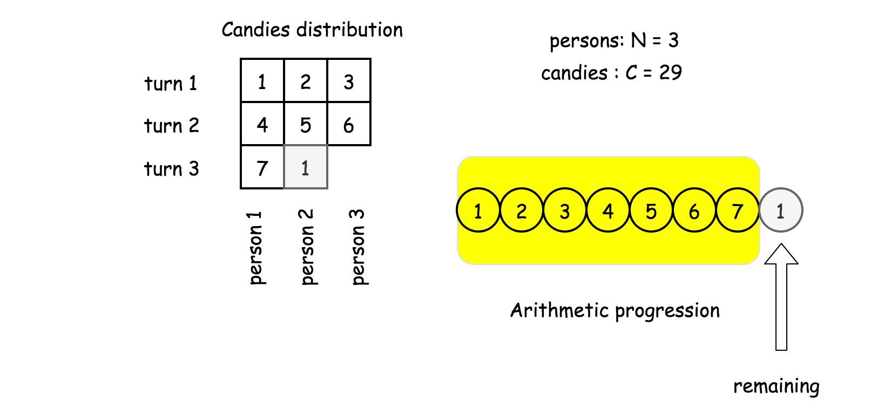
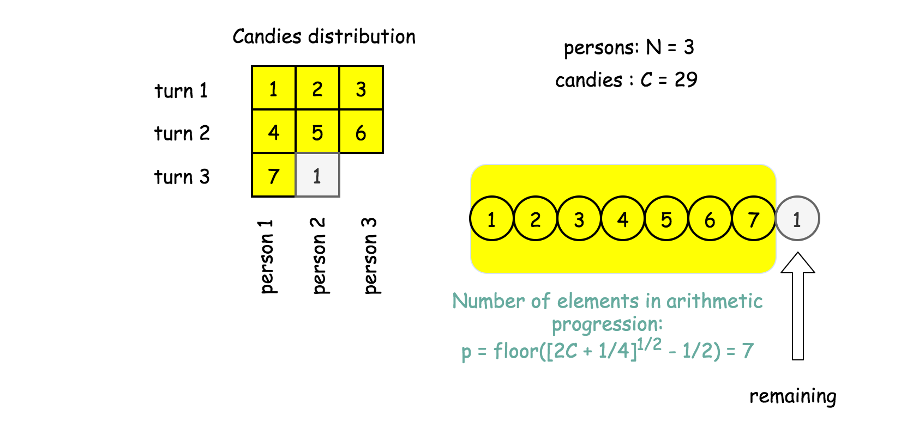
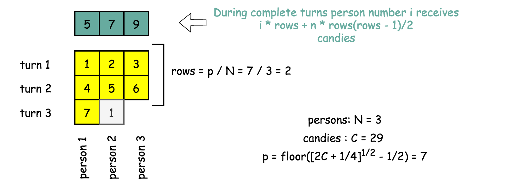
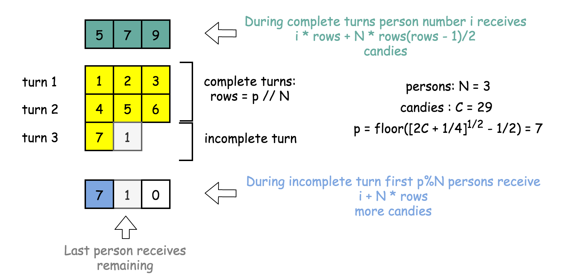

[TOC]

## Solution

---

### Approach 1: Sum of Arithmetic Progression

**Intuition**

That sort of "Math" question is to check how far one could simplify the problem even before starting to code.

The naive idea here is to jump into code and start to give candies in a loop till the end of candies. The time complexity of such a solution would be $\mathcal{O}(\max(G, N))$, where G is the number of gifts and N is the number of people.

A more elegant way would be to notice that candies distribution could be described by a simple formula. Using that formula one could solve the problem in $\mathcal{O}(N)$ time by the straightforward generation of the final distribution array.

Let's derive that formula step by step.

**Number of persons with complete gifts**

Candies gifts, except the last gift which contains the remaining, represent the arithmetic progression of natural numbers.



Let's assume that the progression has `p` elements, then the remaining is just a difference between the number of candies $C$ and the sum of the progression elements

$\textrm{remaining} = C - \sum\limits_{k = 0}^{k = p}{k}$

The sum of the natural numbers progression is a [school knowledge](https://en.wikipedia.org/wiki/1_%2B_2_%2B_3_%2B_4_%2B_%E2%8B%AF), and the remaining could be rewritten as

$\textrm{remaining} = C - \frac{p(p + 1)}{2}$

It's known that the remaining is larger or equal to 0 and smaller than the next progression number $p + 1$.

$0 \le C - \frac{p(p + 1)}{2} < p + 1$

Simple calculations result in

$\sqrt{2C + \frac{1}{4}} - \frac{3}{2} < p \le \sqrt{2C + \frac{1}{4}} - \frac{1}{2}$

There is only one integer in this interval, and hence now one knows the number of elements in the arithmetic progression

$p = \textrm{floor}\left(\sqrt{2C + \frac{1}{4}} - \frac{1}{2}\right)$



**Candies gain during the complete turns**

Now one could compute the number of complete turns when all N persons received a gift: $rows = p / N$.

During complete turns person, the number `i` received in total

$$d[i] = i + (i + N) + (i + 2N) + ... (i + (\textrm{rows} - 1) N) =
i \times \textrm{rows} + N \frac{\textrm{rows}(\textrm{rows} - 1)}{2}$$



**Candies gain during the incomplete turn**

The last turn could be incomplete, i.e. not all persons receive their gifts.

One could compute the number of persons who received a complete gift: $cols = p \% N$. These persons will receive one turn more candies

$d[i] += i + N \times \textrm{rows}$

The last person with a gift will receive all remaining candies

$d[\textrm{cols} + 1] += \textrm{remaining}$



That's all, all distributed candies are computed.

**Algorithm**

- Compute number of persons with complete gifts

$p = \textrm{floor}\left(\sqrt{2C + \frac{1}{4}} - \frac{1}{2}\right)$

and the last gift $\textrm{remaining} = C - \frac{p(p + 1)}{2}$.

- Compute the number of complete turns, when all persons receive their gifts : $rows = p // n$, and candies gain from these turns :
$d[i] = i \times \textrm{rows} + N \frac{\textrm{rows}(\textrm{rows} - 1)}{2}$

- Add one turn more candies to first `p % N` persons participated in the last incomplete turn : $d[i] += i + N \times \textrm{rows}$.

- Add `remaining` to the person after the first `p % N` persons.

- Return candies distribution `d`.

**Implementation**

```python
class Solution:
    def distributeCandies(self, candies: int, num_people: int) -> List[int]:
        n = num_people
        # how many people received complete gifts
        p = int((2 * candies + 0.25)**0.5 - 0.5)
        remaining = int(candies - (p + 1) * p * 0.5)
        rows, cols = p // n, p % n

        d = [0] * n
        for i in range(n):
            # complete rows
            d[i] = (i + 1) * rows + int(rows * (rows - 1) * 0.5) * n
            # cols in the last row
            if i < cols:
                d[i] += i + 1 + rows * n
        # remaining candies
        d[cols] += remaining
        return d
```

**Complexity Analysis**

* Time complexity : $\mathcal{O}(N)$ to create N elements of the output array.
* Space complexity : $\mathcal{O}(N)$ to keep the output.