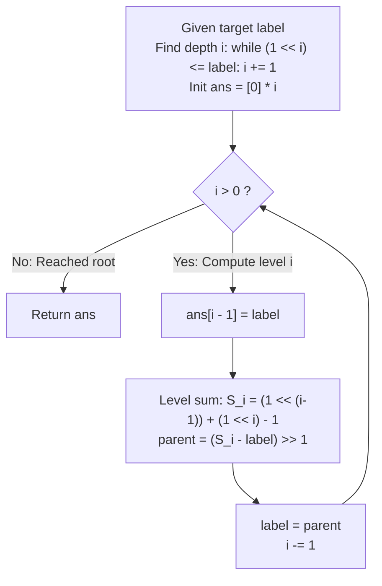

# Guided Example: Path In Zigzag Labelled Binary Tree

We trace the step-by-step root-to-node path reconstruction in an alternating zigzag complete binary tree using row reflection arithmetic, prove the Dual-Level Reflection Inversion Theorem and the Level Sum Constant Invariant, and evaluate parent transitions across representative tree depths:

- **Representative Instance 1 (Target on Reversed Even Row):**
  $$
  label = 14
  $$
- **Required Output:** `[1, 3, 4, 14]`
  - Problem definitions:
    - An infinite complete binary tree is labeled row by row in zigzag fashion.
    - Odd rows ($1, 3, 5, \dots$) are labeled left to right.
    - Even rows ($2, 4, 6, \dots$) are labeled right to left.
      - Row 1: `[1]`
      - Row 2: `[3, 2]`
      - Row 3: `[4, 5, 6, 7]`
      - Row 4: `[15, 14, 13, 12, 11, 10, 9, 8]`
    - Given `label`, return the ordered list of node labels along the path from the root to `label`.
  - Step 1: Determine Tree Depth / Level Index $i$:
    - Find the highest power of two such that $2^{i-1} \le label$:
      - $x = 1, i = 1$
      - $x = 2, i = 2$ ($2 \le 14$)
      - $x = 4, i = 3$ ($4 \le 14$)
      - $x = 8, i = 4$ ($8 \le 14$)
      - $x = 16 > 14 \implies$ Stops at $i = \mathbf{4}$.
    - Path length is $i = 4$. Allocate array $ans$ of length 4:
      $$ans = [0, 0, 0, 0]$$
  - Step 2: Backward Path Reconstruction:
    - **Level $i = 4, \; label = 14$:**
      - Store current node: $ans[4 - 1] = ans[3] = \mathbf{14}$.
      - Level bounds: $[2^{3}, 2^{4} - 1] = [8, 15]$.
      - Level sum constant: $S_4 = 8 + 15 = 23$.
      - Compute parent using reflection inversion formula:
        $$
        parent = \lfloor (S_4 - label) / 2 \rfloor = \lfloor (23 - 14) / 2 \rfloor = \lfloor 9 / 2 \rfloor = \mathbf{4}
        $$
      - Next label: $label \leftarrow 4, \; i \leftarrow 3$.
    - **Level $i = 3, \; label = 4$:**
      - Store current node: $ans[3 - 1] = ans[2] = \mathbf{4}$.
      - Level bounds: $[2^{2}, 2^{3} - 1] = [4, 7]$.
      - Level sum constant: $S_3 = 4 + 7 = 11$.
      - Compute parent:
        $$
        parent = \lfloor (S_3 - label) / 2 \rfloor = \lfloor (11 - 4) / 2 \rfloor = \lfloor 7 / 2 \rfloor = \mathbf{3}
        $$
      - Next label: $label \leftarrow 3, \; i \leftarrow 2$.
    - **Level $i = 2, \; label = 3$:**
      - Store current node: $ans[2 - 1] = ans[1] = \mathbf{3}$.
      - Level bounds: $[2^{1}, 2^{2} - 1] = [2, 3]$.
      - Level sum constant: $S_2 = 2 + 3 = 5$.
      - Compute parent:
        $$
        parent = \lfloor (S_2 - label) / 2 \rfloor = \lfloor (5 - 3) / 2 \rfloor = \lfloor 2 / 2 \rfloor = \mathbf{1}
        $$
      - Next label: $label \leftarrow 1, \; i \leftarrow 1$.
    - **Level $i = 1, \; label = 1$:**
      - Store current node: $ans[1 - 1] = ans[0] = \mathbf{1}$.
      - Loop terminates ($i \leftarrow 0$).
  - Final Path:
    $$
    [1, 3, 4, 14]
    $$

- **Representative Instance 2 (Five-Level Path with Multiple Direction Changes):**
  $$
  label = 26 \implies i = 5 \implies [1, 2, 6, 10, 26]
  $$

- **Representative Instance 3 (Root Node Edge Case):**
  $$
  label = 1 \implies i = 1 \implies ans[0] = 1 \implies [1]
  $$

- **Representative Instance 4 (Power-of-Two Level Boundary):**
  $$
  label = 16 \implies i = 5 \implies [1, 3, 4, 15, 16]
  $$

---

## 1. Instance & Teaching Goal

Given a node label in an infinite zigzag-labeled binary tree, trace the path from root to that node in logarithmic $\mathcal{O}(\log label)$ time.

```text
The Tree Construction / Simulation Trap:
  Building the explicit tree nodes level by level:
    For label = 10^6, generating all 10^6 tree nodes consumes tens of megabytes
    and millions of heap allocations.

Mirror Reflection Invariant (O(log(label)) Time, O(1) Auxiliary Space):
  In standard binary heaps, parent(v) = v // 2.
  In a zigzag tree, every row reverses direction relative to its predecessor.
  For any row i spanning [2^(i-1), 2^i - 1], the sum of the endpoints is:
    S_i = 2^(i-1) + (2^i - 1)
  The standard (unreversed) position of label is v' = S_i - label.
  Because row i - 1 is ALSO reversed relative to row i,
  the standard parent index v' // 2 ALREADY matches the zigzag label in row i - 1!
  Parent Formula:
    parent = (2^(i-1) + 2^i - 1 - label) // 2
  Trace backward from leaf to root in <= 20 arithmetic steps!
```

Because row orientations alternate, taking the complement of the label within its level interval before integer division by 2 maps directly to the parent's zigzag label.

The decisive pedagogical goal is the **Dual-Level Reflection Inversion Theorem & Level Sum Constant Invariant**:
1. **Level Interval Invariant:** Level $i$ contains exactly $2^{i-1}$ nodes labeled in the integer interval $[2^{i-1}, 2^i - 1]$.
2. **Standard Position Equivalence:** Reflecting $label$ about the level midpoint maps it to its natural left-to-right heap position $label' = S_i - label$.
3. **Alternating Direction Cancellation:** Inverting the child's orientation and halving the index naturally matches the reversed orientation of the parent level.
4. Total time $\mathcal{O}(\log(label))$ and auxiliary space $\mathcal{O}(\log(label))$.

---

## 2. Conceptual Foundation & The Zigzag Reflection Pipeline



### The Dual-Level Reflection Inversion Theorem

Let $T$ be an infinite complete binary tree.
1. **Standard Heap Indexing:**
   In standard left-to-right level-order indexing, node $k$ at level $i$ (with $k \in [2^{i-1}, 2^i - 1]$) has children $2k$ and $2k + 1$ at level $i+1$, and parent $\lfloor k / 2 \rfloor$ at level $i-1$.
2. **Zigzag Permutation:**
   Let $\pi_i : [2^{i-1}, 2^i - 1] \to [2^{i-1}, 2^i - 1]$ be the labeling permutation at level $i$:
   - If level $i$ is odd (left to right): $\pi_i(k) = k$.
   - If level $i$ is even (right to left): $\pi_i(k) = 2^{i-1} + 2^i - 1 - k = S_i - k$.
   Observe that for any level $i$, $\pi_i$ is an involution ($\pi_i(\pi_i(k)) = k$).
3. **Parent Derivation under Alternating Parity:**
   Suppose node $u$ has label $v$ at level $i$.
   - **Case 1: Level $i$ is even (reversed), Level $i-1$ is odd (normal).**
     The standard position of $u$ is $k = S_i - v$.
     The parent in standard indexing is $p = \lfloor k / 2 \rfloor = \lfloor (S_i - v) / 2 \rfloor$.
     Since level $i-1$ is odd, its labels are standard: $\pi_{i-1}(p) = p$.
     Thus, the parent's zigzag label is $\lfloor (S_i - v) / 2 \rfloor$.
   - **Case 2: Level $i$ is odd (normal), Level $i-1$ is even (reversed).**
     The standard position of $u$ is $k = v$.
     The parent in standard indexing is $p = \lfloor v / 2 \rfloor$.
     Since level $i-1$ is even, its label is reversed: $\pi_{i-1}(p) = S_{i-1} - p$.
     Note that:
     $$
     S_i - v = (2^{i-1} + 2^i - 1) - v = 2 \cdot (2^{i-2} + 2^{i-1} - 1) + 1 - v = 2 S_{i-1} + 1 - v
     $$
     Dividing by 2 with floor division:
     $$
     \lfloor (S_i - v) / 2 \rfloor = \lfloor (2 S_{i-1} + 1 - v) / 2 \rfloor = S_{i-1} + \lfloor (1 - v) / 2 \rfloor = S_{i-1} - \lfloor v / 2 \rfloor
     $$
     This exactly matches $\pi_{i-1}(p)$!
4. **Universal Parent Invariant:**
   For all levels $i \ge 2$, regardless of whether $i$ is even or odd:
   $$
   parent(v, i) = \left\lfloor \frac{2^{i-1} + 2^i - 1 - v}{2} \right\rfloor \quad \blacksquare
   $$

---

## 3. Step-by-Step Worked Execution: Representative Instance 1

$label = 14$.

### Level and Bounds Setup
- $2^3 \le 14 < 2^4 \implies i = 4$. Array $ans$ of size 4.

### Backward Walk
- $i = 4, label = 14$:
  - $ans[3] = 14$.
  - $S_4 = 8 + 15 = 23$.
  - $parent = (23 - 14) // 2 = 9 // 2 = \mathbf{4}$.
- $i = 3, label = 4$:
  - $ans[2] = 4$.
  - $S_3 = 4 + 7 = 11$.
  - $parent = (11 - 4) // 2 = 7 // 2 = \mathbf{3}$.
- $i = 2, label = 3$:
  - $ans[1] = 3$.
  - $S_2 = 2 + 3 = 5$.
  - $parent = (5 - 3) // 2 = 2 // 2 = \mathbf{1}$.
- $i = 1, label = 1$:
  - $ans[0] = 1$.

Final array: `[1, 3, 4, 14]`.

---

## 4. Traceback Transition Table

| Depth $i$ | Current $label$ | Row Interval $[2^{i-1}, 2^i - 1]$ | Row Sum $S_i$ | Inverted Value $S_i - label$ | Computed Parent $\lfloor (S_i - label) / 2 \rfloor$ | Stored in $ans[i-1]$ |
|:---:|:---:|:---:|:---:|:---:|:---:|:---:|
| $4$ | $14$ | $[8, 15]$ | $23$ | $9$ | $4$ | $ans[3] = 14$ |
| $3$ | $4$ | $[4, 7]$ | $11$ | $7$ | $3$ | $ans[2] = 4$ |
| $2$ | $3$ | $[2, 3]$ | $5$ | $2$ | $1$ | $ans[1] = 3$ |
| **$1$** | **$1$** | **$[1, 1]$** | **$2$** | **$1$** | **$0$ (Terminates)** | **$ans[0] = 1$** |

---

## 5. Algorithmic Correctness

### Soundness & Completeness
1. **Soundness:**
   The universal parent formula is proved correct for both even and odd row parities, ensuring exact mathematical parent recovery.
2. **Completeness:**
   Since each level step decrements $i$ by 1, the algorithm traverses all ancestors from leaf to root without missing any node.

---

## 6. Boundary Cases & Traps

| Scenario | Input Pattern | Behavior | Trapped Risk |
|---|---|---|---|
| Target is Root | $label = 1$ | $i = 1$; stores $ans[0] = 1$; terminates immediately. | Out-of-bounds index or division by zero. |
| Power-of-Two Value | $label = 16$ | Level start; correctly computes $i = 5$; moves to parent 15. | Off-by-one errors in log2 / bit shifts. |
| Maximum Constraint | $label = 10^6$ | Depth $i = 20$; executes in 20 arithmetic steps. | Memory allocation timeouts from tree objects. |
| Level Endpoint Max | $label = 7$ | Level end ($2^3 - 1$); parent correctly identified as 2. | Boundary rounding errors. |

---

## 7. Complexity Derivation

- **Time Complexity:** $\mathcal{O}(\log(label))$, where $label \le 10^6$.
  - Depth calculation takes $\mathcal{O}(\log(label))$ bit shifts.
  - Path reconstruction takes $\mathcal{O}(\log(label))$ iterations, each with $\mathcal{O}(1)$ arithmetic.
  - For $label \le 10^6$, depth $i \le 20 \implies < 0.0001\text{ s}$.
- **Auxiliary Space Complexity:** $\mathcal{O}(\log(label))$ auxiliary memory for the return path array of length at most 21.