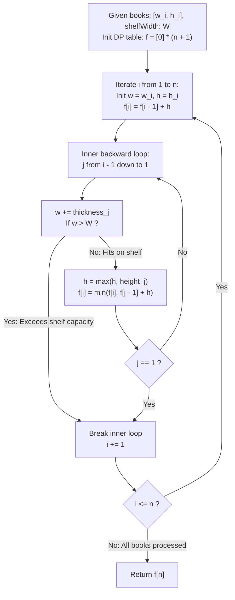

# Guided Example: Filling Bookcase Shelves

We trace the step-by-step dynamic programming optimization of bookcase shelf heights, prove the Backward Suffix Shelf Partition Invariant and the Greediness Suboptimality Counterexample Theorem, and evaluate bookshelf layouts across representative book dimensions:

- **Representative Instance 1 (Non-Greedy Shelf Partitioning):**
  $$
  books = \big[ [1, 1], \; [2, 3], \; [2, 3], \; [1, 1], \; [1, 1], \; [1, 1], \; [1, 2] \big], \quad shelfWidth = 4, \quad n = 7
  $$
- **Required Output:** `6`
  - Problem definitions:
    - Array `books[i] = [thickness_i, height_i]`.
    - Books must be placed onto shelves in the **exact given sequence order**.
    - The total thickness of books on any shelf cannot exceed `shelfWidth`.
    - The height of a shelf is $\max$ of the heights of books on that shelf.
    - Return the **minimum possible total height** of the bookcase.
  - Step 1: Greedy Approach Failure Analysis:
    - Greedy packing fills each shelf until capacity is reached:
      - Shelf 1: $[1, 1] + [2, 3] \implies$ width 3, height $\max(1, 3) = \mathbf{3}$.
      - Shelf 2: $[2, 3] + [1, 1] + [1, 1] \implies$ width 4, height $\max(3, 1, 1) = \mathbf{3}$.
      - Shelf 3: $[1, 1] + [1, 2] \implies$ width 2, height $\max(1, 2) = \mathbf{2}$.
      - Total Greedy Height: $3 + 3 + 2 = \mathbf{8}$ (Suboptimal!).
    - Optimal DP packing isolates the first book:
      - Shelf 1: $[1, 1]$ alone $\implies$ height $\mathbf{1}$.
      - Shelf 2: $[2, 3] + [2, 3] \implies$ width 4, height $\mathbf{3}$.
      - Shelf 3: $[1, 1] + [1, 1] + [1, 1] + [1, 2] \implies$ width 4, height $\mathbf{2}$.
      - Total Optimal Height: $1 + 3 + 2 = \mathbf{6} < 8$!
  - Step 2: Dynamic Programming Formulation:
    - Let $f[i]$ be the minimum height to shelve the first $i$ books.
    - Base case: $f[0] = 0$.
    - Recurrence for book $i \in [1, n]$:
      $$
      f[i] = \min_{\substack{1 \le j \le i \\ \sum_{k=j}^i thickness_k \le shelfWidth}} \Big( f[j - 1] + \max_{j \le k \le i} height_k \Big)
      $$
  - Step 3: Backward Suffix Evaluation:
    - $f[0] = 0$
    - **$i = 1$ (Book $[1, 1]$):**
      - $j = 1$: width $1 \le 4$, height $1 \implies f[1] = f[0] + 1 = \mathbf{1}$.
    - **$i = 2$ (Book $[2, 3]$):**
      - $j = 2$: width $2 \le 4$, height $3 \implies f[1] + 3 = 4$.
      - $j = 1$: width $2 + 1 = 3 \le 4$, height $\max(3, 1) = 3 \implies f[0] + 3 = \mathbf{3}$.
      - $f[2] = \min(4, 3) = \mathbf{3}$.
    - **$i = 3$ (Book $[2, 3]$):**
      - $j = 3$: width $2 \le 4$, height $3 \implies f[2] + 3 = 6$.
      - $j = 2$: width $2 + 2 = 4 \le 4$, height $\max(3, 3) = 3 \implies f[1] + 3 = 1 + 3 = \mathbf{4}$.
      - $j = 1$: width $4 + 1 = 5 > 4 \implies$ Break!
      - $f[3] = \min(6, 4) = \mathbf{4}$.
    - **$i = 4$ (Book $[1, 1]$):**
      - $j = 4$: $f[3] + 1 = 5$.
      - $j = 3$: width $1 + 2 = 3$, height $3 \implies f[2] + 3 = 6$.
      - $j = 2$: width $3 + 2 = 5 > 4 \implies$ Break!
      - $f[4] = \min(5, 6) = \mathbf{5}$.
    - **$i = 5$ (Book $[1, 1]$):**
      - $j = 5$: $f[4] + 1 = 6$.
      - $j = 4$: width $1 + 1 = 2$, height $1 \implies f[3] + 1 = 4 + 1 = \mathbf{5}$.
      - $j = 3$: width $2 + 2 = 4$, height $3 \implies f[2] + 3 = 3 + 3 = 6$.
      - $f[5] = \min(6, 5, 6) = \mathbf{5}$.
    - **$i = 6$ (Book $[1, 1]$):**
      - $j = 6$: $f[5] + 1 = 6$.
      - $j = 5$: width 2, height $1 \implies f[4] + 1 = 6$.
      - $j = 4$: width 3, height $1 \implies f[3] + 1 = 4 + 1 = \mathbf{5}$.
      - $j = 3$: width $3 + 2 = 5 > 4 \implies$ Break!
      - $f[6] = \mathbf{5}$.
    - **$i = 7$ (Book $[1, 2]$):**
      - $j = 7$: $f[6] + 2 = 7$.
      - $j = 6$: width 2, height $2 \implies f[5] + 2 = 7$.
      - $j = 5$: width 3, height $2 \implies f[4] + 2 = 7$.
      - $j = 4$: width $1 + 1 + 1 + 1 = 4 \le 4$, height $\max(1, 1, 1, 2) = 2 \implies f[3] + 2 = 4 + 2 = \mathbf{6}$.
      - $j = 3$: width $4 + 2 = 6 > 4 \implies$ Break!
      - $f[7] = \min(7, 7, 7, 6) = \mathbf{6}$.
  - Final Minimum Total Height:
    $$
    f[7] = \mathbf{6}
    $$

- **Representative Instance 2 (All Books Fit on a Single Shelf):**
  $$
  books = [[1, 3], [2, 4], [3, 2]], \quad shelfWidth = 6 \implies \text{Total width } 1 + 2 + 3 = 6 \le 6 \implies \max(3, 4, 2) = \mathbf{4}
  $$

- **Representative Instance 3 (Single Book Shelf):**
  $$
  books = [[7, 3]], \quad shelfWidth = 7 \implies \mathbf{3}
  $$

- **Representative Instance 4 (Forced Separate Shelves):**
  $$
  books = [[3, 2], [3, 5], [3, 4]], \quad shelfWidth = 3 \implies 2 + 5 + 4 = \mathbf{11}
  $$

---

## 1. Instance & Teaching Goal

Given an ordered sequence of books and maximum shelf width, partition the books into contiguous shelves to minimize the sum of shelf heights.

```text
The Greedy Shelf Packing Hazard:
  Packing books onto the current shelf until capacity is reached:
    In Representative Instance 1, greedy packing produces height 3 + 3 + 2 = 8.
    It forces the tall books [2, 3] and [2, 3] onto separate shelves, incurring double penalty.
    The optimal partition puts both tall books on Shelf 2, achieving total height 6!

Dynamic Programming Invariant (O(n * W) Time, O(n) Auxiliary Space):
  Let f[i] be the minimum height to shelve the first i books:
    1. Base case: f[0] = 0.
    2. For book i (from 1 to n):
         Start with book i alone on a new shelf: f[i] = f[i - 1] + height_i
         Scan j backwards from i - 1 down to 1:
           Accumulate width: w += thickness_j
           If w > shelfWidth: break (shelf capacity exceeded)
           Maintain maximum height: h = max(h, height_j)
           Relax state: f[i] = min(f[i], f[j - 1] + h)
  3. Because optimal prefix partitions have optimal substructure,
     f[n] provably guarantees the global minimum height!
```

Contiguous sequence ordering restricts shelf candidates to backward suffixes, allowing dynamic programming to explore all valid shelf groupings in polynomial time.

The decisive pedagogical goal is the **Backward Suffix Shelf Partition Invariant & Greediness Suboptimality Counterexample Theorem**:
1. **Contiguous Suffix Principle:** The final shelf containing book $i$ must consist of a contiguous block $books[j \dots i]$ of total width $\le shelfWidth$.
2. **Subproblem Independence:** Once the boundary of the final shelf $[j, i]$ is fixed, the cost of the preceding books is strictly $f[j-1]$, satisfying optimal substructure.
3. **Greedy Trap Proof:** Local minimization of shelf count or immediate shelf packing often forces tall books onto distinct shelves, inflating overall height.
4. Total time $\mathcal{O}(n \cdot \min(n, shelfWidth))$ and auxiliary space $\mathcal{O}(n)$.

---

## 2. Conceptual Foundation & The Dynamic Programming Pipeline



### The Backward Suffix Shelf Partition Invariant

Let $B = [b_1, b_2, \dots, b_n]$ be an ordered sequence of books, where $b_k = (w_k, h_k)$ with $w_k, h_k \in \mathbb{Z}^+$, and maximum shelf width $W \in \mathbb{Z}^+$.
1. **Shelf Validity and Cost Function:**
   A shelf containing the contiguous block of books from index $j$ to $i$ ($1 \le j \le i \le n$) is valid if:
   $$
   \sum_{k=j}^i w_k \le W
   $$
   Its height contribution to the bookcase is:
   $$
   H(j, i) = \max_{j \le k \le i} h_k
   $$
2. **Optimal Substructure Theorem:**
   Let $f[i]$ denote the minimum total bookcase height to pack prefix $B_{1 \dots i}$.
   Any valid arrangement of $B_{1 \dots i}$ must have a final shelf containing books $B_{j \dots i}$ for some $j \in [1, i]$.
   The total height of such an arrangement is the height of the preceding prefix plus the height of the final shelf:
   $$
   \text{Total Height} = \text{Height}(B_{1 \dots j-1}) + H(j, i)
   $$
   To minimize the total height for a fixed $j$, $\text{Height}(B_{1 \dots j-1})$ must be minimized, which is precisely $f[j-1]$ by the induction hypothesis.
3. **Bellman Recurrence:**
   Minimizing over all feasible choices of $j$:
   $$
   f[i] = \min_{\substack{1 \le j \le i \\ \sum_{k=j}^i w_k \le W}} \Big( f[j - 1] + \max_{j \le k \le i} h_k \Big)
   $$
   with base case $f[0] = 0$.
   Since $f[i]$ depends only on $f[j-1]$ for $j \le i$, the recurrence is strictly acyclic and topological order $i = 1, 2, \dots, n$ computes exact global optima. $\blacksquare$

---

## 3. Step-by-Step Worked Execution: Representative Instance 1

$books = [[1, 1], [2, 3], [2, 3], [1, 1], [1, 1], [1, 1], [1, 2]], \quad shelfWidth = 4$.

### DP State Evolution
- $f[0] = 0$.
- $i = 1: f[1] = 0 + 1 = \mathbf{1}$.
- $i = 2: f[2] = \min(f[1] + 3, f[0] + 3) = \min(4, 3) = \mathbf{3}$.
- $i = 3: f[3] = \min(f[2] + 3, f[1] + 3) = \min(6, 4) = \mathbf{4}$ (width 5 exceeds 4 at $j=1$).
- $i = 4: f[4] = \min(f[3] + 1, f[2] + 3) = \min(5, 6) = \mathbf{5}$.
- $i = 5: f[5] = \min(f[4] + 1, f[3] + 1, f[2] + 3) = \min(6, 5, 6) = \mathbf{5}$.
- $i = 6: f[6] = \min(f[5] + 1, f[4] + 1, f[3] + 1) = \min(6, 6, 5) = \mathbf{5}$.
- $i = 7: f[7] = \min(f[6] + 2, f[5] + 2, f[4] + 2, f[3] + 2) = \min(7, 7, 7, 6) = \mathbf{6}$.

Result: `6`.

---

## 4. Dynamic Programming Transition Trace Table

| Book $i$ | Dimensions $(w_i, h_i)$ | Tested Suffixes $j \dots i$ | Suffix Width $\sum w$ | Suffix Height $\max h$ | Candidate Cost $f[j-1] + \max h$ | Optimal $f[i]$ |
|:---:|:---:|:---:|:---:|:---:|:---:|:---:|
| $0$ (Base) | — | — | — | — | — | **$0$** |
| $1$ | $(1, 1)$ | $j=1: [1]$ | $1 \le 4$ | $1$ | $f[0] + 1 = 1$ | **$1$** |
| $2$ | $(2, 3)$ | $j=2: [2]$<br>$j=1: [1, 2]$ | $2 \le 4$<br>$3 \le 4$ | $3$<br>$3$ | $f[1] + 3 = 4$<br>$f[0] + 3 = 3$ | **$3$** |
| $3$ | $(2, 3)$ | $j=3: [3]$<br>$j=2: [2, 3]$<br>$j=1: [1 \dots 3]$ | $2 \le 4$<br>$4 \le 4$<br>$5 > 4$ (Break) | $3$<br>$3$<br>— | $f[2] + 3 = 6$<br>$f[1] + 3 = 4$<br>— | **$4$** |
| $4$ | $(1, 1)$ | $j=4: [4]$<br>$j=3: [3, 4]$ | $1 \le 4$<br>$3 \le 4$ | $1$<br>$3$ | $f[3] + 1 = 5$<br>$f[2] + 3 = 6$ | **$5$** |
| $5$ | $(1, 1)$ | $j=5: [5]$<br>$j=4: [4, 5]$<br>$j=3: [3 \dots 5]$ | $1 \le 4$<br>$2 \le 4$<br>$4 \le 4$ | $1$<br>$1$<br>$3$ | $f[4] + 1 = 6$<br>$f[3] + 1 = 5$<br>$f[2] + 3 = 6$ | **$5$** |
| $6$ | $(1, 1)$ | $j=6: [6]$<br>$j=4: [4 \dots 6]$ | $1 \le 4$<br>$3 \le 4$ | $1$<br>$1$ | $f[5] + 1 = 6$<br>$f[3] + 1 = 5$ | **$5$** |
| **$7$** | **$(1, 2)$** | **$j=7: [7]$**<br>**$j=4: [4 \dots 7]$** | **$1 \le 4$**<br>**$4 \le 4$** | **$2$**<br>**$2$** | **$f[6] + 2 = 7$**<br>**$f[3] + 2 = 6$** | **$6$** |

---

## 5. Algorithmic Correctness

### Soundness & Completeness
1. **Soundness:**
   Every shelf boundary considered is contiguous and within `shelfWidth`, ensuring valid geometric placement.
2. **Completeness:**
   Since all valid split points $j$ are tested for each book $i$, no shelf combination can be omitted.

---

## 6. Boundary Cases & Traps

| Scenario | Input Pattern | Behavior | Trapped Risk |
|---|---|---|---|
| Single Book | $books = [[7, 3]], W = 7$ | $f[1] = f[0] + 3 = 3$; returns 3. | Off-by-one loop indexing. |
| All Books Fit on One Shelf | $\sum w_i \le W$ | Suffix extends back to $j=1$; $f[n] = \max h_i$. | Forcing unnecessary breaks. |
| Every Book Consumes Full Shelf | $w_i = W$ for all $i$ | Inner loop breaks after 1 step; $f[n] = \sum h_i$. | Inner loop continuing past width limit. |
| Greedy Trap | Multiple tall books | Tested in Representative Instance 1; DP beats greedy. | Assuming greedy packing is optimal. |

---

## 7. Complexity Derivation

- **Time Complexity:** $\mathcal{O}(n \cdot \min(n, shelfWidth))$, where $n = \text{len}(books) \le 1000$ and $shelfWidth \le 1000$.
  - Outer loop runs $n$ times.
  - Inner loop backward scan runs at most $\min(n, shelfWidth)$ times because thickness is at least 1.
  - Total inner loop operations $\le 1000 \cdot 1000 = 10^6 \implies < 0.02\text{ s}$.
- **Auxiliary Space Complexity:** $\mathcal{O}(n)$ auxiliary memory for the 1D DP table $f$ of length $n + 1$.