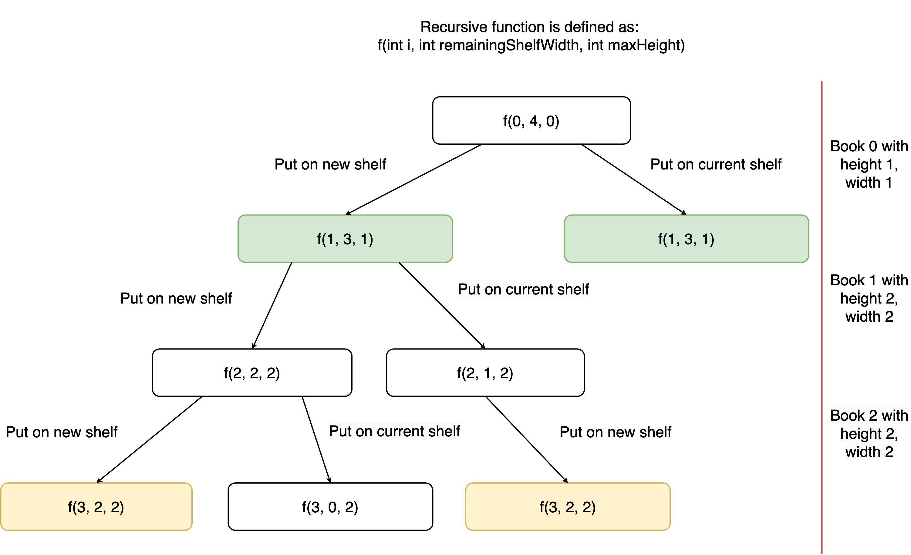

[TOC]

## Solution

---

### Overview

We are given an array of `books`, where each book has a specified thickness and height, and a bookcase with a given `shelfWidth`. The goal is to arrange the books in the bookcase to minimize its height.

As we process each book sequentially, we have two options: place the book on the current shelf (if its thickness is less than or equal to the remaining width), or start a new shelf. When a new shelf is created, the height of the bookcase increases by the height of the tallest book on the previous shelf.

Our task is to determine the minimum possible height of the bookcase after all books have been placed.

---

### Approach 1: Top-Down Dynamic Programming

### Intuition

When processing each book in the `books` array, we have two options: place the book on the current shelf or start a new shelf. Since it's not immediately clear which option will yield the minimum height of the bookcase, we need to evaluate both scenarios and choose the one that results in the smallest height.

We can model this problem using recursion by defining a function $f(i, remainingShelfWidth, maxHeight)$ that represents the minimum height of the bookcase containing all books up to book `i`, with the current shelf having a remaining width of `remainingShelfWidth` and a maximum height of `maxHeight`. This function essentially breaks down the problem into smaller subproblems:

- **New Shelf Option**: If we choose to put book `i` on a new shelf, the height of the bookcase will be equal to the height of the previous shelf plus the height of book `i`. This leads to the subproblem $f(i + 1, shelfWidth - \text{books}[i][0], \text{books}[i][1])$, where we process book $i + 1$ with a new shelf containing book `i`.

- **Current Shelf Option**: If we choose to put book `i` on the current shelf, the remaining width of the shelf decreases, and the maximum height of the shelf may increase if the height of book `i` exceeds the current `maxHeight`. This leads to the subproblem $f(i + 1, remainingShelfWidth - \text{books}[i][0], \max(maxHeight, \text{books}[i][1]))$.

To find the optimal height of the bookcase, we can use the recurrence relation below encompassing these two options. This recurrence relation compares the height of the bookcase when placing the book on a new shelf (adding the height of the previous shelf to the result of processing the remaining books) versus placing it on the current shelf (adjusting width and height accordingly):

$f(i, remainingShelfWidth, maxHeight) = \min\left(maxHeight + f(i + 1, shelfWidth - \text{books}[i][0], \text{books}[i][1]), f(i + 1, remainingShelfWidth - \text{books}[i][0], \max(maxHeight, \text{books}[i][1]))\right)$

If we look at the recursive calls that would be made for Example 1, we notice that subproblems appear more than once.



Without any optimizations, this recursive approach would lead to an exponential time complexity of $O(2^N)$ due to the doubling of recursive calls at each book. However, we can utilize a technique called memoization to store previously computed results. This way, if the same subproblem is encountered again, we can retrieve the result from a cache rather than recalculating it. With this optimization, the time complexity would be linearly proportional to the number of unique subproblems.

We use a 2D array `memo` as our cache, where $\text{memo}[i][j]$ represents the minimum height of the bookcase containing all books up to `i` with $j$ remaining shelf space. Note that `maxHeight` is implicitly handled by this memoization structure because the height is recalculated based on the maximum height of books in the current configuration.

### Algorithm

1. Initialize a 2D array `memo` to cache previous computations, where $\text{memo}[i][remainingShelfWidth]$ stores the minimum height of the bookcase containing all books up to the `i-th` book with `remainingShelfWidth` width available on the current shelf.
2. Call `dpHelper(books, shelfWidth, memo, 0, shelfWidth, 0)` to start the dynamic programming process from the first book, with the full shelf width available and initial height set to 0.
3. In `dpHelper` function:
*  If $i = \text{books.length}$:
* Finish the current shelf and return its height `maxHeight`
* **If the result is already computed in `memo`:**
* Return the cached result to avoid redundant calculations.
* **Calculate the height for different scenarios:**
* Extract the current book's width ($\text{currentBook}[0]$) and height ($\text{currentBook}[1]$).
* **Option 1:** Place the current book on a new shelf:
* Compute height by adding the height of the bookcase for the rest of the books starting from $i + 1$ with a new shelf width ($shelfWidth - \text{currentBook}[0]$) and updated height ($\text{currentBook}[1]$).
* **Option 2:** Place the current book on the current shelf:
* Initialize `maxHeightUpdated` to be the maximum of `maxHeight` and $\text{currentBook}[1]$.
* Compute height by adding the height of the bookcase for the rest of the books starting from $i + 1$ with updated remaining shelf width ($remainingShelfWidth - \text{currentBook}[0]$) and updated maximum height (`maxHeightUpdated`).
* **Store the minimum height** between the two options in $\text{memo}[i][remainingShelfWidth]$ to use it for future computations.
* Return the cached result from $\text{memo}[i][remainingShelfWidth]$.
4. Return the result from `dpHelper` for the initial call to get the minimum height of the bookcase to accommodate all books on the shelves.

### Implementation

```python
class Solution:
    def minHeightShelves(self, books: List[List[int]], shelfWidth: int) -> int:
        # Cache to store previous computations
        memo = [[0 for _ in range(shelfWidth + 1)] for _ in range(len(books))]
        return self._dpHelper(books, shelfWidth, memo, 0, shelfWidth, 0)

    def _dpHelper(
        self, books, shelf_width, memo, i, remaining_shelf_width, max_height
    ):
        if i == len(books):
            return max_height
        if memo[i][remaining_shelf_width] != 0:
            return memo[i][remaining_shelf_width]
        else:
            current_book = books[i]
            # Calculate height of the bookcase if we put the current book on the new shelf
            option_1_height = max_height + self._dpHelper(
                books,
                shelf_width,
                memo,
                i + 1,
                shelf_width - current_book[0],
                current_book[1],
            )
            option_2_height = float("inf")
            if remaining_shelf_width >= current_book[0]:
                # Calculate height of the bookcase if we put the current book on the current shelf
                max_height_updated = max(max_height, current_book[1])
                option_2_height = self._dpHelper(
                    books,
                    shelf_width,
                    memo,
                    i + 1,
                    remaining_shelf_width - current_book[0],
                    max_height_updated,
                )

            # Store the smaller result in cache
            memo[i][remaining_shelf_width] = min(
                option_1_height, option_2_height
            )
            return memo[i][remaining_shelf_width]
```

### Complexity Analysis

Let $N$ be the length of array `books`, and $W$ be the `shelfWidth`.

* Time Complexity: $O(N \cdot W)$

    There are a total of $O(N \cdot W)$ possible subproblems to be solved. Each subproblem takes constant time, so the total time complexity is $O(N \cdot W \cdot H)$.

* Space Complexity: $O(N \cdot W)$

    Our `memo` array has a size of $N \cdot W$. Thus, the total space complexity is $O(N \cdot W)$.

### Approach 2: Bottom-Up Dynamic Programming

### Intuition

In the previous recurrence relation, we used a top-down approach where we recursively solved subproblems in decreasing order of size. Now, let’s explore a bottom-up approach, where our subproblems are solved in increasing order of size.

We can define a subproblem $f(i)$ as the minimum possible height of the bookcase when containing all books up to (but not including) book `i`. This allows us to compute the bookcase height incrementally:

- **Base Cases**:
  - For $i = 0$, $f(0)$ is trivially `0`, as there are no books to place.
  - For $i = 1$, $f(1)$ is simply the height of the first book, $\text{books}[0][1]$, since it must be placed on the first shelf.
Starting from these base cases, we build up to $f(books.length)$, which will be our final answer.

To compute $f(i + 1)$, we need to consider how to arrange book `i` on the shelves, taking advantage of the previously computed values $f(j)$ for $0 \leq j < i + 1$:

- **New Shelf Option**: Similar to approach 1, one option is to place book `i` on a new shelf. The height of the bookcase in this scenario would be $\text{books}[i][1] + f(i)$, where `f(i)` is the height when arranging all books up to book `i-1`.

- **Combining Books**: Another option is to place book `i` on a shelf along with some of the previous books. To do this, we need to consider moving all possible numbers of previous books onto this new shelf and check which arrangement yields the minimum height:

  - For each possible number of previous books that can fit within the `shelfWidth`, calculate the height of the shelf with book `i` and the previous books. For example, if we decide to place book `i` along with book `i-1`, the smallest possible height would be $\max(\text{books}[i][1], books[i-1][1]) + f(i-1)$. This involves taking the maximum height of books on the new shelf and adding it to the height from the previous arrangement without the current books.

By iterating through all possible combinations of previous books that can fit on the shelf with book `i`, we determine the minimal height for $f(i + 1)$.

The final solution, $f(books.length)$, gives us the minimum height of the bookcase when all books are placed optimally.

### Algorithm

1. Initialize `dp` array of size $\text{books.length} + 1$. $\text{dp}[i]$ represents the minimum height of the bookshelf when containing all books up to and excluding book `i`.
2. Set base cases:
* $\text{dp}[0]$ is 0 (height of an empty bookcase).
* $\text{dp}[1]$ is the height of the first book, $\text{books}[0][1]$.
3. Iterate from $i = 2$ to `books.length`:
* Calculate the remaining shelf width after placing the current book $books[i - 1]$ on a new shelf.
* Initialize `maxHeight` to the height of the current book.
* Set $\text{dp}[i]$ to the height of the current book ($books[i - 1][1]$) plus the height of the bookcase containing all previous books ($dp[i - 1]$).
* Iterate backwards from $j = i - 1$:
* Check if adding the book $books[j - 1]$ to the shelf still fits within the remaining shelf width.
* Update `maxHeight` to be the maximum height of books on the current shelf.
* Calculate the height if the current set of books ($books[j - 1]$ to $books[i - 1]$) are placed on the same shelf.
* Update $\text{dp}[i]$ to be the minimum of the current $\text{dp}[i]$ and the height of this configuration ($maxHeight + dp[j - 1]$).
* Decrease `j` to consider additional books on the same shelf.
4. Return `dp[books.length]` which represents the minimum height of the bookcase required to store all the books.

### Implementation

```python
class Solution:
    def minHeightShelves(self, books: List[List[int]], shelfWidth: int) -> int:
        n = len(books)
        # dp[i] will store the minimum height of the bookcase containing all
        # books up to and excluding i
        dp = [0] * (n + 1)

        # Base cases
        dp[0] = 0
        dp[1] = books[0][1]

        for i in range(2, n + 1):
            # new shelf built to hold current book
            remaining_shelf_width = shelfWidth - books[i - 1][0]
            max_height = books[i - 1][1]
            dp[i] = books[i - 1][1] + dp[i - 1]

            j = i - 1
            # calculate the height when previous books are added to new shelf
            while j > 0 and remaining_shelf_width - books[j - 1][0] >= 0:
                max_height = max(max_height, books[j - 1][1])
                remaining_shelf_width -= books[j - 1][0]
                dp[i] = min(dp[i], max_height + dp[j - 1])
                j -= 1

        return dp[n]
```

### Complexity Analysis

Let $N$ be the length of array `books`, and $W$ be the `shelfWidth`.

* Time Complexity: $O(N \cdot W)$

    There are $O(N)$ subproblems to complete. In the worst case, each subproblem $\text{dp}[i]$ takes $O(W)$ time to calculate the heights when adding previous books onto the new shelf. Thus, the total time complexity is $O(N \cdot W)$.

* Space Complexity: $O(N)$

    The `dp` array has $N + 1$ elements, so the total space complexity is $O(N)$.