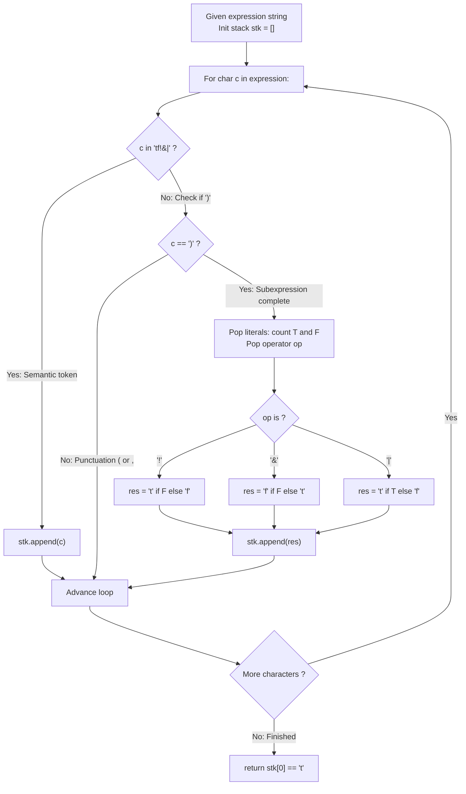

# Guided Example: Parsing A Boolean Expression

We trace the step-by-step syntactic evaluation of nested boolean expressions using an operand-counting reduction stack, prove the Boolean Algebra Reduction Invariant and the Bottom-Up Arity Conservation Theorem, and evaluate expression trees across representative boolean structures:

- **Representative Instance 1 (Nested Conjunction of a Single-Operand Disjunction):**
  $$
  expression = \text{"\&(|(f))"}
  $$
- **Required Output:** `false`
  - Problem definitions:
    - A boolean expression evaluates to either `true` or `false`.
    - Literals: `'t'` is true, `'f'` is false.
    - `'!(subExpr)'`: NOT of sub-expression.
    - `'&(subExpr1, subExpr2, ...)'`: AND of 1 or more sub-expressions.
    - `'|(subExpr1, subExpr2, ...)'`: OR of 1 or more sub-expressions.
    - Return the boolean result of the expression.
  - Step 1: Token Streaming and Stack Pushing:
    - Ignore structural punctuation `(` and `,`.
    - Push operators and literals `'tf!&|'` directly onto stack `stk`.
    - Read char 0: `'&'` $\implies stk = [\mathbf{'\&'}]$.
    - Read char 1: `'('` $\implies$ Skipped.
    - Read char 2: `'|'` $\implies stk = ['\&', \mathbf{'|'}]$.
    - Read char 3: `'('` $\implies$ Skipped.
    - Read char 4: `'f'` $\implies stk = ['\&', '|', \mathbf{'f'}]$.
  - Step 2: First Reduction at Char 5 (`')'`):
    - Reached closing parenthesis of innermost subexpression `|(f)`.
    - Pop consecutive boolean literals from `stk`:
      - Popped `'f'`: $F \leftarrow 1, \; T \leftarrow 0$.
    - Pop opening operator from `stk`:
      - Popped `'|'`.
    - Apply Disjunction Algebra:
      $$
      c = \begin{cases} \text{'t'} & \text{if } T > 0 \\ \text{'f'} & \text{if } T = 0 \end{cases} \implies T = 0 \implies c = \mathbf{\text{'f'}}
      $$
    - Push reduced result onto `stk`:
      $$
      stk = ['\&', \mathbf{\text{'f'}}]
      $$
  - Step 3: Second Reduction at Char 6 (`')'`):
    - Reached closing parenthesis of outer expression `&(f)`.
    - Pop consecutive boolean literals:
      - Popped `'f'`: $F \leftarrow 1, \; T \leftarrow 0$.
    - Pop opening operator:
      - Popped `'&'`.
    - Apply Conjunction Algebra:
      $$
      c = \begin{cases} \text{'f'} & \text{if } F > 0 \\ \text{'t'} & \text{if } F = 0 \end{cases} \implies F = 1 \implies c = \mathbf{\text{'f'}}
      $$
    - Push reduced result onto `stk`:
      $$
      stk = [\mathbf{\text{'f'}}]
      $$
  - Step 4: Final State Resolution:
    - String traversal exhausted.
    - Terminal check: $stk[0] == \text{'t'} \iff \text{'f'} == \text{'t'} \implies \mathbf{false}$.

- **Representative Instance 2 (Multi-Operand OR with Single True):**
  $$
  expression = \text{"|(f,f,f,t)"} \implies T = 1, \; F = 3 \implies T > 0 \implies \mathbf{true}
  $$

- **Representative Instance 3 (Negation of Conjunction):**
  $$
  expression = \text{"!(\&(f,t))"} \implies \&(f, t) = \text{'f'} \implies !(\text{'f'}) = \mathbf{true}
  $$

- **Representative Instance 4 (Single Literal Without Operators):**
  $$
  expression = \text{"t"} \implies stk = [\text{'t'}] \implies \mathbf{true}
  $$

---

## 1. Instance & Teaching Goal

Given a string representing a nested boolean expression with AND, OR, and NOT operators, parse and evaluate its truth value in linear $\mathcal{O}(N)$ time.

```text
The String-Replacement Parser Disaster:
  Repeatedly searching for innermost parenthesized groups and slicing strings:
    Each string replacement copies the entire remaining string.
    For deeply nested expressions of length N = 20000, this takes O(N^2) time
    and allocates tens of thousands of intermediate string copies, risking TLE.

Linear Stack Postfix Reduction Invariant:
  1. Only push meaningful tokens: 't', 'f', '!', '&', '|'.
     Commas ',' and opening parentheses '(' are purely cosmetic structural bounds.
  2. A closing parenthesis ')' unambiguously terminates the arguments of the nearest operator:
       - Pop all boolean literals ('t' and 'f'), counting true (T) and false (F).
       - Pop the operator sitting directly underneath them ('!', '&', '|').
  3. Evaluate the operator in O(1) arithmetic:
       - '!': 't' if F > 0 else 'f'  (negates single operand)
       - '&': 'f' if F > 0 else 't'  (false if ANY operand is false)
       - '|': 't' if T > 0 else 'f'  (true if ANY operand is true)
  4. Push the evaluated literal back onto the stack.
  Runs in strict O(N) time with at most 1 push and 1 pop per token!
```

Ignoring formatting punctuation and reducing operand sequences at each closing parenthesis evaluates nested AST trees in a single pass.

The decisive pedagogical goal is the **Boolean Algebra Reduction Invariant & Bottom-Up Arity Conservation Theorem**:
1. **Punctuation Independence:** Opening parentheses and commas carry zero semantic value; the operator sits immediately beneath its operands on the stack.
2. **Short-Summary Counters:** Regardless of whether an AND or OR group has 2 or 20,000 operands, tracking only the counts $T$ and $F$ captures complete truth values.
3. **Arity Conservation:** Each reduction replaces 1 operator and $k \ge 1$ operands with exactly 1 boolean literal, guaranteeing exactly 1 root token remains at the end.
4. Total time $\mathcal{O}(N)$ and auxiliary space $\mathcal{O}(N)$.

---

## 2. Conceptual Foundation & The Stack Reduction Pipeline



### The Boolean Algebra Reduction Invariant

Let $\mathcal{E}$ be the language of valid boolean expressions over the alphabet $\Sigma = \{ \text{'t'}, \text{'f'}, \text{'!'}, \text{'\&'}, \text{'|'}, \text{'('}, \text{')'}, \text{','} \}$.
1. **Denotational Semantics:**
   The evaluation function $\mathcal{V} : \mathcal{E} \to \{0, 1\}$ is defined as:
   - $\mathcal{V}(\text{'t'}) = 1, \quad \mathcal{V}(\text{'f'}) = 0$.
   - $\mathcal{V}(\text{'!(}e\text{)'}) = 1 - \mathcal{V}(e)$.
   - $\mathcal{V}(\text{'\&(}e_1, \dots, e_m\text{)'}) = \min_{1 \le k \le m} \mathcal{V}(e_k) = \begin{cases} 0 & \text{if } \exists k, \; \mathcal{V}(e_k) = 0 \\ 1 & \text{otherwise} \end{cases}$
   - $\mathcal{V}(\text{'|(}e_1, \dots, e_m\text{)'}) = \max_{1 \le k \le m} \mathcal{V}(e_k) = \begin{cases} 1 & \text{if } \exists k, \; \mathcal{V}(e_k) = 1 \\ 0 & \text{otherwise} \end{cases}$
2. **Postfix Reduction Lemma:**
   Let $stk$ be the stack containing tokens filtered from $\Sigma \setminus \{ \text{'('}, \text{','} \}$.
   When a closing parenthesis `')'` is read:
   - All nested child subexpressions of the current operator have already been reduced to boolean literals.
   - The top of $stk$ consists of $m \ge 1$ tokens from $\{ \text{'t'}, \text{'f'} \}$.
   - The token immediately preceding these $m$ literals is the parent operator $op \in \{ \text{'!'}, \text{'\&'}, \text{'|'} \}$.
3. **Truth Counter Equivalence:**
   Let $T = \sum_{k=1}^m \mathbb{I}(token_k = \text{'t'})$ and $F = \sum_{k=1}^m \mathbb{I}(token_k = \text{'f'})$.
   - For `!`: Arity $m = 1$. If $F = 1$, operand is false $\implies$ NOT is true ($1$). If $F = 0$, NOT is false ($0$).
   - For `&`: Conjunction is false $\iff \exists token_k = \text{'f'} \iff F > 0$.
   - For `|`: Disjunction is true $\iff \exists token_k = \text{'t'} \iff T > 0$.
   Replacing the operator and its operands with the computed character preserves $\mathcal{V}$ across all parent nodes by structural induction. $\blacksquare$

---

## 3. Step-by-Step Worked Execution: Representative Instance 1

$expression = \text{"\&(|(f))"}$.

### Token Trace
- Char 0 `'&'`: Push `'&'` $\implies stk = ['\&']$.
- Char 1 `'('`: Ignore.
- Char 2 `'|'`: Push `'|'` $\implies stk = ['\&', '|']$.
- Char 3 `'('`: Ignore.
- Char 4 `'f'`: Push `'f'` $\implies stk = ['\&', '|', 'f']$.
- Char 5 `')'`:
  - Pop literals: `'f'` $\implies T = 0, F = 1$.
  - Pop operator: `'|'`.
  - Disjunction: $T = 0 \implies$ result `'f'`.
  - Push `'f'` $\implies stk = ['\&', 'f']$.
- Char 6 `')'`:
  - Pop literals: `'f'` $\implies T = 0, F = 1$.
  - Pop operator: `'&'`.
  - Conjunction: $F = 1 \implies$ result `'f'`.
  - Push `'f'` $\implies stk = ['f']$.
- Result: $stk[0] == \text{'t'} \implies$ **`false`**.

---

## 4. Stack Reduction Trace Table

| Char Index | Character Processed | Action Taken | Literals Popped | Operator Popped | Evaluation Rule | Stack Contents After Step |
|:---:|:---:|:---:|:---:|:---:|:---:|:---:|
| $0$ | `'&'` | Push operator | — | — | — | `['&']` |
| $2$ | `'\|'` | Push operator | — | — | — | `['&', '\|']` |
| $4$ | `'f'` | Push literal | — | — | — | `['&', '\|', 'f']` |
| **$5$** | **`')'`** | **Reduce group** | **$T=0, F=1$** | **`'\|'`** | **$T=0 \implies \text{'f'}$** | **`['&', 'f']`** |
| **$6$** | **`')'`** | **Reduce group** | **$T=0, F=1$** | **`'&'`** | **$F=1 \implies \text{'f'}$** | **`['f']`** |
| Final | — | Extract root | — | — | `'f' == 't' \implies \text{false}` | `['f']` |

---

## 5. Algorithmic Correctness

### Soundness & Completeness
1. **Soundness:**
   Every operator is evaluated using exact boolean logic on its immediate children.
2. **Completeness:**
   All parentheses are properly matched; every child is evaluated before its parent terminates.

---

## 6. Boundary Cases & Traps

| Scenario | Input Pattern | Behavior | Trapped Risk |
|---|---|---|---|
| Single Literal | $expression = \text{"t"}$ | Never encounters `)`; leaves `['t']`; returns `true`. | Attempting to pop on single-character inputs. |
| Wide OR Expression | $expression = \text{"\textbar(f,f,f,t)"}$ | Pops multiple `f`s and one `t`; $T=1 > 0 \implies$ `true`. | Premature loop break on first operand. |
| Negation of Conjunction | $expression = \text{"!(\&(f,t))"}$ | Reduces `&` to `f`, then `!` flips to `t`. | Misaligned operator stack popping. |
| Formatting Punctuation | Commas and `(` | Deliberately ignored by token check. | Pushing useless delimiters onto stack. |

---

## 7. Complexity Derivation

- **Time Complexity:** $\mathcal{O}(N)$, where $N = \text{len}(expression) \le 20000$.
  - Scanning the string takes $\mathcal{O}(N)$ time.
  - Each character is pushed onto `stk` at most once.
  - During reduction, each token is popped exactly once.
  - Total amortized stack operations: $\le 2N \implies < 0.005\text{ s}$.
- **Auxiliary Space Complexity:** $\mathcal{O}(N)$ auxiliary memory for the parsing stack `stk`.
