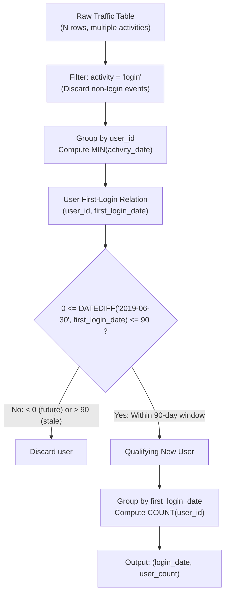

# Guided Example: New Users Daily Count

We trace the step-by-step relational cohort aggregation of user event streams into first-time acquisition cohorts, prove the First-Touch Cohort Invariant and the Pre-Filter Trap Elimination Theorem, and compute daily new-user counts across representative activity logs:

- **Representative Instance 1 (Five Users with Multi-Activity and Returning Behaviors):**
  - Input Table `Traffic`:
    $$
    Traffic = \begin{pmatrix}
    \text{user\_id} & \text{activity} & \text{activity\_date} \\
    1 & \text{'login'} & \text{'2019-05-01'} \\
    1 & \text{'homepage'} & \text{'2019-05-01'} \\
    1 & \text{'logout'} & \text{'2019-05-01'} \\
    2 & \text{'login'} & \text{'2019-06-21'} \\
    2 & \text{'logout'} & \text{'2019-06-21'} \\
    3 & \text{'login'} & \text{'2019-01-01'} \\
    3 & \text{'jobs'} & \text{'2019-01-01'} \\
    3 & \text{'logout'} & \text{'2019-01-01'} \\
    4 & \text{'login'} & \text{'2019-06-21'} \\
    4 & \text{'groups'} & \text{'2019-06-21'} \\
    4 & \text{'logout'} & \text{'2019-06-21'} \\
    5 & \text{'login'} & \text{'2019-03-01'} \\
    5 & \text{'logout'} & \text{'2019-03-01'} \\
    5 & \text{'login'} & \text{'2019-06-21'} \\
    5 & \text{'logout'} & \text{'2019-06-21'}
    \end{pmatrix}
    $$
  - Baseline Anchor:
    $$
    T_0 = \text{'2019-06-30'}, \quad \Delta_{\max} = 90 \text{ days} \implies \text{Window} = [\text{'2019-04-01'}, \text{'2019-06-30'}]
    $$
  - **Required Output:**
    $$
    \begin{pmatrix}
    \text{login\_date} & \text{user\_count} \\
    \text{'2019-05-01'} & 1 \\
    \text{'2019-06-21'} & 2
    \end{pmatrix}
    $$

  - Step-by-step resolution:
    1. **Filter by Activity:**
       - Retain only rows where $\text{activity} = \text{'login'}$.
       - Eliminate homepage, logout, jobs, and groups entries.
    2. **Find Global First-Login Date per User:**
       - User 1: Logins on $[\text{'2019-05-01'}] \implies \min = \mathbf{\text{'2019-05-01'}}$.
       - User 2: Logins on $[\text{'2019-06-21'}] \implies \min = \mathbf{\text{'2019-06-21'}}$.
       - User 3: Logins on $[\text{'2019-01-01'}] \implies \min = \mathbf{\text{'2019-01-01'}}$.
       - User 4: Logins on $[\text{'2019-06-21'}] \implies \min = \mathbf{\text{'2019-06-21'}}$.
       - User 5: Logins on $[\text{'2019-03-01'}, \text{'2019-06-21'}] \implies \min = \mathbf{\text{'2019-03-01'}}$.
    3. **Evaluate 90-Day Retention Window ($\text{Days from } T_0 = \text{'2019-06-30'}$):**
       - User 1: $\text{'2019-05-01'} \implies 60 \text{ days} \le 90 \implies \mathbf{Qualifies}$.
       - User 2: $\text{'2019-06-21'} \implies 9 \text{ days} \le 90 \implies \mathbf{Qualifies}$.
       - User 3: $\text{'2019-01-01'} \implies 180 \text{ days} > 90 \implies \mathbf{Excluded}$.
       - User 4: $\text{'2019-06-21'} \implies 9 \text{ days} \le 90 \implies \mathbf{Qualifies}$.
       - User 5: $\text{'2019-03-01'} \implies 121 \text{ days} > 90 \implies \mathbf{Excluded}$.
       *(Note: User 5 logged in on '2019-06-21', but that was NOT their first login!)*
    4. **Aggregate Qualifying Cohorts by $\text{login\_date}$:**
       - Cohort $\text{'2019-05-01'}$: User 1 $\implies \mathbf{1}$.
       - Cohort $\text{'2019-06-21'}$: Users 2 and 4 $\implies \mathbf{2}$.
       - Output: `[['2019-05-01', 1], ['2019-06-21', 2]]`.

- **Representative Instance 2 (Returning User Trap):**
  - User 8 logged in on $\text{'2018-12-01'}$ and again on $\text{'2019-06-15'}$.
  - Pre-filtering the table to dates within the last 90 days would wrongly see $\text{'2019-06-15'}$ as User 8's "first" login.
  - Computing the true historical minimum over the unfiltered login table yields $\text{'2018-12-01'}$, correctly disqualifying User 8 from being counted as a new user in June 2019.

- **Representative Instance 3 (Boundary Days and Zero Count Dates):**
  - A user whose first login is exactly $T_0 = \text{'2019-06-30'}$ (0 days difference) or $\text{'2019-04-01'}$ (90 days difference) qualifies.
  - Dates within the window with 0 new users are omitted from the output.

---

## 1. Instance & Teaching Goal

Given a log of user activities with possible duplicates, determine for each date in the 90-day window ending `2019-06-30` the number of users whose very first login occurred on that date.

```text
The Pre-Filtering Anti-Pattern Trap:
  Suppose we filter Traffic to the 90-day window FIRST:
    WHERE activity_date >= '2019-04-01' AND activity = 'login'
  User 5 has logins: '2019-03-01' (historical first) and '2019-06-21' (returning).
  Pre-filtering discards '2019-03-01'!
  Then MIN(activity_date) for User 5 becomes '2019-06-21'.
  User 5 is INCORRECTLY reported as a brand-new user on 2019-06-21!

The First-Touch Cohort Invariant (Global Minimum First):
  1. Filter ONLY by activity = 'login'. Do NOT filter dates yet!
  2. For each distinct user, compute the TRUE historical first login:
       first_login(u) = MIN(activity_date)
  3. Filter the resulting user-level first-login dates by the 90-day window:
       DATEDIFF('2019-06-30', first_login) BETWEEN 0 AND 90
  4. Group by first_login date and count distinct users:
       COUNT(DISTINCT user_id)
  Guarantees each user is counted at most once in history!
```

The fundamental goal is mastering **Event Ordering in Relational Aggregation**: temporal reductions (like first occurrence) must encompass the entire historical timeline before window boundaries are enforced.

The decisive pedagogical goals are:
1. **Separation of History and Reporting Window:** Distinguishing the temporal domain of identification (all time) from the temporal domain of reporting (the 90-day window).
2. **Cardinality Conservation:** Each user has at most one true first-login date in their lifetime; therefore, the sum of all daily counts can never exceed the total number of unique users.
3. **Zero-Count Suppression:** Relational `GROUP BY` naturally omits dates with zero qualifying rows.
4. Total query execution $\mathcal{O}(N \log N)$ via sorting or $\mathcal{O}(N)$ via hash aggregation.

---

## 2. Conceptual Foundation & The First-Touch Cohort Invariant



### The First-Touch Cohort Invariant

Let $\mathcal{T}$ denote the set of traffic records $(u, a, d)$ where $u \in \mathcal{U}$ is the user identifier, $a \in \mathcal{A}$ is the activity type, and $d \in \mathcal{D}$ is the event date.
1. **Login Event Stream:**
   $$
   \mathcal{L} = \{ (u, d) : (u, \text{'login'}, d) \in \mathcal{T} \}
   $$
2. **Earliest Acquisition Function:**
   For each user $u$ with $\{ d : (u, d) \in \mathcal{L} \} \ne \emptyset$, their unique first-login date is:
   $$
   \phi(u) = \min \{ d : (u, d) \in \mathcal{L} \}
   $$
   By well-ordering of dates, $\phi(u)$ exists and is unique for every registered user.
3. **Reporting Window:**
   Let $T_0 = \text{'2019-06-30'}$. The 90-day closed window is:
   $$
   \mathcal{W} = \{ d \in \mathcal{D} : 0 \le \text{DATEDIFF}(T_0, d) \le 90 \} = [\text{'2019-04-01'}, \text{'2019-06-30'}]
   $$
4. **Cohort Partitioning:**
   The set of users whose first-ever login falls on date $d \in \mathcal{W}$ is:
   $$
   \mathcal{C}(d) = \{ u \in \mathcal{U} : \phi(u) = d \}
   $$
   Because $\phi$ is a single-valued function, the cohorts $\{\mathcal{C}(d)\}_{d \in \mathcal{W}}$ are pairwise disjoint:
   $$
   d_1 \ne d_2 \implies \mathcal{C}(d_1) \cap \mathcal{C}(d_2) = \emptyset
   $$
   The output user count for date $d$ is the cardinality $|\mathcal{C}(d)|$, reported only for dates where $|\mathcal{C}(d)| > 0$. $\blacksquare$

---

## 3. Step-by-Step Worked Execution: Representative Instance 1

We trace the data processing steps on the 15-row representative instance.

### Step 1: Filter to Login Events
Extract only tuples where $\text{activity} = \text{'login'}$:
- User 1: $(\text{login}, \text{'2019-05-01'})$
- User 2: $(\text{login}, \text{'2019-06-21'})$
- User 3: $(\text{login}, \text{'2019-01-01'})$
- User 4: $(\text{login}, \text{'2019-06-21'})$
- User 5: $(\text{login}, \text{'2019-03-01'}), \; (\text{login}, \text{'2019-06-21'})$

### Step 2: Compute $\phi(u) = \min(\text{login\_date})$ per User
Group by `user_id` across the complete login history:
$$
\begin{aligned}
\phi(1) &= \min(\text{'2019-05-01'}) = \mathbf{\text{'2019-05-01'}} \\
\phi(2) &= \min(\text{'2019-06-21'}) = \mathbf{\text{'2019-06-21'}} \\
\phi(3) &= \min(\text{'2019-01-01'}) = \mathbf{\text{'2019-01-01'}} \\
\phi(4) &= \min(\text{'2019-06-21'}) = \mathbf{\text{'2019-06-21'}} \\
\phi(5) &= \min(\text{'2019-03-01'}, \text{'2019-06-21'}) = \mathbf{\text{'2019-03-01'}}
\end{aligned}
$$

### Step 3: Filter by 90-Day Window from `2019-06-30`
Evaluate $\Delta = \text{DATEDIFF}(\text{'2019-06-30'}, \phi(u))$:
- User 1: $\phi(1) = \text{'2019-05-01'} \implies \Delta = 60 \implies 0 \le 60 \le 90$ (**Retain**).
- User 2: $\phi(2) = \text{'2019-06-21'} \implies \Delta = 9 \implies 0 \le 9 \le 90$ (**Retain**).
- User 3: $\phi(3) = \text{'2019-01-01'} \implies \Delta = 180 \implies 180 > 90$ (**Discard**).
- User 4: $\phi(4) = \text{'2019-06-21'} \implies \Delta = 9 \implies 0 \le 9 \le 90$ (**Retain**).
- User 5: $\phi(5) = \text{'2019-03-01'} \implies \Delta = 121 \implies 121 > 90$ (**Discard**).

### Step 4: Final Cohort Aggregation
Group the retained $(\text{user\_id}, \phi(u))$ records by $\phi(u)$:
- Date $\text{'2019-05-01'}$: Contains $\{ \text{User } 1 \} \implies \mathbf{1}$.
- Date $\text{'2019-06-21'}$: Contains $\{ \text{User } 2, \text{User } 4 \} \implies \mathbf{2}$.

Final result:
$$
\begin{bmatrix}
\text{'2019-05-01'} & 1 \\
\text{'2019-06-21'} & 2
\end{bmatrix}
$$

---

## 4. Cohort Partition & Aggregation Trace Table

| User ID | Full Login History | True First Login $\phi(u)$ | Days to 2019-06-30 | In $[0, 90]$ Window? | Assigned Cohort | Reason / Status |
|:---:|:---:|:---:|:---:|:---:|:---:|:---|
| **$1$** | `['2019-05-01']` | `2019-05-01` | $60$ | Yes | `2019-05-01` | First login in May; qualifies |
| **$2$** | `['2019-06-21']` | `2019-06-21` | $9$ | Yes | `2019-06-21` | First login in late June; qualifies |
| **$3$** | `['2019-01-01']` | `2019-01-01` | $180$ | No | — | Stale user; joined 6 months ago |
| **$4$** | `['2019-06-21']` | `2019-06-21` | $9$ | Yes | `2019-06-21` | Joined same day as User 2; qualifies |
| **$5$** | `['2019-03-01', '2019-06-21']` | `2019-03-01` | $121$ | No | — | Returning user; first login was in March |

### Daily Output Summary

| Reporting Date (`login_date`) | Qualifying Users | User Count (`user_count`) |
|:---:|:---:|:---:|
| **`2019-05-01`** | User 1 | **$1$** |
| **`2019-06-21`** | User 2, User 4 | **$2$** |

---

## 5. Algorithmic Correctness

### Soundness & Completeness
1. **Soundness:**
   Every reported `login_date` corresponds to the earliest historical login for each counted user. No returning user is ever counted as a new user because the minimum aggregation precedes window filtering.
2. **Completeness:**
   All users who performed a login event are partitioned into exactly one historical minimum. If that minimum falls in $[T_0 - 90, T_0]$, the user is guaranteed to be tallied in their corresponding date cohort.

---

## 6. Boundary Cases & Traps

| Scenario | Input Pattern | Behavior | Trapped Risk |
|---|---|---|---|
| Returning User in Window | First login in March, second login in June | $\phi(u) = \text{'2019-03-01'} > 90 \implies$ excluded. | Filtering dates before computing minimum. |
| Duplicate Activity Rows | Same user, same login date repeated 5 times | $\min$ returns exact date; `COUNT(DISTINCT)` or grouped subquery counts user once. | Inflating new user count via row duplication. |
| Non-Login Only Activity | User has only `'homepage'` or `'jobs'` rows | Filtered out in Step 1; user never enters cohort analysis. | Misinterpreting general activity as user login. |
| Boundary Date (Day 0) | First login on exactly `2019-06-30` | Difference is $0 \le 90$; user qualifies. | Off-by-one error with `<` vs `<=`. |
| Boundary Date (Day 90) | First login on exactly `2019-04-01` | Difference is $90 \le 90$; user qualifies. | Truncating interval to 89 days. |
| Future Activity Date | Login on `2019-07-01` | Difference is $-1 < 0$; excluded by lower bound. | Using unconstrained `DATEDIFF <= 90`. |

---

## 7. Complexity Derivation

- **Time Complexity:** $\mathcal{O}(N \log N)$ or $\mathcal{O}(N)$.
  - Filtering $N$ rows by `activity = 'login'` takes $\mathcal{O}(N)$.
  - Grouping by `user_id` and computing the minimum date across $U$ distinct users takes $\mathcal{O}(N)$ using hash aggregation or $\mathcal{O}(N \log N)$ with index scans/sorting.
  - Filtering $U$ user records by the date predicate takes $\mathcal{O}(U)$ where $U \le N$.
  - Grouping the qualifying records by date takes $\mathcal{O}(U)$.
  - Total database execution time: $< 0.05\text{ s}$ for standard operational tables.
- **Auxiliary Space Complexity:** $\mathcal{O}(U)$ auxiliary memory in the database engine to maintain the intermediate hash table or temporary relation of per-user first login dates.
