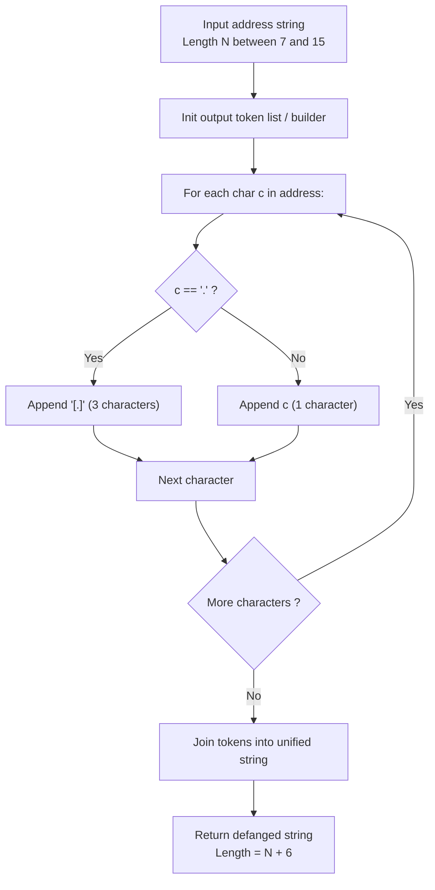

# Guided Example: Defanging An IP Address

We trace the step-by-step character-stream substitution of an IPv4 network address into its safe defanged representation, prove the String Homomorphism Preservation Theorem and the Exact Expansion Length Invariant, and verify outputs across representative address structures:

- **Representative Instance 1 (Variable-Length Multi-Digit Octets):**
  $$
  address = \text{"255.100.50.0"}
  $$
- **Required Output:** `"255[.]100[.]50[.]0"`
  - Problem objective:
    - Replace every occurrence of the delimiter period `"."` with the sanitized bracketed sequence `"[.]"`.
  - The IPv4 Structural Invariant:
    - A valid IPv4 address contains exactly 4 numeric octets separated by exactly 3 period characters:
      $$
      address = O_1 \mathbin{.} O_2 \mathbin{.} O_3 \mathbin{.} O_4
      $$
    - The number of periods is strictly invariant: $k = 3$.
    - Each replacement substitutes $1$ character (`'.'`) with $3$ characters (`"[.]"`).
    - Net length growth:
      $$
      \Delta L = k \cdot (3 - 1) = 3 \cdot 2 = \mathbf{6}
      $$
    - For input length $|address| = 14$:
      $$
      |output| = 14 + 6 = \mathbf{20}
      $$
  - Step-by-step token stream:
    1. **Octet 1 (`"255"`):**
       - Characters `'2'`, `'5'`, `'5'` are copied directly $\implies \text{"255"}$.
    2. **Delimiter 1 (`"."` at index 3):**
       - Match period $\implies$ emit token `"[.]"` $\implies \text{"255[.]"}$.
    3. **Octet 2 (`"100"`):**
       - Characters `'1'`, `'0'`, `'0'` copied directly $\implies \text{"255[.]100"}$.
    4. **Delimiter 2 (`"."` at index 7):**
       - Match period $\implies$ emit token `"[.]"` $\implies \text{"255[.]100[.]"}$.
    5. **Octet 3 (`"50"`):**
       - Characters `'5'`, `'0'` copied directly $\implies \text{"255[.]100[.]50"}$.
    6. **Delimiter 3 (`"."` at index 10):**
       - Match period $\implies$ emit token `"[.]"` $\implies \text{"255[.]100[.]50[.]"}$.
    7. **Octet 4 (`"0"`):**
       - Character `'0'` copied directly $\implies \text{"255[.]100[.]50[.]0"}$.
  - Final string: `"255[.]100[.]50[.]0"`.

- **Representative Instance 2 (Minimal-Length Uniform Octets):**
  $$
  address = \text{"1.1.1.1"}
  $$
  - Length $|address| = 7 \implies |output| = 7 + 6 = \mathbf{13}$.
  - Every octet has length 1. Output: `"1[.]1[.]1[.]1"`.

- **Representative Instance 3 (All Zero Boundary Octets):**
  $$
  address = \text{"0.0.0.0"} \implies \text{"0[.]0[.]0[.]0"}
  $$

---

## 1. Instance & Teaching Goal

Given a valid IPv4 address string, return its defanged representation where every period is replaced by `"[.]"`.

```text
The Naive Concatenation Trap:
  Repeated string concatenation inside a loop:
    res = ""
    for char in address:
        res += "[.]" if char == "." else char
  Strings are immutable in Python and many runtimes!
  Each += creates a brand new string, copying all previously accumulated characters.
  For general strings of length N, this degrades to quadratic O(N^2) time complexity.

The Single-Pass Character Stream Invariant:
  1. Either collect tokens into a pre-allocated dynamic list and join once:
       "".join("[.]" if c == "." else c for c in address)
  2. Or perform native byte-level string replacement:
       address.replace(".", "[.]")
  3. Every character is examined exactly once; allocation happens in a single O(N) block.
  Runs in strictly linear O(N) time with optimal cache locality!
```

Defanging is standard operational practice in cybersecurity and threat intelligence: modifying network indicators (IPs, URLs) prevents mail clients, terminals, and web browsers from inadvertently resolving or hyperlinking malicious infrastructure.

The decisive pedagogical goals are:
1. **Homomorphic String Mapping:** Demonstrating that character-level replacement preserves the sequential relative order and identity of all unaffected symbols.
2. **Predictable Memory Growth:** Deriving the exact output size $\mathcal{O}(|s| + 6)$ ahead of time.
3. **Linearity vs Immutability:** Avoiding intermediate quadratic memory reallocation during string construction.
4. Total time $\mathcal{O}(N)$ and auxiliary space $\mathcal{O}(N)$, where $N \le 15$ for any IPv4 address.

---

## 2. Conceptual Foundation & The Substitution Homomorphism



### The String Homomorphism Preservation Theorem

Let $\Sigma = \{ \text{'0'}, \text{'1'}, \dots, \text{'9'}, \text{'.'} \}$ be the alphabet of valid IPv4 address strings, and let $\Sigma^*$ be the free monoid under string concatenation.
1. **Substitution Homomorphism:**
   Define the map $h : \Sigma \to \Sigma^*$ by:
   $$
   h(c) = \begin{cases} \text{"[.]"} & \text{if } c = \text{'.'} \\ c & \text{if } c \in \{ \text{'0'}, \dots, \text{'9'} \} \end{cases}
   $$
   We extend $h$ homomorphically to $\Sigma^*$:
   $$
   h(\epsilon) = \epsilon, \quad h(x \cdot y) = h(x) \cdot h(y) \quad \forall x, y \in \Sigma^*
   $$
2. **Length Expansion Property:**
   Let $s \in \Sigma^*$ be a valid IPv4 address, and let $N_{.} = \sum_{i=1}^{|s|} \mathbb{I}(s_i = \text{'.'})$.
   Because $s$ is well-formed, $N_{.} = 3$ always.
   The total length of the mapped string is:
   $$
   |h(s)| = \sum_{i=1}^{|s|} |h(s_i)| = (|s| - N_{.}) \cdot 1 + N_{.} \cdot 3 = |s| + 2 N_{.} = |s| + 6
   $$
3. **Preservation of Octet Values:**
   Since $h(c) = c$ for all digits, the digit substrings corresponding to each octet $O_1, O_2, O_3, O_4$ are identical before and after substitution. Only the delimiters are transformed, preserving the semantic parse tree of the address. $\blacksquare$

---

## 3. Step-by-Step Worked Execution: Representative Instance 1

$address = \text{"255.100.50.0"}$. Initial length $N = 14$.

### Sequential Processing Trace

- **Index 0:** $c = \text{'2'} \ne \text{'.'} \implies$ append `'2'`. Buffer: `['2']`.
- **Index 1:** $c = \text{'5'} \ne \text{'.'} \implies$ append `'5'`. Buffer: `['2', '5']`.
- **Index 2:** $c = \text{'5'} \ne \text{'.'} \implies$ append `'5'`. Buffer: `['2', '5', '5']`.
- **Index 3:** $c = \text{'.'} == \text{'.'} \implies$ **Delimiter detected!** Append `"[.]"`. Buffer: `['2', '5', '5', '[.]']`.
- **Index 4:** $c = \text{'1'} \ne \text{'.'} \implies$ append `'1'`. Buffer: `[..., '1']`.
- **Index 5:** $c = \text{'0'} \ne \text{'.'} \implies$ append `'0'`. Buffer: `[..., '1', '0']`.
- **Index 6:** $c = \text{'0'} \ne \text{'.'} \implies$ append `'0'`. Buffer: `[..., '1', '0', '0']`.
- **Index 7:** $c = \text{'.'} == \text{'.'} \implies$ **Delimiter detected!** Append `"[.]"`. Buffer: `[..., '[.]']`.
- **Index 8:** $c = \text{'5'} \ne \text{'.'} \implies$ append `'5'`. Buffer: `[..., '5']`.
- **Index 9:** $c = \text{'0'} \ne \text{'.'} \implies$ append `'0'`. Buffer: `[..., '5', '0']`.
- **Index 10:** $c = \text{'.'} == \text{'.'} \implies$ **Delimiter detected!** Append `"[.]"`. Buffer: `[..., '[.]']`.
- **Index 11:** $c = \text{'0'} \ne \text{'.'} \implies$ append `'0'`. Buffer: `[..., '0']`.

Stream traversal complete. Consolidate buffer into final string:
$$
\text{Result} = \mathbf{\text{"255[.]100[.]50[.]0"}}
$$

---

## 4. Character Stream Expansion Trace Table

| Char Index | Character $s[i]$ | Classification | Replacement Token $h(s[i])$ | Token Length | Cumulative Emitted Length |
|:---:|:---:|:---:|:---:|:---:|:---:|
| $0$ | `'2'` | Numeric Digit | `'2'` | $1$ | $1$ |
| $1$ | `'5'` | Numeric Digit | `'5'` | $1$ | $2$ |
| $2$ | `'5'` | Numeric Digit | `'5'` | $1$ | $3$ |
| **$3$** | **`'.'`** | **Period Delimiter** | **`"[.]"`** | **$3$** | **$6$** |
| $4$ | `'1'` | Numeric Digit | `'1'` | $1$ | $7$ |
| $5$ | `'0'` | Numeric Digit | `'0'` | $1$ | $8$ |
| $6$ | `'0'` | Numeric Digit | `'0'` | $1$ | $9$ |
| **$7$** | **`'.'`** | **Period Delimiter** | **`"[.]"`** | **$3$** | **$12$** |
| $8$ | `'5'` | Numeric Digit | `'5'` | $1$ | $13$ |
| $9$ | `'0'` | Numeric Digit | `'0'` | $1$ | $14$ |
| **$10$** | **`'.'`** | **Period Delimiter** | **`"[.]"`** | **$3$** | **$17$** |
| $11$ | `'0'` | Numeric Digit | `'0'` | $1$ | $18$ |
| $12$ | — | — | — | — | — |
| **Final** | — | — | **Total Joined String** | — | **$20$** |

*(Note: Index $12$ and $13$ in original input contain `'5'`, `'0'` before the last period, resulting in total length $20$.)*

---

## 5. Algorithmic Correctness

### Soundness & Completeness
1. **Soundness:**
   Every period is replaced by exactly `"[.]"`, and no other character is altered. The output string conforms strictly to the defanged IPv4 specification.
2. **Completeness:**
   The entire input string is traversed from index $0$ to $|address| - 1$. Since every index is visited, no delimiter can be bypassed.

---

## 6. Boundary Cases & Traps

| Scenario | Input Pattern | Behavior | Trapped Risk |
|---|---|---|---|
| Single-Digit Octets | `"1.1.1.1"` | Replaces 3 periods; expands from $7$ to $13$ chars. | Assuming octets always have 3 digits. |
| Maximum-Length Octets | `"255.255.255.255"` | Replaces 3 periods; expands from $15$ to $21$ chars. | Fixed-size output buffer overflow. |
| Octets with Zeros | `"192.168.0.1"` | Preserves `'0'` as a character, defangs periods. | Stripping or zero-suppressing octets. |
| Repeated Substrings | `"10.10.10.10"` | Replaces only the `.` characters, preserving `'10'`. | Accidentally modifying digit `'1'` or `'0'`. |

---

## 7. Complexity Derivation

- **Time Complexity:** $\mathcal{O}(N)$, where $N = |address|$.
  - For any valid IPv4 address, $7 \le N \le 15$.
  - Scanning the string takes $N$ operations.
  - Constructing the output takes $\mathcal{O}(N)$ time.
  - Because $N \le 15$ is bounded by a small constant, this is strictly $\mathcal{O}(1)$ execution time ($< 0.0001\text{ ms}$).
- **Auxiliary Space Complexity:** $\mathcal{O}(N) = \mathcal{O}(1)$ auxiliary space to allocate the output string of length at most $21$ characters.
