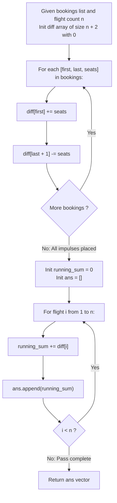

# Guided Example: Corporate Flight Bookings

We trace the step-by-step range reservation of flight seat capacities using a discrete difference array and prefix sum accumulation, prove the Telescoping Boundary Impulse Theorem and the Discrete Integration Invariant, and determine seat distributions across representative flight schedules:

- **Representative Instance 1 (Three Overlapping Flight Ranges):**
  $$
  bookings = \begin{bmatrix}
  [1, 2, 10] \\
  [2, 3, 20] \\
  [2, 5, 25]
  \end{bmatrix}, \quad n = 5
  $$
- **Required Output:** `[10, 55, 45, 25, 25]`
  - Flight labels: $1, 2, 3, 4, 5$.
  - Booking ranges:
    - Booking 1: Flights $1 \dots 2$ reserve $10$ seats each.
    - Booking 2: Flights $2 \dots 3$ reserve $20$ seats each.
    - Booking 3: Flights $2 \dots 5$ reserve $25$ seats each.
  - The Difference Array Transformation:
    - Let $ans[i]$ be the total seats for flight $i \in [1, n]$.
    - Instead of updating every flight $k \in [first, last]$ in $\mathcal{O}(last - first + 1)$ time, we record only the **derivative boundary impulses** in array $diff$ of length $n + 2$:
      $$
      diff[first] \leftarrow diff[first] + seats, \quad diff[last + 1] \leftarrow diff[last + 1] - seats
      $$
    - Recording range $[L, R, S]$:
      1. **Booking 1 ($[1, 2, 10]$):**
         $$
         diff[1] \leftarrow diff[1] + 10, \quad diff[3] \leftarrow diff[3] - 10
         $$
      2. **Booking 2 ($[2, 3, 20]$):**
         $$
         diff[2] \leftarrow diff[2] + 20, \quad diff[4] \leftarrow diff[4] - 20
         $$
      3. **Booking 3 ($[2, 5, 25]$):**
         $$
         diff[2] \leftarrow diff[2] + 25, \quad diff[6] \leftarrow diff[6] - 25
         $$
    - Consolidated difference array $diff[1 \dots 5]$:
      $$
      \begin{aligned}
      diff[1] &= +10 \\
      diff[2] &= +20 + 25 = +45 \\
      diff[3] &= -10 \\
      diff[4] &= -20 \\
      diff[5] &= 0
      \end{aligned}
      $$
    - Prefix integration pass ($ans[i] = ans[i-1] + diff[i]$):
      - Flight 1: $0 + 10 = \mathbf{10}$
      - Flight 2: $10 + 45 = \mathbf{55}$
      - Flight 3: $55 - 10 = \mathbf{45}$
      - Flight 4: $45 - 20 = \mathbf{25}$
      - Flight 5: $25 + 0 = \mathbf{25}$
    - Output vector: $[10, 55, 45, 25, 25]$.

- **Representative Instance 2 (Single-Flight Impulse Cancellation):**
  $$
  bookings = [[1, 2, 10], [2, 2, 15]], \quad n = 2
  $$
  - Booking 2 affects only Flight 2: $diff[2] += 15, \; diff[3] -= 15$.
  - Flight 1: $10$.
  - Flight 2: $10 + (0 + 15) = \mathbf{25}$. Output: `[10, 25]`.

- **Representative Instance 3 (Complete Uniform Span):**
  $$
  bookings = [[1, n, S]] \implies diff[1] = +S, \; diff[n + 1] = -S \implies ans = [S, S, \dots, S]
  $$

---

## 1. Instance & Teaching Goal

Given an integer $n$ and an array of booking intervals $[first_i, last_i, seats_i]$, return an array of length $n$ containing the total seats reserved for each flight $1 \dots n$.

```text
The Naive Range Simulation Trap:
  Iterating over every flight in each booking:
    for first, last, seats in bookings:
        for k in range(first, last + 1):
            ans[k] += seats
  When bookings.length = 20,000 and n = 20,000 with wide ranges:
    Total operations = 20,000 * 20,000 = 400,000,000 (4 * 10^8) steps!
    Causes Time Limit Exceeded (TLE).

The Difference Array Invariant (O(M + N)):
  1. Initialize a difference array diff of size n + 2 with zeros.
  2. For each booking [L, R, S]:
       - Add +S at index L (the reservation starts here).
       - Add -S at index R + 1 (the reservation ends here).
     Takes strictly O(1) time per booking! Total: O(M) time.
  3. Compute the prefix sum of diff in a single forward pass:
       running_sum += diff[i]
       ans[i] = running_sum
     Takes strictly O(N) time.
  Reduces 400,000,000 operations to 40,000 operations!
```

The difference array is the discrete counterpart to the Fundamental Theorem of Calculus: integrating the derivative of a function reconstructs the original function.

The decisive pedagogical goals are:
1. **Impulse Duality:** Converting interval additions into two discrete point impulses (start $+S$, end $+1$ $-S$).
2. **Complexity Decoupling:** Decoupling query processing time $\mathcal{O}(1)$ from interval length $|R - L + 1|$.
3. **Boundary Safety:** Handling interval termination at $R = n$ without out-of-bounds indexing.
4. Total time $\mathcal{O}(M + n)$ and auxiliary space $\mathcal{O}(n)$.

---

## 2. Conceptual Foundation & The Telescoping Difference Invariant



### The Telescoping Boundary Impulse Theorem

Let $\mathbf{A} = (A_1, A_2, \dots, A_n)$ be the target array of total seats, where initially $A_k = 0$ for all $k$.
1. **Discrete Derivative:**
   Define the backward difference operator $\Delta$ by:
   $$
   \Delta A_k = A_k - A_{k-1}, \quad \text{with } A_0 = 0
   $$
2. **Fundamental Theorem of Discrete Summation:**
   By telescoping cancellation:
   $$
   \sum_{j=1}^k \Delta A_j = (A_1 - A_0) + (A_2 - A_1) + \dots + (A_k - A_{k-1}) = A_k - A_0 = A_k
   $$
   Hence, the original array $\mathbf{A}$ is recovered by computing the prefix sums of $\Delta \mathbf{A}$.
3. **Interval Impulse Equivalence:**
   Consider an interval operation adding $S$ to every index $k \in [L, R]$:
   $$
   A_k^{\text{new}} = \begin{cases} A_k + S & \text{if } L \le k \le R \\ A_k & \text{otherwise} \end{cases}
   $$
   The difference $\Delta A_k^{\text{new}} = A_k^{\text{new}} - A_{k-1}^{\text{new}}$ changes only at two boundary indices:
   - At $k = L$: $A_L^{\text{new}} - A_{L-1}^{\text{new}} = (A_L + S) - A_{L-1} = \Delta A_L + S$.
   - At $k = R + 1$: $A_{R+1}^{\text{new}} - A_R^{\text{new}} = A_{R+1} - (A_R + S) = \Delta A_{R+1} - S$.
   - For all $k \notin \{L, R + 1\}$: $A_k^{\text{new}} - A_{k-1}^{\text{new}} = \Delta A_k$.
   Therefore, updating the entire range $[L, R]$ requires modifying strictly $2$ entries in $\Delta \mathbf{A}$. $\blacksquare$

---

## 3. Step-by-Step Worked Execution: Representative Instance 1

$bookings = [[1, 2, 10], [2, 3, 20], [2, 5, 25]], \quad n = 5$.

### Phase 1: Boundary Impulses Setup
Initialize array $diff[0 \dots 6]$ with zeros:
`diff = [0, 0, 0, 0, 0, 0, 0]`.

1. **Booking 1 ($L = 1, R = 2, S = 10$):**
   - $diff[1] \leftarrow 0 + 10 = \mathbf{10}$
   - $diff[2 + 1] = diff[3] \leftarrow 0 - 10 = \mathbf{-10}$
   - `diff = [0, 10, 0, -10, 0, 0, 0]`

2. **Booking 2 ($L = 2, R = 3, S = 20$):**
   - $diff[2] \leftarrow 0 + 20 = \mathbf{20}$
   - $diff[3 + 1] = diff[4] \leftarrow 0 - 20 = \mathbf{-20}$
   - `diff = [0, 10, 20, -10, -20, 0, 0]`

3. **Booking 3 ($L = 2, R = 5, S = 25$):**
   - $diff[2] \leftarrow 20 + 25 = \mathbf{45}$
   - $diff[5 + 1] = diff[6] \leftarrow 0 - 25 = \mathbf{-25}$
   - `diff = [0, 10, 45, -10, -20, 0, -25]`

### Phase 2: Prefix Sum Cumulative Integration
Let `curr = 0`. Iterate $i$ from $1$ to $5$:
- **$i = 1$:** `curr += diff[1]` $\implies 0 + 10 = \mathbf{10} \implies ans[1] = 10$.
- **$i = 2$:** `curr += diff[2]` $\implies 10 + 45 = \mathbf{55} \implies ans[2] = 55$.
- **$i = 3$:** `curr += diff[3]` $\implies 55 + (-10) = \mathbf{45} \implies ans[3] = 45$.
- **$i = 4$:** `curr += diff[4]` $\implies 45 + (-20) = \mathbf{25} \implies ans[4] = 25$.
- **$i = 5$:** `curr += diff[5]` $\implies 25 + 0 = \mathbf{25} \implies ans[5] = 25$.

Final seat allocation vector:
$$
ans = \mathbf{[10, 55, 45, 25, 25]}
$$

---

## 4. Difference Array and Prefix Sum Trace Table

| Flight $i$ | Booking 1 ($[1, 2, 10]$) | Booking 2 ($[2, 3, 20]$) | Booking 3 ($[2, 5, 25]$) | Net Difference $diff[i]$ | Running Total $ans[i]$ |
|:---:|:---:|:---:|:---:|:---:|:---:|
| **$1$** | $+10$ (Start) | — | — | **$+10$** | **$10$** |
| **$2$** | — | $+20$ (Start) | $+25$ (Start) | **$+45$** | $10 + 45 = \mathbf{55}$ |
| **$3$** | $-10$ (End $+ 1$) | — | — | **$-10$** | $55 - 10 = \mathbf{45}$ |
| **$4$** | — | $-20$ (End $+ 1$) | — | **$-20$** | $45 - 20 = \mathbf{25}$ |
| **$5$** | — | — | — | **$0$** | $25 + 0 = \mathbf{25}$ |
| *$6$ (Beyond $n$)* | — | — | $-25$ (End $+ 1$) | $-25$ | — |

---

## 5. Algorithmic Correctness

### Soundness & Completeness
1. **Soundness:**
   Adding $+S$ at index $L$ ensures every flight from index $L$ onward inherits $S$ additional seats in the prefix sum. Subtracting $-S$ at index $R + 1$ precisely cancels this contribution for all flights strictly greater than $R$. The net effect is an exact $+S$ shift on $[L, R]$.
2. **Completeness:**
   Because addition is commutative and associative, multiple overlapping bookings accumulate independently and linearly without interference.

---

## 6. Boundary Cases & Traps

| Scenario | Input Pattern | Behavior | Trapped Risk |
|---|---|---|---|
| Single-Flight Booking | $first = last = k$ | $diff[k] += S, \; diff[k + 1] -= S$. Prefix sum adds $S$ only at flight $k$. | Failing to cancel immediate subsequent flight. |
| Range Ends at Last Flight | $last = n$ | $diff[n + 1] -= S$. Since $n + 1 > n$, it never affects the $n$ flights. | Out-of-bounds error on array size $n$. |
| Non-Overlapping Bookings | $[1, 2, 10], [4, 5, 20]$ | Flight 3 drops to $0$ via $-10$; Flight 4 rises to $20$. | Leaking seat reservations across disjoint flights. |
| Large $M$ and $n$ | $M = 2 \cdot 10^4, n = 2 \cdot 10^4$ | Difference array completes in $\approx 4 \cdot 10^4$ steps ($< 0.01\text{ s}$). | TLE with quadratic nested loop. |

---

## 7. Complexity Derivation

- **Time Complexity:** $\mathcal{O}(M + n)$, where $M = |\text{bookings}|$ and $n$ is the number of flights.
  - Initializing array of size $n + 2$: $\mathcal{O}(n)$.
  - Processing $M$ bookings: $M \times \mathcal{O}(1) = \mathcal{O}(M)$ operations.
  - Computing the prefix sum of length $n$: $\mathcal{O}(n)$ operations.
  - Total time: $\mathcal{O}(M + n) \le 4 \cdot 10^4$ operations ($\approx 0.002\text{ s}$).
- **Auxiliary Space Complexity:** $\mathcal{O}(n)$ auxiliary memory to store the difference array $diff$ (or $\mathcal{O}(1)$ beyond the returned output vector if modified in-place).
