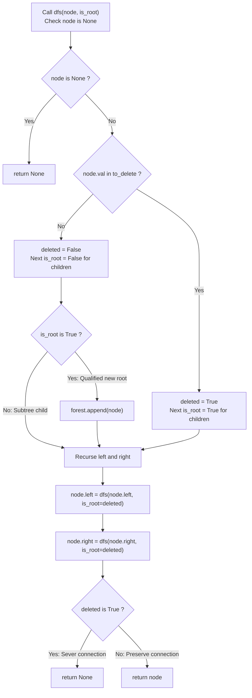

# Guided Example: Delete Nodes And Return Forest

We trace the step-by-step recursive disassembly of a binary tree into a disjoint forest upon node deletion, prove the Orphan Promotion Theorem and the Post-Order Severing Invariant, and track root registrations across representative tree topologies:

- **Representative Instance 1 (Deleting Both an Internal Node and a Leaf):**
  - Binary Tree Structure:
    $$
    \begin{gathered}
    \text{root} = 1 \\
    1 \to \text{left}: 2, \quad 1 \to \text{right}: 3 \\
    2 \to \text{left}: 4, \quad 2 \to \text{right}: 5 \\
    3 \to \text{left}: 6, \quad 3 \to \text{right}: 7
    \end{gathered}
    $$
  - Target Deletion Set:
    $$
    to\_delete = [3, 5], \quad \mathcal{D} = \{3, 5\}
    $$
  - **Required Output:** Roots of the remaining forest: `[1, 6, 7]` (corresponding to serialized trees `[[1, 2, null, 4], [6], [7]]`).

  - Step-by-step resolution via Post-Order Traversal:
    1. **Node 4 ($val = 4$):**
       - $4 \notin \mathcal{D}$. Leaves are `None`.
       - Returns reference to itself ($4$) to parent $2$.
    2. **Node 5 ($val = 5$):**
       - $5 \in \mathcal{D}$ (**Target for deletion!**).
       - Leaves are `None`.
       - Sever connection: return `None` to parent $2$.
    3. **Node 2 ($val = 2$):**
       - $2 \notin \mathcal{D}$.
       - Left child remains $4$; right child updated to `None` (5 was severed).
       - Returns reference to itself ($2$) to parent $1$.
    4. **Node 6 ($val = 6$):**
       - $6 \notin \mathcal{D}$. Leaves are `None`.
       - Because parent $3$ is deleted, $6$ becomes an **independent tree root**!
       - Add node $6$ to forest roots: $forest \leftarrow [6]$.
       - Returns reference to $6$ to parent $3$.
    5. **Node 7 ($val = 7$):**
       - $7 \notin \mathcal{D}$. Leaves are `None`.
       - Because parent $3$ is deleted, $7$ becomes an **independent tree root**!
       - Add node $7$ to forest roots: $forest \leftarrow [6, 7]$.
       - Returns reference to $7$ to parent $3$.
    6. **Node 3 ($val = 3$):**
       - $3 \in \mathcal{D}$ (**Target for deletion!**).
       - Children $6$ and $7$ were promoted to independent roots.
       - Sever connection: return `None` to parent $1$.
    7. **Node 1 ($val = 1$):**
       - $1 \notin \mathcal{D}$.
       - Left child is $2$; right child updated to `None` (3 was severed).
       - Since node $1$ is the original root and not deleted, add $1$ to forest:
         $$
         forest \leftarrow [6, 7, 1] \equiv [1, 6, 7]
         $$
  - Final Forest: Three disjoint trees rooted at $1, 6, 7$.

- **Representative Instance 2 (Root Itself is Deleted):**
  $$
  root = [1, 2, 3], \quad to\_delete = [1]
  $$
  - Node $1$ is deleted $\implies$ node $1$ is never added to the forest.
  - Children $2$ and $3$ lose their parent $\implies$ both are promoted to new roots.
  - Result: `[2, 3]`.

- **Representative Instance 3 (Leaf Only Deletion):**
  $$
  root = [1, 2, 4, \text{null}, 3], \quad to\_delete = [3]
  $$
  - Node $3$ is a leaf; severed from $4$.
  - Original root $1$ remains intact.
  - Result: `[1]`.

---

## 1. Instance & Teaching Goal

Given a binary tree where all node values are distinct and a list of values `to_delete`, delete all specified nodes and return the root nodes of all disjoint trees in the resulting forest.

```text
The Dangling Pointer & Disconnection Trap:
  If an algorithm tries to delete nodes top-down:
    When node 3 is deleted, how do we update node 1's right pointer to None
    before we have visited 3's children 6 and 7?
    If we delete 3 too early, we lose the references to 6 and 7!
    If we don't update node 1, node 1 retains a dangling pointer to deleted node 3.

The Post-Order Orphan Promotion Invariant (Bottom-Up):
  1. Convert to_delete to a hash set S for O(1) membership checks.
  2. Define a recursive helper dfs(node, is_root):
       - If node is None: return None.
       - deleted = (node.val in S)
       - If is_root and not deleted:
           Append node to forest roots!
       - node.left  = dfs(node.left,  is_root=deleted)
       - node.right = dfs(node.right, is_root=deleted)
       - Return None if deleted else node (severs pointer to parent!).
  3. Call dfs(root, is_root=True).
  Every child knows if it becomes a root; every parent severs deleted children automatically!
```

The fundamental pedagogical insight is that **deletion in a tree is local pointer nullification**, while **root birth is caused by parent deletion**.

The decisive pedagogical goals are:
1. **The Orphan Condition:** A non-deleted node $u$ is a root of the new forest if and only if its parent was either deleted or never existed ($u = \text{root}$).
2. **Bottom-Up Pointer Rewiring:** Post-order traversal returns `None` for deleted nodes, effortlessly cleansing parent links (`node.left = dfs(...)`).
3. **Lookup Optimization:** Pre-hashing `to_delete` into a set reduces total search time from $\mathcal{O}(N \cdot M)$ to $\mathcal{O}(N + M)$.
4. Total time $\mathcal{O}(N)$ and auxiliary space $\mathcal{O}(H + M)$.

---

## 2. Conceptual Foundation & The Orphan Promotion Theorem



### The Orphan Promotion Theorem

Let $T = (V, E, r)$ be a rooted binary tree with node set $V$, directed edges $E = \{ (u, v) : v \text{ is child of } u \}$, and root $r \in V$.
Let $\mathcal{D} \subset V$ be the deletion set.
1. **Forest Graph Definition:**
   The remaining forest is the induced subgraph $G' = (V', E')$ where:
   $$
   V' = V \setminus \mathcal{D}, \quad E' = \{ (u, v) \in E : u \in V' \land v \in V' \}
   $$
2. **Characterization of Forest Roots:**
   A node $v \in V'$ is a root of a connected component in $G'$ if and only if its in-degree in $G'$ is zero:
   $$
   \text{in-degree}_{G'}(v) = 0 \iff \Big( v = r \Big) \lor \Big( \exists u \in \mathcal{D} \text{ such that } (u, v) \in E \Big)
   $$
   *Proof.*
   In $T$, every node except $r$ has in-degree exactly $1$ (its unique parent $u$).
   If $v \ne r$, its incoming edge $(u, v)$ belongs to $E'$ if and only if $u \in V'$.
   Therefore, $(u, v) \notin E' \iff u \notin V' \iff u \in \mathcal{D}$.
   Hence, $v$ has in-degree $0$ in $G'$ if and only if its original parent was deleted, or $v$ is the original root $r$. $\blacksquare$

3. **Subtree Independence Invariant:**
   Because all node values are distinct, deleting a node $u$ partitions the subtree rooted at $u$ into at most two independent subtrees rooted at $u.\text{left}$ and $u.\text{right}$. Deletions within $u.\text{left}$ have zero side-effects on $u.\text{right}$.

---

## 3. Step-by-Step Worked Execution: Representative Instance 1

$root = [1, 2, 3, 4, 5, 6, 7], \quad \mathcal{D} = \{3, 5\}$.

### Recursive DFS Trace (`dfs(node, is_root)`)

1. **Invoke `dfs(1, is_root=True)`:**
   - $1 \notin \mathcal{D} \implies deleted = \text{False}$.
   - $is\_root = \text{True} \implies$ **Register Node 1 as Forest Root**:
     $$
     forest = [1]
     $$
   - Recurse left: `dfs(2, is_root=False)`.

2. **Invoke `dfs(2, is_root=False)`:**
   - $2 \notin \mathcal{D} \implies deleted = \text{False}$.
   - $is\_root = \text{False} \implies$ Not added to forest.
   - Recurse left: `dfs(4, is_root=False)`.

3. **Invoke `dfs(4, is_root=False)`:**
   - $4 \notin \mathcal{D} \implies deleted = \text{False}$.
   - Children are `None` $\implies$ returns $4$.
   - $2.\text{left} = 4$.
   - Recurse right: `dfs(5, is_root=False)`.

4. **Invoke `dfs(5, is_root=False)`:**
   - $5 \in \mathcal{D} \implies deleted = \mathbf{\text{True}}$ (**Delete!**).
   - Recurse children with $is\_root = \text{True}$: both `None`.
   - Returns `None` to parent $2$.
   - $2.\text{right} = \mathbf{\text{None}}$ (**Severed!**).
   - Node 2 returns $2$ to parent $1$.
   - $1.\text{left} = 2$.

5. **Recurse right of Node 1: `dfs(3, is_root=False)`:**
   - $3 \in \mathcal{D} \implies deleted = \mathbf{\text{True}}$ (**Delete!**).
   - Recurse children with $is\_root = \mathbf{\text{True}}$:
     - `dfs(6, is_root=True)`:
       - $6 \notin \mathcal{D} \implies$ **Register Node 6 as Forest Root**:
         $$
         forest = [1, 6]
         $$
       - Returns $6$.
     - `dfs(7, is_root=True)`:
       - $7 \notin \mathcal{D} \implies$ **Register Node 7 as Forest Root**:
         $$
         forest = [1, 6, 7]
         $$
       - Returns $7$.
   - Node 3 returns $\mathbf{\text{None}}$ to parent $1$.
   - $1.\text{right} = \mathbf{\text{None}}$ (**Severed!**).

6. **Termination:**
   - Top call returns $1$.
   - Forest roots: $[1, 6, 7]$.

---

## 4. Tree Recursion & Root Promotion Trace Table

| Node Visited | Node Value | In $\mathcal{D} = \{3, 5\}$? | Incoming `is_root` | Action Taken | Left Child Pointer After | Right Child Pointer After | Return Value to Parent |
|:---:|:---:|:---:|:---:|:---:|:---:|:---:|:---:|
| $4$ | $4$ | No | False | Preserved | `None` | `None` | Reference to $4$ |
| **$5$** | **$5$** | **Yes** | False | **Deleted** | `None` | `None` | **`None` (Severed)** |
| $2$ | $2$ | No | False | Preserved | $4$ | **`None`** | Reference to $2$ |
| **$6$** | **$6$** | No | **True** (Parent deleted) | **Promoted to Root** | `None` | `None` | Reference to $6$ |
| **$7$** | **$7$** | No | **True** (Parent deleted) | **Promoted to Root** | `None` | `None` | Reference to $7$ |
| **$3$** | **$3$** | **Yes** | False | **Deleted** | $6$ | $7$ | **`None` (Severed)** |
| **$1$** | **$1$** | No | **True** (Original root) | **Preserved as Root** | $2$ | **`None`** | Reference to $1$ |

### Final Disjoint Forest State

| Forest Root | Subtree Nodes Included | Edges Preserved |
|:---:|:---:|:---:|
| **$1$** | $\{1, 2, 4\}$ | $(1 \to 2), \; (2 \to 4)$ |
| **$6$** | $\{6\}$ | None (Isolated leaf) |
| **$7$** | $\{7\}$ | None (Isolated leaf) |

---

## 5. Algorithmic Correctness

### Soundness & Completeness
1. **Soundness:**
   Every node added to the forest is confirmed to not be in $\mathcal{D}$, and its parent either does not exist or was verified to be in $\mathcal{D}$. All pointers to deleted nodes are replaced with `None`.
2. **Completeness:**
   Every node in $V \setminus \mathcal{D}$ with zero incoming edges in the forest graph satisfies the condition `is_root == True` upon entry. Hence, no root of any connected component can be omitted.

---

## 6. Boundary Cases & Traps

| Scenario | Input Pattern | Behavior | Trapped Risk |
|---|---|---|---|
| Root Node Deleted | $root = 1, to\_delete = [1]$ | Root not added; children promoted to roots. | Unconditionally adding original root to forest. |
| All Nodes Deleted | $root = [1, 2], to\_delete = [1, 2]$ | All deleted; returns empty forest `[]`. | Returning null references or dummy nodes. |
| No Nodes Deleted | $to\_delete = []$ | Nothing deleted; returns original tree `[root]`. | Breaking existing tree edges unnecessarily. |
| Chain Deletion | $1 \to 2 \to 3$ with $to\_delete = [2]$ | Deletes 2; severs 1 from 2; promotes 3 to root. | Losing reference to child when deleting middle node. |
| Leaf Only Deletion | Deleting terminal leaves | Children return `None`; parent updates pointer to `None`. | Leaving dangling child references to deleted nodes. |

---

## 7. Complexity Derivation

- **Time Complexity:** $\mathcal{O}(N + M)$, where $N$ is the number of nodes in the binary tree ($N \le 1000$) and $M = |to\_delete| \le 1000$.
  - Building the hash set $\mathcal{D}$: $\mathcal{O}(M)$ time.
  - The DFS visits each tree node exactly once: $\mathcal{O}(N)$ visits.
  - At each node, set lookup is $\mathcal{O}(1)$ average.
  - Total time: $\mathcal{O}(N + M) < 0.001\text{ s}$.
- **Auxiliary Space Complexity:** $\mathcal{O}(H + M)$, where $H$ is the height of the tree ($\mathcal{O}(\log N)$ balanced, $\mathcal{O}(N)$ worst-case) for the recursion call stack, plus $\mathcal{O}(M)$ auxiliary space for the deletion hash set.
