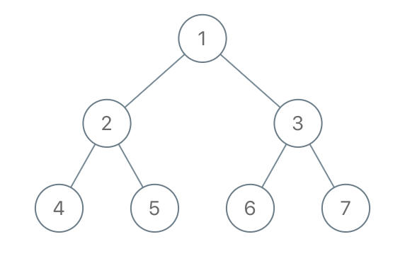

## Description

Given the `root` of a binary tree, each node in the tree has a distinct value.

After deleting all nodes with a value in $\text{to}_{delete}$, we are left with a forest (a disjoint union of trees).

Return the roots of the trees in the remaining forest. You may return the result in any order.
### Function Contract

- `n`: Input parameter.
- Returns expected result.

### Examples
#### Example 1

- **Input:** `root = [1,2,3,4,5,6,7], to_delete = [3,5]`
- **Output:** `[[1,2,null,4],[6],[7]]`
#### Example 2

- **Input:** `root = [1,2,4,null,3], to_delete = [3]`
- **Output:** `[[1,2,4]]`
### Constraints

- The number of nodes in the given tree is at most `1000`.

- Each node has a distinct value between `1` and `1000`.

- $\text{to}_{delete}.length \le 1000$

- $\text{to}_{delete}$ contains distinct values between `1` and `1000`.