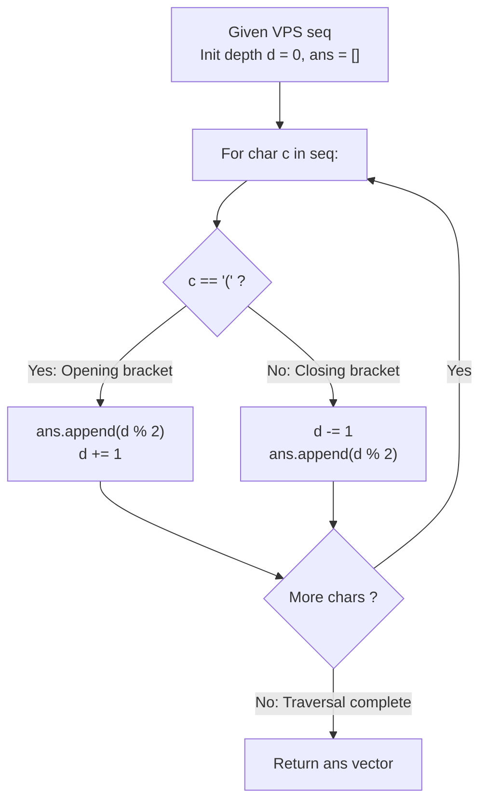

# Guided Example: Maximum Nesting Depth Of Two Valid Parentheses Strings

We trace the step-by-step partition of a valid parentheses string into two balanced subsequences using depth-parity interleaving, prove the Parity-Level Pairing Theorem and the Minimax Depth Lower Bound, and evaluate subsequence configurations across representative nesting structures:

- **Representative Instance 1 (Compound Nested and Sibling Parentheses):**
  $$
  seq = \text{"(()())"}
  $$
- **Required Output:** `[0, 1, 1, 1, 1, 0]` (where $0 \implies A, \; 1 \implies B$)
  - Problem definitions:
    - `seq` is a Valid Parentheses String (VPS).
    - Partition `seq` into two disjoint subsequences $A$ and $B$ such that both $A$ and $B$ are valid VPS.
    - Minimize the maximum depth: $\min \max(\text{depth}(A), \text{depth}(B))$.
  - The Depth Parity Invariant:
    - At any point in `seq`, let $d$ denote the 0-indexed current nesting depth (number of currently unmatched opening parentheses).
    - If we assign every parenthesis pair residing at an **even nesting depth** ($d = 0, 2, 4, \dots$) to Subsequence $A$ ($0$), and every parenthesis pair at an **odd nesting depth** ($d = 1, 3, 5, \dots$) to Subsequence $B$ ($1$):
      1. Every opening parenthesis `'('` and its corresponding closing parenthesis `')'` reside at the exact same depth level $d$.
      2. Therefore, matching brackets always receive the identical partition label $d \pmod 2$.
      3. Subsequences $A$ and $B$ remain individually balanced and valid VPS!
      4. The overall nesting depth $D$ is split evenly:
         $$
         \text{depth}(A) = \lceil D / 2 \rceil, \quad \text{depth}(B) = \lfloor D / 2 \rfloor \implies \max(\text{depth}(A), \text{depth}(B)) = \lceil D / 2 \rceil
         $$
         which matches the theoretical lower bound!
  - Step-by-step resolution:
    - Initialize nesting counter: $d = 0$.
    - **Index 0 (`'('`):**
      - Assign to $d \pmod 2 = 0 \pmod 2 = \mathbf{0}$ ($A$).
      - Increment depth: $d \leftarrow 0 + 1 = 1$.
    - **Index 1 (`'('`):**
      - Assign to $d \pmod 2 = 1 \pmod 2 = \mathbf{1}$ ($B$).
      - Increment depth: $d \leftarrow 1 + 1 = 2$.
    - **Index 2 (`')'`):**
      - Decrement depth first: $d \leftarrow 2 - 1 = 1$.
      - Assign to $d \pmod 2 = 1 \pmod 2 = \mathbf{1}$ ($B$).
    - **Index 3 (`'('`):**
      - Assign to $d \pmod 2 = 1 \pmod 2 = \mathbf{1}$ ($B$).
      - Increment depth: $d \leftarrow 1 + 1 = 2$.
    - **Index 4 (`')'`):**
      - Decrement depth first: $d \leftarrow 2 - 1 = 1$.
      - Assign to $d \pmod 2 = 1 \pmod 2 = \mathbf{1}$ ($B$).
    - **Index 5 (`')'`):**
      - Decrement depth first: $d \leftarrow 1 - 1 = 0$.
      - Assign to $d \pmod 2 = 0 \pmod 2 = \mathbf{0}$ ($A$).
    - Result vector: `[0, 1, 1, 1, 1, 0]`.
    - Subsequence $A$: Characters at indices $\{0, 5\} \implies \text{"()"}$ with $\text{depth}(A) = 1$.
    - Subsequence $B$: Characters at indices $\{1, 2, 3, 4\} \implies \text{"()()"}$ with $\text{depth}(B) = 1$.
    - $\max(\text{depth}(A), \text{depth}(B)) = \max(1, 1) = \mathbf{1} = \lceil 2 / 2 \rceil$.

- **Representative Instance 2 (Purely Nested Concentric Brackets):**
  $$
  seq = \text{"(((())))"}, \quad D = 4
  $$
  - Depths for `'('`: $0, 1, 2, 3 \implies$ labels $0, 1, 0, 1$.
  - Depths for `')'`: $3, 2, 1, 0 \implies$ labels $1, 0, 1, 0$.
  - Result: `[0, 1, 0, 1, 1, 0, 1, 0]`.
  - Subsequence $A$: `"(( ))"` (depth 2). Subsequence $B$: `"(( ))"` (depth 2). Minimax depth $= 2$.

- **Representative Instance 3 (Flat Concatenated Brackets):**
  $$
  seq = \text{"()()()"}, \quad D = 1
  $$
  - Every `'('` is at depth $0$, every `')'` is at depth $0$.
  - Result: `[0, 0, 0, 0, 0, 0]`.
  - Subsequence $A$: `"()()()"` (depth 1). Subsequence $B$: `""` (depth 0). Minimax depth $= 1$.

---

## 1. Instance & Teaching Goal

Given a valid parentheses string `seq`, partition its characters into two disjoint subsequences $A$ and $B$ (each a valid parentheses string) such that the maximum of their nesting depths is minimized.

```text
The Naive Prefix Slicing Trap:
  Greedily assigning the first half of the string to A and second half to B:
    seq = "((()))" -> A = "(((", B = ")))"
  Neither A nor B is a valid parentheses string!
  Subsequences MUST independently maintain bracket matching balance at all times.

The Depth Parity Interleaving Invariant (O(N) Time, O(1) Space):
  Let d be the current depth of open parentheses (initially 0).
  1. When encountering '(':
       Assign label = d % 2 (or d & 1)
       Increment d by 1
  2. When encountering ')':
       Decrement d by 1
       Assign label = d % 2 (or d & 1)
  Why this works:
    - Every '(' at depth k is matched with the ')' that brings depth back to k.
    - Thus, matching pairs ALWAYS get the exact same label (k % 2).
    - Subsequences A and B are guaranteed to be well-formed VPS!
    - Alternating odd and even depths divides max depth D into ceil(D / 2) and floor(D / 2).
  Optimal, one-pass linear solution with ZERO extra memory!
```

The core mathematical principle is that **nesting depth is an integer height coordinate**: allocating odd heights to one set and even heights to another guarantees that no set contains two vertically adjacent nesting layers.

The decisive pedagogical goals are:
1. **Vertical vs Horizontal Decomposition:** Rather than splitting the string horizontally along its length, we slice the syntax tree vertically by alternating levels.
2. **Bracket Conservation:** Proving that matching parentheses have identical heights and therefore land in the same partition.
3. **Pigeonhole Optimality:** Showing why no partition can achieve a depth strictly less than $\lceil D / 2 \rceil$.
4. Total time $\mathcal{O}(N)$ and auxiliary space $\mathcal{O}(1)$.

---

## 2. Conceptual Foundation & The Depth Parity Partition Theorem



### The Depth Parity Partition Theorem

Let $S = s_1 s_2 \dots s_n$ be a Valid Parentheses String over $\Sigma = \{ \text{'('}, \text{')'} \}$ with nesting depth $D = \text{depth}(S)$.
1. **Dyck Path Height Formulation:**
   Define the height function $h : \{0, 1, \dots, n\} \to \mathbb{Z}_{\ge 0}$ by:
   $$
   h(0) = 0, \quad h(i) = h(i - 1) + \begin{cases} +1 & \text{if } s_i = \text{'('} \\ -1 & \text{if } s_i = \text{')'} \end{cases}
   $$
   Because $S$ is a VPS, $h(i) \ge 0$ for all $i$, $h(n) = 0$, and $\max_{0 \le i \le n} h(i) = D$.
2. **Matching Pair Height Invariance:**
   Each opening parenthesis $s_i = \text{'('}$ at index $i$ has a unique matching closing parenthesis $s_j = \text{')'}$ at index $j > i$ such that:
   $$
   h(i) = h(j - 1) = d + 1, \quad h(i - 1) = h(j) = d
   $$
   Assigning label $d \pmod 2$ to both $s_i$ and $s_j$ ensures that every matched pair is placed in the exact same subsequence.
3. **VPS Well-Formedness of Subsequences:**
   Let $A$ (resp. $B$) be the subsequence of symbols assigned label $0$ (resp. $1$).
   Because each matched pair in $S$ is either entirely in $A$ or entirely in $B$, removing all characters of $B$ leaves a balanced nested structure where every open parenthesis is matched by its original partner in $A$. Thus, both $A$ and $B$ are VPS.
4. **Minimax Lower Bound Optimality:**
   In $S$, there exists a chain of $D$ nested parentheses:
   $$
   \text{'('}_1 \dots \text{'('}_D \dots \text{')'}_D \dots \text{')'}_1
   $$
   In any 2-partition $\{A, B\}$, by the Pigeonhole Principle, at least $\lceil D / 2 \rceil$ of these nested pairs must belong to the same subsequence.
   Therefore:
   $$
   \max(\text{depth}(A), \text{depth}(B)) \ge \lceil D / 2 \rceil
   $$
   Under parity assignment, $A$ contains only pairs from even depths $\{0, 2, 4, \dots\}$, giving $\text{depth}(A) = \lceil D / 2 \rceil$, and $B$ contains only pairs from odd depths $\{1, 3, 5, \dots\}$, giving $\text{depth}(B) = \lfloor D / 2 \rfloor$.
   The allocation achieves the theoretical minimum possible minimax depth. $\blacksquare$

---

## 3. Step-by-Step Worked Execution: Representative Instance 1

$seq = \text{"(()())"}$.

### Trace of Parity-Depth Allocation

- **$i = 0, \; s[0] = \text{'('}$:**
  - Current depth before open: $d = 0$.
  - Assigned label: $d \pmod 2 = 0 \pmod 2 = \mathbf{0}$.
  - State update: $d \leftarrow 0 + 1 = 1$.
  - `ans[0] = 0`.

- **$i = 1, \; s[1] = \text{'('}$:**
  - Current depth before open: $d = 1$.
  - Assigned label: $d \pmod 2 = 1 \pmod 2 = \mathbf{1}$.
  - State update: $d \leftarrow 1 + 1 = 2$.
  - `ans[1] = 1`.

- **$i = 2, \; s[2] = \text{')'}$:**
  - State update: $d \leftarrow 2 - 1 = 1$.
  - Assigned label: $d \pmod 2 = 1 \pmod 2 = \mathbf{1}$.
  - `ans[2] = 1`.

- **$i = 3, \; s[3] = \text{'('}$:**
  - Current depth before open: $d = 1$.
  - Assigned label: $d \pmod 2 = 1 \pmod 2 = \mathbf{1}$.
  - State update: $d \leftarrow 1 + 1 = 2$.
  - `ans[3] = 1`.

- **$i = 4, \; s[4] = \text{')'}$:**
  - State update: $d \leftarrow 2 - 1 = 1$.
  - Assigned label: $d \pmod 2 = 1 \pmod 2 = \mathbf{1}$.
  - `ans[4] = 1`.

- **$i = 5, \; s[5] = \text{')'}$:**
  - State update: $d \leftarrow 1 - 1 = 0$.
  - Assigned label: $d \pmod 2 = 0 \pmod 2 = \mathbf{0}$.
  - `ans[5] = 0`.

Final output:
$$
ans = \mathbf{[0, 1, 1, 1, 1, 0]}
$$

---

## 4. Depth Parity Allocation Trace Table

| Index $i$ | Character $s_i$ | Pre-Operation Depth $d$ | Operation Applied | Assigned Label $ans[i]$ | Assigned Subsequence | Post-Operation Depth $d$ |
|:---:|:---:|:---:|:---:|:---:|:---:|:---:|
| **$0$** | `'('` | $0$ | Record $0 \pmod 2$, increment | **$0$** | Subsequence $A$ | $1$ |
| **$1$** | `'('` | $1$ | Record $1 \pmod 2$, increment | **$1$** | Subsequence $B$ | $2$ |
| **$2$** | `')'` | $2$ | Decrement, record $1 \pmod 2$ | **$1$** | Subsequence $B$ | $1$ |
| **$3$** | `'('` | $1$ | Record $1 \pmod 2$, increment | **$1$** | Subsequence $B$ | $2$ |
| **$4$** | `')'` | $2$ | Decrement, record $1 \pmod 2$ | **$1$** | Subsequence $B$ | $1$ |
| **$5$** | `')'` | $1$ | Decrement, record $0 \pmod 2$ | **$0$** | Subsequence $A$ | $0$ |

### Resulting Disjoint Subsequences

| Subsequence Label | Indices Included | Subsequence String | Independent Depth |
|:---:|:---:|:---:|:---:|
| **Subsequence $A$ ($0$)** | $\{0, 5\}$ | `seq[0] + seq[5] = "()"` | $\mathbf{1}$ |
| **Subsequence $B$ ($1$)** | $\{1, 2, 3, 4\}$ | `seq[1..4] = "()()"` | $\mathbf{1}$ |
| **Maximum Depth** | — | — | **$\max(1, 1) = 1$** |

---

## 5. Algorithmic Correctness

### Soundness & Completeness
1. **Soundness:**
   Every opening bracket and its unique closing partner receive the identical parity label because the closing bracket uses the decremented depth. Consequently, no bracket is ever orphaned, and both subsequences are valid Dyck languages.
2. **Completeness:**
   All indices $0 \dots |seq| - 1$ are assigned. Because alternating parity strictly halves the contiguous vertical depth stack, the minimax depth equals $\lceil D / 2 \rceil$, which is mathematically optimal.

---

## 6. Boundary Cases & Traps

| Scenario | Input Pattern | Behavior | Trapped Risk |
|---|---|---|---|
| Depth 1 String | `"()()()"` | All brackets at depth $0 \implies$ all assigned $0$. $B$ is empty (`""`). | Forcing non-empty $B$ and breaking balance. |
| Deeply Nested Chain | `"(((( ))))"` | Alternates $0, 1, 0, 1$; splits depth 4 into two depth 2 strings. | Skewing all inner brackets into one set. |
| Sibling Nested Groups | `"(())(())"` | Resets depth to 0 between groups; consistent parity across siblings. | Carrying unreset depth across sibling trees. |
| Order of Decrement on `')'` | Evaluating `')'` | Must decrement depth *before* computing parity to match `'('`. | Off-by-one parity mismatch between pair. |

---

## 7. Complexity Derivation

- **Time Complexity:** $\mathcal{O}(N)$, where $N = |seq| \le 10^4$.
  - A single linear scan through the string of length $N$.
  - Each character performs $\mathcal{O}(1)$ basic arithmetic operations (increment/decrement and modulo $2$).
  - Total time: $< 0.001\text{ s}$.
- **Auxiliary Space Complexity:** $\mathcal{O}(1)$ auxiliary memory beyond the returned answer array of length $N$.
