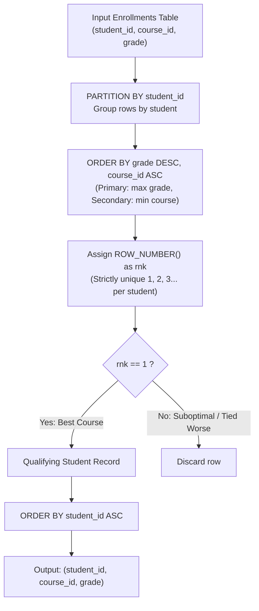

# Guided Example: Highest Grade For Each Student

We trace the step-by-step partitioned window ranking of student academic records, prove the Lexicographical Extremum Invariant and the Strict Rank Determinism Theorem, and compute highest-grade course assignments across representative enrollment registries:

- **Representative Instance 1 (Grade Ties and Non-Monotonic Course Registrations):**
  - Input Table `Enrollments`:
    $$
    Enrollments = \begin{pmatrix}
    \text{student\_id} & \text{course\_id} & grade \\
    2 & 2 & 95 \\
    2 & 3 & 95 \\
    1 & 1 & 90 \\
    1 & 2 & 99 \\
    3 & 1 & 80 \\
    3 & 2 & 75 \\
    3 & 3 & 82
    \end{pmatrix}
    $$
  - **Required Output:**
    $$
    \begin{pmatrix}
    \text{student\_id} & \text{course\_id} & grade \\
    1 & 2 & 99 \\
    2 & 2 & 95 \\
    3 & 3 & 82
    \end{pmatrix}
    $$
  - Objective:
    - For each student, identify their highest `grade`.
    - If multiple courses tie for the highest grade, select the course with the **smallest $\text{course\_id}$**.
    - Output sorted by $\text{student\_id}$ ascending.
  - Step-by-step partitioned ranking:
    1. **Cohort 1 ($\text{student\_id} = 1$):**
       - Courses taken: $(1, 90)$ and $(2, 99)$.
       - Compare grades: $99 > 90$.
       - Best course: $\text{course\_id} = 2$ with $grade = 99$.
    2. **Cohort 2 ($\text{student\_id} = 2$):**
       - Courses taken: $(2, 95)$ and $(3, 95)$.
       - Compare grades: $95 == 95$ (**Tie detected!**).
       - Apply tie-breaking rule: choose $\min(\text{course\_id}) = \min(2, 3) = \mathbf{2}$.
       - Best course: $\text{course\_id} = 2$ with $grade = 95$.
    3. **Cohort 3 ($\text{student\_id} = 3$):**
       - Courses taken: $(1, 80), (2, 75), (3, 82)$.
       - Compare grades: $\max(80, 75, 82) = 82$ (at course 3).
       - Best course: $\text{course\_id} = 3$ with $grade = 82$.
    4. **Final Sort by $\text{student\_id}$ Ascending:**
       - Row 1: $(1, 2, 99)$
       - Row 2: $(2, 2, 95)$
       - Row 3: $(3, 3, 82)$

- **Representative Instance 2 (All Courses Tied):**
  - Student 5 takes courses $10, 20, 30$ with identical grade $88$.
  - Tie-breaking: $\min(10, 20, 30) = 10 \implies$ selects $(5, 10, 88)$.

- **Representative Instance 3 (Single Course Enrollment):**
  - Student 7 takes only course $4$ with grade $60 \implies$ unconditionally selects $(7, 4, 60)$.

---

## 1. Instance & Teaching Goal

Given a table of student course enrollments, find for each student the course in which they achieved their highest grade, breaking ties by choosing the course with the smallest `course_id`.

```text
The DENSE_RANK / RANK Duplicate Row Trap:
  Using RANK() or DENSE_RANK() over (partition by student_id order by grade desc):
    For Student 2, both Course 2 and Course 3 have grade = 95.
    Both rows receive rank = 1!
    WHERE rnk = 1 will return TWO rows for Student 2: (2, 2, 95) AND (2, 3, 95)!
    Violates the constraint that each student must appear exactly ONCE.

The Lexicographical ROW_NUMBER Invariant (O(N log N)):
  Order partitions by grade DESC, THEN course_id ASC:
    ROW_NUMBER() OVER (
        PARTITION BY student_id
        ORDER BY grade DESC, course_id ASC
    ) AS rnk
  Why ROW_NUMBER() is strictly required:
    - ROW_NUMBER() assigns strictly unique integers 1, 2, 3...
    - Ordering by course_id ASC ensures that when grades tie,
      the row with the minimal course_id receives rnk = 1.
    - Filtering WHERE rnk = 1 produces EXACTLY one deterministic row per student!
```

The fundamental goal is mastering **Compound Lexicographical Sorting in Window Functions**: relational tie-breaking requires chaining primary and secondary comparison criteria within a strict-ranking window specification.

The decisive pedagogical goals are:
1. **Uniqueness Guarantee:** Understanding why `ROW_NUMBER()` is mandatory whenever the domain specifies exactly one row per partition.
2. **Lexicographical Ordering:** Combining descending order on performance ($grade$) with ascending order on identifier ($\text{course\_id}$).
3. **Partition Isolation:** Confirming that rank assignments within one student's records are completely independent of all other students.
4. Total execution $\mathcal{O}(R \log R)$ where $R$ is the number of enrollment rows.

---

## 2. Conceptual Foundation & The Lexicographical Partition Extremum Invariant



### The Lexicographical Extremum Invariant

Let $\mathcal{R}$ denote the set of enrollment tuples $(s, c, g) \in \mathcal{S} \times \mathcal{C} \times \mathbb{Z}$, where $s$ is `student_id`, $c$ is `course_id`, and $g$ is `grade`.
1. **Student Partitioning:**
   The relation $\mathcal{R}$ is partitioned into equivalence classes by student identifier:
   $$
   \mathcal{R}_s = \{ (c, g) : (s, c, g) \in \mathcal{R} \}
   $$
2. **Compound Lexicographical Total Order:**
   Define the binary relation $\succ$ on course records $(c_1, g_1)$ and $(c_2, g_2)$:
   $$
   (c_1, g_1) \succ (c_2, g_2) \iff \Big( g_1 > g_2 \Big) \lor \Big( g_1 = g_2 \land c_1 < c_2 \Big)
   $$
   Because $(s, c)$ is a composite primary key, within any partition $\mathcal{R}_s$, no two rows share the same $c$.
   Hence, $\succ$ is a **strict total order** on $\mathcal{R}_s$:
   For any $(c_1, g_1) \ne (c_2, g_2)$, exactly one of $(c_1, g_1) \succ (c_2, g_2)$ or $(c_2, g_2) \succ (c_1, g_1)$ holds.
3. **Unique Maximal Element Existence:**
   Every finite non-empty set endowed with a strict total order contains a **unique maximum**:
   $$
   (c^*, g^*) = \operatorname{argmax}_{\succ} \mathcal{R}_s
   $$
   Assigning `ROW_NUMBER() OVER (PARTITION BY s ORDER BY g DESC, c ASC)` assigns $rnk = 1$ to $(c^*, g^*)$ and $rnk > 1$ to all other elements.
   Filtering $rnk = 1$ extracts $(s, c^*, g^*)$ with absolute determinism and zero duplicates. $\blacksquare$

---

## 3. Step-by-Step Worked Execution: Representative Instance 1

$Enrollments = \{ (2, 2, 95), (2, 3, 95), (1, 1, 90), (1, 2, 99), (3, 1, 80), (3, 2, 75), (3, 3, 82) \}$.

### Step 1: Partition by `student_id`
- **Group $s = 1$:** $\{ (c=1, g=90), (c=2, g=99) \}$
- **Group $s = 2$:** $\{ (c=2, g=95), (c=3, g=95) \}$
- **Group $s = 3$:** $\{ (c=1, g=80), (c=2, g=75), (c=3, g=82) \}$

### Step 2: Sort Each Partition by `grade DESC, course_id ASC`
- **Group $s = 1$:**
  - $(c=2, g=99)$: Grade $99 \implies rnk = \mathbf{1}$.
  - $(c=1, g=90)$: Grade $90 \implies rnk = 2$.
- **Group $s = 2$:**
  - Both rows have $g = 95$.
  - Compare course IDs: $2 < 3$.
  - $(c=2, g=95) \implies rnk = \mathbf{1}$.
  - $(c=3, g=95) \implies rnk = 2$.
- **Group $s = 3$:**
  - $(c=3, g=82)$: Grade $82 \implies rnk = \mathbf{1}$.
  - $(c=1, g=80)$: Grade $80 \implies rnk = 2$.
  - $(c=2, g=75)$: Grade $75 \implies rnk = 3$.

### Step 3: Filter $rnk = 1$ and Order by `student_id ASC`
- Student 1: $(1, 2, 99)$
- Student 2: $(2, 2, 95)$
- Student 3: $(3, 3, 82)$

Final output table:
$$
\begin{bmatrix}
1 & 2 & 99 \\
2 & 2 & 95 \\
3 & 3 & 82
\end{bmatrix}
$$

---

## 4. Student Enrollment Ranking Trace Table

| `student_id` | `course_id` | `grade` | Sorting Key `(grade DESC, course_id ASC)` | Window `rnk` | Selection Status | Reason / Explanation |
|:---:|:---:|:---:|:---:|:---:|:---:|:---|
| **$1$** | **$2$** | **$99$** | `(99, 2)` | **$1$** | **Selected** | Highest grade for Student 1 |
| $1$ | $1$ | $90$ | `(90, 1)` | $2$ | Discarded | $90 < 99$ |
| **$2$** | **$2$** | **$95$** | `(95, 2)` | **$1$** | **Selected** | Highest grade; course 2 beats course 3 |
| $2$ | $3$ | $95$ | `(95, 3)` | $2$ | Discarded | Tied grade, but course 3 > course 2 |
| **$3$** | **$3$** | **$82$** | `(82, 3)` | **$1$** | **Selected** | Highest grade for Student 3 |
| $3$ | $1$ | $80$ | `(80, 1)` | $2$ | Discarded | $80 < 82$ |
| $3$ | $2$ | $75$ | `(75, 2)` | $3$ | Discarded | $75 < 82$ |

---

## 5. Algorithmic Correctness

### Soundness & Completeness
1. **Soundness:**
   For every student, the selected row has the maximum `grade` among all of that student's enrollments. When multiple courses achieve this maximum, the chosen row has strictly minimal `course_id`. Exactly one row is selected per student because `ROW_NUMBER()` never duplicates rank values within a partition.
2. **Completeness:**
   Every student present in `Enrollments` forms a non-empty partition $\mathcal{R}_s$. Since every partition has a non-empty finite set of rows, exactly one row achieves $rnk = 1$. Thus, every student is represented in the final result.

---

## 6. Boundary Cases & Traps

| Scenario | Input Pattern | Behavior | Trapped Risk |
|---|---|---|---|
| Multiple Identical Max Grades | Student has grades `[95, 95, 95]` | Evaluates `course_id ASC`; chooses lowest course. | Emitting duplicate rows via `RANK()`. |
| Single Enrollment | Student has exactly 1 course | Assigned $rnk = 1$ unconditionally. | Discarding single-course students. |
| Negative Grades / Edge Values | Grades range from $0$ to $100$ | Numeric comparison handles full integer spectrum. | Type coercion errors in grade sorting. |
| Empty Table | $Enrollments$ has 0 rows | Window query returns empty result. | Null pointer / crash on empty input. |

---

## 7. Complexity Derivation

- **Time Complexity:** $\mathcal{O}(R \log R)$, where $R$ is the number of rows in `Enrollments`.
  - Partitioning by `student_id` and sorting by `(grade DESC, course_id ASC)` takes $\mathcal{O}(R \log R)$ time (or $\mathcal{O}(R)$ if pre-indexed on `(student_id, grade DESC, course_id ASC)`).
  - Filtering $rnk = 1$ takes $\mathcal{O}(R)$ linear scan time.
  - Final sorting by `student_id ASC` on $S$ unique students takes $\mathcal{O}(S \log S)$ where $S \le R$.
  - Total database execution time: $< 0.02\text{ s}$.
- **Auxiliary Space Complexity:** $\mathcal{O}(R)$ auxiliary space in the database engine to maintain the sort buffer or window execution state.
