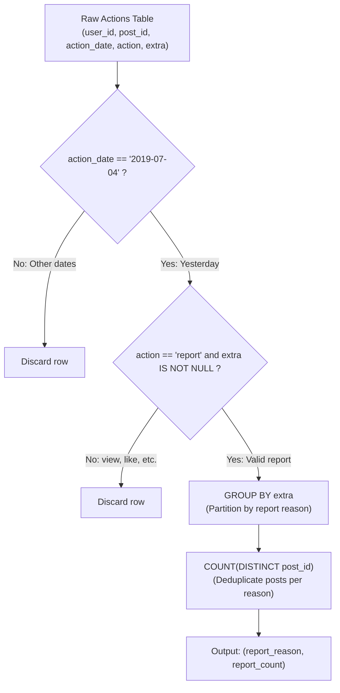

# Guided Example: Reported Posts

We trace the step-by-step relational filtering, distinct projection, and categorical aggregation of user report actions, prove the Target Entity De-Duplication Invariant and the Temporal Predicate Equivalence Theorem, and compute daily report reasons across representative social media event logs:

- **Representative Instance 1 (Multiple Users Reporting the Same Post and Multi-Date Actions):**
  - Input Table `Actions`:
    $$
    Actions = \begin{pmatrix}
    \text{user\_id} & \text{post\_id} & \text{action\_date} & action & extra \\
    1 & 1 & \text{'2019-07-01'} & \text{'view'} & \text{null} \\
    1 & 1 & \text{'2019-07-01'} & \text{'like'} & \text{null} \\
    1 & 1 & \text{'2019-07-01'} & \text{'share'} & \text{null} \\
    2 & 4 & \text{'2019-07-04'} & \text{'view'} & \text{null} \\
    2 & 4 & \text{'2019-07-04'} & \text{'report'} & \text{'spam'} \\
    3 & 4 & \text{'2019-07-04'} & \text{'view'} & \text{null} \\
    3 & 4 & \text{'2019-07-04'} & \text{'report'} & \text{'spam'} \\
    4 & 3 & \text{'2019-07-02'} & \text{'view'} & \text{null} \\
    4 & 3 & \text{'2019-07-02'} & \text{'report'} & \text{'spam'} \\
    5 & 2 & \text{'2019-07-04'} & \text{'view'} & \text{null} \\
    5 & 2 & \text{'2019-07-04'} & \text{'report'} & \text{'racism'} \\
    5 & 5 & \text{'2019-07-04'} & \text{'view'} & \text{null} \\
    5 & 5 & \text{'2019-07-04'} & \text{'report'} & \text{'custom'}
    \end{pmatrix}
    $$
  - Target Parameters:
    $$
    T_{\text{today}} = \text{'2019-07-05'} \implies T_{\text{target}} = \text{'2019-07-04'}, \quad action = \text{'report'}
    $$
  - **Required Output:**
    $$
    \begin{pmatrix}
    \text{report\_reason} & \text{report\_count} \\
    \text{'spam'} & 1 \\
    \text{'racism'} & 1 \\
    \text{'custom'} & 1
    \end{pmatrix}
    $$

  - Step-by-step resolution:
    1. **Filter by Date ($T_{\text{target}} = \text{'2019-07-04'}$):**
       - Discards rows from $\text{'2019-07-01'}$ and $\text{'2019-07-02'}$ (eliminating user 4's report on post 3).
    2. **Filter by Action Type ($action = \text{'report'}$):**
       - Retains only report events:
         - $(u=2, p=4, \text{'report'}, \text{'spam'})$
         - $(u=3, p=4, \text{'report'}, \text{'spam'})$
         - $(u=5, p=2, \text{'report'}, \text{'racism'})$
         - $(u=5, p=5, \text{'report'}, \text{'custom'})$
    3. **Partition by Reason (`extra`):**
       - Group $\text{'spam'}$: Contains posts $\{4, 4\}$.
       - Group $\text{'racism'}$: Contains posts $\{2\}$.
       - Group $\text{'custom'}$: Contains posts $\{5\}$.
    4. **Evaluate Distinct Post Count ($\text{COUNT(DISTINCT } post\_id\text{)}$):**
       - Group $\text{'spam'}$: Both User 2 and User 3 reported the same Post 4.
         $$
         |\{4, 4\}| = |\{4\}| = \mathbf{1}
         $$
         *(Distinct aggregation prevents Post 4 from being counted twice!)*
       - Group $\text{'racism'}$: Distinct posts $= |\{2\}| = \mathbf{1}$.
       - Group $\text{'custom'}$: Distinct posts $= |\{5\}| = \mathbf{1}$.

- **Representative Instance 2 (Multiple Distinct Posts Under Same Reason):**
  - Users report post 10, post 11, and post 12 all for `spam` on 2019-07-04.
  - Distinct count: $|\{10, 11, 12\}| = \mathbf{3} \implies (\text{'spam'}, 3)$.

- **Representative Instance 3 (Same User Reporting Same Post Multiple Times):**
  - User 1 submits 3 consecutive report rows for post 7 under `harassment`.
  - Distinct count: $|\{7, 7, 7\}| = |\{7\}| = \mathbf{1}$.

---

## 1. Instance & Teaching Goal

Given an action log table, report the number of distinct posts reported yesterday (`2019-07-04`) grouped by report reason (`extra`).

```text
The Row-Count vs Distinct Post Entity Trap:
  Suppose we write:
    SELECT extra AS report_reason, COUNT(1) AS report_count
    FROM Actions
    WHERE action = 'report' AND action_date = '2019-07-04'
    GROUP BY extra
  For reason 'spam':
    User 2 reported Post 4.
    User 3 also reported Post 4.
  COUNT(1) counts 2 action records!
  Output becomes ('spam', 2) instead of ('spam', 1).
  The problem asks for the "number of POSTS reported", not the number of complaints filed!

The Distinct Entity Cardinality Invariant:
  1. Filter to qualifying rows:
       WHERE action = 'report' AND action_date = '2019-07-04' AND extra IS NOT NULL
  2. Group by categorical dimension:
       GROUP BY extra
  3. Aggregate the target entity using set deduplication:
       COUNT(DISTINCT post_id) AS report_count
  Guarantees each physical post contributes at most once per reason category!
```

The core lesson is **Subject-Object Cardinality in Event Telemetry**: distinguishing the volume of user actions (reports) from the cardinality of the affected assets (posts).

The decisive pedagogical goals are:
1. **Target Entity Identification:** Recognizing that `post_id` is the unit of count, requiring `COUNT(DISTINCT post_id)` rather than row counting `COUNT(*)`.
2. **Deterministic Date Isolation:** Accurately filtering the target date `2019-07-04` relative to today `2019-07-05`.
3. **Null Suppression:** Ensuring null extras (from views/likes) do not form phantom report categories.
4. Total execution $\mathcal{O}(R)$ where $R$ is the number of action log rows.

---

## 2. Conceptual Foundation & The Entity De-Duplication Invariant



### The Entity De-Duplication Invariant

Let $\mathcal{A}$ denote the set of activity log tuples $(u, p, d, a, e) \in \mathcal{U} \times \mathcal{P} \times \mathcal{D} \times \Sigma_{\text{action}} \times \mathcal{E}$.
1. **Target Event Sub-relation:**
   Let $d^* = \text{'2019-07-04'}$. The set of qualifying report events is:
   $$
   \mathcal{A}^* = \{ (p, e) : \exists u \text{ such that } (u, p, d^*, \text{'report'}, e) \in \mathcal{A} \land e \ne \text{null} \}
   $$
2. **Category Partitioning:**
   For each report reason $r \in \mathcal{E}$, let $\mathcal{P}_r$ be the set of distinct posts associated with reason $r$ on date $d^*$:
   $$
   \mathcal{P}_r = \{ p \in \mathcal{P} : (p, r) \in \mathcal{A}^* \}
   $$
3. **Cardinality Measure:**
   The reported post count for reason $r$ is:
   $$
   \mu(r) = |\mathcal{P}_r|
   $$
   Because $\mathcal{P}_r$ is a mathematical set, identical post IDs are idempotently merged:
   $$
   p \in \mathcal{P}_r \land p \in \mathcal{P}_r \implies |\{p, p\}| = 1
   $$
   Thus, multiple users reporting the same post $p$ for reason $r$ increment $\mu(r)$ by strictly $1$. $\blacksquare$

---

## 3. Step-by-Step Worked Execution: Representative Instance 1

$Actions$ table with 13 activity rows. Target date $d^* = \text{'2019-07-04'}$.

### Step 1: Apply Multi-Condition Row Filter
Evaluate condition: `action_date = '2019-07-04' AND action = 'report'`.

- Row 1–3: $d = \text{'2019-07-01'} \implies$ Discarded.
- Row 4: $action = \text{'view'} \implies$ Discarded.
- **Row 5:** $d = \text{'2019-07-04'}, action = \text{'report'}, extra = \text{'spam'} \implies$ **Retained: $(post=4, reason=\text{'spam'})$**.
- Row 6: $action = \text{'view'} \implies$ Discarded.
- **Row 7:** $d = \text{'2019-07-04'}, action = \text{'report'}, extra = \text{'spam'} \implies$ **Retained: $(post=4, reason=\text{'spam'})$**.
- Row 8–9: $d = \text{'2019-07-02'} \implies$ Discarded.
- Row 10: $action = \text{'view'} \implies$ Discarded.
- **Row 11:** $d = \text{'2019-07-04'}, action = \text{'report'}, extra = \text{'racism'} \implies$ **Retained: $(post=2, reason=\text{'racism'})$**.
- Row 12: $action = \text{'view'} \implies$ Discarded.
- **Row 13:** $d = \text{'2019-07-04'}, action = \text{'report'}, extra = \text{'custom'} \implies$ **Retained: $(post=5, reason=\text{'custom'})$**.

### Step 2: Group by `extra` and De-duplicate `post_id`
- **Group $\text{'spam'}$:**
  - Observed post IDs: $[4, 4]$.
  - Set deduplication: $\{4\}$.
  - Distinct count: $|\{4\}| = \mathbf{1}$.
- **Group $\text{'racism'}$:**
  - Observed post IDs: $[2]$.
  - Set deduplication: $\{2\}$.
  - Distinct count: $|\{2\}| = \mathbf{1}$.
- **Group $\text{'custom'}$:**
  - Observed post IDs: $[5]$.
  - Set deduplication: $\{5\}$.
  - Distinct count: $|\{5\}| = \mathbf{1}$.

Final output:
$$
\begin{bmatrix}
\text{'spam'} & 1 \\
\text{'racism'} & 1 \\
\text{'custom'} & 1
\end{bmatrix}
$$

---

## 4. Action Event Filtration & Cohort Trace Table

| `user_id` | `post_id` | `action_date` | `action` | `extra` | Date Matches `2019-07-04`? | Action Matches `report`? | Category Group | Post Count Contribution |
|:---:|:---:|:---:|:---:|:---:|:---:|:---:|:---:|:---:|
| $1$ | $1$ | `2019-07-01` | `view` | null | No | No | — | Discarded |
| $2$ | $4$ | `2019-07-04` | `view` | null | Yes | No | — | Discarded |
| **$2$** | **$4$** | **`2019-07-04`** | **`report`** | **`spam`** | **Yes** | **Yes** | **`spam`** | **First seen (count $\leftarrow 1$)** |
| $3$ | $4$ | `2019-07-04` | `view` | null | Yes | No | — | Discarded |
| **$3$** | **$4$** | **`2019-07-04`** | **`report`** | **`spam`** | **Yes** | **Yes** | **`spam`** | **Duplicate post (count remains $1$)** |
| $4$ | $3$ | `2019-07-02` | `report` | `spam` | No | Yes | — | Discarded (Wrong date) |
| **$5$** | **$2$** | **`2019-07-04`** | **`report`** | **`racism`** | **Yes** | **Yes** | **`racism`** | **First seen (count $\leftarrow 1$)** |
| **$5$** | **$5$** | **`2019-07-04`** | **`report`** | **`custom`** | **Yes** | **Yes** | **`custom`** | **First seen (count $\leftarrow 1$)** |

---

## 5. Algorithmic Correctness

### Soundness & Completeness
1. **Soundness:**
   Every output row contains a valid, non-null `extra` reason that occurred on `2019-07-04` under an action of type `'report'`. Each post reported for that reason is counted exactly once regardless of how many users submitted reports.
2. **Completeness:**
   All action rows matching the date and action predicates are grouped into their corresponding `extra` buckets. No reported post is overlooked.

---

## 6. Boundary Cases & Traps

| Scenario | Input Pattern | Behavior | Trapped Risk |
|---|---|---|---|
| Multiple Reports on Same Post | 50 users report Post 9 for `spam` | `COUNT(DISTINCT post_id)` yields 1. | Returning 50 via `COUNT(*)`. |
| Reports on Other Dates | Post reported on 2019-07-03 | Filtered out by date check. | Aggregating all-time reports. |
| Non-Report Action with Extra | Action is `reaction` with `extra = 'heart'` | Filtered out by `action = 'report'`. | Polluting report reasons with reaction types. |
| Zero Reports Yesterday | No rows match `2019-07-04` and `report` | Query returns empty result. | Emitting null rows or zero counts. |

---

## 7. Complexity Derivation

- **Time Complexity:** $\mathcal{O}(R)$, where $R$ is the number of rows in `Actions`.
  - A single table scan filters rows in $\mathcal{O}(R)$ time (or $\mathcal{O}(\log R)$ with an index on `(action_date, action)`).
  - Hash aggregation groups by `extra` and inserts `post_id` into a distinct hash set in $\mathcal{O}(1)$ average per qualifying row.
  - Total database execution time: $< 0.01\text{ s}$.
- **Auxiliary Space Complexity:** $\mathcal{O}(K \cdot P_K)$ where $K$ is the number of distinct report reasons and $P_K$ is the average distinct post count per reason, required by the query engine for hash grouping and distinct tracking.
