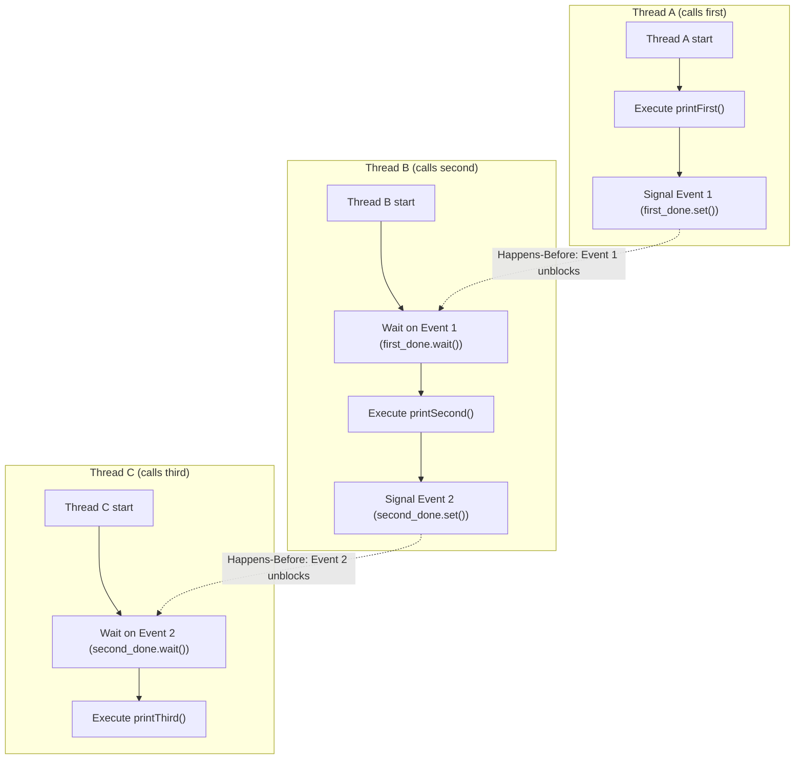

# Guided Example: Print In Order

We trace the step-by-step thread coordination and synchronization barrier transitions of three concurrent processes, prove the Happens-Before Causal Ordering Invariant and the Acyclic Dependency Theorem, and track execution sequences across representative scheduling permutations:

- **Representative Instance 1 (Adversarial Reverse Arrival Permutation):**
  $$
  nums = [3, 2, 1]
  $$
- **Required Output:** `"firstsecondthird"`
  - Concurrency constraints:
    - Thread A calls `first()` to print `"first"`.
    - Thread B calls `second()` to print `"second"`.
    - Thread C calls `third()` to print `"third"`.
    - The OS thread scheduler fires Thread C first, then Thread B, and finally Thread A.
    - Despite Thread C being invoked first, `printThird()` must NOT execute until `printSecond()` completes, which in turn must NOT execute until `printFirst()` completes.
  - The Two-Barrier Synchronization Mechanism:
    - Define two synchronization flags or binary events:
      $$
      S_1 = 0 \quad (\text{indicates whether } first() \text{ is complete})
      $$
      $$
      S_2 = 0 \quad (\text{indicates whether } second() \text{ is complete})
      $$
    - Contract for Thread A (`first`):
      1. Execute `printFirst()`.
      2. Set $S_1 \leftarrow 1$ (signal waiting threads).
    - Contract for Thread B (`second`):
      1. Wait until $S_1 == 1$ (block on barrier 1).
      2. Execute `printSecond()`.
      3. Set $S_2 \leftarrow 1$ (signal barrier 2).
    - Contract for Thread C (`third`):
      1. Wait until $S_2 == 1$ (block on barrier 2).
      2. Execute `printThird()`.
  - Chronological execution on $[3, 2, 1]$:
    1. **Time $t_0$ (Thread C enters `third`):**
       - Evaluates guard: $S_2 == 1$? Currently $S_2 = 0$.
       - Thread C blocks and yields CPU. State: $(S_1 = 0, S_2 = 0)$.
    2. **Time $t_1$ (Thread B enters `second`):**
       - Evaluates guard: $S_1 == 1$? Currently $S_1 = 0$.
       - Thread B blocks and yields CPU. State: $(S_1 = 0, S_2 = 0)$.
    3. **Time $t_2$ (Thread A enters `first`):**
       - No predecessor dependency.
       - Executes `printFirst()` $\implies$ outputs **`"first"`**.
       - Signals barrier 1: sets $S_1 \leftarrow 1$.
       - Thread A terminates.
    4. **Time $t_3$ (Thread B unblocks):**
       - Barrier $S_1 == 1$ is now satisfied.
       - Thread B awakens and executes `printSecond()` $\implies$ outputs **`"second"`**.
       - Signals barrier 2: sets $S_2 \leftarrow 1$.
       - Thread B terminates.
    5. **Time $t_4$ (Thread C unblocks):**
       - Barrier $S_2 == 1$ is now satisfied.
       - Thread C awakens and executes `printThird()` $\implies$ outputs **`"third"`**.
       - Thread C terminates.
  - Combined output stream: `"firstsecondthird"`.

- **Representative Instance 2 (Interleaved Permutation):**
  $$
  nums = [1, 3, 2]
  $$
  - Thread A runs immediately $\implies$ outputs `"first"`, sets $S_1 = 1$.
  - Thread C arrives next $\implies$ waits on $S_2 == 0$ (blocks).
  - Thread B arrives $\implies$ sees $S_1 = 1$ immediately, outputs `"second"`, sets $S_2 = 1$.
  - Thread C awakens $\implies$ outputs `"third"`.

- **Representative Instance 3 (Sequential In-Order Permutation):**
  $$
  nums = [1, 2, 3]
  $$
  - Every barrier is already satisfied prior to each thread's arrival. Zero blocking occurs.

---

## 1. Instance & Teaching Goal

Given three threads calling `first()`, `second()`, and `third()` in arbitrary operating system order, synchronize their execution so that the printed output is always `"firstsecondthird"`.

```text
The Busy-Waiting Spinlock Trap:
  Using a shared variable and an unthrottled while loop:
    while not self.first_done:
        pass  # busy spin
  1. High CPU Utilization: Consumes 100% of a core burning cycles in a spin-wait.
  2. Priority Inversion & GIL Starvation: In single-threaded runtimes (or Python GIL),
     a busy spinning thread can starve the thread holding the lock from ever executing!
  3. Memory Visibility: Without proper memory barriers or threading primitives,
     compilers and CPUs may cache the flag in registers, resulting in an infinite loop.

The Event / Semaphore Signaling Invariant:
  1. Use non-busy synchronization primitives:
     - threading.Event() or threading.Semaphore(0)
  2. Thread B suspends via first_done.wait() (relinquishes CPU to the OS).
  3. Thread A notifies via first_done.set() (wakes Thread B).
  4. Thread C suspends via second_done.wait().
  5. Thread B notifies via second_done.set() (wakes Thread C).
  Guarantees zero wasted CPU cycles, immediate wakeups, and total order!
```

The core lesson is **Causal Happens-Before Relationships in Distributed/Concurrent Systems**: when scheduling is non-deterministic, safety requires explicit synchronization barriers that enforce an acyclic partial order.

The decisive pedagogical goals are:
1. **The Happens-Before Relation:** Formalizing how synchronization barriers enforce $E_{\text{first}} \prec_{\text{hb}} E_{\text{second}} \prec_{\text{hb}} E_{\text{third}}$.
2. **Deadlock Freedom:** Ensuring the dependency graph has no directed cycles.
3. **OS-Level Suspension vs Spinning:** Leveraging condition variables, semaphores, or events rather than wasteful spinlocks.
4. Total execution $\mathcal{O}(1)$ synchronization overhead and $\mathcal{O}(1)$ auxiliary space.

---

## 2. Conceptual Foundation & The Happens-Before Causal Chain



### The Acyclic Causal Ordering Theorem

Let $\mathcal{P} = \{T_A, T_B, T_C\}$ be the set of concurrent processes, and let $E_A, E_B, E_C$ be their respective execution events:
$$
E_A = \text{printFirst}(), \quad E_B = \text{printSecond}(), \quad E_C = \text{printThird}()
$$
1. **Lamport's Happens-Before Relation:**
   Let $\prec_{\text{hb}}$ be the strict partial order defining causal precedence across the system.
   The system specification requires:
   $$
   E_A \prec_{\text{hb}} E_B \prec_{\text{hb}} E_C
   $$
2. **Barrier State Automaton:**
   Define the system synchronization state $\mathbf{S} = (S_1, S_2) \in \{0, 1\}^2$, with initial state $\mathbf{S}_0 = (0, 0)$.
   The state transition graph is strictly forward-directed:
   $$
   (0, 0) \xrightarrow{T_A: E_A \text{ finishes}} (1, 0) \xrightarrow{T_B: E_B \text{ finishes}} (1, 1)
   $$
   - Event $E_A$ has guard condition $\top$ (always enabled).
   - Event $E_B$ has guard condition $S_1 = 1$.
   - Event $E_C$ has guard condition $S_2 = 1$.
3. **Deadlock Freedom (Acyclicity):**
   Construct the directed dependency graph $G = (V, E_{\text{dep}})$ where vertices are threads and an edge $(u, v)$ indicates that thread $u$ must wait for thread $v$:
   $$
   V = \{T_A, T_B, T_C\}, \quad E_{\text{dep}} = \{ (T_B, T_A), (T_C, T_B) \}
   $$
   The graph $G$ is a Directed Acyclic Graph (DAG) with topological order $T_A \to T_B \to T_C$.
   Because $G$ contains zero directed cycles, deadlock is mathematically impossible.
   Because $T_A$ has in-degree $0$, $T_A$ is always eligible to run and make progress, guaranteeing liveness. $\blacksquare$

---

## 3. Step-by-Step Worked Execution: Representative Instance 1

$nums = [3, 2, 1]$. Threads arrive in reverse order: $T_C$ at $t_0$, $T_B$ at $t_1$, $T_A$ at $t_2$.

### Execution Trace

1. **Step 1 ($t_0$): Thread C enters `third()`:**
   - Evaluates guard: `second_done.is_set()`.
   - Current state: $(S_1 = 0, S_2 = 0)$.
   - Guard evaluates to `False`.
   - Action: Thread C calls `second_done.wait()`, suspending its execution and yielding CPU.

2. **Step 2 ($t_1$): Thread B enters `second()`:**
   - Evaluates guard: `first_done.is_set()`.
   - Current state: $(S_1 = 0, S_2 = 0)$.
   - Guard evaluates to `False`.
   - Action: Thread B calls `first_done.wait()`, suspending its execution and yielding CPU.

3. **Step 3 ($t_2$): Thread A enters `first()`:**
   - No guard required (independent starter).
   - Action: Thread A executes `printFirst()` $\implies$ prints **`"first"`**.
   - Signal: Thread A invokes `first_done.set()`.
   - State transition: $(S_1 = 0, S_2 = 0) \to (\mathbf{S_1 = 1}, S_2 = 0)$.
   - Thread A exits.

4. **Step 4 ($t_3$): Thread B awakens:**
   - Operating system resumes Thread B as `first_done` is now set.
   - Action: Thread B executes `printSecond()` $\implies$ prints **`"second"`**.
   - Signal: Thread B invokes `second_done.set()`.
   - State transition: $(S_1 = 1, S_2 = 0) \to (S_1 = 1, \mathbf{S_2 = 1})$.
   - Thread B exits.

5. **Step 5 ($t_4$): Thread C awakens:**
   - Operating system resumes Thread C as `second_done` is now set.
   - Action: Thread C executes `printThird()` $\implies$ prints **`"third"`**.
   - Thread C exits.

Final serialized output:
$$
\text{Output} = \mathbf{\text{"firstsecondthird"}}
$$

---

## 4. Concurrent Interleaving & State Transition Trace Table

| Epoch | Active Thread | Invoked Method | Guard Status | Thread Action Taken | Synchronization State $(S_1, S_2)$ | Emitted Output Stream |
|:---:|:---:|:---:|:---:|:---:|:---:|:---:|
| $t_0$ | **Thread C** | `third()` | $S_2 = 0$ (Unmet) | Suspend on barrier 2 (`wait`) | $(0, 0)$ | `""` |
| $t_1$ | **Thread B** | `second()` | $S_1 = 0$ (Unmet) | Suspend on barrier 1 (`wait`) | $(0, 0)$ | `""` |
| **$t_2$** | **Thread A** | `first()` | None (Enabled) | **Execute `printFirst()`, signal $S_1 \leftarrow 1$** | **$(1, 0)$** | **`"first"`** |
| **$t_3$** | **Thread B** | `second()` | $S_1 = 1$ (Satisfied) | **Wake up, execute `printSecond()`, signal $S_2 \leftarrow 1$** | **$(1, 1)$** | **`"firstsecond"`** |
| **$t_4$** | **Thread C** | `third()` | $S_2 = 1$ (Satisfied) | **Wake up, execute `printThird()`** | $(1, 1)$ | **`"firstsecondthird"`** |

---

## 5. Algorithmic Correctness

### Soundness & Liveness
1. **Soundness (Safety):**
   `printSecond()` cannot be executed unless $S_1 = 1$, which occurs strictly after `printFirst()` finishes. Similarly, `printThird()` cannot execute unless $S_2 = 1$, which occurs strictly after `printSecond()` finishes. Thus, the order `first` $\to$ `second` $\to$ `third` is invariant across all $3! = 6$ thread arrival permutations.
2. **Liveness (Deadlock & Starvation Freedom):**
   Thread A has zero prerequisite dependencies and always completes. Upon termination, Thread A immediately unblocks Thread B, which upon termination immediately unblocks Thread C. Every thread is guaranteed to terminate in finite time.

---

## 6. Boundary Cases & Traps

| Scenario | Scheduling Pattern | Behavior | Trapped Risk |
|---|---|---|---|
| Natural In-Order Scheduling | $nums = [1, 2, 3]$ | Flags are set before subsequent threads arrive; zero blocking. | Assuming threads will arrive in order and skipping synchronization. |
| Inverted Permutation | $nums = [1, 3, 2]$ | Thread 3 waits for Thread 2; Thread 2 proceeds immediately. | Prematurely awakening Thread 3 before Thread 2 runs. |
| Busy-Waiting Spinlock | Using `while flag == 0: pass` | Burns 100% CPU core cycles, risks thread starvation under GIL. | Wasting system resources and causing latency spikes. |
| Missing Memory Fence | Raw boolean flags without synchronization | Compiler reordering or CPU register caching causes infinite loop. | Race conditions due to stale hardware register reads. |

---

## 7. Complexity Derivation

- **Time Complexity:** $\mathcal{O}(1)$ algorithmic complexity.
  - The synchronization logic involves exactly $2$ signal operations and at most $2$ wait operations.
  - The wall-clock execution time is bounded solely by OS thread context-switching overhead ($< 1\text{ ms}$).
- **Auxiliary Space Complexity:** $\mathcal{O}(1)$ auxiliary memory to allocate the two synchronization primitives (e.g., `threading.Event` or `threading.Semaphore`).
