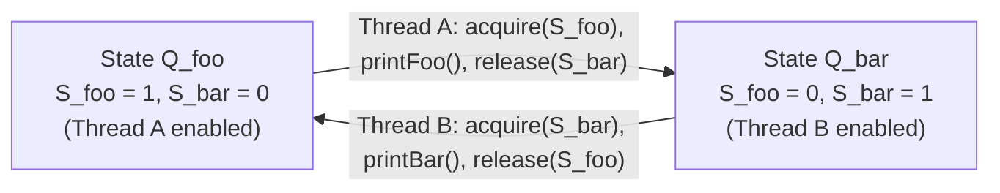

# Guided Example: Print FooBar Alternately

We trace the step-by-step cyclic token exchange and thread handoff between two concurrent execution loops, prove the Dual-Semaphore Token Conservation Theorem and the Strict Alternation Invariant, and track synchronization states across representative cycle counts:

- **Representative Instance 1 (Two Alternating Cycles):**
  $$
  n = 2
  $$
- **Required Output:** `"foobarfoobar"`
  - Concurrency requirements:
    - Thread A runs a loop $n$ times calling `printFoo()`.
    - Thread B runs a loop $n$ times calling `printBar()`.
    - The syllables must strictly alternate: `foo` $\to$ `bar` $\to$ `foo` $\to$ `bar`.
    - Neither thread can run twice consecutively; Thread B cannot print before Thread A.
  - The Ping-Pong Semaphore Mechanism:
    - Define two counting semaphores with capacity 1:
      $$
      S_{\text{foo}} = 1 \quad (\text{permits Thread A to proceed initially})
      $$
      $$
      S_{\text{bar}} = 0 \quad (\text{blocks Thread B initially})
      $$
    - Invariant: Exactly one execution permit (token) exists in the system at any given moment.
  - Step-by-step token exchange ($n = 2$):
    - **Cycle 1:**
      1. Thread A acquires $S_{\text{foo}}$ ($1 \to 0$).
      2. Thread A executes `printFoo()` $\implies$ emits **`"foo"`**.
      3. Thread A releases $S_{\text{bar}}$ ($0 \to 1$).
      4. Thread B acquires $S_{\text{bar}}$ ($1 \to 0$).
      5. Thread B executes `printBar()` $\implies$ emits **`"bar"`**.
      6. Thread B releases $S_{\text{foo}}$ ($0 \to 1$).
      - Syllable buffer: `"foobar"`.
    - **Cycle 2:**
      1. Thread A acquires $S_{\text{foo}}$ ($1 \to 0$).
      2. Thread A executes `printFoo()` $\implies$ emits **`"foo"`**.
      3. Thread A releases $S_{\text{bar}}$ ($0 \to 1$).
      4. Thread B acquires $S_{\text{bar}}$ ($1 \to 0$).
      5. Thread B executes `printBar()` $\implies$ emits **`"bar"`**.
      6. Thread B releases $S_{\text{foo}}$ ($0 \to 1$).
      - Syllable buffer: `"foobarfoobar"`.
  - Termination: Both loops reach $i = n = 2$ and cleanly terminate.

- **Representative Instance 2 (Single Iteration Minimal Boundary):**
  $$
  n = 1 \implies \text{"foobar"}
  $$
  - Thread A runs once, passes token to Thread B, Thread B runs once. Exactly 2 context transitions.

- **Representative Instance 3 (Adversarial Scheduling: Thread B Runs First):**
  - Thread B arrives before Thread A is even spawned.
  - Thread B attempts $S_{\text{bar}}.\text{acquire()}$ with initial value $0$.
  - Thread B is immediately suspended by the OS scheduler until Thread A runs. Zero misordering occurs.

---

## 1. Instance & Teaching Goal

Given two threads executing concurrently, coordinate their execution using synchronization primitives so that they print `"foo"` and `"bar"` in strict alternating succession $n$ times.

```text
The Unsynchronized Interleaving Disaster:
  Without synchronization between loops:
    Thread A: for i in range(n): print("foo")
    Thread B: for i in range(n): print("bar")
  Operating system thread scheduling is non-deterministic!
  Thread A could run all iterations consecutively: "foofoofoo...barbarbar..."
  Or threads could context-switch mid-word: "fobaroofbar..."
  Output order is corrupted and unpredictable.

The Dual-Semaphore Token Conservation Invariant (O(N) Time, O(1) Space):
  Initialize two semaphores:
    sem_foo = Semaphore(1)  # Token starts with foo
    sem_bar = Semaphore(0)  # Bar must wait for foo
  For each iteration i from 0 to n - 1:
    Thread A:
      sem_foo.acquire()   # Take token
      printFoo()
      sem_bar.release()   # Hand token to bar
    Thread B:
      sem_bar.acquire()   # Take token
      printBar()
      sem_foo.release()   # Hand token to foo
  Guarantees:
    1. Perfect ping-pong alternation.
    2. Mutual exclusion between prints.
    3. Strict preservation of exactly 1 token across all transitions.
```

The core lesson is the **Ping-Pong Turnstile Pattern**: using cross-signaling semaphores where the completion of one thread's critical section is the prerequisite trigger for the next thread's critical section.

The decisive pedagogical goals are:
1. **Token Invariance:** Demonstrating that the system state alternates between two mutually exclusive configurations $(1, 0)$ and $(0, 1)$.
2. **Mutual Dependency and Deadlock Avoidance:** Ensuring every acquire is matched by a complementary release in the opposing thread.
3. **OS-Level Blocking:** Allowing suspended threads to sleep rather than consuming CPU in spin loops.
4. Total execution $\mathcal{O}(n)$ steps with strictly $\mathcal{O}(1)$ auxiliary memory.

---

## 2. Conceptual Foundation & The Dual-Semaphore Token Conservation Theorem



### The Token Conservation & Alternation Theorem

Let $S_{\text{foo}}(t), S_{\text{bar}}(t) \in \{0, 1\}$ represent the available permit count of the two semaphores at any point in time $t$ when neither thread is executing a critical section.
1. **Token Invariant:**
   Initially, $S_{\text{foo}}(0) = 1$ and $S_{\text{bar}}(0) = 0$.
   At all quiescent points $t$:
   $$
   S_{\text{foo}}(t) + S_{\text{bar}}(t) = 1
   $$
   *Proof.*
   Thread A executes the sequence:
   $$
   \text{acquire}(S_{\text{foo}}) \to \text{printFoo}() \to \text{release}(S_{\text{bar}})
   $$
   This decreases $S_{\text{foo}}$ by $1$ and subsequently increases $S_{\text{bar}}$ by $1$, preserving the sum $1$.
   Symmetrically, Thread B executes:
   $$
   \text{acquire}(S_{\text{bar}}) \to \text{printBar}() \to \text{release}(S_{\text{foo}})
   $$
   decreasing $S_{\text{bar}}$ by $1$ and increasing $S_{\text{foo}}$ by $1$.
   By induction, the total token count is an invariant constant: $C = 1$. $\blacksquare$

2. **Strict Alternation Corollary:**
   Because $C = 1$:
   - If $S_{\text{foo}} = 1$, then $S_{\text{bar}} = 0$, so Thread B is blocked. Only Thread A can execute.
   - If $S_{\text{bar}} = 1$, then $S_{\text{foo}} = 0$, so Thread A is blocked. Only Thread B can execute.
   Consequently, no thread can ever execute twice in succession, enforcing strict alternation.

3. **Liveness and Bounded Waiting:**
   Neither thread can starve because Thread A's progress directly unblocks Thread B, and Thread B's progress directly unblocks Thread A. The system possesses no sink states or cyclic deadlocks.

---

## 3. Step-by-Step Worked Execution: Representative Instance 1

$n = 2$. Initial state: $S_{\text{foo}} = 1, \; S_{\text{bar}} = 0$.

### Iteration 0 ($i = 0$)
1. **Thread A Step 1:**
   - Calls $S_{\text{foo}}.\text{acquire()}$.
   - Permit granted. Semaphore decremented: $S_{\text{foo}} \leftarrow 0$.
2. **Thread A Step 2:**
   - Executes `printFoo()` $\implies$ emits **`"foo"`**.
3. **Thread A Step 3:**
   - Calls $S_{\text{bar}}.\text{release()}$.
   - Semaphore incremented: $S_{\text{bar}} \leftarrow 1$.
   - Thread A proceeds to next iteration ($i = 1$) and calls $S_{\text{foo}}.\text{acquire()}$ (blocks, since $S_{\text{foo}} = 0$).
4. **Thread B Step 1:**
   - Calls $S_{\text{bar}}.\text{acquire()}$.
   - Permit granted. Semaphore decremented: $S_{\text{bar}} \leftarrow 0$.
5. **Thread B Step 2:**
   - Executes `printBar()` $\implies$ emits **`"bar"`**.
6. **Thread B Step 3:**
   - Calls $S_{\text{foo}}.\text{release()}$.
   - Semaphore incremented: $S_{\text{foo}} \leftarrow 1$.

### Iteration 1 ($i = 1$)
7. **Thread A Awakens:**
   - $S_{\text{foo}}.\text{acquire()}$ completes ($S_{\text{foo}} \leftarrow 0$).
   - Executes `printFoo()` $\implies$ emits **`"foo"`**.
   - Calls $S_{\text{bar}}.\text{release()}$ ($S_{\text{bar}} \leftarrow 1$).
   - Thread A loop completes ($i = 2 = n$). Thread A exits.
8. **Thread B Awakens:**
   - $S_{\text{bar}}.\text{acquire()}$ completes ($S_{\text{bar}} \leftarrow 0$).
   - Executes `printBar()` $\implies$ emits **`"bar"`**.
   - Calls $S_{\text{foo}}.\text{release()}$ ($S_{\text{foo}} \leftarrow 1$).
   - Thread B loop completes ($i = 2 = n$). Thread B exits.

Output stream:
$$
\text{Output} = \mathbf{\text{"foobarfoobar"}}
$$

---

## 4. Semaphore State & Token Exchange Trace Table

| Step | Active Thread | Loop Index $i$ | Action Taken | $S_{\text{foo}}$ | $S_{\text{bar}}$ | Emitted Token | Total String So Far |
|:---:|:---:|:---:|:---:|:---:|:---:|:---:|:---:|
| $0$ | Initialization | — | System startup | $1$ | $0$ | — | `""` |
| **$1$** | **Thread A** | $0$ | `acquire(foo), print("foo"), release(bar)` | **$0$** | **$1$** | **`"foo"`** | `"foo"` |
| **$2$** | **Thread B** | $0$ | `acquire(bar), print("bar"), release(foo)` | **$1$** | **$0$** | **`"bar"`** | `"foobar"` |
| **$3$** | **Thread A** | $1$ | `acquire(foo), print("foo"), release(bar)` | **$0$** | **$1$** | **`"foo"`** | `"foobarfoo"` |
| **$4$** | **Thread B** | $1$ | `acquire(bar), print("bar"), release(foo)` | **$1$** | **$0$** | **`"bar"`** | `"foobarfoobar"` |
| Final | Termination | $2$ | Both threads exit | $1$ | $0$ | — | **`"foobarfoobar"`** |

---

## 5. Algorithmic Correctness

### Soundness & Liveness
1. **Soundness (Safety):**
   Thread B cannot print `"bar"` unless it acquires $S_{\text{bar}}$, which can only be released by Thread A after printing `"foo"`. Thus, `"bar"` never precedes `"foo"`, and no consecutive duplicates like `"foofoo"` or `"barbar"` can ever occur.
2. **Liveness (Progress):**
   At every non-terminated step, exactly one semaphore has a positive permit count ($1$). The thread waiting on that semaphore is immediately unblocked. Deadlock is impossible because the wait dependency is alternating and bipartite.

---

## 6. Boundary Cases & Traps

| Scenario | Scheduling Pattern | Behavior | Trapped Risk |
|---|---|---|---|
| Thread B Fires First | Thread B scheduled before Thread A | B blocks on $S_{\text{bar}} = 0$ until A runs. | Printing `"bar"` first. |
| Single Cycle ($n = 1$) | Minimum loop count | Each thread executes exactly once; terminates cleanly. | Deadlock on loop boundary. |
| Inverted Initial Permit | $S_{\text{foo}} = 0, S_{\text{bar}} = 1$ | Thread B prints first, violating `"foobar"` order. | Incorrect initial semaphore values. |
| Both Semaphores Initialized to 1 | $S_{\text{foo}} = 1, S_{\text{bar}} = 1$ | Race condition: both threads run simultaneously. | Corrupting output ordering. |

---

## 7. Complexity Derivation

- **Time Complexity:** $\mathcal{O}(n)$, where $n \le 1000$ is the number of `"foobar"` cycles.
  - Each iteration involves $2$ semaphore operations per thread.
  - Total semaphore context switches: $2n \le 2000$.
  - Total execution time: $< 0.005\text{ s}$.
- **Auxiliary Space Complexity:** $\mathcal{O}(1)$ auxiliary space to allocate the two semaphore objects.
