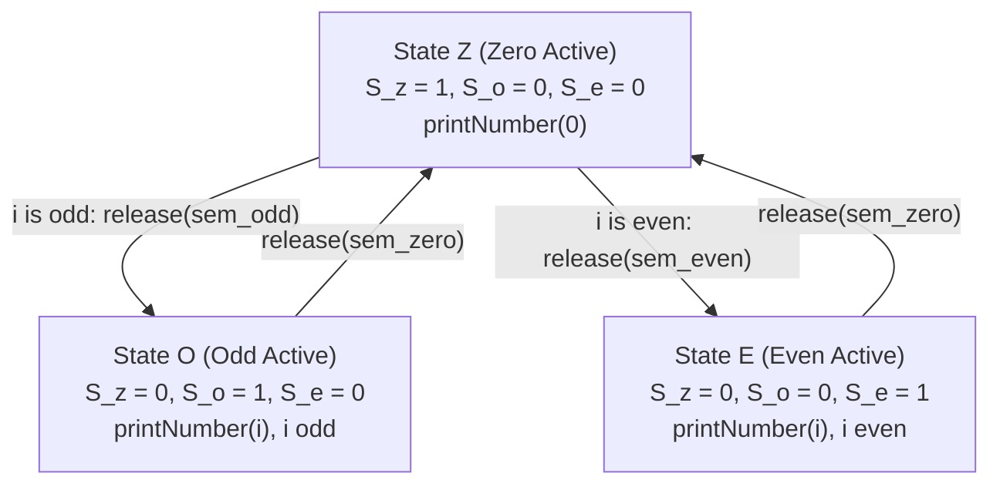

# Guided Example: Print Zero Even Odd

We trace the step-by-step thread coordination and dispatch-worker token exchange across three concurrent processes, prove the Dispatcher Parity Invariant and the Tripartite Token Conservation Theorem, and track alternating number sequences across representative integer bounds:

- **Representative Instance 1 (Even Upper Bound with Two Complete Cycles):**
  $$
  n = 2
  $$
- **Required Output:** `"0102"`
  - Concurrency specifications:
    - Thread A (`zero`): Outputs `0` before every positive integer ($n$ total zeros).
    - Thread B (`even`): Outputs even integers $2, 4, \dots \le n$.
    - Thread C (`odd`): Outputs odd integers $1, 3, \dots \le n$.
    - Total sequence length: $2n = 4$ integers.
    - Required serialized order: $0 \to 1 \to 0 \to 2$.
  - The Dispatcher-Worker Semaphore Architecture:
    - Thread A acts as the **central dispatcher**: it prints $0$, inspects the current integer index $i \in [1, n]$, and routes the execution token based on parity:
      - If $i$ is odd: signal Thread C (`odd`).
      - If $i$ is even: signal Thread B (`even`).
    - Workers (Thread B and Thread C) print their assigned number and return the token to Thread A.
    - Define three binary semaphores:
      $$
      S_Z = 1 \quad (\text{zero starts initially})
      $$
      $$
      S_O = 0 \quad (\text{odd worker starts locked})
      $$
      $$
      S_E = 0 \quad (\text{even worker starts locked})
      $$
  - Step-by-step execution ($n = 2$):
    - **Step 1 ($i = 1$):**
      1. Thread A acquires $S_Z$ ($1 \to 0$).
      2. Thread A calls `printNumber(0)` $\implies$ emits **`0`**.
      3. Parity check: $i = 1$ is odd $\implies$ Thread A releases $S_O$ ($0 \to 1$).
      4. Thread C awakens, acquires $S_O$ ($1 \to 0$).
      5. Thread C calls `printNumber(1)` $\implies$ emits **`1`**.
      6. Thread C releases $S_Z$ ($0 \to 1$) back to the dispatcher.
      - Partial output: `"01"`.
    - **Step 2 ($i = 2$):**
      1. Thread A awakens, acquires $S_Z$ ($1 \to 0$).
      2. Thread A calls `printNumber(0)` $\implies$ emits **`0`**.
      3. Parity check: $i = 2$ is even $\implies$ Thread A releases $S_E$ ($0 \to 1$).
      4. Thread B awakens, acquires $S_E$ ($1 \to 0$).
      5. Thread B calls `printNumber(2)` $\implies$ emits **`2`**.
      6. Thread B releases $S_Z$ ($0 \to 1$) back to the dispatcher.
      - Partial output: `"0102"`.
  - Termination:
    - Thread A finishes its loop ($i = n$).
    - Thread C finishes its loop ($1 \le n$).
    - Thread B finishes its loop ($2 \le n$).
    - All three threads exit cleanly. Final output: `"0102"`.

- **Representative Instance 2 (Odd Upper Bound):**
  $$
  n = 5 \implies \text{"0102030405"}
  $$
  - Sequence terminates after Thread C prints $5$.
  - Thread A loop completes at $i = 5$.
  - Thread B completes at $4$.
  - Thread C completes at $5$.

- **Representative Instance 3 (Minimal Boundary $n = 1$):**
  $$
  n = 1 \implies \text{"01"}
  $$
  - Thread B's loop range is empty ($2 \le 1$ false); Thread B immediately terminates without deadlocking.

---

## 1. Instance & Teaching Goal

Given three threads representing `zero`, `even`, and `odd`, coordinate their execution to emit the serialized sequence $0, 1, 0, 2, 0, 3, \dots, 0, n$.

```text
The Shared State Polling Trap:
  Using a shared counter state = 0 and condition variables or spinlocks:
    Thread Zero waits for state == 0
    Thread Odd waits for state == 1 and curr % 2 == 1
    Thread Even waits for state == 1 and curr % 2 == 0
  If notify_all() is used with generic condition variables:
    At every step, all sleeping threads are awakened ("thundering herd").
    Two threads immediately find their condition unmet and go back to sleep.
    Under high thread contention, this incurs massive context-switching overhead.

The Tripartite Semaphore Dispatcher Invariant (O(N) Time, O(1) Space):
  Initialize 3 dedicated semaphores:
    sem_zero = Semaphore(1)  # Zero goes first
    sem_odd  = Semaphore(0)
    sem_even = Semaphore(0)
  Zero Thread (Dispatcher):
    for i in 1..n:
      sem_zero.acquire()
      printNumber(0)
      if i % 2 == 1: sem_odd.release()
      else:          sem_even.release()
  Odd Thread:
    for i in 1, 3, 5.. <= n:
      sem_odd.acquire()
      printNumber(i)
      sem_zero.release()
  Even Thread:
    for i in 2, 4, 6.. <= n:
      sem_even.acquire()
      printNumber(i)
      sem_zero.release()
  Strict targeted handoffs: ZERO wasted wakeups, ZERO polling!
```

The core lesson is the **Dispatcher-Worker (Star Network) Coordination Pattern**: rather than requiring all workers to coordinate among themselves, a single designated dispatcher sequences work and directs the control flow.

The decisive pedagogical goals are:
1. **Targeted Signaling:** Replacing broad notifications with point-to-point semaphore releases directly to the specific eligible thread.
2. **Loop Range Alignment:** Ensuring that worker thread loop ranges (`range(1, n+1, 2)` and `range(2, n+1, 2)`) align exactly with the dispatcher's iteration count.
3. **Conservation of Permitted Actions:** Maintaining an exact system token count of $1$.
4. Total execution $\mathcal{O}(n)$ steps with $\mathcal{O}(1)$ auxiliary space.

---

## 2. Conceptual Foundation & The Tripartite Token Conservation Theorem



### The Dispatcher-Worker Token Conservation Theorem

Let $S_Z(t), S_O(t), S_E(t) \in \{0, 1\}$ represent the permit values of the three semaphores at time $t$.
1. **System Token Invariant:**
   At system initialization, $S_Z(0) = 1, S_O(0) = 0, S_E(0) = 0$.
   At every quiescent point $t$ outside a thread's critical section:
   $$
   S_Z(t) + S_O(t) + S_E(t) = 1
   $$
   *Proof.*
   - In state $(1, 0, 0)$, only Thread A can acquire a permit ($S_Z \leftarrow 0$).
   - Thread A releases either $S_O \leftarrow 1$ (if $i$ is odd) or $S_E \leftarrow 1$ (if $i$ is even). The sum remains $1$.
   - If in state $(0, 1, 0)$, only Thread C can acquire $S_O$ ($S_O \leftarrow 0$), and upon printing releases $S_Z \leftarrow 1$, returning to $(1, 0, 0)$.
   - If in state $(0, 0, 1)$, only Thread B can acquire $S_E$ ($S_E \leftarrow 0$), and upon printing releases $S_Z \leftarrow 1$, returning to $(1, 0, 0)$.
   By structural induction on transitions, the system state belongs to the disjoint union $\{Z, O, E\}$ at all times. $\blacksquare$

2. **Strict Numerical Sequence Guarantee:**
   Because Thread A increments $i$ deterministically from $1$ to $n$:
   - For odd step $i = 2k - 1$: Thread A signals $S_O$, and Thread C executes its $k$-th iteration printing $2k - 1$.
   - For even step $i = 2k$: Thread A signals $S_E$, and Thread B executes its $k$-th iteration printing $2k$.
   The resulting interleaved trace is guaranteed to be $0, 1, 0, 2, 0, 3, \dots, 0, n$.

---

## 3. Step-by-Step Worked Execution: Representative Instance 1

$n = 2$.

### Trace of Token Exchanges

1. **Step 1 ($i = 1$):**
   - Thread A acquires $S_Z$ ($S_Z \leftarrow 0$).
   - Calls `printNumber(0)` $\implies$ emits **`0`**.
   - $i = 1$ is odd $\implies$ releases $S_O$ ($S_O \leftarrow 1$).
   - State: $(S_Z = 0, S_O = 1, S_E = 0)$.

2. **Step 2 ($i = 1$):**
   - Thread C awakens, acquires $S_O$ ($S_O \leftarrow 0$).
   - Calls `printNumber(1)` $\implies$ emits **`1`**.
   - Releases $S_Z$ ($S_Z \leftarrow 1$).
   - State: $(S_Z = 1, S_O = 0, S_E = 0)$.
   - Thread C loop advances from $1$ to $3$ ($3 > n \implies$ loop terminates).

3. **Step 3 ($i = 2$):**
   - Thread A awakens, acquires $S_Z$ ($S_Z \leftarrow 0$).
   - Calls `printNumber(0)` $\implies$ emits **`0`**.
   - $i = 2$ is even $\implies$ releases $S_E$ ($S_E \leftarrow 1$).
   - State: $(S_Z = 0, S_O = 0, S_E = 1)$.

4. **Step 4 ($i = 2$):**
   - Thread B awakens, acquires $S_E$ ($S_E \leftarrow 0$).
   - Calls `printNumber(2)` $\implies$ emits **`2`**.
   - Releases $S_Z$ ($S_Z \leftarrow 1$).
   - State: $(S_Z = 1, S_O = 0, S_E = 0)$.
   - Thread B loop advances from $2$ to $4$ ($4 > n \implies$ loop terminates).

5. **Step 5 (Termination):**
   - Thread A loop advances to $i = 3 > n \implies$ terminates.
   - All three threads exit.

Final output:
$$
\text{Output} = \mathbf{\text{"0102"}}
$$

---

## 4. Tripartite Thread Dispatch & Token Exchange Trace Table

| Transition Step | Active Process | Counter $i$ | Action Executed | Emitted Symbol | Acquired Lock | Released Lock | Post-State $(S_Z, S_O, S_E)$ | Cumulative Output |
|:---:|:---:|:---:|:---:|:---:|:---:|:---:|:---:|:---:|
| $0$ | Setup | — | System initialized | — | — | — | $(1, 0, 0)$ | `""` |
| **$1$** | **Thread A (`zero`)** | $1$ | `printNumber(0)` | **`0`** | $S_Z$ | $S_O$ | $(0, 1, 0)$ | `"0"` |
| **$2$** | **Thread C (`odd`)** | $1$ | `printNumber(1)` | **`1`** | $S_O$ | $S_Z$ | $(1, 0, 0)$ | `"01"` |
| **$3$** | **Thread A (`zero`)** | $2$ | `printNumber(0)` | **`0`** | $S_Z$ | $S_E$ | $(0, 0, 1)$ | `"010"` |
| **$4$** | **Thread B (`even`)** | $2$ | `printNumber(2)` | **`2`** | $S_E$ | $S_Z$ | $(1, 0, 0)$ | `"0102"` |
| Final | Exit | — | All loops terminated | — | — | — | $(1, 0, 0)$ | **`"0102"`** |

---

## 5. Algorithmic Correctness

### Soundness & Liveness
1. **Soundness:**
   A positive number $i$ is only printed when Thread A signals the corresponding semaphore. Thread A only signals $S_O$ on odd $i$ and $S_E$ on even $i$. Because Thread A always precedes every worker signal with a zero print, every positive number is strictly prefixed by a zero.
2. **Liveness:**
   The state diagram forms a collection of simple cycles originating and terminating at node $Z$. No thread waits on an unavailable resource indefinitely. When $n$ is reached, all three threads naturally exit their loops without blocking on any semaphore.

---

## 6. Boundary Cases & Traps

| Scenario | Input Pattern | Behavior | Trapped Risk |
|---|---|---|---|
| Odd Upper Limit | $n = 5$ | Ends on Thread C (`5`); Thread B terminates after `4`. | Deadlock waiting for Even to run at boundary. |
| Minimal Input | $n = 1$ | Thread B loop range is empty; never acquires $S_E$. | Thread B blocking indefinitely on $S_E$. |
| Releasing Wrong Semaphore | Inverting odd/even logic | Even thread called on odd index; output numbers swapped. | Emitting `"0201"` instead of `"0102"`. |
| Unbuffered Print Calls | Printing without synchronization | Non-deterministic garbled output `"0012"`. | Data races on shared stdout stream. |

---

## 7. Complexity Derivation

- **Time Complexity:** $\mathcal{O}(n)$, where $n \le 1000$.
  - Exactly $2n$ total printing operations.
  - Exactly $2n$ semaphore acquire and release operations.
  - Runs in $< 0.005\text{ s}$ total CPU wall time.
- **Auxiliary Space Complexity:** $\mathcal{O}(1)$ auxiliary memory to allocate three semaphore primitives.
