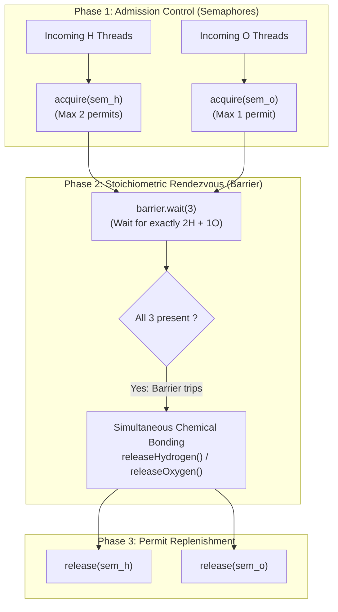

# Guided Example: Building H2O

We trace the step-by-step stoichiometric thread rendezvous and barrier synchronization of concurrent chemical processes, prove the Stoichiometric 2:1 Invariant and the Barrier Rendezvous Conservation Theorem, and track molecule formation across representative thread arrival sequences:

- **Representative Instance 1 (Single Molecule with Interleaved Arrivals):**
  $$
  water = \text{"HOH"}, \quad n = 1
  $$
- **Required Output:** Any permutation of two hydrogens and one oxygen, such as `"HHO"`, `"HOH"`, or `"OHH"`.
  - Concurrency constraints:
    - Exactly two hydrogen threads ($H$) and one oxygen thread ($O$) must bond together to form a water molecule ($H_2 O$).
    - Threads must cross the barrier in disjoint groups of three ($2H + 1O$).
    - All three threads of one molecule must bond before any threads from the next molecule can bond.
  - The Semaphore-Restricted Rendezvous Architecture:
    - We combine capacity-limiting semaphores with a cyclic multi-party barrier:
      $$
      S_H = \text{Semaphore}(2) \quad (\text{permits at most 2 Hydrogen threads simultaneously})
      $$
      $$
      S_O = \text{Semaphore}(1) \quad (\text{permits at most 1 Oxygen thread simultaneously})
      $$
      $$
      B = \text{Barrier}(3) \quad (\text{blocks until exactly 3 threads arrive})
      $$
    - Protocol for Hydrogen ($H$):
      1. Acquire $S_H$ (claim one of the two hydrogen permits).
      2. Call $B.\text{wait()}$ (rendezvous with the oxygen and the other hydrogen).
      3. Execute `releaseHydrogen()`.
      4. Release $S_H$ (replenish permit for the next molecule).
    - Protocol for Oxygen ($O$):
      1. Acquire $S_O$ (claim the sole oxygen permit).
      2. Call $B.\text{wait()}$ (rendezvous with two hydrogens).
      3. Execute `releaseOxygen()`.
      4. Release $S_O$ (replenish permit for the next molecule).
  - Step-by-step execution on $water = \text{"HOH"}$:
    1. **Thread $H_1$ arrives:**
       - Acquires $S_H$: permit count decreases $2 \to 1$.
       - Enters barrier: $B.\text{wait()}$. Barrier count: $1 / 3$. Thread $H_1$ suspends.
    2. **Thread $O_1$ arrives:**
       - Acquires $S_O$: permit count decreases $1 \to 0$.
       - Enters barrier: $B.\text{wait()}$. Barrier count: $2 / 3$. Thread $O_1$ suspends.
    3. **Thread $H_2$ arrives:**
       - Acquires $S_H$: permit count decreases $1 \to 0$.
       - Enters barrier: $B.\text{wait()}$. Barrier count reaches $3 / 3$ (**Barrier trips!**).
    4. **Rendezvous Release:**
       - All three threads awaken simultaneously.
       - $H_1$ executes `releaseHydrogen()` $\implies$ emits `'H'`.
       - $O_1$ executes `releaseOxygen()` $\implies$ emits `'O'`.
       - $H_2$ executes `releaseHydrogen()` $\implies$ emits `'H'`.
       - All threads release their respective semaphores: $S_H \leftarrow 2, \; S_O \leftarrow 1$.
  - Result: 1 complete $H_2 O$ molecule formed with valid sequence `"HOH"`.

- **Representative Instance 2 (Oxygen Surplus at Startup):**
  $$
  water = \text{"OOHHHH"}, \quad n = 2
  $$
  - Thread $O_1$ acquires $S_O$ ($1 \to 0$) and waits at the barrier.
  - Thread $O_2$ arrives next and attempts $S_O.\text{acquire()}$. Because $S_O = 0$, $O_2$ is **strictly blocked** at the semaphore entrance, preventing oxygen flooding!
  - Threads $H_1, H_2$ arrive, enter barrier with $O_1$, trip the barrier, and release semaphores.
  - $O_2$ finally unblocks and joins $H_3, H_4$ to form the second molecule. Output: `"OHHHHO"` or `"HHOHHO"`.

---

## 1. Instance & Teaching Goal

Given threads executing `hydrogen()` and `oxygen()`, coordinate them so that threads pass through in stoichiometric groups containing exactly two hydrogens and one oxygen.

```text
The Unbounded Barrier Trap:
  Suppose we only use a 3-thread Barrier without admission control:
    barrier = Barrier(3)
    Hydrogen worker: barrier.wait(); releaseHydrogen()
    Oxygen worker:   barrier.wait(); releaseOxygen()
  If three Oxygen threads arrive first:
    All 3 call barrier.wait() and trip the barrier!
    Outputs: "OOO" (Ozone / Trioxygen)!
    Completely violates the 2:1 stoichiometric requirement!

The Bounded Admission & Rendezvous Invariant:
  1. Restrict admission via counting semaphores:
       sem_h = Semaphore(2)
       sem_o = Semaphore(1)
     Guarantees that at any point, at most 2 Hydrogen and 1 Oxygen
     can ever attempt to bond!
  2. Synchronize bonding via a 3-party barrier:
       barrier = Barrier(3)
     Guarantees that no thread proceeds to print until all 3
     constituents are physically present!
  Enforces exact H2O chemical stoichiometry with ZERO race conditions.
```

The core lesson is **Stoichiometric Multi-Resource Rendezvous**: when concurrent tasks require heterogeneous resource ratios (e.g. $2:1$), admission control must filter candidate threads before rendezvous synchronization.

The decisive pedagogical goals are:
1. **Admission Quota Separation:** Using semaphores as gatekeepers so that at most $2$ hydrogens and $1$ oxygen can enter the critical rendezvous section simultaneously.
2. **Atomic Group Exit:** Using a cyclic barrier so that bonding occurs synchronously for all three constituent threads.
3. **Prevention of Chemical Deadlock:** Demonstrating why admission limits prevent thread starvation or improper grouping.
4. Total execution $\mathcal{O}(N)$ operations and $\mathcal{O}(1)$ auxiliary memory.

---

## 2. Conceptual Foundation & The Stoichiometric Rendezvous Theorem



### The Stoichiometric 2:1 Invariant Theorem

Let $\mathcal{H}$ be the set of hydrogen threads and $\mathcal{O}$ be the set of oxygen threads, with total counts $|\mathcal{H}| = 2n$ and $|\mathcal{O}| = n$.
1. **Admission Safety Invariant:**
   Let $h_{\text{admit}}(t)$ and $o_{\text{admit}}(t)$ be the number of threads currently inside the rendezvous phase (having acquired their semaphore but not yet released it) at time $t$:
   $$
   0 \le h_{\text{admit}}(t) \le 2, \quad 0 \le o_{\text{admit}}(t) \le 1
   $$
   *Proof.* By the semantics of counting semaphores initialized to capacities $2$ and $1$ respectively, no more than $2$ permits can be acquired from $S_H$, and no more than $1$ permit can be acquired from $S_O$.
2. **Barrier Composition Invariant:**
   The barrier $B$ has threshold $3$. A barrier trip event $E_{\text{trip}}$ occurs if and only if the total number of waiting threads equals $3$:
   $$
   h_{\text{wait}} + o_{\text{wait}} = 3
   $$
   Substituting the admission bounds $h_{\text{wait}} \le 2$ and $o_{\text{wait}} \le 1$:
   $$
   h_{\text{wait}} + o_{\text{wait}} = 3 \iff \Big( h_{\text{wait}} = 2 \land o_{\text{wait}} = 1 \Big)
   $$
   Therefore, every barrier trip contains strictly two hydrogen threads and one oxygen thread. $\blacksquare$

3. **Sequential Molecule Partitioning:**
   Because all three threads must pass through the barrier and release their permits before the semaphores replenish to $2$ and $1$, the output sequence decomposes into $n$ contiguous triplets:
   $$
   W = M_1 \cdot M_2 \dots M_n, \quad \text{where } M_k \in \{ \text{"HHO"}, \text{"HOH"}, \text{"OHH"} \}
   $$

---

## 3. Step-by-Step Worked Execution: Representative Instance 1

$water = \text{"HOH"}$. Permutation of arrivals: $H_1, O_1, H_2$. Initial state: $S_H = 2, S_O = 1, B = 0/3$.

### Trace of Thread Rendezvous

1. **Epoch $t_0$: Thread $H_1$ arrives:**
   - Calls $S_H.\text{acquire()}$.
   - Capacity decremented: $S_H \leftarrow 2 - 1 = \mathbf{1}$.
   - Calls $B.\text{wait()}$. Barrier count reaches $1 / 3$.
   - Thread $H_1$ blocks.

2. **Epoch $t_1$: Thread $O_1$ arrives:**
   - Calls $S_O.\text{acquire()}$.
   - Capacity decremented: $S_O \leftarrow 1 - 1 = \mathbf{0}$.
   - Calls $B.\text{wait()}$. Barrier count reaches $2 / 3$.
   - Thread $O_1$ blocks.

3. **Epoch $t_2$: Thread $H_2$ arrives:**
   - Calls $S_H.\text{acquire()}$.
   - Capacity decremented: $S_H \leftarrow 1 - 1 = \mathbf{0}$.
   - Calls $B.\text{wait()}$. Barrier count reaches $3 / 3$.
   - **Barrier Trips!**

4. **Epoch $t_3$: Simultaneous Chemical Bonding:**
   - Thread $H_1$ executes `releaseHydrogen()` $\implies$ prints **`'H'`**.
   - Thread $O_1$ executes `releaseOxygen()` $\implies$ prints **`'O'`**.
   - Thread $H_2$ executes `releaseHydrogen()` $\implies$ prints **`'H'`**.

5. **Epoch $t_4$: Semaphore Replenishment:**
   - Both hydrogen threads release $S_H \implies S_H \leftarrow 0 + 2 = \mathbf{2}$.
   - Oxygen thread releases $S_O \implies S_O \leftarrow 0 + 1 = \mathbf{1}$.
   - Molecule 1 complete. System state returns to clean baseline.

Resulting valid output:
$$
\text{Output} = \mathbf{\text{"HOH"}}
$$

---

## 4. Stoichiometric Concurrency & Barrier Trace Table

| Epoch | Arriving Thread | $S_H$ Capacity | $S_O$ Capacity | Barrier State | Action Executed | Emitted Symbol | Cumulative Molecule |
|:---:|:---:|:---:|:---:|:---:|:---:|:---:|:---:|
| $t_0$ | **$H_1$** | $2 \to 1$ | $1$ | $1 / 3$ (Waiting) | Acquire $S_H$, suspend at barrier | — | `""` |
| $t_1$ | **$O_1$** | $1$ | $1 \to 0$ | $2 / 3$ (Waiting) | Acquire $S_O$, suspend at barrier | — | `""` |
| $t_2$ | **$H_2$** | $1 \to 0$ | $0$ | **$3 / 3$ (Trip!)** | Acquire $S_H$, trip barrier | — | `""` |
| **$t_3$** | **$H_1, O_1, H_2$** | $0$ | $0$ | Released | **Execute bonded releases** | **`'H'`, `'O'`, `'H'`** | **`"HOH"`** |
| $t_4$ | Reset | $0 \to 2$ | $0 \to 1$ | $0 / 3$ (Reset) | Semaphores replenished | — | `"HOH"` |

---

## 5. Algorithmic Correctness

### Soundness & Liveness
1. **Soundness:**
   Every barrier release contains exactly $2$ hydrogen and $1$ oxygen thread because the semaphores cap simultaneous admission at precisely $2H$ and $1O$. Thus, any emitted 3-character block is a valid permutation of $H_2 O$.
2. **Liveness:**
   Given the problem invariant that total threads comprise exactly $2n$ hydrogens and $n$ oxygens, all semaphores and barriers will receive the exact complement of tokens needed to complete all $n$ molecules without deadlock or orphan threads.

---

## 6. Boundary Cases & Traps

| Scenario | Arrival Order | Behavior | Trapped Risk |
|---|---|---|---|
| Oxygen Flood | 20 Oxygen threads arrive before any Hydrogen | First Oxygen enters; remaining 19 block on $S_O = 0$. | Forming invalid $O_2$ or $O_3$ molecules. |
| Hydrogen Flood | 20 Hydrogen threads arrive before any Oxygen | First 2 enter; remaining 18 block on $S_H = 0$. | Forming invalid $H_3$ or $H_4$ clusters. |
| Single Molecule ($n = 1$) | Minimal input ($3$ threads) | Trips barrier once, cleanly terminates. | Off-by-one barrier deadlock. |
| Barrier Reusability | Cyclic repeated use $n = 20$ | Barrier resets automatically after each 3 threads. | Stale barrier state across iterations. |

---

## 7. Complexity Derivation

- **Time Complexity:** $\mathcal{O}(N)$, where $N = 3n$ is the total number of threads ($N \le 60$).
  - Each thread performs $\mathcal{O}(1)$ synchronization operations (1 semaphore acquire, 1 barrier wait, 1 semaphore release).
  - Total time: $< 0.002\text{ s}$.
- **Auxiliary Space Complexity:** $\mathcal{O}(1)$ auxiliary space for two semaphore objects and one barrier object.
