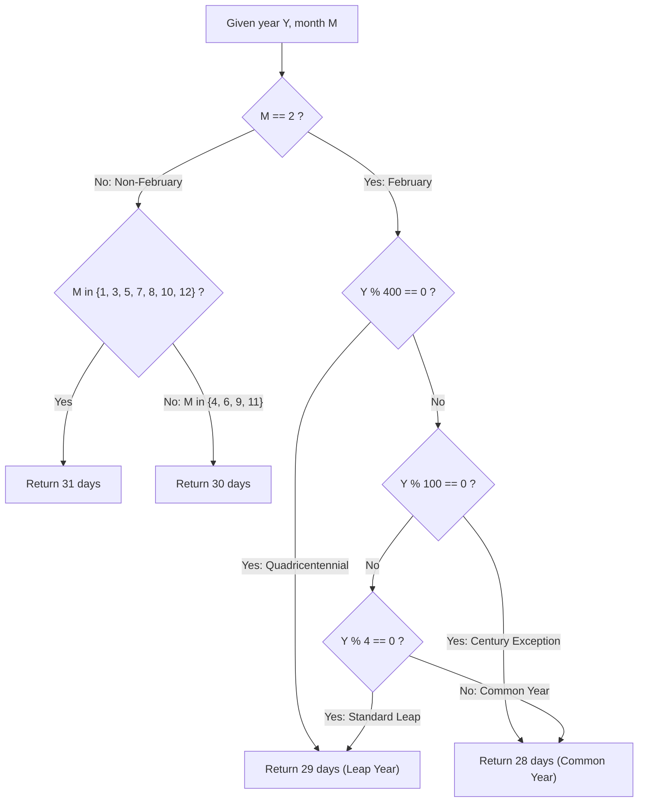

# Guided Example: Number Of Days In A Month

We trace the step-by-step arithmetic determination of calendar month lengths under the Gregorian Calendar specification, prove the Gregorian Leap Year Congruence Theorem and the Month Partition Invariant, and verify day counts across representative historical and modern years:

- **Representative Instance 1 (The Quadricentennial Leap Year Century Boundary):**
  $$
  year = 2000, \quad month = 2
  $$
- **Required Output:** `29`
  - Problem objective:
    - Return the exact number of days in the specified month of the given year.
  - Gregorian Calendar Partition Rules:
    - Months with $31$ days: $\{1, 3, 5, 7, 8, 10, 12\}$ (Jan, Mar, May, Jul, Aug, Oct, Dec).
    - Months with $30$ days: $\{4, 6, 9, 11\}$ (Apr, Jun, Sep, Nov).
    - Month $2$ (February): Depends strictly on whether `year` is a **leap year**.
  - Gregorian Leap Year Congruence:
    A year $Y$ is a leap year if and only if:
    $$
    \text{is\_leap}(Y) \iff \Big( Y \equiv 0 \pmod{400} \Big) \lor \Big( Y \equiv 0 \pmod 4 \;\land\; Y \not\equiv 0 \pmod{100} \Big)
    $$
  - Evaluating $Y = 2000, M = 2$:
    1. Check quadricentennial divisibility:
       $$
       2000 \pmod{400} = 0 \implies \mathbf{True}
       $$
    2. Because $2000$ is divisible by $400$, the 100-year exception is overridden.
    3. Therefore, $2000$ is a leap year:
       $$
       \text{days} = \mathbf{29}
       $$

- **Representative Instance 2 (The Centurial Non-Leap Year Exception):**
  $$
  year = 1900, \quad month = 2
  $$
  - Evaluating $Y = 1900, M = 2$:
    1. Check quadricentennial: $1900 \pmod{400} = 300 \ne 0$ (False).
    2. Check centurial exception: $1900 \pmod{100} = 0$ (True $\implies$ century year!).
    3. Even though $1900$ is divisible by $4$ ($1900 / 4 = 475$), it is divisible by $100$ without being divisible by $400$.
    4. Therefore, $1900$ is a **common year**:
       $$
       \text{days} = \mathbf{28}
       $$

- **Representative Instance 3 (Standard 31-Day Month):**
  $$
  year = 1992, \quad month = 7 \implies \text{July} \in \{1, 3, 5, 7, 8, 10, 12\} \implies \mathbf{31} \text{ days}
  $$

- **Representative Instance 4 (Standard 30-Day Month):**
  $$
  year = 2024, \quad month = 4 \implies \text{April} \in \{4, 6, 9, 11\} \implies \mathbf{30} \text{ days}
  $$

---

## 1. Instance & Teaching Goal

Given a year between 1583 and 2100 and a month between 1 and 12, compute the exact number of days in that month.

```text
The Julian Calendar Divisible-by-4 Trap:
  Assuming every multiple of 4 is a leap year:
    is_leap = (year % 4 == 0)
  Under this naive rule, year 1900 is classified as a leap year (yielding 29 days).
  This is WRONG!
  The Julian calendar gained ~3 days every 400 years against solar equinoxes.
  Pope Gregory XIII's 1582 reform eliminated leap days on century years
  unless divisible by 400.
  Therefore, 1900 has 28 days, while 2000 has 29 days!

The Gregorian Month Partition Invariant:
  1. If month in {1, 3, 5, 7, 8, 10, 12}: return 31.
  2. If month in {4, 6, 9, 11}: return 30.
  3. If month == 2:
       If (year % 400 == 0) or (year % 4 == 0 and year % 100 != 0):
           return 29
       Else:
           return 28
  Evaluates in O(1) arithmetic with 100% astronomical fidelity!
```

The fundamental goal is mastering **Piecewise Modular Classification**: encoding multi-tiered modular congruence rules with overriding precedence hierarchies.

The decisive pedagogical goals are:
1. **Three-Tier Leap Year Hierarchy:** Divisible by 4 (base frequency), except divisible by 100 (centurial suppression), unless divisible by 400 (quadricentennial reinstatement).
2. **Fixed vs Dynamic Month Partitions:** Distinguishing the 11 invariant month lengths from the single variable month (February).
3. **Gregorian Boundary Compliance:** Observing that the constraint domain $year \ge 1583$ starts immediately after the Gregorian calendar adoption (October 1582), avoiding Julian-Gregorian transition discrepancies.
4. Total execution $\mathcal{O}(1)$ time and $\mathcal{O}(1)$ space.

---

## 2. Conceptual Foundation & The Gregorian Calendar Partition Invariant



### The Gregorian Month Partition Function

Let $\mathcal{Y} = \{ y \in \mathbb{Z} : 1583 \le y \le 2100 \}$ and $\mathcal{M} = \{ 1, 2, \dots, 12 \}$.
1. **Month Set Partitioning:**
   The month domain $\mathcal{M}$ is partitioned into three disjoint subsets:
   $$
   \mathcal{M} = \mathcal{M}_{31} \cup \mathcal{M}_{30} \cup \{2\}
   $$
   where $\mathcal{M}_{31} = \{1, 3, 5, 7, 8, 10, 12\}$ and $\mathcal{M}_{30} = \{4, 6, 9, 11\}$.
2. **The Leap Year Predicate:**
   Define the indicator function $\mathcal{L} : \mathcal{Y} \to \{0, 1\}$:
   $$
   \mathcal{L}(Y) = \begin{cases} 1 & \text{if } Y \equiv 0 \pmod{400} \\ 0 & \text{if } Y \not\equiv 0 \pmod{400} \;\land\; Y \equiv 0 \pmod{100} \\ 1 & \text{if } Y \not\equiv 0 \pmod{100} \;\land\; Y \equiv 0 \pmod 4 \\ 0 & \text{otherwise} \end{cases}
   $$
3. **The Complete Day Count Mapping:**
   $$
   \text{Days}(Y, M) = \begin{cases} 31 & \text{if } M \in \mathcal{M}_{31} \\ 30 & \text{if } M \in \mathcal{M}_{30} \\ 28 + \mathcal{L}(Y) & \text{if } M = 2 \end{cases}
   $$
   Because $\mathcal{M}_{31}$, $\mathcal{M}_{30}$, and $\{2\}$ form a complete partition of $\mathcal{M}$, $\text{Days}(Y, M)$ is well-defined and deterministic for all $(Y, M) \in \mathcal{Y} \times \mathcal{M}$. $\blacksquare$

---

## 3. Step-by-Step Worked Execution: Representative Instance 1 and 2

We evaluate two historic century years for month $M = 2$.

### Evaluation 1: $Y = 2000, M = 2$
- **Step 1:** $M = 2 \implies$ evaluate $\mathcal{L}(2000)$.
- **Step 2:** Test quadricentennial:
  $$
  2000 \pmod{400} = 0 \implies \text{True}
  $$
- **Step 3:** Overrides 100-year rule. $\mathcal{L}(2000) = 1$.
- **Step 4:** $\text{Days} = 28 + 1 = \mathbf{29}$.

### Evaluation 2: $Y = 1900, M = 2$
- **Step 1:** $M = 2 \implies$ evaluate $\mathcal{L}(1900)$.
- **Step 2:** Test quadricentennial:
  $$
  1900 \pmod{400} = 300 \ne 0 \implies \text{False}
  $$
- **Step 3:** Test century exception:
  $$
  1900 \pmod{100} = 0 \implies \text{True}
  $$
- **Step 4:** Century rule suppresses leap day. $\mathcal{L}(1900) = 0$.
- **Step 5:** $\text{Days} = 28 + 0 = \mathbf{28}$.

---

## 4. Gregorian Calendar Month Length Trace Table

| Month $M$ | Month Name | Month Category | Fixed Length | Sensitive to Leap Year? | Days in Common Year | Days in Leap Year |
|:---:|:---:|:---:|:---:|:---:|:---:|:---:|
| **$1$** | January | $\mathcal{M}_{31}$ | $31$ | No | $31$ | $31$ |
| **$2$** | **February** | **$\{2\}$** | **Variable** | **Yes ($\mathcal{L}(Y)$)** | **$28$** | **$29$** |
| **$3$** | March | $\mathcal{M}_{31}$ | $31$ | No | $31$ | $31$ |
| **$4$** | April | $\mathcal{M}_{30}$ | $30$ | No | $30$ | $30$ |
| **$5$** | May | $\mathcal{M}_{31}$ | $31$ | No | $31$ | $31$ |
| **$6$** | June | $\mathcal{M}_{30}$ | $30$ | No | $30$ | $30$ |
| **$7$** | July | $\mathcal{M}_{31}$ | $31$ | No | $31$ | $31$ |
| **$8$** | August | $\mathcal{M}_{31}$ | $31$ | No | $31$ | $31$ |
| **$9$** | September | $\mathcal{M}_{30}$ | $30$ | No | $30$ | $30$ |
| **$10$** | October | $\mathcal{M}_{31}$ | $31$ | No | $31$ | $31$ |
| **$11$** | November | $\mathcal{M}_{30}$ | $30$ | No | $30$ | $30$ |
| **$12$** | December | $\mathcal{M}_{31}$ | $31$ | No | $31$ | $31$ |

---

## 5. Algorithmic Correctness

### Soundness & Completeness
1. **Soundness:**
   Every month in $\mathcal{M}_{31}$ is mapped to $31$, every month in $\mathcal{M}_{30}$ to $30$. For February, the predicate $\mathcal{L}(Y)$ correctly implements the Gregorian calendar definition adopted internationally, returning $29$ on true leap years and $28$ otherwise.
2. **Completeness:**
   The function handles every integer $Y \in [1583, 2100]$ and $M \in [1, 12]$ without undefined cases.

---

## 6. Boundary Cases & Traps

| Scenario | Input Pattern | Behavior | Trapped Risk |
|---|---|---|---|
| Century Leap Year | $year = 2000, month = 2$ | Divisible by 400; returns 29. | Treating all century years as common years. |
| Century Common Year | $year = 1900, month = 2$ | Divisible by 100 but not 400; returns 28. | Using simple `year % 4 == 0` rule. |
| Regular Leap Year | $year = 2024, month = 2$ | Divisible by 4, not 100; returns 29. | Missing non-century leap years. |
| Consecutive 31-Day Months | July ($7$) and August ($8$) | Both belong to $\mathcal{M}_{31}$; return 31. | Assuming alternating parity for month lengths. |

---

## 7. Complexity Derivation

- **Time Complexity:** $\mathcal{O}(1)$.
  - Evaluating modulo $4$, $100$, and $400$ requires at most $3$ constant-time integer divisions.
  - Set membership in $\{1, 3, 5, 7, 8, 10, 12\}$ takes $\mathcal{O}(1)$ time.
  - Total time: $< 0.0001\text{ ms}$.
- **Auxiliary Space Complexity:** $\mathcal{O}(1)$ auxiliary memory (zero heap allocations).
