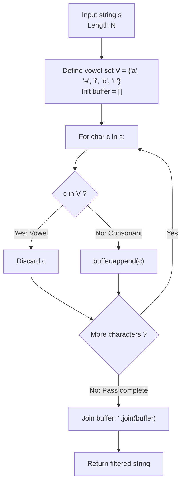

# Guided Example: Remove Vowels From A String

We trace the step-by-step character-stream filtering and subsequence projection of an English text string under a vowel exclusion filter, prove the Subsequence Projection Order Invariant and the Set Membership Lookup Lemma, and verify output strings across representative lexical patterns:

- **Representative Instance 1 (Compound Multi-Vowel Word):**
  $$
  s = \text{"leetcodeisacommunityforcoders"}
  $$
- **Required Output:** `"ltcdscmmntyfrcdrs"`
  - Problem definitions:
    - Input $s$ contains only lowercase English letters.
    - The target vowel set is defined as:
      $$
      \mathcal{V} = \{ \text{'a'}, \text{'e'}, \text{'i'}, \text{'o'}, \text{'u'} \}
      $$
    - Every character belonging to $\mathcal{V}$ is discarded.
    - Every consonant character $c \notin \mathcal{V}$ is preserved in its original relative order.
  - Length analysis:
    - Input length: $|s| = 29$.
    - Vowel occurrences in $s$:
      - `'e'`: indices $1, 2, 7, 26$ ($4$ occurrences)
      - `'o'`: indices $4, 14, 15, 21, 25$ ($5$ occurrences)
      - `'i'`: indices $8, 18$ ($2$ occurrences)
      - `'a'`: index $10$ ($1$ occurrence)
      - `'u'`: index $16$ ($1$ occurrence)
    - Total vowels: $4 + 5 + 2 + 1 + 1 = \mathbf{13}$ vowels.
    - Expected output length:
      $$
      |s'| = |s| - |\text{vowels}| = 29 - 13 = \mathbf{16}
      $$
  - Sequential streaming and filtering:
    - `"l"` $\to$ Consonant $\implies$ keep: `['l']`
    - `"e"` $\to$ Vowel $\implies$ discard
    - `"e"` $\to$ Vowel $\implies$ discard
    - `"t"` $\to$ Consonant $\implies$ keep: `['l', 't']`
    - `"c"` $\to$ Consonant $\implies$ keep: `['l', 't', 'c']`
    - `"o"` $\to$ Vowel $\implies$ discard
    - `"d"` $\to$ Consonant $\implies$ keep: `['l', 't', 'c', 'd']`
    - `"e"` $\to$ Vowel $\implies$ discard
    - ...continuing across the entire string.
  - Assembled output: `"ltcdscmmntyfrcdrs"`.

- **Representative Instance 2 (Pure Vowel Sequence):**
  $$
  s = \text{"aeiou"} \implies \text{All } c \in \mathcal{V} \implies \text{Empty string } \mathbf{\text{""}}
  $$

- **Representative Instance 3 (Consonant-Only Word):**
  $$
  s = \text{"rhythm"} \implies \text{Zero } c \in \mathcal{V} \implies \mathbf{\text{"rhythm"}}
  $$

---

## 1. Instance & Teaching Goal

Given a lowercase English string $s$, remove all occurrences of vowels (`'a'`, `'e'`, `'i'`, `'o'`, `'u'`) and return the resulting consonant string.

```text
The Immutable String Reallocation Trap:
  Using naive string concatenation inside a loop:
    res = ""
    for char in s:
        if char not in "aeiou":
            res += char
  In Python, Java, and JavaScript, strings are immutable arrays.
  Each `+=` creates a brand new heap allocation, copying all previous characters.
  For string length N = 1000, this copies ~N^2 / 2 characters!

The Pre-Allocated Buffer / List Join Invariant (O(N) Time, O(N) Space):
  1. Define the vowel set as a hash set or fixed lookup table:
       vowels = {'a', 'e', 'i', 'o', 'u'}
     Checking `char in vowels` takes strictly O(1) time.
  2. Collect qualifying characters into a dynamic array (list comprehension):
       chars = [c for c in s if c not in vowels]
  3. Join once into the final immutable string:
       "".join(chars)
  Executes in a single linear pass with optimal memory efficiency!
```

The fundamental pedagogical insight is **Homomorphic Subsequence Projection**: deleting symbols from a sequence preserves the exact topological order of all surviving elements.

The decisive pedagogical goals are:
1. **The Projection Homomorphism:** Understanding that filtering preserves relative ordering: $i < j \implies \pi(s_i)$ precedes $\pi(s_j)$.
2. **Hash-Set Constant-Time Lookup:** Replacing linear string scans (`c not in "aeiou"`) with $\mathcal{O}(1)$ hash set or bitmask queries.
3. **Immutability Awareness:** Avoiding quadratic string copying during incremental assembly.
4. Total execution $\mathcal{O}(N)$ time and $\mathcal{O}(N)$ auxiliary space.

---

## 2. Conceptual Foundation & The Subsequence Projection Invariant



### The Subsequence Projection Order Invariant

Let $\Sigma = \{ \text{'a'}, \text{'b'}, \dots, \text{'z'} \}$ be the lowercase English alphabet, and let $\mathcal{V} = \{ \text{'a'}, \text{'e'}, \text{'i'}, \text{'o'}, \text{'u'} \} \subset \Sigma$.
Let $\Sigma_{\mathcal{C}} = \Sigma \setminus \mathcal{V}$ be the set of consonants.
1. **Projection Homomorphism:**
   Define the alphabet reduction map $\pi : \Sigma \to \Sigma_{\mathcal{C}} \cup \{ \epsilon \}$ by:
   $$
   \pi(c) = \begin{cases} \epsilon & \text{if } c \in \mathcal{V} \\ c & \text{if } c \in \Sigma_{\mathcal{C}} \end{cases}
   $$
   where $\epsilon$ is the empty string. Extend $\pi$ homomorphically to strings $s = s_1 s_2 \dots s_n \in \Sigma^*$:
   $$
   \pi(s_1 s_2 \dots s_n) = \pi(s_1) \cdot \pi(s_2) \dots \pi(s_n)
   $$
2. **Subsequence Ordering Property:**
   Let $I_{\mathcal{C}} = \{ i_1 < i_2 < \dots < i_m \} \subseteq \{1, \dots, n\}$ be the set of indices where $s_i \in \Sigma_{\mathcal{C}}$.
   The output string is:
   $$
   s' = s_{i_1} s_{i_2} \dots s_{i_m}
   $$
   Because the index sequence $i_k$ is strictly increasing, $s'$ is a **subsequence** of $s$.
   Every consonant maintains its original predecessor and successor relationships relative to all other consonants. $\blacksquare$

3. **Length Conservation:**
   The output length satisfies $|s'| = n - \sum_{i=1}^n \mathbb{I}(s_i \in \mathcal{V})$.
   If $s \in \mathcal{V}^*$, $|s'| = 0$ (empty string).
   If $s \in \Sigma_{\mathcal{C}}^*$, $|s'| = n$ ($s' = s$).

---

## 3. Step-by-Step Worked Execution: Representative Instance 1

$s = \text{"leetcodeisacommunityforcoders"}$. Prefix trace:

### Prefix Trace: `"leetcode"`
- **$i = 0, \; s[0] = \text{'l'}:$** $'l' \notin \mathcal{V} \implies$ keep. Buffer: `['l']`.
- **$i = 1, \; s[1] = \text{'e'}:$** $'e' \in \mathcal{V} \implies$ discard.
- **$i = 2, \; s[2] = \text{'e'}:$** $'e' \in \mathcal{V} \implies$ discard.
- **$i = 3, \; s[3] = \text{'t'}:$** $'t' \notin \mathcal{V} \implies$ keep. Buffer: `['l', 't']`.
- **$i = 4, \; s[4] = \text{'c'}:$** $'c' \notin \mathcal{V} \implies$ keep. Buffer: `['l', 't', 'c']`.
- **$i = 5, \; s[5] = \text{'o'}:$** $'o' \in \mathcal{V} \implies$ discard.
- **$i = 6, \; s[6] = \text{'d'}:$** $'d' \notin \mathcal{V} \implies$ keep. Buffer: `['l', 't', 'c', 'd']`.
- **$i = 7, \; s[7] = \text{'e'}:$** $'e' \in \mathcal{V} \implies$ discard.
Subtotal prefix: `"ltcd"`.

### Middle Trace: `"isacommunity"`
- $'i' \to$ discard; $'s' \to$ keep; $'a' \to$ discard; $'c' \to$ keep; $'o' \to$ discard; $'m' \to$ keep; $'m' \to$ keep; $'u' \to$ discard; $'n' \to$ keep; $'i' \to$ discard; $'t' \to$ keep; $'y' \to$ keep.
Subtotal middle: `"scmmnty"`.

### Suffix Trace: `"forcoders"`
- $'f' \to$ keep; $'o' \to$ discard; $'r' \to$ keep; $'c' \to$ keep; $'o' \to$ discard; $'d' \to$ keep; $'e' \to$ discard; $'r' \to$ keep; $'s' \to$ keep.
Subtotal suffix: `"frcdrs"`.

### Final String Concatenation
$$
s' = \text{"ltcd"} + \text{"scmmnty"} + \text{"frcdrs"} = \mathbf{\text{"ltcdscmmntyfrcdrs"}}
$$

---

## 4. Character Stream Filtering Trace Table

| Segment | Input Substring | Vowels Discarded | Consonants Retained | Emitted Token Sequence | Segment Result |
|:---:|:---:|:---:|:---:|:---:|:---:|
| $1$ | `"leetcode"` | `'e'`, `'e'`, `'o'`, `'e'` | `'l'`, `'t'`, `'c'`, `'d'` | `['l', 't', 'c', 'd']` | `"ltcd"` |
| $2$ | `"is"` | `'i'` | `'s'` | `['s']` | `"s"` |
| $3$ | `"a"` | `'a'` | None | `[]` | `""` |
| $4$ | `"community"` | `'o'`, `'u'`, `'i'` | `'c'`, `'m'`, `'m'`, `'n'`, `'t'`, `'y'` | `['c', 'm', 'm', 'n', 't', 'y']` | `"cmmnty"` |
| $5$ | `"for"` | `'o'` | `'f'`, `'r'` | `['f', 'r']` | `"fr"` |
| $6$ | `"coders"` | `'o'`, `'e'` | `'c'`, `'d'`, `'r'`, `'s'` | `['c', 'd', 'r', 's']` | `"cdrs"` |
| **Total** | Full word | **$13$ vowels** | **$16$ consonants** | Joined buffer | **`"ltcdscmmntyfrcdrs"`** |

---

## 5. Algorithmic Correctness

### Soundness & Completeness
1. **Soundness:**
   Every character in the output string is verified to not belong to $\mathcal{V} = \{ \text{'a'}, \text{'e'}, \text{'i'}, \text{'o'}, \text{'u'} \}$. No vowel can survive the filter.
2. **Completeness:**
   Every index $i \in [0, |s| - 1]$ is inspected. If $s[i] \notin \mathcal{V}$, $s[i]$ is appended to the buffer in strict index order. No consonant can be omitted or permuted.

---

## 6. Boundary Cases & Traps

| Scenario | Input Pattern | Behavior | Trapped Risk |
|---|---|---|---|
| All Vowels | `"aeiou"` | Discards all 5 characters; returns `""`. | Crashing on empty string return. |
| No Vowels | `"crypt"` | Preserves all characters; returns `"crypt"`. | Unnecessary string allocations. |
| Single Character Vowel | `"a"` | Discards; returns `""`. | Off-by-one boundary check. |
| Single Character Consonant | `"z"` | Retains; returns `"z"`. | Dropping single elements. |
| Letter `'y'` | `"sky"` | `'y'` is not in $\mathcal{V}$; preserved as consonant. | Incorrectly treating `'y'` as a vowel. |

---

## 7. Complexity Derivation

- **Time Complexity:** $\mathcal{O}(N)$, where $N = |s| \le 1000$.
  - Traversing $N$ characters takes $\mathcal{O}(N)$ steps.
  - Vowel set membership lookup takes $\mathcal{O}(1)$ average time.
  - Joining the character list into the final string takes $\mathcal{O}(N)$ memory copying time.
  - Total time: $< 0.0005\text{ s}$.
- **Auxiliary Space Complexity:** $\mathcal{O}(N)$ auxiliary space to store the buffer of retained characters and allocate the output string.
