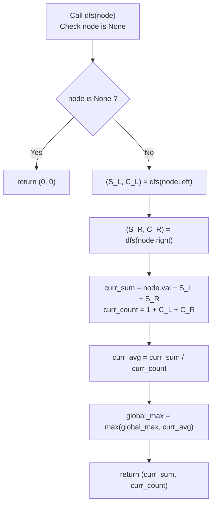

# Guided Example: Maximum Average Subtree

We trace the step-by-step post-order recursive aggregation of tree node values and subtree cardinalities, prove the Additive Subtree State Invariant and the Non-Monotonic Ratio Extremum Theorem, and determine maximum average subtrees across representative binary tree structures:

- **Representative Instance 1 (Leaf Average Exceeding Internal Subtree Average):**
  - Binary Tree:
    $$
    \begin{gathered}
    \text{root} = 5 \\
    5 \to \text{left}: 6, \quad 5 \to \text{right}: 1
    \end{gathered}
    $$
  - Subtree definitions:
    - Subtree at Node 6: $\{6\}$, cardinality $= 1$.
    - Subtree at Node 1: $\{1\}$, cardinality $= 1$.
    - Subtree at Node 5: $\{5, 6, 1\}$, cardinality $= 3$.
  - **Required Output:** `6.00000`
  - Subtree calculation:
    1. **Node 6 (Left Leaf):**
       - $\text{Sum}(6) = 6$
       - $\text{Count}(6) = 1$
       - Subtree average:
         $$
         \mu(6) = \frac{6}{1} = \mathbf{6.00000}
         $$
    2. **Node 1 (Right Leaf):**
       - $\text{Sum}(1) = 1$
       - $\text{Count}(1) = 1$
       - Subtree average:
         $$
         \mu(1) = \frac{1}{1} = \mathbf{1.00000}
         $$
    3. **Node 5 (Root Node):**
       - Combine children:
         $$
         \text{Sum}(5) = 5 + \text{Sum}(6) + \text{Sum}(1) = 5 + 6 + 1 = 12
         $$
         $$
         \text{Count}(5) = 1 + \text{Count}(6) + \text{Count}(1) = 1 + 1 + 1 = 3
         $$
       - Subtree average:
         $$
         \mu(5) = \frac{12}{3} = \mathbf{4.00000}
         $$
    4. **Global Extremum Comparison:**
       $$
       \mu^* = \max(\mu(6), \mu(1), \mu(5)) = \max(6.0, 1.0, 4.0) = \mathbf{6.00000}
       $$
       *(Note: The maximum average is achieved by a leaf node, not the whole tree!)*

- **Representative Instance 2 (Skewed Tree with Zero Root):**
  $$
  root = [0, \text{null}, 1]
  $$
  - Subtree at 1: sum $= 1$, count $= 1 \implies \mu(1) = 1.0$.
  - Subtree at 0: sum $= 0 + 1 = 1$, count $= 1 + 1 = 2 \implies \mu(0) = 0.5$.
  - Global maximum: $\mathbf{1.00000}$.

- **Representative Instance 3 (Single-Node Tree):**
  $$
  root = [42] \implies \mu(42) = \frac{42}{1} = \mathbf{42.00000}
  $$

---

## 1. Instance & Teaching Goal

Given the root of a binary tree, find the maximum average value among all subtrees.

```text
The Top-Down Recomputation Trap:
  Computing the average of every node using separate recursive sum and count traversals:
    average(node) = sum(node) / count(node)
    for each node:
        max_avg = max(max_avg, average(node))
  For a degenerate linear tree of N = 10,000 nodes:
    Each node traverses all its descendants.
    Total operations = N + (N - 1) + ... + 1 = O(N^2) = 10^8 operations!
    Causes Time Limit Exceeded (TLE).

The Bottom-Up Post-Order Tuple Invariant (O(N) Time, O(H) Space):
  Have a single post-order DFS helper return the tuple: (subtree_sum, subtree_count).
  1. Base case: null child returns (0, 0).
  2. For current node u:
       left_sum, left_count   = dfs(u.left)
       right_sum, right_count = dfs(u.right)
       curr_sum   = u.val + left_sum + right_sum
       curr_count = 1 + left_count + right_count
       curr_avg   = curr_sum / curr_count
       global_max = max(global_max, curr_avg)
       return (curr_sum, curr_count)
  Each node is visited exactly ONCE! Runs in strict O(N) time.
```

The crucial conceptual challenge is understanding that **averages are non-monotonic**: unlike monotonic properties (such as subtree sum or subtree height), a parent's average can be strictly smaller than its child's average if the parent's value dilutes the ratio.

The decisive pedagogical goals are:
1. **The Non-Monotonic Ratio Phenomenon:** Realizing that the subtree with the maximum average is often not the full tree, requiring an exhaustive evaluation of all $N$ subtrees.
2. **Tuple Aggregation:** Decoupling the quotient into additive components $(S, C)$ that compose strictly bottom-up.
3. **Floating-Point Precision:** Performing true floating-point division rather than integer-truncating division.
4. Total execution $\mathcal{O}(N)$ time and $\mathcal{O}(H)$ auxiliary stack space.

---

## 2. Conceptual Foundation & The Subtree Additive Aggregation Invariant



### The Additive Subtree State Invariant

Let $T = (V, E)$ be a binary tree rooted at $r$, with node values $v : V \to \mathbb{Z}_{\ge 0}$.
For each $u \in V$, let $T(u) \subseteq V$ denote the subtree rooted at $u$.
1. **Recursive Definition of Subtree Components:**
   $$
   \text{Sum}(u) = \sum_{w \in T(u)} v(w), \quad \text{Count}(u) = |T(u)|
   $$
   By the disjoint partition of subtrees:
   $$
   T(u) = \{u\} \cup T(u.\text{left}) \cup T(u.\text{right})
   $$
   with $T(u.\text{left}) \cap T(u.\text{right}) = \emptyset$.
2. **Additive Recurrence:**
   $$
   \text{Sum}(u) = v(u) + \text{Sum}(u.\text{left}) + \text{Sum}(u.\text{right})
   $$
   $$
   \text{Count}(u) = 1 + \text{Count}(u.\text{left}) + \text{Count}(u.\text{right})
   $$
   with base conditions $\text{Sum}(\text{null}) = 0$ and $\text{Count}(\text{null}) = 0$.
3. **Subtree Average:**
   The average value of subtree $T(u)$ is:
   $$
   \mu(u) = \frac{\text{Sum}(u)}{\text{Count}(u)}
   $$
4. **Global Maximum Characterization:**
   The target value is $\mu^* = \max_{u \in V} \mu(u)$.
   Because both $\text{Sum}(u)$ and $\text{Count}(u)$ depend strictly on the return values of $u$'s immediate children, a post-order traversal computes $(\text{Sum}(u), \text{Count}(u))$ in $\mathcal{O}(1)$ time per node, evaluating $\mu(u)$ and updating $\mu^*$ simultaneously across all $N$ subtrees. $\blacksquare$

---

## 3. Step-by-Step Worked Execution: Representative Instance 1

$root = 5, \; 5.\text{left} = 6, \; 5.\text{right} = 1$. Initial state: $\mu^* = 0.0$.

### Recursive DFS Trace

1. **Visit Node 6 (Left child of 5):**
   - Recurse left: `dfs(None)` $\implies (0, 0)$.
   - Recurse right: `dfs(None)` $\implies (0, 0)$.
   - Aggregate at 6:
     $$
     S_6 = 6 + 0 + 0 = 6, \quad C_6 = 1 + 0 + 0 = 1
     $$
   - Average: $\mu(6) = 6 / 1 = \mathbf{6.0}$.
   - Update maximum: $\mu^* \leftarrow \max(0.0, 6.0) = \mathbf{6.0}$.
   - Returns $(6, 1)$ to parent $5$.

2. **Visit Node 1 (Right child of 5):**
   - Recurse left: `dfs(None)` $\implies (0, 0)$.
   - Recurse right: `dfs(None)` $\implies (0, 0)$.
   - Aggregate at 1:
     $$
     S_1 = 1 + 0 + 0 = 1, \quad C_1 = 1 + 0 + 0 = 1
     $$
   - Average: $\mu(1) = 1 / 1 = \mathbf{1.0}$.
   - Update maximum: $\mu^* \leftarrow \max(6.0, 1.0) = \mathbf{6.0}$.
   - Returns $(1, 1)$ to parent $5$.

3. **Visit Node 5 (Root):**
   - Left subtree returned: $(S_L = 6, C_L = 1)$.
   - Right subtree returned: $(S_R = 1, C_R = 1)$.
   - Aggregate at 5:
     $$
     S_5 = 5 + 6 + 1 = 12
     $$
     $$
     C_5 = 1 + 1 + 1 = 3
     $$
   - Average: $\mu(5) = 12 / 3 = \mathbf{4.0}$.
   - Update maximum: $\mu^* \leftarrow \max(6.0, 4.0) = \mathbf{6.0}$.
   - Returns $(12, 3)$ to caller.

4. **Result Extraction:**
   - Traversal complete.
   - Global maximum: $\mu^* = \mathbf{6.00000}$.

---

## 4. Subtree Post-Order Aggregation Trace Table

| Traversal Order | Node Visited | Node Value | Left Child $(S_L, C_L)$ | Right Child $(S_R, C_R)$ | Subtree Sum $S$ | Subtree Count $C$ | Subtree Average $\mu(u)$ | Running Maximum $\mu^*$ |
|:---:|:---:|:---:|:---:|:---:|:---:|:---:|:---:|:---:|
| $1$ | Node $6$ | $6$ | $(0, 0)$ | $(0, 0)$ | $6$ | $1$ | $6.0 / 1 = \mathbf{6.00000}$ | **$6.00000$** |
| $2$ | Node $1$ | $1$ | $(0, 0)$ | $(0, 0)$ | $1$ | $1$ | $1.0 / 1 = \mathbf{1.00000}$ | $6.00000$ |
| $3$ | Node $5$ | $5$ | $(6, 1)$ | $(1, 1)$ | $12$ | $3$ | $12.0 / 3 = \mathbf{4.00000}$ | $6.00000$ |
| **Final** | — | — | — | — | — | — | **Max over all nodes** | **$6.00000$** |

---

## 5. Algorithmic Correctness

### Soundness & Completeness
1. **Soundness:**
   Every subtree $T(u)$ is evaluated with its exact mathematical sum and count because tree structures contain no cycles or cross-edges. The division $\text{Sum}(u) / \text{Count}(u)$ accurately computes the arithmetic mean of each subtree.
2. **Completeness:**
   Every node in the tree is visited by the post-order DFS. Because the running maximum tracks all evaluated subtrees, no candidate subtree average can be overlooked.

---

## 6. Boundary Cases & Traps

| Scenario | Input Pattern | Behavior | Trapped Risk |
|---|---|---|---|
| Single Node Tree | $root = [5]$ | Sum $= 5$, count $= 1 \implies$ returns $5.0$. | Division by zero on empty child counts. |
| Integer Division Truncation | $sum = 1, count = 2$ | Must use float division: $1.0 / 2 = 0.5$. | Truncating $1 / 2 = 0$ via integer division. |
| Node Values Equal to Zero | $root = [0, 0, 0]$ | Returns $0.00000$. | Failing when values are all zeroes. |
| Skewed / Line Tree | Deep chain of $10^4$ nodes | Post-order traversal takes $O(N)$ time. | Recursion depth limit in unoptimized environments. |

---

## 7. Complexity Derivation

- **Time Complexity:** $\mathcal{O}(N)$, where $N$ is the number of nodes in the binary tree ($N \le 10^4$).
  - Post-order DFS visits each node exactly once.
  - At each node, computing the sum, count, average, and maximum takes $\mathcal{O}(1)$ arithmetic operations.
  - Total time: $< 0.005\text{ s}$.
- **Auxiliary Space Complexity:** $\mathcal{O}(H)$, where $H$ is the height of the tree ($\mathcal{O}(\log N)$ for balanced trees, $\mathcal{O}(N)$ worst-case for degenerate chains) to store the call frames on the execution stack.