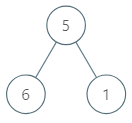

### 1. Description

Given the `root` of a binary tree, return *the maximum **average** value of a **subtree** of that tree*. Answers within $10^{-5}$ of the actual answer will be accepted.

A **subtree** of a tree is any node of that tree plus all its descendants.

The **average** value of a tree is the sum of its values, divided by the number of nodes.

### 2. Function Contract

**Inputs**

- `root`: the root of a nonempty binary tree. cOde(n) fixtures serialize the tree in level order, using `null` for an absent child.

Let $N$ be the number of nodes in the tree. For a node $u$, its subtree contains $u$ and every node descended from $u$ through left- or right-child links. Its average is

$\frac{\text{sum of values in the subtree rooted at }u}{\text{number of nodes in that subtree}}.$

**Return value**

- The maximum subtree average over all $N$ possible roots. Answers within $10^{-5}$ of the exact value are accepted.

### 3. Examples

#### Example 1

- **Input:** `root = [5,6,1]`
- **Output:** `6.00000`
- **Explanation:**
For the node with value = 5 we have an average of (5 + 6 + 1) / 3 = 4.
For the node with value = 6 we have an average of 6 / 1 = 6.
For the node with value = 1 we have an average of 1 / 1 = 1.
So the answer is 6 which is the maximum.
#### Example 2

- **Input:** `root = [0,null,1]`
- **Output:** `1.00000`

### 4. Constraints

- The number of nodes in the tree is in the range $[1, 10^{4}]$.

- $0 \le \text{Node.val} \le 10^{5}$