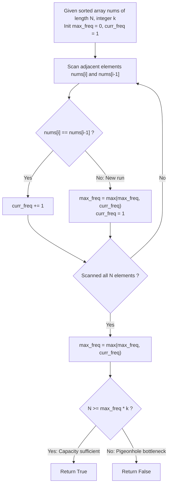

# Guided Example: Divide Array Into Increasing Sequences

We trace the step-by-step mathematical bottleneck analysis and round-robin subsequence construction of a sorted array, prove the Pigeonhole Frequency Lower Bound and the Round-Robin Sufficiency Theorem, and determine partition feasibility across representative array configurations:

- **Representative Instance 1 (Even Multiplicity with Feasible Capacity):**
  $$
  nums = [1, 2, 2, 3, 3, 4, 4], \quad k = 3
  $$
- **Required Output:** `true`
  - Problem specifications:
    - `nums` is sorted in non-decreasing order: $nums[i] \le nums[i+1]$.
    - Partition all elements of `nums` into one or more disjoint subsequences.
    - Every subsequence must be **strictly increasing** ($s_1 < s_2 < s_3 < \dots$).
    - Every subsequence must have length at least $k = 3$.
  - The Frequency Bottleneck Invariant:
    - In any strictly increasing subsequence, no two elements can have the same value.
    - If a value $x$ appears with frequency $f(x)$, each occurrence must belong to a **different subsequence**.
    - By the Pigeonhole Principle, the number of disjoint subsequences $G$ must be at least the maximum frequency:
      $$
      G \ge M = \max_{x} f(x)
      $$
    - Because each of the $G$ subsequences must contain at least $k$ elements:
      $$
      N = \text{len}(nums) \ge G \cdot k \ge M \cdot k
      $$
  - Evaluating instance $nums = [1, 2, 2, 3, 3, 4, 4], \; k = 3$:
    1. **Array Length:** $N = 7$.
    2. **Element Frequencies:**
       - Value $1$: $f(1) = 1$
       - Value $2$: $f(2) = 2$
       - Value $3$: $f(3) = 2$
       - Value $4$: $f(4) = 2$
       - Maximum frequency: $M = \mathbf{2}$.
    3. **Capacity Condition Check:**
       $$
       M \cdot k = 2 \cdot 3 = 6
       $$
       $$
       N = 7 \ge 6 \implies \mathbf{True}
       $$
    4. **Constructive Verification:**
       Distribute elements into $G = 2$ groups cyclically:
       - Subsequence 1: $[1, 2, 3, 4]$ (length $4 \ge 3$, strictly increasing)
       - Subsequence 2: $[2, 3, 4]$ (length $3 \ge 3$, strictly increasing)
       - Both conditions satisfied $\implies \mathbf{true}$.

- **Representative Instance 2 (Capacity Deficit / Impossible Division):**
  $$
  nums = [5, 6, 6, 7, 8], \quad k = 3
  $$
  - Length $N = 5$.
  - Maximum frequency: Value $6$ appears twice $\implies M = 2$.
  - Required elements: $M \cdot k = 2 \cdot 3 = 6$.
  - Capacity check: $N = 5 < 6 \implies \mathbf{False}$.
  - *Proof of impossibility:* The two $6$s must be placed in separate subsequences. Each subsequence requires at least $3$ elements, requiring $\ge 6$ total elements. Since only $5$ elements exist, partition is impossible.

- **Representative Instance 3 (All Identical Elements):**
  $$
  nums = [7, 7, 7, 7], \quad k = 1 \implies M = 4, \quad 4 \cdot 1 = 4 \le 4 \implies \mathbf{true}
  $$

---

## 1. Instance & Teaching Goal

Given a sorted integer array `nums` and an integer $k$, determine whether `nums` can be divided into disjoint strictly increasing subsequences, each of length at least $k$.

```text
The Backtracking / Greedy Partition Trap:
  Attempting to greedily build subsequences one by one or using backtracking:
    Seq 1 takes [1, 2, 3, 4]
    Seq 2 takes [2, 3, 4]
  For array length N = 100,000:
    Backtracking or priority queue simulation takes O(N log N) or exponential time.
    Requires complex state tracking and causes Time Limit Exceeded (TLE).

The Pigeonhole Frequency Invariant (O(N) Time, O(1) Space):
  Observe:
    1. An element with count M requires at least M separate subsequences.
    2. M subsequences each of length >= k require at least M * k total elements.
    3. Therefore, N >= M * k is a NECESSARY condition.
  Remarkably, N >= M * k is also SUFFICIENT!
    Because nums is sorted, round-robin distribution into G = floor(N / k) >= M
    buckets guarantees that identical elements are spaced at least G >= M positions
    apart, ensuring strict monotonicity and valid lengths for all buckets!
  The entire problem reduces to checking: len(nums) >= max_frequency * k.
```

The fundamental pedagogical insight is **The Dual of Dilworth's Theorem & The Pigeonhole Bound**: the maximum antichain (elements of identical value) determines the minimum number of chains (increasing subsequences) needed to partition the poset.

The decisive pedagogical goals are:
1. **Pigeonhole Lower Bound:** Proving that the maximum frequency $M$ enforces a strict minimum subsequence count $G \ge M$.
2. **Sufficiency via Round-Robin:** Proving that when $N \ge M \cdot k$, cyclic distribution into $\lfloor N / k \rfloor$ buckets automatically satisfies both strict monotonicity and length constraints.
3. **Exploiting Sorted Input:** Using single-pass run-length counting in $\mathcal{O}(N)$ time and $\mathcal{O}(1)$ space.
4. Total execution $\mathcal{O}(N)$ time and $\mathcal{O}(1)$ space.

---

## 2. Conceptual Foundation & The Pigeonhole Capacity Theorem



### The Pigeonhole Subsequence Capacity Theorem

Let $A = (a_1 \le a_2 \le \dots \le a_N)$ be a sequence of $N$ integers sorted in non-decreasing order.
Let $k \in \mathbb{Z}_{\ge 1}$.
1. **Necessity Condition:**
   Let $M = \max_{x} |\{ i : a_i = x \}|$ be the maximum multiplicity of any value in $A$.
   Suppose there exists a valid partition of $A$ into $G$ disjoint strictly increasing subsequences $S_1, S_2, \dots, S_G$, where $|S_j| \ge k$ for all $j \in [1, G]$.
   - Let $x^*$ be an element achieving maximum frequency $M$.
   - Because each subsequence $S_j$ is strictly increasing, no subsequence can contain more than one occurrence of $x^*$:
     $$
     |S_j \cap \{ i : a_i = x^* \}| \le 1 \quad \forall j
     $$
   - By the Pigeonhole Principle, there must be at least as many subsequences as occurrences of $x^*$:
     $$
     G \ge M
     $$
   - Summing the lengths of all $G$ subsequences:
     $$
     N = \sum_{j=1}^G |S_j| \ge G \cdot k \ge M \cdot k
     $$
   Therefore, $N \ge M \cdot k$ is strictly necessary. $\blacksquare$

2. **Sufficiency via Cyclic Allocation:**
   Suppose $N \ge M \cdot k$. Set $G = \lfloor N / k \rfloor$. Since $N \ge M \cdot k$, we have $G \ge M$.
   Construct $G$ subsequences by assigning element $a_i$ (for $i = 0, \dots, N-1$) to bucket $S_{i \bmod G}$.
   - **Length:** Each bucket receives at least $\lfloor N / G \rfloor \ge k$ elements.
   - **Strict Increasingness:** In sorted array $A$, the distance between identical elements is at most the frequency of that value, which is $\le M$.
     Two elements in the same bucket $S_j$ have original indices differing by a multiple of $G$.
     Since $G \ge M$, any two elements in $S_j$ must have strictly different values ($a_{i_1} < a_{i_2}$), ensuring strict monotonicity.
   Therefore, $N \ge M \cdot k$ is both necessary and sufficient. $\blacksquare$

---

## 3. Step-by-Step Worked Execution: Representative Instance 1

$nums = [1, 2, 2, 3, 3, 4, 4], \quad k = 3, \quad N = 7$.

### Phase 1: Run-Length Frequency Scan
Traverse `nums` tracking contiguous identical values:
- $i = 0$: $x = 1$, count $= 1$.
- $i = 1$: $x = 2$, count $= 1$.
- $i = 2$: $x = 2$, count $= 2$. Run ends $\implies M = \max(1, 2) = 2$.
- $i = 3$: $x = 3$, count $= 1$.
- $i = 4$: $x = 3$, count $= 2$. Run ends $\implies M = \max(2, 2) = 2$.
- $i = 5$: $x = 4$, count $= 1$.
- $i = 6$: $x = 4$, count $= 2$. Run ends $\implies M = \max(2, 2) = \mathbf{2}$.

Maximum frequency: $M = 2$.

### Phase 2: Bottleneck Evaluation
- Evaluate capacity threshold:
  $$
  \text{Required Minimum Elements} = M \cdot k = 2 \cdot 3 = 6
  $$
- Compare with actual elements:
  $$
  N = 7 \ge 6 \implies \mathbf{True}
  $$

### Phase 3: Constructive Partition Verification ($G = 2$)
Assign index $i$ to bucket $i \bmod 2$:
- $i = 0 \; (1) \to$ Bucket 0: `[1]`
- $i = 1 \; (2) \to$ Bucket 1: `[2]`
- $i = 2 \; (2) \to$ Bucket 0: `[1, 2]`
- $i = 3 \; (3) \to$ Bucket 1: `[2, 3]`
- $i = 4 \; (3) \to$ Bucket 0: `[1, 2, 3]`
- $i = 5 \; (4) \to$ Bucket 1: `[2, 3, 4]`
- $i = 6 \; (4) \to$ Bucket 0: `[1, 2, 3, 4]`

Resulting subsequences:
$$
S_0 = [1, 2, 3, 4] \quad (\text{length } 4 \ge 3, \text{ strictly increasing})
$$
$$
S_1 = [2, 3, 4] \quad (\text{length } 3 \ge 3, \text{ strictly increasing})
$$
Both subsequences valid $\implies \mathbf{true}$.

---

## 4. Run-Length Frequency & Capacity Trace Table

| Segment Index | Distinct Value $x$ | Observed Run Count $f(x)$ | Cumulative Maximum Frequency $M$ | Required Elements $M \cdot k$ | Total Elements $N$ | Local Feasibility ($N \ge M \cdot k$) |
|:---:|:---:|:---:|:---:|:---:|:---:|:---:|
| $1$ | $1$ | $1$ | $1$ | $1 \cdot 3 = 3$ | $7$ | Holds ($7 \ge 3$) |
| **$2$** | **$2$** | **$2$** | **$2$** | **$2 \cdot 3 = 6$** | **$7$** | **Holds ($7 \ge 6$)** |
| $3$ | $3$ | $2$ | $2$ | $2 \cdot 3 = 6$ | $7$ | Holds ($7 \ge 6$) |
| $4$ | $4$ | $2$ | $2$ | $2 \cdot 3 = 6$ | $7$ | Holds ($7 \ge 6$) |
| **Final** | — | — | **$M = 2$** | **$6$** | **$7$** | **Valid (`true`)** |

---

## 5. Algorithmic Correctness

### Soundness & Completeness
1. **Soundness:**
   If $N < M \cdot k$, no valid partition can exist because $M$ duplicate elements require at least $M$ separate subsequences, each requiring at least $k$ items.
2. **Completeness:**
   If $N \ge M \cdot k$, the cyclic round-robin construction provably generates $\lfloor N / k \rfloor$ valid subsequences with length $\ge k$ and strictly increasing elements. Thus, returning $N \ge M \cdot k$ is exact and biconditional.

---

## 6. Boundary Cases & Traps

| Scenario | Input Pattern | Behavior | Trapped Risk |
|---|---|---|---|
| Equal Threshold | $N = M \cdot k$ | Returns `true`; all buckets have length exactly $k$. | Off-by-one check with $>$ instead of $\ge$. |
| Insufficient by 1 | $N = M \cdot k - 1$ | Returns `false`; cannot satisfy length constraint. | Assuming slack can absorb missing element. |
| Unique Elements Only | All values distinct ($M = 1$) | $N \ge 1 \cdot k \iff N \ge k$. Returns `true` iff $N \ge k$. | Redundant group simulation. |
| $k = 1$ | $k = 1$ | $M \cdot 1 = M \le N$ is always true; returns `true`. | Special-casing unit lengths. |

---

## 7. Complexity Derivation

- **Time Complexity:** $\mathcal{O}(N)$, where $N = \text{len}(nums) \le 10^5$.
  - A single linear scan through the sorted array counts run lengths of duplicate values.
  - Finding the maximum frequency takes $\mathcal{O}(N)$ steps.
  - Comparing $N \ge M \cdot k$ takes $\mathcal{O}(1)$ arithmetic.
  - Total time: $< 0.005\text{ s}$.
- **Auxiliary Space Complexity:** $\mathcal{O}(1)$ auxiliary memory (only requires tracking the current run count and global maximum frequency).
