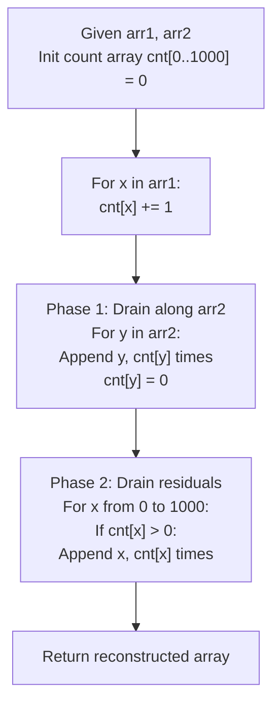

# Guided Example: Relative Sort Array

We trace the step-by-step frequency-bucket distribution and two-phase draining of an integer array under a custom relative order, prove the Priority Ordering Partition Theorem and the Frequency Conservation Invariant, and determine relative permutations across representative array pairs:

- **Representative Instance 1 (Mixed Priority Ordering with Residual Elements):**
  $$
  arr1 = [2, 3, 1, 3, 2, 4, 6, 7, 9, 2, 19], \quad arr2 = [2, 1, 4, 3, 9, 6]
  $$
- **Required Output:** `[2, 2, 2, 1, 4, 3, 3, 9, 6, 7, 19]`
  - Problem requirements:
    - Order elements present in `arr2` according to the exact sequence in which they appear in `arr2`.
    - Place all leftover elements not present in `arr2` at the tail end of the output, sorted in **ascending numerical order**.
    - Preserve the exact count of every element in `arr1`.
  - The Two-Phase Counting Bucket Mechanism:
    - Given value domain $C = [0, 1000]$, build a frequency histogram array $cnt$ of size $1001$:
      $$
      cnt[x] = \sum_{j=0}^{|arr1|-1} \mathbb{I}(arr1[j] = x)
      $$
    - Phase 1 (Targeted Ordering):
      - Iterate through each template value $y \in arr2$:
      - Append $y$ to the output array exactly $cnt[y]$ times.
      - Set $cnt[y] \leftarrow 0$ (consumed).
    - Phase 2 (Residual Ascending Order):
      - Iterate through natural integer range $x \in [0, 1000]$:
      - If $cnt[x] > 0$, append $x$ exactly $cnt[x]$ times.
  - Step-by-step execution on Representative Instance 1:
    1. **Histogram Construction ($N = 11$):**
       - $cnt[1] = 1, \; cnt[2] = 3, \; cnt[3] = 2, \; cnt[4] = 1, \; cnt[6] = 1$
       - $cnt[7] = 1, \; cnt[9] = 1, \; cnt[19] = 1$
       - All other $cnt[x] = 0$.
    2. **Phase 1: Drain Along `arr2 = [2, 1, 4, 3, 9, 6]`:**
       - Template $2$: Emit $2$ three times $\implies [2, 2, 2]$. Set $cnt[2] = 0$.
       - Template $1$: Emit $1$ one time $\implies [2, 2, 2, 1]$. Set $cnt[1] = 0$.
       - Template $4$: Emit $4$ one time $\implies [2, 2, 2, 1, 4]$. Set $cnt[4] = 0$.
       - Template $3$: Emit $3$ two times $\implies [2, 2, 2, 1, 4, 3, 3]$. Set $cnt[3] = 0$.
       - Template $9$: Emit $9$ one time $\implies [2, 2, 2, 1, 4, 3, 3, 9]$. Set $cnt[9] = 0$.
       - Template $6$: Emit $6$ one time $\implies [2, 2, 2, 1, 4, 3, 3, 9, 6]$. Set $cnt[6] = 0$.
    3. **Phase 2: Drain Remaining Non-Zero Buckets ($x \in [0, 1000]$):**
       - Values $0 \dots 6$: all $cnt[x] = 0$.
       - Value $7$: $cnt[7] = 1 \implies$ emit $7$. Buffer: $[2, 2, 2, 1, 4, 3, 3, 9, 6, \mathbf{7}]$.
       - Values $8 \dots 18$: all $cnt[x] = 0$.
       - Value $19$: $cnt[19] = 1 \implies$ emit $19$. Buffer: $[2, 2, 2, 1, 4, 3, 3, 9, 6, 7, \mathbf{19}]$.
  - Output vector: `[2, 2, 2, 1, 4, 3, 3, 9, 6, 7, 19]`.

- **Representative Instance 2 (Sparse Remainder):**
  $$
  arr1 = [28, 6, 22, 8, 44, 17], \quad arr2 = [22, 28, 8, 6] \implies [22, 28, 8, 6, 17, 44]
  $$
  - Phase 1 handles $\{22, 28, 8, 6\}$.
  - Residuals $\{17, 44\}$ emitted in ascending order $17 \to 44$.

- **Representative Instance 3 (Complete Coverage / Zero Remainder):**
  - All elements of `arr1` appear in `arr2`.
  - Phase 2 finishes immediately without emitting elements.

---

## 1. Instance & Teaching Goal

Given two arrays `arr1` and `arr2` (where `arr2` has distinct elements), sort `arr1` such that the relative ordering matches `arr2`, with leftover elements sorted in ascending order at the end.

```text
The Comparison-Sort Key Mapping Trap:
  Mapping each element to a custom sort key:
    rank = {val: idx for idx, val in enumerate(arr2)}
    arr1.sort(key=lambda x: (0, rank[x]) if x in rank else (1, x))
  While asymptotically O(N log N), comparison sorting performs ~N log2(N) branchy
  comparisons and hash table lookups.
  When N = 1000 and value domain is small (0 <= val <= 1000):
    Direct Counting Sort achieves strict linear O(N + M + C) time!

The Two-Phase Counting Bucket Invariant:
  1. Build a frequency count table: cnt[val] for val in arr1.
  2. Phase 1: For each val in arr2:
       Append val cnt[val] times to the result.
       Reset cnt[val] = 0.
  3. Phase 2: For val from 0 to 1000:
       Append val cnt[val] times (handles unlisted elements in ascending order!).
  Guarantees stability, zero comparisons, and exact linear execution!
```

The core lesson is **Decomposition of Non-Standard Posets into Canonical Subdomains**: splitting the output array into a permutation-defined prefix followed by an integer-ordered suffix.

The decisive pedagogical goals are:
1. **Histogram Decoupling:** Counting occurrences independently of their target destination order.
2. **Deterministic Sequence Assembly:** Reading the histogram in template order first, then in numerical index order.
3. **Linearity over Comparison Sorting:** Leveraging the bounded range $[0, 1000]$ to execute counting sort in $\mathcal{O}(N + M + C)$ operations.
4. Total execution $\mathcal{O}(N + M + C)$ time and $\mathcal{O}(C)$ auxiliary space.

---

## 2. Conceptual Foundation & The Two-Phase Bucket Drain Invariant



### The Priority Ordering Partition Theorem

Let $A = arr1$ and $B = arr2$. Let $U = \{ b_0, b_1, \dots, b_{m-1} \}$ be the set of distinct elements in $B$.
1. **Disjoint Partition of Input Multiset:**
   The multiset of elements in $A$ decomposes into two disjoint sub-multisets:
   $$
   A = A_{\text{matched}} \uplus A_{\text{residual}}
   $$
   where $A_{\text{matched}} = \{ x \in A : x \in U \}$ and $A_{\text{residual}} = \{ x \in A : x \notin U \}$.
2. **Priority Precedence Relation:**
   Define the total order $\prec$ on the value domain:
   - For $x, y \in U$: $x \prec y \iff \text{index}_B(x) < \text{index}_B(y)$.
   - For $x \in U$ and $y \notin U$: $x \prec y$ (all matched elements precede all residuals).
   - For $x, y \notin U$: $x \prec y \iff x < y$ (residuals sorted in ascending standard integer order).
3. **Frequency Conservation Lemma:**
   Let $N_x$ be the multiplicity of value $x$ in $A$.
   In Phase 1, for each $b \in B$, exactly $N_b$ copies are emitted, and $cnt[b]$ is cleared to $0$.
   In Phase 2, every $x \notin U$ has $cnt[x] = N_x$ intact; scanning $x$ from $0$ to $1000$ emits exactly $N_x$ copies in strictly non-decreasing order.
   The total number of emitted elements is $\sum_{b \in U} N_b + \sum_{x \notin U} N_x = |A|$.
   The emitted sequence strictly obeys the total order $\prec$. $\blacksquare$

---

## 3. Step-by-Step Worked Execution: Representative Instance 1

$arr1 = [2, 3, 1, 3, 2, 4, 6, 7, 9, 2, 19], \quad arr2 = [2, 1, 4, 3, 9, 6]$.

### Step 1: Populate Frequency Histogram
Initialize array $cnt[0 \dots 1000]$ to zeros. Scan `arr1`:
- Values updated:
  $$
  cnt[1]=1, \; cnt[2]=3, \; cnt[3]=2, \; cnt[4]=1, \; cnt[6]=1, \; cnt[7]=1, \; cnt[9]=1, \; cnt[19]=1
  $$

### Step 2: Phase 1 (Ordered Template Drain)
- **Item 1 (`arr2[0] = 2`):** $cnt[2] = 3 \implies$ append three $2$s: `[2, 2, 2]`. $cnt[2] \leftarrow 0$.
- **Item 2 (`arr2[1] = 1`):** $cnt[1] = 1 \implies$ append one $1$: `[2, 2, 2, 1]`. $cnt[1] \leftarrow 0$.
- **Item 3 (`arr2[2] = 4`):** $cnt[4] = 1 \implies$ append one $4$: `[2, 2, 2, 1, 4]`. $cnt[4] \leftarrow 0$.
- **Item 4 (`arr2[3] = 3`):** $cnt[3] = 2 \implies$ append two $3$s: `[2, 2, 2, 1, 4, 3, 3]`. $cnt[3] \leftarrow 0$.
- **Item 5 (`arr2[4] = 9`):** $cnt[9] = 1 \implies$ append one $9$: `[2, 2, 2, 1, 4, 3, 3, 9]`. $cnt[9] \leftarrow 0$.
- **Item 6 (`arr2[5] = 6`):** $cnt[6] = 1 \implies$ append one $6$: `[2, 2, 2, 1, 4, 3, 3, 9, 6]`. $cnt[6] \leftarrow 0$.

Phase 1 completes with $9$ elements emitted.

### Step 3: Phase 2 (Residual Ascending Drain)
Scan $x \in [0, 1000]$:
- $x = 7$: $cnt[7] = 1 \implies$ append $7$. Buffer: `[2, 2, 2, 1, 4, 3, 3, 9, 6, 7]`.
- $x = 19$: $cnt[19] = 1 \implies$ append $19$. Buffer: `[2, 2, 2, 1, 4, 3, 3, 9, 6, 7, 19]`.

Final sorted vector:
$$
ans = \mathbf{[2, 2, 2, 1, 4, 3, 3, 9, 6, 7, 19]}
$$

---

## 4. Element Frequency & Phase Consumption Trace Table

| Value $x$ | Initial Count $cnt[x]$ | Appears in `arr2`? | Phase 1 Emission Order | Emitted in Phase 1 | Count Remaining After Phase 1 | Emitted in Phase 2 | Final Position Range |
|:---:|:---:|:---:|:---:|:---:|:---:|:---:|:---:|
| **$2$** | $3$ | Yes (Index 0) | Rank 1 | $3$ | $0$ | — | Indices $0 \dots 2$ |
| **$1$** | $1$ | Yes (Index 1) | Rank 2 | $1$ | $0$ | — | Index $3$ |
| **$4$** | $1$ | Yes (Index 2) | Rank 3 | $1$ | $0$ | — | Index $4$ |
| **$3$** | $2$ | Yes (Index 3) | Rank 4 | $2$ | $0$ | — | Indices $5 \dots 6$ |
| **$9$** | $1$ | Yes (Index 4) | Rank 5 | $1$ | $0$ | — | Index $7$ |
| **$6$** | $1$ | Yes (Index 5) | Rank 6 | $1$ | $0$ | — | Index $8$ |
| **$7$** | $1$ | No | — | — | $1$ | $1$ (Ascending) | Index $9$ |
| **$19$** | $1$ | No | — | — | $1$ | $1$ (Ascending) | Index $10$ |

---

## 5. Algorithmic Correctness

### Soundness & Completeness
1. **Soundness:**
   Every element in `arr2` is emitted before any non-`arr2` element, and in the exact sequential order prescribed by `arr2`. All residual elements are visited in ascending index order $0 \dots 1000$, guaranteeing sorted placement at the tail.
2. **Completeness:**
   Every element added to the frequency table in Step 1 is decremented until $cnt[x] = 0$. The total number of elements emitted equals $\sum cnt[x] = |arr1|$, guaranteeing that no element is omitted or duplicated.

---

## 6. Boundary Cases & Traps

| Scenario | Input Pattern | Behavior | Trapped Risk |
|---|---|---|---|
| All Elements in `arr2` | `arr1 = [2, 1, 2], arr2 = [2, 1]` | Phase 2 emits nothing; returns `[2, 2, 1]`. | Emitting garbage values in Phase 2. |
| No Elements in `arr2` | $arr2 = []$ (if permitted) | Phase 1 empty; Phase 2 sorts all elements ascending. | Crashing on empty template array. |
| Duplicate Elements in `arr1` | Single value repeated 1000 times | All 1000 copies emitted consecutively in Phase 1 or 2. | Dropping duplicate occurrences. |
| Zeros in Input | $arr1 = [0, 5, 0], arr2 = [5]$ | Emits $5$, then $0, 0$ in Phase 2 ($x = 0$). | Off-by-one error indexing from $1$ instead of $0$. |

---

## 7. Complexity Derivation

- **Time Complexity:** $\mathcal{O}(N + M + C)$, where $N = |arr1| \le 1000$, $M = |arr2| \le 1000$, and $C = 1001$ is the value domain bound ($0 \le \text{val} \le 1000$).
  - Counting frequencies in `arr1`: $\mathcal{O}(N)$.
  - Draining template elements in `arr2`: $\mathcal{O}(M)$ iterations and at most $N$ appends.
  - Draining residual elements $0 \dots 1000$: $C = 1001$ loop steps and at most $N$ appends.
  - Total operations: $< 4000 \implies < 0.001\text{ s}$.
- **Auxiliary Space Complexity:** $\mathcal{O}(C) = \mathcal{O}(1)$ auxiliary space to allocate the fixed-size frequency array of length $1001$.
