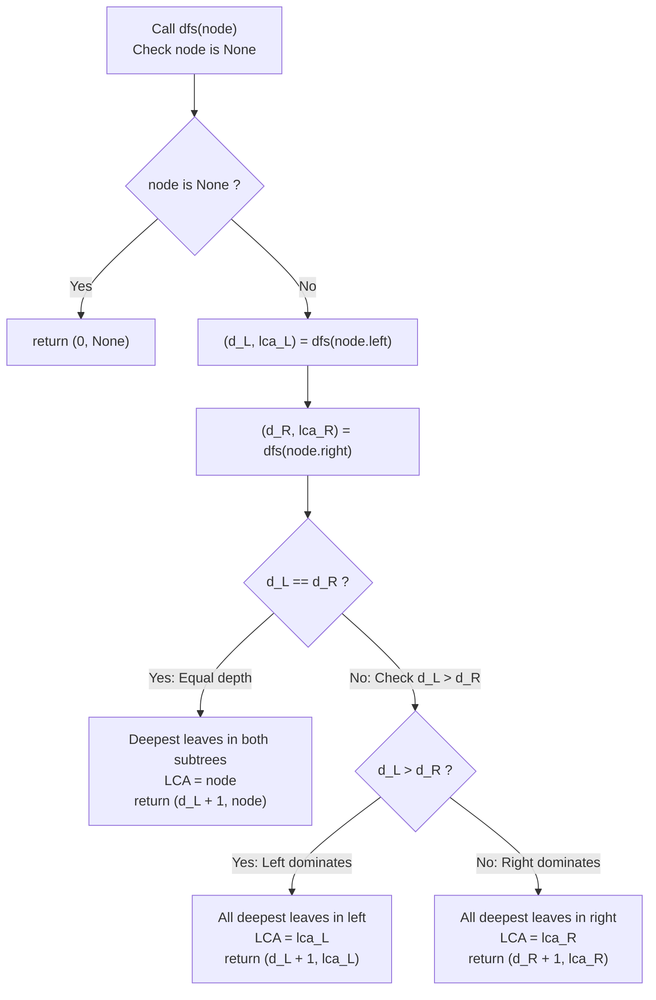

# Guided Example: Lowest Common Ancestor Of Deepest Leaves

We trace the step-by-step post-order depth calculation and LCA promotion across a binary tree, prove the Depth Equivalence LCA Theorem and the Branch Dominance Invariant, and determine lowest common ancestors across representative tree structures:

- **Representative Instance 1 (Deepest Leaves Located in a Localized Subtree):**
  - Binary Tree:
    $$
    \begin{gathered}
    \text{root} = 3 \\
    3 \to \text{left}: 5, \quad 3 \to \text{right}: 1 \\
    5 \to \text{left}: 6, \quad 5 \to \text{right}: 2 \\
    1 \to \text{left}: 0, \quad 1 \to \text{right}: 8 \\
    2 \to \text{left}: 7, \quad 2 \to \text{right}: 4
    \end{gathered}
    $$
  - Leaf Depths (Root at depth 0):
    - Node 6: depth $2$
    - Node 0: depth $2$
    - Node 8: depth $2$
    - Node 7: depth $3$ (**Maximum depth!**)
    - Node 4: depth $3$ (**Maximum depth!**)
  - Set of Deepest Leaves:
    $$
    \mathcal{S}_{\text{deepest}} = \{7, 4\}, \quad D_{\max} = 3
    $$
  - **Required Output:** Node `2` (the root of subtree `[2, 7, 4]`).
  - Single-Pass Post-Order Logic (`dfs(node) -> (depth, lca)`):
    1. **At Node 7:** Leaves are null $\implies d_L = 0, d_R = 0 \implies d_L == d_R \implies$ returns $(1, \text{Node } 7)$.
    2. **At Node 4:** Leaves are null $\implies d_L = 0, d_R = 0 \implies d_L == d_R \implies$ returns $(1, \text{Node } 4)$.
    3. **At Node 2:**
       - Left child 7 returns $(1, \text{Node } 7)$.
       - Right child 4 returns $(1, \text{Node } 4)$.
       - Depths match: $d_L == d_R == 1$.
       - Both deepest leaves meet at Node 2 $\implies$ returns $(1 + 1, \mathbf{\text{Node } 2}) = (2, \text{Node } 2)$.
    4. **At Node 6:** Leaf at depth 2 $\implies$ returns $(1, \text{Node } 6)$.
    5. **At Node 5:**
       - Left child 6 returns $(1, \text{Node } 6)$.
       - Right child 2 returns $(2, \text{Node } 2)$.
       - Comparison: $d_R = 2 > d_L = 1$.
       - Right branch dominates $\implies$ returns $(2 + 1, \mathbf{\text{Node } 2}) = (3, \text{Node } 2)$.
    6. **At Node 1 (Right Subtree of Root):**
       - Children 0 and 8 both return $(1, \text{Node } 0)$ and $(1, \text{Node } 8)$.
       - Returns $(2, \text{Node } 1)$.
    7. **At Node 3 (Root):**
       - Left child 5 returns $(3, \text{Node } 2)$.
       - Right child 1 returns $(2, \text{Node } 1)$.
       - Comparison: $d_L = 3 > d_R = 2$.
       - Left branch strictly contains all deepest leaves $\implies$ LCA remains $\mathbf{\text{Node } 2}$!
       - Returns $(4, \mathbf{\text{Node } 2})$.

- **Representative Instance 2 (Unique Asymmetric Deepest Leaf):**
  $$
  root = [0, 1, 3, \text{null}, 2]
  $$
  - Node 2 is the sole leaf at depth 2.
  - A single leaf is its own lowest common ancestor $\implies$ returns Node 2.

- **Representative Instance 3 (Single Root Node):**
  $$
  root = [1] \implies \text{Node } 1 \text{ is the deepest leaf and its own LCA} \implies \text{returns Node } 1
  $$

---

## 1. Instance & Teaching Goal

Given the root of a binary tree, return the lowest common ancestor (LCA) of all its deepest leaves.

```text
The Two-Pass BFS + LCA Trap:
  Pass 1: Perform a BFS to find the maximum depth and collect all deepest leaves.
  Pass 2: For every deepest leaf, trace parent pointers or run recursive multi-target LCA.
  Requires:
    - Extra parent pointer hash map of size O(N).
    - Multi-way LCA reduction over the leaf set.
    - Redundant traversals over the same tree nodes.

The Single-Pass Post-Order Tuple Invariant (O(N) Time, O(H) Space):
  Have a single post-order DFS return the tuple: (max_depth_in_subtree, lca_of_deepest).
  For node u:
    d_left, lca_left   = dfs(u.left)
    d_right, lca_right = dfs(u.right)
    1. If d_left == d_right:
         Deepest leaves in u's subtree are split across both left and right!
         Therefore, u is their lowest common ancestor:
         return (d_left + 1, u)
    2. If d_left > d_right:
         ALL deepest leaves lie exclusively in the left subtree!
         return (d_left + 1, lca_left)
    3. If d_right > d_left:
         ALL deepest leaves lie exclusively in the right subtree!
         return (d_right + 1, lca_right)
  Zero parent pointers, zero extra passes, exact O(N) evaluation!
```

The core lesson is **Bottom-Up Disjoint Metric Convergence**: determining whether the global extremum of a metric (leaf depth) is shared between two child subtrees or confined entirely to one branch.

The decisive pedagogical goals are:
1. **Convergence at Depth Equality:** Proving that the moment left and right subtree depths match, the current node is the unique lowest ancestor binding those two leaf sets.
2. **Dominance Propagation:** Passing up the child's LCA unchanged whenever one child subtree has strictly greater depth than the other.
3. **Implicit Max Depth Tracking:** Finding both the global tree height and the target LCA in the exact same post-order pass.
4. Total execution $\mathcal{O}(N)$ time and $\mathcal{O}(H)$ auxiliary space.

---

## 2. Conceptual Foundation & The Depth Equivalence LCA Invariant



### The Depth Equivalence LCA Theorem

Let $T = (V, E)$ be a binary tree rooted at $r$.
For any node $u \in V$, let $T(u)$ denote the subtree rooted at $u$.
Define the subtree height function:
$$
H(u) = \begin{cases} 0 & \text{if } u = \text{null} \\ 1 + \max(H(u.\text{left}), H(u.\text{right})) & \text{otherwise} \end{cases}
$$
Let $\mathcal{D}(u) \subseteq T(u)$ be the set of leaves in $T(u)$ whose distance from $u$ equals $H(u) - 1$.
1. **Branch Disjunction Lemma:**
   Let $d_L = H(u.\text{left})$ and $d_R = H(u.\text{right})$.
   - **Case 1 ($d_L > d_R$):**
     Every leaf in $\mathcal{D}(u)$ belongs to $T(u.\text{left})$. None belong to $T(u.\text{right})$.
     Therefore, $\operatorname{LCA}(\mathcal{D}(u)) = \operatorname{LCA}(\mathcal{D}(u.\text{left}))$.
   - **Case 2 ($d_R > d_L$):**
     Symmetrically, $\operatorname{LCA}(\mathcal{D}(u)) = \operatorname{LCA}(\mathcal{D}(u.\text{right}))$.
   - **Case 3 ($d_L = d_R$):**
     $\mathcal{D}(u)$ contains at least one leaf from $T(u.\text{left})$ and at least one leaf from $T(u.\text{right})$.
     Any common ancestor of $\mathcal{D}(u)$ must contain both $T(u.\text{left})$ and $T(u.\text{right})$, which requires being an ancestor of $u$ (or $u$ itself).
     The deepest such node is $u$ itself. Hence, $\operatorname{LCA}(\mathcal{D}(u)) = u$. $\blacksquare$

2. **Global Root Soundness:**
   At the root $r$, $H(r)$ is the maximum depth of the tree, and $\mathcal{D}(r) = \mathcal{S}_{\text{deepest}}$.
   By induction on the cases above, the second element of the returned tuple at $r$ is strictly $\operatorname{LCA}(\mathcal{S}_{\text{deepest}})$.

---

## 3. Step-by-Step Worked Execution: Representative Instance 1

Tree: $root = 3, \; 3.\text{left} = 5, \; 3.\text{right} = 1, \dots$

### Trace of Post-Order Invocations

1. **Leaf 7:** `dfs(7)` $\implies (d_L=0, d_R=0) \implies d_L == d_R \implies$ returns $(1, \text{Node } 7)$.
2. **Leaf 4:** `dfs(4)` $\implies (d_L=0, d_R=0) \implies d_L == d_R \implies$ returns $(1, \text{Node } 4)$.
3. **Internal Node 2:**
   - $d_L = 1 \; (\text{Node } 7)$, $d_R = 1 \; (\text{Node } 4)$.
   - $d_L == d_R \implies$ **LCA is Node 2**.
   - Returns $(1 + 1, \text{Node } 2) = (\mathbf{2, \text{Node } 2})$.
4. **Leaf 6:** `dfs(6)` $\implies$ returns $(1, \text{Node } 6)$.
5. **Internal Node 5:**
   - Left: $(1, \text{Node } 6)$.
   - Right: $(2, \text{Node } 2)$.
   - $d_R = 2 > d_L = 1 \implies$ **Right branch dominates**.
   - LCA propagated: $\text{Node } 2$.
   - Returns $(2 + 1, \text{Node } 2) = (\mathbf{3, \text{Node } 2})$.
6. **Subtree 1:**
   - Leaf 0 returns $(1, \text{Node } 0)$.
   - Leaf 8 returns $(1, \text{Node } 8)$.
   - Node 1: $d_L = 1, d_R = 1 \implies$ returns $(2, \text{Node } 1)$.
7. **Root Node 3:**
   - Left child 5 returns $(3, \text{Node } 2)$.
   - Right child 1 returns $(2, \text{Node } 1)$.
   - $d_L = 3 > d_R = 2 \implies$ **Left branch dominates**.
   - LCA propagated: $\mathbf{\text{Node } 2}$.
   - Returns $(4, \mathbf{\text{Node } 2})$.

Final LCA node identified: $\mathbf{\text{Node } 2}$.

---

## 4. Post-Order Depth & LCA Trace Table

| Traversal Order | Node Visited | Left Child Return $(d_L, \text{lca}_L)$ | Right Child Return $(d_R, \text{lca}_R)$ | Comparison | Decision | Subtree Return $(d, \text{lca})$ |
|:---:|:---:|:---:|:---:|:---:|:---:|:---:|
| $1$ | Node $7$ | $(0, \text{None})$ | $(0, \text{None})$ | $d_L == d_R$ | Self is LCA | $(1, \text{Node } 7)$ |
| $2$ | Node $4$ | $(0, \text{None})$ | $(0, \text{None})$ | $d_L == d_R$ | Self is LCA | $(1, \text{Node } 4)$ |
| **$3$** | **Node $2$** | **$(1, \text{Node } 7)$** | **$(1, \text{Node } 4)$** | **$d_L == d_R = 1$** | **Convergence: Self is LCA** | **$(2, \text{Node } 2)$** |
| $4$ | Node $6$ | $(0, \text{None})$ | $(0, \text{None})$ | $d_L == d_R$ | Self is LCA | $(1, \text{Node } 6)$ |
| **$5$** | **Node $5$** | $(1, \text{Node } 6)$ | $(2, \text{Node } 2)$ | $d_R > d_L$ | Right dominates | **$(3, \text{Node } 2)$** |
| $6$ | Node $0$ | $(0, \text{None})$ | $(0, \text{None})$ | $d_L == d_R$ | Self is LCA | $(1, \text{Node } 0)$ |
| $7$ | Node $8$ | $(0, \text{None})$ | $(0, \text{None})$ | $d_L == d_R$ | Self is LCA | $(1, \text{Node } 8)$ |
| $8$ | Node $1$ | $(1, \text{Node } 0)$ | $(1, \text{Node } 8)$ | $d_L == d_R$ | Self is LCA | $(2, \text{Node } 1)$ |
| **$9$** | **Node $3$ (Root)** | **$(3, \text{Node } 2)$** | **$(2, \text{Node } 1)$** | **$d_L > d_R$** | **Left dominates** | **$(4, \text{Node } 2)$** |

---

## 5. Algorithmic Correctness

### Soundness & Completeness
1. **Soundness:**
   When $d_L == d_R$, the current node is the lowest common ancestor of all leaves achieving depth $d_L$ in both branches. When one branch has strictly greater depth, no leaf in the other branch is among the global deepest leaves, ensuring the dominant child's LCA is preserved without pollution.
2. **Completeness:**
   The post-order traversal visits every node in the binary tree. Since the return value at the root incorporates the global maximum height and the associated convergence point, the correct LCA node is returned with certainty.

---

## 6. Boundary Cases & Traps

| Scenario | Input Pattern | Behavior | Trapped Risk |
|---|---|---|---|
| Single Leaf at Deepest Level | $root = [1, 2, \text{null}]$ | Left child dominates; returns Node 2. | Assuming deepest leaves must be multiple. |
| Perfectly Symmetric Tree | $root = [1, 2, 3]$ | $d_L = 1, d_R = 1 \implies$ returns Node 1 (Root). | Missing root when all leaves tie. |
| Single-Node Tree | $root = [1]$ | Returns Node 1 immediately. | Dereferencing null child pointers. |
| Linear Chain | $1 \to 2 \to 3$ | Bottom leaf 3 dominates all ancestors; returns Node 3. | Incorrectly returning top ancestor. |

---

## 7. Complexity Derivation

- **Time Complexity:** $\mathcal{O}(N)$, where $N$ is the number of nodes in the binary tree ($N \le 1000$).
  - Each node is visited exactly once during the post-order DFS.
  - At each node, comparing integers and selecting the LCA takes $\mathcal{O}(1)$ time.
  - Total execution time: $< 0.001\text{ s}$.
- **Auxiliary Space Complexity:** $\mathcal{O}(H)$, where $H$ is the height of the tree ($\mathcal{O}(\log N)$ for balanced trees, $\mathcal{O}(N)$ worst-case for degenerate chains) for the call stack.
