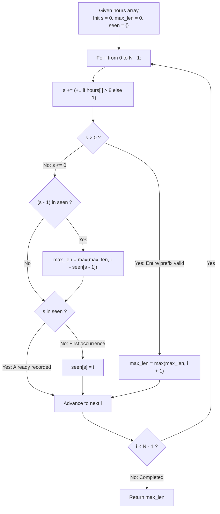

# Guided Example: Longest Well-Performing Interval

We trace the step-by-step prefix reduction of binary tiring-day indicators into an integer random walk, prove the Discrete Intermediate Value Invariant and the Earliest Predecessor Boundary Lemma, and determine maximal interval lengths across representative work schedules:

- **Representative Instance 1 (Alternating Fatigue with a Prefix Dominance Window):**
  $$
  hours = [9, 9, 6, 0, 6, 6, 9]
  $$
- **Required Output:** `3`
  - Problem definitions:
    - A day is *tiring* if $hours[i] > 8$.
    - An interval $[i, j]$ is *well-performing* if the count of tiring days strictly exceeds non-tiring days:
      $$
      \text{tiring days} > \text{non-tiring days}
      $$
  - Binary Indicator Transformation:
    - Map each day to a unit score $x_i$:
      $$
      x_i = \begin{cases} +1 & \text{if } hours[i] > 8 \\ -1 & \text{if } hours[i] \le 8 \end{cases}
      $$
    - For $hours = [9, 9, 6, 0, 6, 6, 9]$:
      $$
      \mathbf{x} = [+1, +1, -1, -1, -1, -1, +1]
      $$
    - A subarray $[i, j]$ is well-performing if and only if its sum is strictly positive:
      $$
      \sum_{k=i}^j x_k \ge 1 \iff P[j+1] - P[i] \ge 1
      $$
      where $P[k] = \sum_{m=0}^{k-1} x_m$ is the prefix sum with $P[0] = 0$.
  - Prefix Sum Trajectory ($P[0]=0$):
    - $i = 0 \; (x_0 = +1): s = 1 > 0 \implies$ Valid from start! Length $= 0 + 1 = \mathbf{1}$.
    - $i = 1 \; (x_1 = +1): s = 2 > 0 \implies$ Valid from start! Length $= 1 + 1 = \mathbf{2}$.
    - $i = 2 \; (x_2 = -1): s = 1 > 0 \implies$ Valid from start! Length $= 2 + 1 = \mathbf{3}$.
    - $i = 3 \; (x_3 = -1): s = 0 \le 0 \implies$ Not valid from start. First time reaching $0$: record $seen[0] = 3$.
    - $i = 4 \; (x_4 = -1): s = -1 \le 0 \implies$ First time reaching $-1$: record $seen[-1] = 4$.
    - $i = 5 \; (x_5 = -1): s = -2 \le 0 \implies$ First time reaching $-2$: record $seen[-2] = 5$.
    - $i = 6 \; (x_6 = +1): s = -1 \le 0 \implies$ Check if $s - 1 = -2$ was seen earlier:
      - $seen[-2] = 5$.
      - Subarray $(5, 6]$ has sum $P[7] - P[6] = (-1) - (-2) = +1 > 0$.
      - Length $= 6 - seen[-2] = 6 - 5 = 1$.
  - Maximum length over all days:
    $$
    \text{ans} = \max(1, 2, 3, 1) = \mathbf{3}
    $$
    corresponding to interval $[0, 2]$: `[9, 9, 6]` ($2$ tiring days, $1$ non-tiring day).

- **Representative Instance 2 (All Non-Tiring Days):**
  $$
  hours = [6, 6, 6] \implies \mathbf{x} = [-1, -1, -1] \implies \text{All subsegment sums } \le -1 \implies \mathbf{0}
  $$

- **Representative Instance 3 (Delayed Recovery):**
  $$
  hours = [6, 9, 9] \implies \mathbf{x} = [-1, +1, +1]
  $$
  - $P = [0, -1, 0, 1]$.
  - At $i = 2$, $s = 1 > 0 \implies$ entire array $[0, 2]$ has sum $+1 > 0 \implies$ length $\mathbf{3}$.

---

## 1. Instance & Teaching Goal

Given an array `hours`, return the length of the longest subarray where the count of tiring days ($> 8$) strictly exceeds the count of non-tiring days ($\le 8$).

```text
The Quadratic Sliding-Window Failure:
  Attempting to use a standard two-pointer sliding window directly:
    Shrinking or expanding when the condition breaks is invalid because
    well-performing intervals are not monotonic: adding elements can turn
    an invalid window valid, and shrinking can destroy valid balance!
  A naive check of all (i, j) pairs takes O(N^2) time.
  When N = 10,000, N^2 = 10^8 operations, triggering TLE.

The Discrete Intermediate Value Theorem Invariant (O(N) Time, O(N) Space):
  Transform hours into scores: +1 if hours[i] > 8 else -1.
  Track running prefix sum s:
    1. If s > 0:
         The entire prefix 0..i has more +1s than -1s!
         Candidate length = i + 1.
    2. If s <= 0:
         Record the FIRST time we ever reach this sum: seen[s] = i.
         Can we form a positive subarray ending at i?
         YES, if there exists an earlier prefix with sum s - 1!
         Subarray sum = s - (s - 1) = +1 > 0.
         Candidate length = i - seen[s - 1].
  Why ONLY check s - 1?
    Because the prefix sum changes by strictly +/- 1 at each step,
    to reach any value <= s - 2 from 0, it MUST hit s - 1 first!
    Hence, seen[s - 1] < seen[s - 2] < seen[s - 3]...
    seen[s - 1] is mathematically guaranteed to be the earliest possible anchor!
```

The core mathematical principle is the **Discrete Intermediate Value Theorem on Random Walks**: a path with step size $\pm 1$ cannot jump across integer levels without landing on every intermediate value.

The decisive pedagogical goals are:
1. **Indicator Simplification:** Mapping the problem to finding the longest subarray with sum $> 0$ over $\{-1, +1\}$.
2. **The $s - 1$ Predecessor Theorem:** Proving why the earliest occurrence of $s - 1$ is strictly earlier than any occurrence of $s - 2, s - 3, \dots$.
3. **Single-Pass Hash Table:** Maintaining first occurrences of negative prefix sums in $\mathcal{O}(N)$ total time.
4. Total execution $\mathcal{O}(N)$ time and $\mathcal{O}(N)$ auxiliary space.

---

## 2. Conceptual Foundation & The Intermediate Value Monotonicity Invariant



### The Discrete Intermediate Value & Monotonicity Theorem

Let $\mathbf{x} = (x_0, x_1, \dots, x_{N-1}) \in \{-1, +1\}^N$, and let $P : \{0, \dots, N\} \to \mathbb{Z}$ be the prefix sum:
$$
P(0) = 0, \quad P(k) = \sum_{m=0}^{k-1} x_m
$$
We seek $\max \{ j - i : 0 \le i < j \le N \text{ and } P(j) - P(i) \ge 1 \}$.
1. **Unit Step Continuity:**
   For all $k$, $|P(k+1) - P(k)| = |x_k| = 1$.
2. **Intermediate Value Property:**
   If $P(0) = 0$ and $P(j) = s \le 0$, then for every integer $v \in [s, 0]$, there exists at least one index $k \le j$ such that $P(k) = v$.
3. **Earliest Arrival Monotonicity:**
   Define $E(v) = \min \{ k : P(k) = v \}$ as the earliest time the walk reaches value $v$.
   - To reach $v - 1$ from $0$, the walk must transition from some state $\ge v$ to $v - 1$.
   - Since the step size is $-1$, the walk must visit $v$ before it can ever visit $v - 1$.
   - Therefore:
     $$
     E(0) < E(-1) < E(-2) < \dots < E(s)
     $$
   *Proof.* Suppose for contradiction $E(v - 1) < E(v)$. At time $t = E(v - 1)$, $P(t) = v - 1$.
   Since $P(0) = 0 > v > v - 1$, by the discrete intermediate value theorem, the walk must have hit $v$ at some time $t' < t$.
   Then $E(v) \le t' < t = E(v - 1)$, a contradiction. Hence $E(v) < E(v - 1)$ strictly holds. $\blacksquare$

4. **Optimality of Checking $s - 1$:**
   If $P(j) = s \le 0$, the condition $P(j) - P(i) \ge 1$ requires $P(i) \le s - 1$.
   To maximize $j - i$, we must minimize $i$.
   The earliest index with $P(i) \le s - 1$ is:
   $$
   \min_{v \le s - 1} E(v) = E(s - 1)
   $$
   since $E(s - 1) < E(s - 2) < E(s - 3) \dots$
   Thus, checking whether $s - 1 \in seen$ inspects the **globally earliest qualifying starting point**.

---

## 3. Step-by-Step Worked Execution: Representative Instance 1

$hours = [9, 9, 6, 0, 6, 6, 9], \quad N = 7$. Initialize $s = 0, \text{max\_len} = 0, seen = \{\}$.

### Sequential Step Trace

- **Day 0 ($hours[0] = 9 > 8 \implies x_0 = +1$):**
  - $s \leftarrow 0 + 1 = 1$.
  - $s = 1 > 0 \implies \text{max\_len} \leftarrow \max(0, 0 + 1) = \mathbf{1}$.

- **Day 1 ($hours[1] = 9 > 8 \implies x_1 = +1$):**
  - $s \leftarrow 1 + 1 = 2$.
  - $s = 2 > 0 \implies \text{max\_len} \leftarrow \max(1, 1 + 1) = \mathbf{2}$.

- **Day 2 ($hours[2] = 6 \le 8 \implies x_2 = -1$):**
  - $s \leftarrow 2 - 1 = 1$.
  - $s = 1 > 0 \implies \text{max\_len} \leftarrow \max(2, 2 + 1) = \mathbf{3}$.

- **Day 3 ($hours[3] = 0 \le 8 \implies x_3 = -1$):**
  - $s \leftarrow 1 - 1 = 0$.
  - $s = 0 \le 0$. Target $s - 1 = -1 \notin seen$.
  - $0 \notin seen \implies seen[0] = 3$.

- **Day 4 ($hours[4] = 6 \le 8 \implies x_4 = -1$):**
  - $s \leftarrow 0 - 1 = -1$.
  - $s = -1 \le 0$. Target $s - 1 = -2 \notin seen$.
  - $-1 \notin seen \implies seen[-1] = 4$.

- **Day 5 ($hours[5] = 6 \le 8 \implies x_5 = -1$):**
  - $s \leftarrow -1 - 1 = -2$.
  - $s = -2 \le 0$. Target $s - 1 = -3 \notin seen$.
  - $-2 \notin seen \implies seen[-2] = 5$.

- **Day 6 ($hours[6] = 9 > 8 \implies x_6 = +1$):**
  - $s \leftarrow -2 + 1 = -1$.
  - $s = -1 \le 0$. Check target $s - 1 = -2 \in seen$:
    - Found $seen[-2] = 5$!
    - Interval length: $6 - seen[-2] = 6 - 5 = 1$.
    - $\text{max\_len} \leftarrow \max(3, 1) = \mathbf{3}$.
    - $-1 \in seen$ already (at index 4), so $seen[-1]$ is **not** overwritten.

Final maximum length:
$$
\text{Result} = \mathbf{3}
$$

---

## 4. Prefix Sum & Earliest Index Trace Table

| Day $i$ | Hours Worked | Score $x_i$ | Running Sum $s$ | Condition Evaluated | $seen$ Table State After Step | Candidate Length | Running Max Length |
|:---:|:---:|:---:|:---:|:---:|:---:|:---:|:---:|
| $0$ | $9$ | $+1$ | $+1$ | $s > 0$ | `{}` | $0 + 1 = 1$ | $1$ |
| $1$ | $9$ | $+1$ | $+2$ | $s > 0$ | `{}` | $1 + 1 = 2$ | $2$ |
| **$2$** | **$6$** | **$-1$** | **$+1$** | **$s > 0$** | `{}` | **$2 + 1 = 3$** | **$3$** |
| $3$ | $0$ | $-1$ | $0$ | Record $seen[0] = 3$ | `\{0: 3\}` | — | $3$ |
| $4$ | $6$ | $-1$ | $-1$ | Record $seen[-1] = 4$ | `\{0: 3, -1: 4\}` | — | $3$ |
| $5$ | $6$ | $-1$ | $-2$ | Record $seen[-2] = 5$ | `\{0: 3, -1: 4, -2: 5\}` | — | $3$ |
| $6$ | $9$ | $+1$ | $-1$ | Found $seen[-2] = 5$ | `\{0: 3, -1: 4, -2: 5\}` | $6 - 5 = 1$ | **$3$** |

---

## 5. Algorithmic Correctness

### Soundness & Completeness
1. **Soundness:**
   Whenever $s > 0$, the entire prefix $[0, i]$ has strictly positive sum. Whenever $s \le 0$ and $s - 1 \in seen$, the subarray from $seen[s-1] + 1$ to $i$ has sum $s - (s - 1) = +1 > 0$. Every candidate length considered is guaranteed to be a valid well-performing interval.
2. **Completeness:**
   By the Earliest Arrival Monotonicity Theorem, $E(s - 1) < E(s - 2) < E(s - 3) \dots$ holds unconditionally. Hence, $seen[s - 1]$ gives the absolute earliest starting index capable of forming a valid interval with end index $i$. No longer valid interval ending at $i$ can exist.

---

## 6. Boundary Cases & Traps

| Scenario | Input Pattern | Behavior | Trapped Risk |
|---|---|---|---|
| All Non-Tiring Days | `[0, 0, 0]` | All scores $-1$; prefix sums strictly negative; returns 0. | Negative length calculations. |
| All Tiring Days | `[10, 10, 10]` | All scores $+1$; prefix sums strictly positive; returns $N$. | Failing to check $s > 0$ directly. |
| Overwriting $seen[s]$ | Value $s$ repeated at later index | Do NOT overwrite; keep earliest index to maximize $j - i$. | Overwriting with latest index and shrinking window. |
| Minimal Input ($N = 1$) | `[9]` $\implies 1$; `[5]` $\implies 0$ | Correctly classifies single-day work record. | Index boundary errors on $N = 1$. |

---

## 7. Complexity Derivation

- **Time Complexity:** $\mathcal{O}(N)$, where $N = \text{len}(hours) \le 10^4$.
  - Single pass through the array of length $N$.
  - At each index, hash map lookup and insertion take $\mathcal{O}(1)$ average time.
  - Total time: $< 0.003\text{ s}$.
- **Auxiliary Space Complexity:** $\mathcal{O}(N)$ auxiliary memory to store at most $N$ prefix sum keys in the hash map $seen$.
